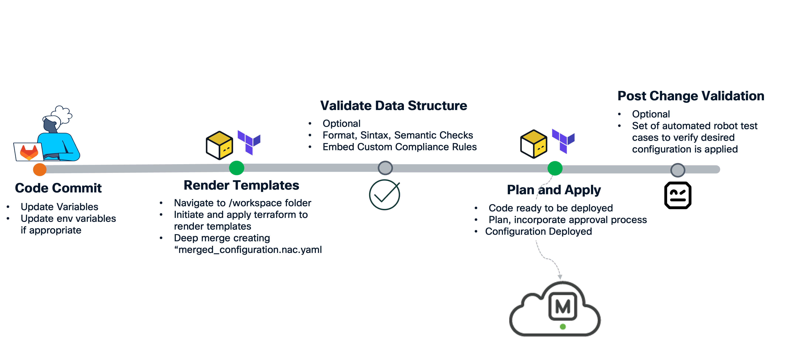

# 🌐 Network as Code for Unified Branch – Branch as Code (`nac-branch`)

This repository delivers the **Network as Code for Unified Branch – Branch as Code** capability (Release 2, May 2026).  
It automates provisioning of cloud-managed branch infrastructure — security appliances, switches, and Wi-Fi access points — using repeatable, version-controlled Terraform artifacts instead of manual dashboard configuration.

All artifacts are aligned with **Cisco Validated Designs (CVDs)** and optimized for **greenfield deployments** (new branch networks configured as VPN spokes).  
The provided code supports importing pre-configured organizations and hubs.

Release 2 adds **medium branch** support (2 appliances in active-backup / warm spare), **3rd party VPN peers** (including Cisco Secure Access / SSE integration), **adaptive policy**, **IP SLA monitoring**, **Splunk webhook integration**, and a redesigned CI/CD pipeline.

## 📚 More Information

- [Unified Branch – Branch as Code Design Guide](docs/Readme.md)  
- [Cisco Validated Design](https://www.cisco.com/c/en/us/solutions/design-zone/campus-branch.html)  
- [Cisco Unified Branch Solution Brief](https://www.cisco.com/c/en/us/td/docs/solutions/CVD/Campus/Unifiedbranch_solution_brief_0813v4.html)  
- [Branch as Code Documentation](https://netascode.cisco.com/docs/guides/branch/00_overview/)
- [Dashboard Device Initial Onboarding Flow and Best Practices](docs/Device_Onboarding_Flow.md)

## 🧰 Prerequisites

You will need:

1. A **Meraki API key** with configuration permissions.  
   *(Dashboard → Organization → Settings → Dashboard API access)*  
   → [API access documentation](https://documentation.meraki.com/General_Administration/Other_Topics/The_Cisco_Meraki_Dashboard_API#Enable_API_access)
2. Branch or Pod **variable data** (serial numbers, IP addressing schema, VLAN IDs, hostnames, etc.)
3. **Environment variables** for credentials and secrets.  
   Secrets may also be stored in a secret manager or Terraform variable file, depending on your policy.

🛡️ [Learn more about variables in Branch as Code](https://netascode.cisco.com/docs/guides/branch/04_fundamentals-nac-bac/#understanding-variables-used-in-branch-as-code)


## 📁 Repository Structure

```bash
nac-branch-terraform/
├── Changelog.md
├── Readme.md
├── main.tf
├── Jenkinsfile
├── .schema.yaml  🔹
├── data/
│   ├── org_global.nac.yaml
│   ├── pods_variables.nac.yaml
│   ├── templates-*.nac.yaml
│   ├── fixed_ip_assignments.yaml.tftpl
│   ├── switch_access_policy.yaml.tftpl
│   └── wireless_radius.yaml.tftpl
├── data-test-templates/
├── docs/
├── tests/           🔹
└── .rules/          🔹
```
**Legend**  
🔹 - The complete set of schema and tests is available through the **Services as Code** subscription. Custom rules can be created and adapted for each customer.


**File and folder overview:**

- **Changelog.md** – release notes and change history  
- **Readme.md** – this document  
- **main.tf** – primary Terraform configuration; defines the NAC module source, YAML data directory, and Terraform Cloud workspace  
- **Jenkinsfile** – CI/CD pipeline definition (Validate → Plan → Deploy → Test with idempotency checks and Webex notifications)  
- **.schema.yaml** – defines the YAML data model (sections, allowed keys, types, relationships)
- **data/** – YAML configuration files and `tftpl` templates for [Branch as Code](https://netascode.cisco.com/docs/guides/branch/04_fundamentals-nac-bac/#data)  
- **data-test-templates/** – example configurations derived from the schema for testing  
- **docs/** – reference diagrams, design documentation, and Step-by-Step (SFS) guides for large and medium branches  
- **tests/** – automated integration tests for CI/CD pipelines (Robot Framework)  
- **.rules/** – custom semantic validation rules for policy enforcement

**🧩 `data/` Folder Overview**

- **org_global.nac.yaml** – organization-level baseline: login security, policy objects, adaptive policy, 3rd party VPN peers, SNMP, etc.  
- **pods_variables.nac.yaml** – branch-specific variables (name, hostnames, addressing, VLANs) for small and medium branches.  
  👉 *This is typically the only file you modify when deploying new branches.*  
- **templates-*.nac.yaml** – modular configuration templates segmented by technology domain. Inline documentation is included. Some templates include predefined values for common use cases but are intended to be modified to reflect the customer's specific environment.  
- **\*.yaml.tftpl** – Terraform template files for dynamic configuration (fixed IP assignments, switch access policies, wireless RADIUS servers)

> ⚠️ These are **Network as Code templates**, not Meraki configuration templates. They are **CVD-aligned** and designed to work with the [Network as Code Meraki Terraform](https://registry.terraform.io/modules/netascode/nac-meraki) modules.


## 🚀 Deployment Workflow




The current Jenkins pipeline runs these stages in order:

1. **Validate** (`terraform fmt -check`, model generation, `nac-validate`)
2. **Plan** (`terraform get -update`, `terraform plan`, plan exports)
3. **Deploy** (`terraform apply plan.tfplan`)
4. **Test** (parallel **Integration** + **Idempotency** checks)


### 1. Fork the Repository

Fork this repository into your organization’s workspace.  
Avoid cloning directly from the upstream if you plan to customize.

```
# Replace <your-github-org> with your GitHub username or org
git clone https://github.com/<your-github-org>/nac-branch.git
cd nac-branch
git remote add upstream https://github.com/netascode/nac-branch.git
git fetch upstream
```

### 2. Export Required Environment Variables

Export all required environment variables before running Terraform:

```bash
# Small branch device serial numbers
export small_appliance_01_serial=YOUR_APPLIANCE_SERIAL
export small_ap_01_serial=YOUR_AP1_SERIAL
export small_ap_02_serial=YOUR_AP2_SERIAL
export small_switch_01_serial=YOUR_SWITCH1_SERIAL
export small_switch_02_serial=YOUR_SWITCH2_SERIAL

# Medium branch devices 
export medium_appliance_01_serial=YOUR_MEDIUM_APPLIANCE_01_SERIAL
export medium_appliance_02_serial=YOUR_MEDIUM_APPLIANCE_02_SERIAL
export medium_switch_01_serial=YOUR_MEDIUM_SWITCH_01_SERIAL
export medium_switch_02_serial=YOUR_MEDIUM_SWITCH_02_SERIAL
export medium_ap_01_serial=YOUR_MEDIUM_AP_01_SERIAL
export medium_ap_02_serial=YOUR_MEDIUM_AP_02_SERIAL

# Large branch devices
export large_appliance_01_serial=YOUR_LARGE_APPLIANCE_01_SERIAL
export large_appliance_02_serial=YOUR_LARGE_APPLIANCE_02_SERIAL
export large_switch1_serial=YOUR_LARGE_SWITCH_01_SERIAL
export large_switch2_serial=YOUR_LARGE_SWITCH_02_SERIAL
export large_switch3_serial=YOUR_LARGE_SWITCH_03_SERIAL
export large_switch4_serial=YOUR_LARGE_SWITCH_04_SERIAL
export large_switch5_serial=YOUR_LARGE_SWITCH_05_SERIAL
export large_switch6_serial=YOUR_LARGE_SWITCH_06_SERIAL
export large_switch7_serial=YOUR_LARGE_SWITCH_07_SERIAL
export large_switch8_serial=YOUR_LARGE_SWITCH_08_SERIAL
export large_switch9_serial=YOUR_LARGE_SWITCH_09_SERIAL
export large_ap1_serial=YOUR_LARGE_AP_01_SERIAL
export large_ap2_serial=YOUR_LARGE_AP_02_SERIAL
export large_ap3_serial=YOUR_LARGE_AP_03_SERIAL

# Organization identification
export org_name="Your Meraki Org Name"
export domain="YourDomainIdentifier"

# Admin credentials
export org_admin="admin-username"
export org_admin_email="admin@example.com"

# SNMPv3 credentials
export v3_auth_pass="CHANGE_ME_AUTH"
export v3_priv_pass="CHANGE_ME_PRIV"
export snmp_username="snmpUser"
export snmp_passphrase="CHANGE_ME_SNMP"

# Local device access credentials
export local_status_page_username="statusUser"
export local_status_page_password="CHANGE_ME_STATUS"
export local_page_username="localUser"
export local_page_password="CHANGE_ME_LOCAL"

# RADIUS secrets
export radius_accounting_server1_secret="CHANGE_ME_RADIUS_ACCT"
export radius_accounting_server2_secret="CHANGE_ME_RADIUS_ACCT2"
export radius_server1_secret="CHANGE_ME_RADIUS_AUTH"
export radius_server2_secret="CHANGE_ME_RADIUS_AUTH2"
export wireless_radius_server1_secret="CHANGE_ME_WIRELESS_RADIUS"
export wireless_radius_server2_secret="CHANGE_ME_WIRELESS_RADIUS2"
export wireless_radius_accounting_server1_secret="CHANGE_ME_WIRELESS_RADIUS_ACCT"
export wireless_radius_accounting_server2_secret="CHANGE_ME_WIRELESS_RADIUS_ACCT2"

# Webhook/token settings
export splunk_hec_token="CHANGE_ME_SPLUNK_HEC_TOKEN"

# 3rd party VPN / SSE secrets
export peer1_secret="CHANGE_ME_PEER_SECRET"
export umbrella_secret="CHANGE_ME_UMBRELLA_SECRET"

# Meraki API key (least privilege recommended)
export MERAKI_API_KEY="REPLACE_WITH_API_KEY"
```

Device naming in `data/pods_variables.nac.yaml` follows a consistent style such as `Small-Branch-MX-01`, `Medium-Branch-MX-01`, and `Large-Branch-MX-01`.

💡 *Tip:* Use a `.env` file and source it (`source ./set_env_vars.sh`).  
Ensure `.env` is excluded via `.gitignore`. You may also integrate a secrets manager.

### 3. 🧩 Configure Your Branch Variables

Navigate to the `data/` folder and update:

- `pods_variables.nac.yaml` – define branch/pod variables (serials, VLANs, etc.)

A sample configuration is provided for reference.

### 4. 🧠 Initialize and Generate Merged Configuration

The `main.tf` at the repository root defines the NAC module and renders the merged YAML configuration in a single step.  
No separate `workspaces/` directory is needed (as in previous relese) — everything runs from the repository root.

```bash
terraform init -input=false
terraform apply -target=module.meraki.module.model -auto-approve -input=false
```

✅ Output: `merged_configuration.nac.yaml` generated in the repository root.


### 5. 🔍 [Optional] Validate Configuration (`nac-validate`)

Validate the merged YAML before deployment to catch syntax or semantic issues early. 
As part of the toolkit, we can use [nac-validate](https://github.com/netascode/nac-validate/blob/main/README.md) CLI tool to perform syntactic and semantic validation of YAML files.

Install (requires Python 3.10+):

```bash
pip install nac-validate
```

Run validation:

```bash
nac-validate merged_configuration.nac.yaml
```

💡 *VS Code users:* install the [YAML Language Support by Red Hat](https://marketplace.visualstudio.com/items?itemName=redhat.vscode-yaml) extension for real-time validation.

👉 Learn more about [Configuration Validation.](https://netascode.cisco.com/docs/guides/concepts/validation/)


### 6. 🗺️ Plan Terraform Deployment

Generate the Terraform plan to preview intended changes:

```bash
rm -rf .terraform/modules
terraform get -update
terraform init -input=false
terraform plan -out=plan.tfplan -input=false
terraform show -no-color plan.tfplan > plan.txt
terraform show -json plan.tfplan | jq > plan.json
```

⚠️ The included configuration uses **Terraform Cloud** as the backend.  
Update the `cloud` block in `main.tf` to match your organization and workspace, or switch to a local backend if preferred.


### 7. 🚀 Apply Configuration

Apply the configuration to push changes to the Meraki Dashboard:

```bash
terraform apply -input=false -auto-approve plan.tfplan
```


### 8. ✅ [Optional] Post-Deployment Tests (`nac-test`)

Run post-change tests to confirm that the Meraki Dashboard matches the intended configuration. For this we make use of [nac-test](https://github.com/netascode/nac-test) CLI tool. 


```bash
pip install nac-test
```

Run:

```bash
nac-test -d merged_configuration.nac.yaml -t ./tests/templates -o ./tests/results -f ./tests/filters |& tee test_output.txt
```

Passing `nac-test` confirms configuration integrity and reproducibility.  
👉 Learn more about [Configuration Testing.](https://netascode.cisco.com/docs/guides/concepts/testing/)

Run idempotency check after deployment:

```bash
terraform init -input=false
terraform plan -input=false -out=idempotency.tfplan -detailed-exitcode
terraform show -no-color idempotency.tfplan > idempotency_plan.txt
```

Expected result: exit code `0` (no changes). Exit code `2` means drift/change detected.

## 💬 Issues & Feedback

We welcome your feedback!  
If you encounter issues or have suggestions, please open a **Issue** in this repository.

