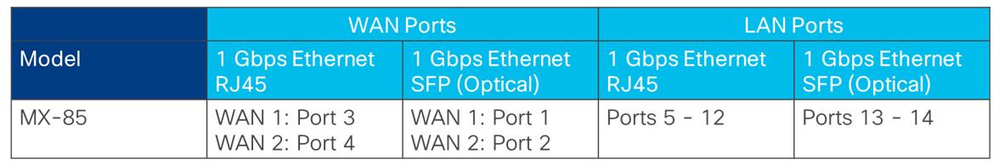
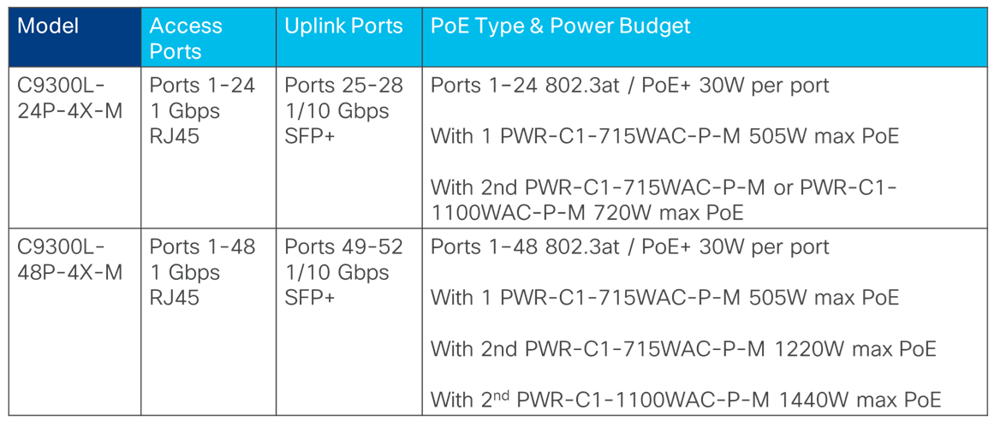
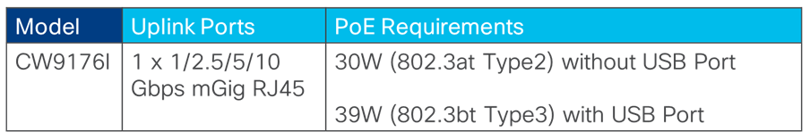

# Unified Branch - Branch as Code Design Guide: Release 1 - Early Availability #

## Overview ##
This intial release of Unified Branch - Branch as Code (referred to as Release 1, Early Availability), is intended to introduce the provisioning of branch network infrastructure (security appliances, switches, and Wi-Fi access points) wholistically using Network as Code (NAC) concepts, practices, and procedures.  In order to ease the amount of learning involved in adopting Network as Code as a means of configuring branch network infrastructure, a very basic and highly prescriptive branch network design has been developed, tested, and documented for this initial release.    

The intent of Release 1 - Early Availability is allow Cisco customers and partners to utilize this repository to rapidly become familiar with the concepts, practices, and procedures necessary to adopt Network as Code - in a non-production test environment - and to provide feedback to Cisco. 

## Network Design ##
Release 1 - Early Availability supports a single network design for small branch sites only. The small branch network design consists of the following components: 

- 1 x MX-85 security appliance
- 1 x C9300L-24P-4X or C9300L-48P-4X switch
- 2 x CW-9176I Wi-Fi Access Points (APs)

The physical layout of the small branch design is shown below.

**Figure 1. Small Branch Design**

### Small Branch Security Appliance ###
For Release 1 - Early Availability, the small branch network supports a single MX-85 security appliance for WAN connectivity.  The physical connectivity of the MX-85 ports is shown in the following table.

**Table 1. MX-85 Security Appliance Physical Ports**

#### WAN Connectivity ####
The physical ports which map to the logical WAN 1 and WAN 2 interfaces depend upon whether SFP modules are inserted into the appliance, as discussed in the [WAN Behavior on MX75/85/95/105](https://documentation.meraki.com/MX/MX_Overviews_and_Specifications/WAN_Behavior_on_MX75%2F%2F85%2F%2F95%2F%2F105) document.

When SFP modules are inserted into the MX-85 security appliance for WAN connectivity, the logical WAN 1 and WAN 2 interfaces correspond to physical ports 1 and 2, respectively.  When SFP modules are not inserted into the appliance, the WAN 1 and WAN 2 interfaces correspond to physical ports 3 and 4, respectively.  Hence for small branch deployments, network administrators must first determine whether they will be using SFP modules for WAN connectivity.  Once that decision is made, physically connect port 1 (SFP) or port 3 (RJ45) to the first WAN service provider network (WAN 1) and either port 2 (SFP) or port 4 (RJ45) to the second WAN service provider network (WAN 2).  Note that the MX-85 supports only 1 Gbps Ethernet SFP or RJ45 WAN connections.

For Release 1 - Early Availability, a single WAN uplink connected to port 3 of the MX-85 security appliance was configured and tested.  The WAN 1 interface was configured for IPv4 only (no IPv6) with dynamic IP addressing (DHCP).

#### LAN Connectivity ####
The range of LAN ports on the MX-85 security appliance is from Port 5 - 14.  Ports 5 - 12 support 1 Gbps Ethernet RJ45 connectivity, while Ports 13 & 14 support 1 Gbps Ethernet SFP (optical) connectivity.

All devices downstream of an MX security appliance must be able to reach the Cisco Cloud (formerly known as the Meraki Cloud) to be onboarded to the network.  To facilitate this, MX security appliances automatically configure VLAN 1 with an IPv4 subnet of 192.168.1.0/24.  The VLAN 1 IP address of the MX security appliance is automatically configured to be 192.168.1.1/24.  A DHCP pool is also automatically configured to hand out the remaining IPv4 addresses in the 192.168.1.2 - 254 range to downstream devices.  All LAN ports of the MX security appliance are by default placed into VLAN 1, because the MX security appliance by default is configured for single VLAN (VLAN 1) operation.

When a cloud enabled downstream switch is connected to the MX security appliance and is initially booted, all switch ports will, by default, be part of VLAN 1.  The switch will initiate DHCP requests for an IP address on all connected interfaces.  The switch will receive an IPv4 address in the 192.168.1.2 - 254 address range from the MX security appliance.  Likewise, when a downstream cloud managed wireless AP is subsequently connected to the switch and is initially booted, the AP will initiate DHCP requests for an IP address on its uplink port.  The AP will receive an IPv4 address in the 192.168.1.2 - 254 range from the MX security appliance.  The MX security appliance firewall is, by default, configured to allow all outbound traffic to the Internet initiated internally on VLAN 1, and to NAT the traffic to the IP address of the WAN interface.  This allows the downstream switch and APs to connect to the Cisco Cloud.

VLAN 1 on the MX security appliance can only be deleted if support for multiple VLANs is first enabled on the MX security appliance, and another VLAN with IP subnet is subsequently configured.  However, the default 192.168.1.0/24 IPv4 subnet and corresponding DHCP pool address range for VLAN 1 can be changed without the requirement for enabling support for multiple VLANs on the MX security appliance.

Due to the need to smoothly onboard and maintain connectivity of downstream switches and APs to the Cisco Cloud, for Release 1 - Early Availability, the MX-85 security appliance uses the default configuration of VLAN 1 for handing out IPv4 addresses to the downstream C9300L-24P-4X or C9300L-48P-4X switch and CW9176I APs.  VLAN 1 is used solely as an Infrastructure VLAN to allow the switch and APs downstream of the MX security appliance to receive IP addresses and connect to the Meraki Cloud, so these devices can be configured and managed.  

Note that since VLAN 1 is automatically configured within the MX security appliance, it will not appear within the YAML configuration files within the *data* folder.  Work is ongoing to import the VLAN 1 configuration for visibility in the YAML configuration files.  

Note also that with this configuration, since all sites (networks) use the same default IPv4 subnet range of 192.168.1.0/24 for the Infrastructure VLAN, VLAN 1 cannot be distributed across the VPN fabric.  Hence, the 192.168.1.0/24 IPv4 subnet range is local to each site / network only.

The following are the constraints of the decision to maintain the default VLAN 1 configuration for Release 1 - Early Availability:

- The small branch design requires the MX security appliance to be configured to support multiple VLANs.  Since VLAN 1 is always used as an Infrastructure VLAN, any customer traffic will need to be part of another VLAN.
- The port connecting the MX security appliance to the downstream switch must be configured as a trunk port with the native VLAN being the default of VLAN 1.
- The ports connecting the switch to downstream cloud managed APs must be configured as trunk ports with the native VLAN being the default of VLAN 1. 

The Release 1 - Early Availability YAML configuration files (found within the /data directory of this repository) hardcode three additional VLANs – Data (VLAN 10), Voice (VLAN 20), and Guest (VLAN 30).

As of the 19.1.x firmware release, MX security appliances do not support link aggregation (otherwise known as EtherChannel) of LAN ports for connectivity between an MX security appliance and a switch or switch stack.  MX security appliances also do not support the concept of a logical Port Channel interface or spanning-tree protocol (STP).

For Release 1 - Early Availability, a single 1 Gbps Ethernet RJ45 connection configured as a trunk interface supporting VLANs 1, 10, 20, and 30 – corresponding to the Infrastructure, Data, Voice, and Guest VLANs – was provisioned between the MX-85 security appliance and the C9300L-24P-4X or C9300L-48P-4X switch.  Port 5 of the MX-85 security appliance was connected to Port 1 of the switch. No redundancy of connectivity between the MX-85 security appliance and the switch was tested or validated.

A single 1 Gigabit Ethernet RJ45 connection provides only 1 Gbps of bandwidth and no redundancy between the MX-85 security appliance and the switch.  Depending upon the WAN transport speeds and the requirements for inter-VLAN routing within the branch, this may or may not be sufficient.  For additional bandwidth, the following options may be possible.  Note that these HAVE NOT BEEN VALIDATED for Release 1 - Early Availability.

- A single pair of redundant 1 Gbps Ethernet RJ45 or SFP connections configured as trunk ports supporting all VLANs.  STP on the switch should put one of the connections into blocking mode, ensuring there are no loops between the switch or switch stack and the MX security appliance.  This potential option addresses redundancy, but not additional bandwidth between the MX security appliance and the switch or switch stack.

- Multiple pairs of redundant 1 Gbps Ethernet RJ45 or SFP (optical) connections configured as trunk ports, each supporting a subset of the overall VLANs.  STP on the switch will put one of the connections of each pair into blocking mode, ensuring there are no loops between the switch and the MX security appliance.  This potential option addresses both redundancy and aggregate bandwidth across all VLANs (not per individual VLAN) between the MX security appliance and the switch or switch stack.

The use of SFP (optical) connectivity may also be needed in situations where the MX security appliance and the switch are physically separated from each other.  Distances greater than 100 meters, or facilities where only fiber optic cabling exists between wiring closets may result in the use of the SFP ports.  For Release 1 - Early Availability it is assumed that the MX-85 security appliance and switch are physically adjacent to each other, requiring only RJ45 wired connectivity.  Hence, the physical port on the MX-85 security appliance is hard-coded in the YAML configuration files found within the *data* directory of this repository to port 1, rather than being assigned a variable which can be assigned by the end-user. 

### Small Branch Switch ###
For Release 1 - Early Availability, a single C9300L-24P-4X or C9300L-48P-4X Layer 2 switch provides LAN connectivity to devices within the small branch.  Physical port media and speeds, as well as Power over Ethernet (PoE) support for these models are shown in the table below.  Both models support fixed 4 x 1/10Gbps SFP+ uplink ports.

**Table 2. C9300L-24P-4X and C9300L-48P-4X Physical Ports**

Support for PoE on switch ports may be needed when connecting wireless LAN (WLAN) APs, IP phones, surveillance cameras, and other devices to the switch.  Both models support 802.3at / PoE+ (Type 2) which can supply up to 30W per port up to the total power budget for PoE devices of the switch. The total power budget for PoE devices depends on the number of power supplies installed within the switch, as well as the power rating of the individual power supplies (715 Watts AC vs. 1100 Watts AC), as shown in the table above. 

When a C9300L Series switch is managed by the Cisco Cloud (formerly known as the Meraki Cloud), the switch ports (or port_ids as they are referred to in the YAML configuration files within this repository) on the switch begin with port / port_id 1, and proceed up to the last port/port_id of the switch, including the uplinks which are typically the highest port / port_id numbers (25-29, 49-52, etc.).  This is unlike switch configurations in traditional IOS-XE platforms, where the port numbering reflects the position of the switch in the switch stack, the module within the switch, and the port position on the switch.  For instance, the first switch uplink port of a standalone IOS-XE switch would be referred to as port GigabitEthernet 1/1/1.

The link speed (10 Mbps, 100 Mbps, 1 Gbps, and/or 10 Gbps) and duplex (full or half) of the Ethernet ports on the MX security appliance and the C9300L Series switch must match for the uplink to come up active.  A best practice is to leave the link speed for auto-negotiation of speed and duplex.

802.1x authentication, MAC Authentication Bypass (MAB), or Meraki Secure Port are not currently supported on the uplink between the MX security appliance and the C9300L Series switch.  Hence, a best parctice is for the equipment to be in a secure area within the site, such as a wiring closet in which only authorized personnel are allowed to enter.

To summarize the uplink connectivity between the MX security appliance and the C9300L Series switch for Release 1 - Early Availability is as follows:

- A single 1 Gbps RJ45 connection (Port 1) from the switch was connected to a 1 Gbps RJ45 connection (Port 5) of MX-85 security appliance.  The SFP+ uplink ports of the C9300L Series switch were not utilized. 
- Link speed and duplex of the uplink port were left to auto-negotiate.  
- The switch port was configured as a trunk port allowing VLANs 1, 10, 20, and 30 on the MX security appliance and VLANs 1 - 100 on the switch - with VLAN 1 being the native VLAN.  

This configuration allowed the switch to automatically acquire an IPv4 address in the 192.168.1.0/24 subnet from the MX-85 security appliance and connect to the Cisco (formerly Meraki) Cloud.  Note that the switch was initially manually configured via console connection to operate as a Cisco Cloud managed switch before being connected to the MX-85 security appliance.

### Small Branch WLAN Access Points ###

For Release 1 - Early Availability, two CW9176I cloud managed APs provided wireless LAN (WLAN) connectivity wtihin the branch.  The CW-9176I supports an omni-directional internal antenna.  Physical port media and speeds, as well as PoE requirements for the CW-9176I are shown in the table below. 

**Table 3. CW9176I Physical Ports and PoE Requirements**

#### Uplink Connectivity to the Switch #### 

The CW-9176I AP support only a single uplink port for connectivity to the switch.  As mentioned previously for Release 1 - Early Availability, VLAN 1 is used as an Infrastructure VLAN to ensure downstream switches and APs are able to connect to the Cisco Cloud to get onboarded.  All VLANs with customer traffic (Data, Voice, and Guest) are configured as additional VLANs.  This means that the connections between switches and APs must be configured as trunk ports.  The native VLAN of the trunk ports should be configured for VLAN 1.

#### PoE Requirements for the Access Points ####
When configuring the uplink between the switch and APs, the network administrator needs to consider how power is to be supplied to the APs.  Power can be supplied via one of the following: 

- A switch which supports PoE, and a switch port that supplies the necessary power (in terms of Watts) required for the model of AP.

- An inline power injector placed within the wiring closed next to the switch in cases where there is insufficient power budget left within the switch, or in cases where the switch does not support PoE or the correct power levels required by the AP. 

- External power supply which converts AC to DC connected directly to the AP.  This is typically done via an AC outlet installed in proximity to the AP. 

For Release 1 - Early Availability, the C9300L-24P-4X and C9300L-48P-4X switches support a maximum of 30W power per switch port.  This is the method of providing power to the APs, since the power levels provided per switch port are sufficient for the CW-9176I AP when not using the USB port.

#### Throughput Requirements for the Access Points ####
Aggregate 802.11 Wi-Fi throughput has exceeded 1 Gbps since 802.11ac came out years ago.  However, this does not mean that the aggregate throughput requirements of each AP within a small branch site will exceed 1 Gbps.  That depends on various factors such as the number of clients per AP, and each client’s particular application requirements. 

If AP uplink speeds greater than 1 Gbps are required, then the network administrator must also consider whether the APs should be connected to switch ports which support Multi-Gigabit Ethernet (mGig) speeds of 2.5, 5, or 10 Gbps, or alternatively whether the APs support multiple uplink ports and/or link aggregation for higher throughput.  Both depend upon the model of AP deployed.  High speed optical connections (SFP+) to Wi-Fi APs are typically not an option because such connections do not address providing power to the APs.  

For Release 1 - Early Availability, the CW-9176I APs support mGig at speeds up to 10 Gbps. However the C9300L-24P-4X and C9300-48P-4X switches only support access port speeds up to 1 Gbps.  The uplink ports on the switch do support speeds up to 10 Gbps.  However, those ports require optical SFP+ modules which do not support PoE.  Hence, for Release 1 - Early Availability, the CW9176I Access Points were connected to access ports (ports 5 & 6) on the switches with a maximum speed of 1 Gbps.
 
As with the uplink between the MX-85 security appliance and the C9300L-24P-4X or C9300L-48P-4X switch port, link speed and duplex (full or half) of the Ethernet ports on the switch and the AP must match for the uplink to come up active.  Again, a best practice is to typically leave the link speed for auto-negotiation of speed and duplex. 

#### Authentication of the AP to the Switch ####

For Release 1 - Early Availability, no authentication of the Access Point to the switch port was configured. The switch models for Release 1 - Early Availability do not support Meraki Secure Port.  Likewise, the AP model does not support the 802.1x supplicant necessary for 802.1x authentication of the AP to the switch. Hence, the only alternatives are either no authentication or MAC Authentication Bypass (MAB).  MAB is not ideal because the MAC address of the AP is normally printed on the AP, making it somewhat easy to circumvent.  However, given the physical installations of the APs are typically 8-12 feet off the ground in the ceilings of sites, it is still preferable to no authentication, and would generally be recommended, although it HAS NOT BEEN VALIDATED for Release 1 - Early Availability.

### WLAN SSIDs ####

For Release 1 - Early Availability, the following three SSIDs (Data - SSID 0, Voice - SSID 1, and Guest - SSDI 2) are hardcoded in the YAML configuration files for example purposes only.  The SSIDs are all configured for open access (no authentication or encryption), with traffic mapped to the three VLANs (Data - VLAN 10, Voice - VLAN 20, and Guest - VLAN 30) defined as variables.

Again, this is shown as an example only, not intended to be implemented in a production network, and not representative of any best practices. In an production network best practices would recommend implementing secure SSIDs using methods such as enterprise WPA2 and/or WPA3 authentication.  The exact method of securing SSIDs would depend on the security policy of the organization.

## Unified Branch Services ##

The following sections discuss the services enabled within the small branch for Release 1 - Early Availability.

### WAN Services ###

WAN services for the small branch for Release 1 - Early Availability consist of the following:

- WAN Connectivity
- WAN Traffic Shaping & Traffic Steering

#### WAN Connectivity ####

WAN connectivity services for the small branch are implemented by the MX security appliance. The *sb122* template within the *data/templates-inventory-related.yaml* file provides an example of the configuration of WAN connectivity services via YAML.  It specifies both WAN 1 and WAN 2 connectivity with IPv4 dynamic (DHCP) IP addressing.  A general best practice for the small branch design would be to provision dual WAN uplink connectivity for resiliency purposes.

> :information_source:
> Only 1 WAN uplink (WAN 1) was tested for Release 1 - Early Availability. 

#### WAN Traffic Shaping & Traffic Steering ####

WAN traffic shapping & traffic steering services are implemented by the MX security appliance.  The *app_ts* and *tfsteering* templates within the *data/appliance-related.nac.yaml* file provides examples of the configuration of the following:

- Overall and per-client rate limiting of and each of the WAN uplinks
- Definition of performance classes which are then used within traffic steering policy to determine which WAN uplink to use for VPN and/or Internet traffic.
- Rule definitions for classifying traffic based on L3 characteristics (source and/or destination IP address and/or port) or L7 characteristics (application and/or application category) which is then matched to a performance class to determine the WAN uplink for the traffic.

> :information_source:
> Applications and application categories must currently be specified via ID within YAML configuration files.  Work is ongoing to translate these IDs into user-friendly names.

The examples shown in the templates are meant to provide guidance for the network administrator as to how to configure such services within the context of a YAML file.  They are not meant to be deployed in a production network, nor do they represent any form of best practices. Such configuration would require knowledge of the specific applications and business requirements of the organization. 

### LAN Services ###

LAN services for the small branch for Release 1 - Early Availability consist of the following:

- LAN Connectivity
- LAN QoS (Ingress Classification & Marking)
- Power over Ethernet (PoE)
- Rapid Spanning-Tree Protocol (RSTP)
- Multiple VLANs
- LAN Port Schedules

#### LAN Connectivity ####

For Release 1 - Early Availability, LAN connectivity is implemented by a single C9300L-24P-4X or C9300L-48P-4X switch within the small branch. LAN connectivity consists of 1 Gbps RJ-45 wired LAN ports for connectivity as uplinks to the MX security appliance, uplinks to the CW9176I access points, and all wired LAN clients.  The device *$(switch-01) section of the *sb122* template within the *data/templates-inventory-related.yaml* file provides an example of the configuration of switch ports.  Ports are set to auto-negotiate port speed and duplex via the *link_negotiation* setting.  A general best practice is to allow switch ports to negotiate speed and duplex unless there is a specific reason otherwise. 

#### QoS (Ingress Classification & Marking) ####

LAN QoS (ingress classification & marking) consist of DSCP to CoS queue mapping configuration as well as rules which classify and set the DSCP marking of traffic.  The *nw_switch* template within the *data/templates-network-related.nac.yaml* file provides an example DSCP to CoS queue mapping assuming a 12 traffic-class QoS model, using all 8 CoS queues, as well as an example set of QoS classification & marking rules for different VLANs on the switch.  Both are applied at the switch level, meaning the DSCP to CoS queue mapping and the QoS classification & marking rules apply to all ports of the switch to which the template is applied.

The QoS classification & marking rules shown in the template are meant to provide guidance for the network administrator as to how to configure such services within the context of a YAML file.  They are not meant to be deployed in a production network, nor do they represent any form of best practices. Such configuration would require knowledge of the specific applications and business requirements of the organization.

#### Power over Ethernet (PoE) ####

For Release 1 - Early Availability, the  C9300L-24P-4X or C9300L-48P-4X switch within the small branch supplies up to 30 Watts 802.3at / PoE+ power per switch port (ports 1-24 for the C9300L-24P-4X or ports 1-48 for the C9300L-48P-4X).  This is sufficient to power to the CW-9176I access points within the small branch design, without the use of the USB port. PoE is enabled by default on the switch ports.  Therefore, the port level *PoE* setting (boolean - true or false) does not appear within the *sb122* template within the *data/templates-inventory-related.nac.yaml* file.  A general best practice is to leave PoE enabled on switch ports and allow the switch port to negotiate whether power is to be supplied to the device connected to the switch port. 

#### Rapid Spanning Tree Protocol (RSTP) ####

RSTP is enabled by default on the switch ports of the C9300L-24P-4X or C9300L-48P-4X small branch switch.  Therefore, the port level *rstp* setting (boolean - true or false) does not appear within the *sb122* template within the *data/templates-inventory-related.nac.yaml* file. In addition, BPDU guard (configured via the *stp_guard* setting) and storm control (configured via the boolean *storm_control* setting) are hardcoded within the *sb122* template to be enabled for the access ports (ports not configured as trunk ports).  

The storm control configuration itself is hardcoded within the *nw_switch* template within the *data/templates-network-related.nac.yaml* file to restrict broadcast, multicast, and unknown unicast traffic to 30% of the available bandwidth of the switch ports.  These percentages are for example purposes only.  Determining the appropriate levels for "normal" broadcast, multicast, and unknown unicast traffic may require monitoring the network first for a period of time, and then setting these parameters slightly above those levels, so as to protect the network.

A general best practice is to leave RSTP protocol enabled on all switch ports within a small branch to minimize the chance of an outage or degradation of service resulting from an inadvertent loop in the network - unless there is a situation where you are absolutely sure this is not needed or will cause problems on given switch ports.  Given the small branch design consists of only a single switch, the chance of a loop occurring is likely low.  However, the benefits from enabling RSTP generally outweigh the minor time delay necessary for a switch port to move from a blocking to a forwarding state when first enabled.

#### Multiple VLANs ####

For Release 1 - Early Availability the small branch design YAML files are hardcoded to support four VLANs - Data (VLAN 10), Voice (VLAN 20), Guest (VLAN 30), and Infrastructure (VLAN 1).

> :information_source:
> Configuration for VLAN 1 does not appear within the YAML configuration files, since this is a default configuration.  Work is ongoing to import VLAN 1 configuration to make it visible within the YAML configuration files to the network administrator.

Multiple VLAN support is enabled through *vlans_settings* within the *app_vlans* template of the *data/templates-appliance-related.nac.yaml* file. Layer 3 (SVI) interface definitions for the VLANs are configured on the MX-85 security appliance.  These are defined within the same template.  The template allows for the subnet of each VLAN as well as the IP address of the MX-85 Layer 3 (SVI) interface corresponding to the VLAN to be specified by the network administrator through variable definitions.

VLAN trunking is supported on the links between the MX-85 security appliance and the C9300L-24P-4X or C9300L-48P-4X switch. On the MX-85 security appliance, this is configured within the *app_ports* template within the *data/templates-appliance-related.nac.yaml* file. On the switch (ports 1-2), this is configured within the *sb122* template within the *data/templates-inventory-related.nac.yaml* file.

VLAN trunking is also supported on the links between the C9300L-24P-4X or C9300L-48P-4X switch and the CW-9176I access points. On the switch (ports 5-13), this is again configured within the *sb122* template within the *data/templates-inventory-related.nac.yaml* file. On the access points, Data, Voice, and Guest SSIDs are mapped to separate VLANs specified through variable definitions. This is configured within the *wireless* template within the *data/templates-network-related.nac.yaml* file.

Access ports (ports 5-24 on the C9300L-24P-4X or ports 5-48 on the C9300L-48P-4X) on the switch are hardcoded with a VLAN and voice VLAN configuration within the *app_ports* template within the *data/templates-appliance-related.nac.yaml* file.

In general, the network administrator should implement as many VLANs as needed based on the requirements of the organization.  In other words, there are no best practices as to how many VLANs you should deploy.  Cisco has long recommended a separate Voice VLAN for isolating IP phones from regular employee data traffic.  The hardcoded YAML configuration files for the Release 1 - Early Availability of the small branch design reflects that.  However, note that the firewall configuration examples discussed in the sections below do not reflect restriction of traffic to/from the Voice VLAN.  Simply putting VoIP telephone traffic onto a Voice VLAN and allowing unlimited access to the Voice VLAN does not provide any additional security for such devices.  Hence the network administrator should configure the appropriate firewall policy restricting traffic to and from the Voice VLAN to only that required for the devices supported by the Voice VLAN.

Likewise, the network administrator should configure the appropriate firewall policy restricting Guest VLAN from reaching any VLANs which support the internal organization.  For Release 1 - Early Availability of the small branch design, it is assumed the Guest VLAN taffic will only have direct Internet access only.  Internet traffic may further be restricted based on content filtering policy.  The firewall, content filtering, intrusion prevention, and AMP example policies currently within the YAML files currently do not reflect a complete guest access configuration - they are examples only, do not reflect best practices, and should not be deployed in a production network.  The network administrator must configure the appropriate policies based on the requirements and security policy of the organization.

#### LAN Port Schedules #####

LAN Port schedules allow network administrators to set up recurring time-based schedules in which LAN switch ports are enabled or disabled.  The *nw_switch* template within the *data/templates-network-related.nac.yaml* file provides an example YAML configuration of a LAN port schedule in which all switch ports are enabled at all hours for all days of the week. This can be modified to suit the needs of the particular organization.  The example port schedule is applied to all switch ports of the C9300L-24P-4X or C9300L-48P-4X small branch switch via the *port_schedule_name* setting within the *sb122* template within the *data/templates-inventory-related.nac.yaml* file.

The general use of port schedules depends on the needs of the specific organization.  There are no best practives or recommendations. Examples of use may be for security or power savings purposes - for example disabling LAN switch ports during non-work hours when employees are not expected to be at the site.  However, the network administrator must balance this against unforseen situations where LAN port connectivity may occasionally be needed during those non-work hours.  Additionally, should IP phone and/or IP surveillance camera connectivity within the small branch site be dependent upon the LAN switch ports being active, provisions for reaching emergency services and for surveillance monitoring may be required within the site, even during non-work hours.  

### Wireless LAN (WLAN) Services ###

WLAN services for the small branch for Release 1 - Early Availability consist of the following:

- 802.11 a/b/g/n/ac/be Connectivity
- Multiple SSIDs
- WLAN QoS

#### 802.11a/b/g/n/ac/be Connectivity ####

TBD...

#### Multiple SSIDs ####

TBD...

#### WLAN QoS ####

TBD...

### Network Services ###

Network services for the small branch for Release 1 - Early Availabiliyt consist of the following:

- DHCP Services
- NTP Services
- DNS Services

### Security Services ###

Security services for the small branch for Release 1 - Early Availability consist of the following:

- Firewalling
- Content Filtering
- Intrusion Prevention
- Advanced Malware Protection
- Identity Services

#### Firewalling ####

Firewalling services for the small branch are implemented by the MX security appliance.  Firewalling services consist of the following:
- L3 Firewalling:  These are outbound rules which allow or deny traffic passing through the MX security appliance based on source and/or destination IP addresses and ports.
- WAN Appliance Services:  These control SNMP, Web, and ICMP Ping access to the MX security appliance itself.
- L7 firewalling:  These are rules which allow or block traffic based on application or application category, relying on technologies such as deep packet inspection to identify and classify traffic.

> :information_source:
> Firewall applications and application categories must be specified by ID currently.  Work to translate the IDs into user-friendly names is ongoing.  

The *app_fw* template within the *data/templates-appliance-related.nac.yaml* file provides an example of the configuration of firewall services via YAML.  This is an example only, not intended to be deployed within a production network, and does not represent any form of best practices.  The actual firewall configuration within any organization will depend upon the security policy of the organization.

#### Content Filtering ####

Content filtering services for the small branch are implemented by the MX security applicance.  Content filtering rules allow or block Internet-bound web traffic based on specific URLs or URL categories.  The *app_content* template within the *data/templates-appliance-related.nac.yaml* file provides an example of the configuration of content filtering services via YAML.  This is an example only, not intended to be deployed within a production network, and does not represent any form of best practices.  The actual content filtering configuration within any organization will depend upon the security policy of the organization.

#### Intrusion Detection and Prevention ####

For Release 1 - Early Availability, intrusion detection and prevention services for the small branch are implemented by the MX security appliance.  Intrusion detection and prevention applies to LAN traffic to and from the Internet, as well as between VLANs which passed through the security appliance.  Intrusion detection and prevention can be configured to simply detect (detection mode) and/or prevent (prevention mode) malicious traffic based on a selectable ruleset geared toward security, connectivity, or a balance between security & connectivity.  The *app_intrusion* template within the *data/templates-appliance-related.nac.yaml* file provides an example of the configuration of intrusion prevention services via YAML.  This is an example only, not intended to be deployed within a production network, and does not represent any form of best practices.  The actual intrusion detection or prevention configuration within any organization will depend upon the security policy of the organization.

> :information_source:
> Exclusions via allowed list rules are currently not supported within the YAML configuration for Release 1 - Early Availabliity.  The network administrator will need to access the Cisco (formerly Meraki) dashboard to exclude specific IDS rules.  

#### Advanced Malware Protection (AMP) ####

AMP services for the small branch are implemented by the MX security appliance.  AMP applies to non-encrypted (since AMP must first identify that content is being downloaded) LAN traffic to and from the Internet.  Once enabled, specific URLs can be excluded from being scanned for malware.  Likewise, previously identified files can be excluded by including the SHA-256 hash of the file to be excluded, in scenarios where a false positive has blocked the file.  The *app_mal* template within the *data/templates-appliance-related.nac.yaml* file provides an example of the configuration of advanced malware protection via YAML. This is an example only, not intended to be deployed within a production network, and does not represent any form of best practices.  The actual AMP configuration within any organization will depend upon the security policy of the organization.

### Identity Services ###

Identity Services provide per-user authentication and authorization the wired and wireless LAN within the small branch design.  These services include the following:

- 802.1x authentication of devices connected to wired switch ports with fallback to MAB for devices without 802.1x supplicant support, such as printers.
- Per-user access control via Group Policy assignment or VLAN assignment upon device authentication to a wired switch port.
- WPA2-Enterprise or WPA3-Enterprise with 802.1x authentication for non-Guest SSIDs.
- Per-user access control via Group Policy assignment or VLAN assignment upon device authentication to an access point.
- External ISE / Radius or Meraki Cloud authentication server. 

For Release 1 - Early Availability, identity services have not been implemented and validated for the small branch design.  Work is ongoing to add configurations for Identity services to the YAML files within the repository.   