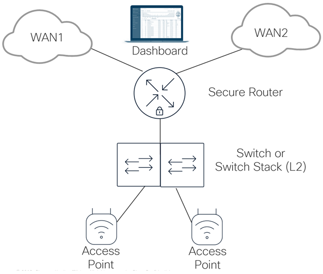
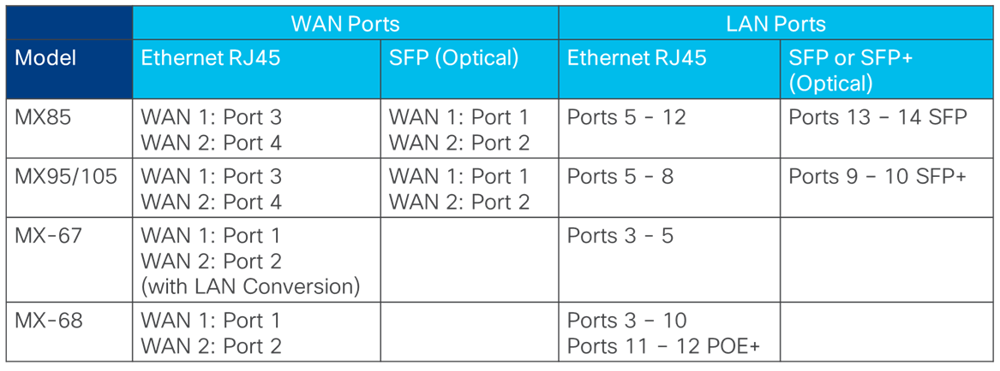
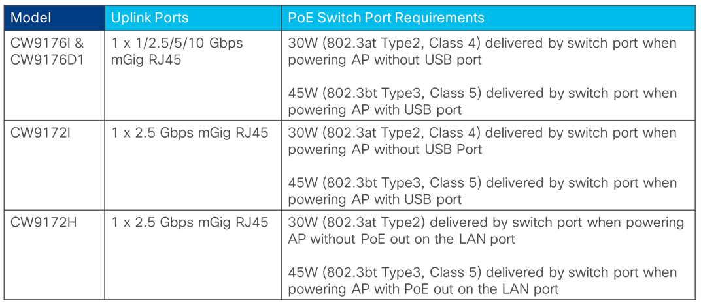

# Cisco Unified Branch - Branch as Code Design Guide

## Overview ##
Please refer to the [Cisco Unified Branch CVD](https://www.cisco.com/c/en/us/td/docs/solutions/CVD/Campus/Cisco_Unified_Branch_Small_Branch.html) for an in-depth discussion of initial release of Cisco Unified Branch.  Branch as Code and Workflows are both part of the overall automation toolkit for Cisco Unified Branch. This document focuses on the automation of Cisco Unified Branch through Branch as Code.

Branch as Code is intended to introduce the provisioning of branch network infrastructure (secure routers, switches, and Wi-Fi access points) holistically using Network as Code (NAC) concepts, practices, and procedures.  To ease the amount of learning involved in adopting Network as Code as a means of configuring branch network infrastructure, a standardized network design has been developed, tested, and documented.

## Network Design ##
The initial release of Cisco Unified Branch - Branch as Code supports a standard network design for small branch sites. The small branch network design consists of the following components: 

- 1 x Secure Router - *MX67/MX68/MX85/MX95/MX105 secure router

- 1 x switch or switch stack - C9300/X/L (-M versions), C9200/L (-M versions), or MS150/MS130

- N x Wi-Fi Access Points (APs) - CW9172 or CW9176

*Only base MX67/MX68 (non-W/CW versions) are supported.

Please refer to the [Cisco Unified Branch CVD](https://www.cisco.com/c/en/us/td/docs/solutions/CVD/Campus/Cisco_Unified_Branch_Small_Branch.html) for specific software versions supported. 

The physical layout of the small branch design is shown below.

**Figure 1. Small Branch Design**

### Small Branch Secure Router ###
The small branch network supports a single MX67, MX68, MX85, MX95, or MX105 secure router (also referred to as an appliance or secure appliance within the files and templates within this repository) for WAN connectivity.  The physical connectivity of each of the  ports for each model is shown in the following table.

**Table 1. MX Secure Router Physical Ports**

#### WAN Connectivity ####
For the MX85/95/105 platforms, the physical ports which map to the logical WAN 1 and WAN 2 interfaces depend upon whether SFP modules are inserted into the secure router, as discussed in the [WAN Behavior on MX75/85/95/105](https://documentation.meraki.com/MX/MX_Overviews_and_Specifications/WAN_Behavior_on_MX75%2F%2F85%2F%2F95%2F%2F105) document.  When SFP modules are inserted into the MX85/95/105 secure router for WAN connectivity, the logical WAN 1 and WAN 2 interfaces correspond to physical ports 1 and 2, respectively.  When SFP modules are not inserted into the appliance, the WAN 1 and WAN 2 interfaces correspond to physical ports 3 and 4, respectively.  Hence for small branch deployments, network administrators must first determine whether they will be using SFP modules for WAN connectivity.  Once that decision is made, physically connect port 1 (SFP) or port 3 (RJ45) to the first WAN service provider network (WAN 1) and either port 2 (SFP) or port 4 (RJ45) to the second WAN service provider network (WAN 2).

The MX67/68 platforms do not support SFP modules.  The MX68 supports up to two Ethernet RJ45 WAN connections (Ports 1 & 2).  The MX67 supports the conversion of Port 2 from a LAN to a WAN port, for up to two Ethernet RJ45 WAN connections (Ports 1 & 2).

#### LAN Connectivity ####
The range of LAN ports available depends on the secure router model.  For the MX85 the LAN port range is from Ports 5 - 14.  Ports 5 - 12 support Ethernet RJ45 connectivity, while Ports 13 & 14 support SFP (optical) connectivity.  For the MX95 and MX105 platforms, the LAN port range is from 5 - 10.  Ports 5 - 8 support Ethernet RJ45 connectivity, while Ports 9 & 10 support SFP+ (optical) connectivity.  For the MX67, assuming Port 2 is converted to a WAN interface for dual-WAN connectivity, the LAN port range is from Ports 3 -5 which support Ethernet RJ45 connectivity.  Finally, for the MX68, the LAN port range is from Ports 3 - 12, which support Ethernet RJ45 connectivity.  Note that Ports 11 & 12 support PoE+, which may be best utilized for connectivity to APs.

All devices downstream of an MX secure router must be able to reach the Cisco Cloud (formerly known as the Meraki Cloud) to be onboarded to the network.  To facilitate this, MX secure routers automatically configure VLAN 1 with an IPv4 subnet of 192.168.128.0/24.  The VLAN 1 IP address of the MX secure router is automatically configured to be 192.168.128.1/24.  A DHCP pool is also automatically configured to hand out the remaining IPv4 addresses in the 192.168.128.2 - 254 range to downstream devices.  All LAN ports of the MX secure router are by default placed into VLAN 1, because the MX secure router by default is configured for single VLAN (VLAN 1) operation.

When a cloud enabled downstream switch is connected to the MX secure router and is initially booted, all switch ports will, by default, be part of VLAN 1.  The switch will initiate DHCP requests for an IP address on all connected interfaces.  The switch will receive an IPv4 address in the 192.168.128.2 - 254 address range from the MX secure router.  Likewise, when a downstream cloud managed wireless AP is subsequently connected to the switch and is initially booted, the AP will initiate DHCP requests for an IP address on its uplink port.  The AP will receive an IPv4 address in the 192.168.128.2 - 254 range from the MX secure router.  The MX secure router firewall is, by default, configured to allow all outbound traffic to the Internet initiated internally on VLAN 1, and to NAT the traffic to the IP address of the WAN interface.  This allows the downstream switch and APs to initially connect to the Cisco Cloud.

VLAN 1 on the MX secure router can only be deleted if support for multiple VLANs is first enabled on the MX secure router, and another VLAN with IP subnet is subsequently configured.  However, the default 192.168.128.0/24 IPv4 subnet and corresponding DHCP pool address range for VLAN 1 can be changed without the requirement for enabling support for multiple VLANs on the MX secure router.

Due to the need to smoothly onboard and maintain connectivity of downstream switches and APs to the Cisco Cloud, for Cisco Unified Branch - Branch as Code, the MX secure router uses the default configuration of VLAN 1 for initially handing out IPv4 addresses to the downstream switches and APs when they are unconfigured and initially connecting to the network.  Once the devices have established connectivity to the Cisco Cloud, they will receive their configurations which change the management VLAN to the Infra VLAN (VLAN 999).  This VLAN is carried across the Auto VPN to the hub site.  This design allows for monitoring traffic, such as SNMP, Syslog, and NetFlow to be originated from the branch network infrastructure devices and sent to centralized servers at hub locations. VLAN 1 is used solely to onboard devices to the Cisco Cloud when unconfigured or reset to an unconfigured state.

Note that since VLAN 1 is automatically configured within the MX secure router, it will not appear within the YAML configuration files within the */data* folder.  Work is ongoing to import the VLAN 1 configuration for visibility in the YAML configuration files.  

Also note that with this configuration, since all sites (networks) use the same default IPv4 subnet range of 192.168.128.0/24 for the Infrastructure VLAN, VLAN 1 cannot be distributed across the VPN fabric.  Hence, the 192.168.128.0/24 IPv4 subnet range is local to each site / network only.  However, the IPv4 subnet range of the Infra VLAN (VLAN 999) is unique for each branch and hence routeable to the hub sites. 

The following are the constraints of the decision to maintain the default VLAN 1 configuration:

- The small branch design requires the MX secure router to be configured to support multiple VLANs.  Since VLAN 1 is always used as an Infrastructure VLAN, any customer traffic will need to be part of another VLAN.
- The port connecting the MX secure router to the downstream switch must be configured as a trunk port with the native VLAN being the default of VLAN 1.
- The ports connecting the switch to downstream cloud managed APs must be configured as trunk ports with the native VLAN being the default of VLAN 1. 

The YAML configuration files (found within the /data directory of this repository) hardcode four additional VLANs – Data (VLAN 10), Voice (VLAN 20), IoT (VLAN 30), and Guest (VLAN 50).

As of the 19.1.x firmware release, MX secure routers do not support link aggregation (otherwise known as EtherChannel) of LAN ports for connectivity between an MX secure router and a switch or switch stack.  MX secure routers also do not support the concept of a logical Port Channel interface or spanning-tree protocol (STP).

The MX67 and MX68 platforms only support 1 Gbps Ethernet RJ45 connections between the MX secure router and switch or switch stack. The MX85 supports 1 Gbps Ethernet RJ45 or 1 Gbps SFP (optical) connections.  However, the bandwidth per port is still limited to 1 Gbps.  The MX95 and MX105 platforms support 1 Gbps Ethernet RJ45 connections as well, but also support 10 Gbps SFP+ (optical) connections. 

When using an MX platform that only supports 1 Gbps RJ45 or SFP connections, a single connection, configured as a trunk port supporting all VLANs configured within the branch, provides only 1 Gbps of bandwidth and no redundancy between the MX secure router and the switch or switch stack.  Depending upon the WAN transport speeds and the requirements for inter-VLAN routing within the branch, this may or may not be sufficient.  For additional bandwidth, the following options may be possible.

- A single pair of redundant 1 Gbps Ethernet RJ45 or SFP connections configured as trunk ports supporting all VLANs.  STP on the switch should put one of the connections into blocking mode, ensuring there are no loops between the switch or switch stack and the MX secure router.  This potential option addresses redundancy, but not additional bandwidth between the MX secure router and the switch or switch stack.

- Multiple pairs of redundant 1 Gbps Ethernet RJ45 or SFP (optical) connections configured as trunk ports, each supporting a subset of the overall VLANs.  STP on the switch will put one of the connections of each pair into blocking mode, ensuring there are no loops between the switch and the MX secure router.  This potential option addresses both redundancy and aggregate bandwidth across all VLANs (not per individual VLAN) between the MX secure router and the switch or switch stack.  Note that this has not been validated or included as part of Unified Branch - Branch as Code for this release.

The use of SFP (optical) connectivity may also be needed in situations where the MX secure router and the switch are physically separated from each other.  Distances greater than 100 meters, or facilities where only fiber optic cabling exists between wiring closets may result in the use of the SFP ports.  

When using an MX platform which supports 10 Gbps SFP+ (optical) connections, you must ensure the switch model of the swith or switch stack you choose to deploy within the small branch also supports 10 Gbps SFP+ (optical) connections.

### Small Branch Switch / Switch Stack ###
For this release of Cisco Unified Branch - Branch as Code, a single switch or switch stack consisting of C9300/X/L (-M versions), C9200/L (-M versions), or MS150/MS130 switches provides LAN connectivity to devices within the small branch.  All switches within a single stack should be the same model.

Support for PoE on switch ports may be needed when connecting wireless LAN (WLAN) APs, IP phones, surveillance cameras, and other devices to switches.  You must select switch models that support the necessary power per port for the devices you plan on using within the branch, as well as the overall power budget based on the number of such devices. The total power budget for PoE devices depends on the number of power supplies installed within the switch, as well as the power rating of the individual power supplies. 

When C9300/X/L or C9200/L Series switches are managed by the Cisco Cloud (formerly known as the Meraki Cloud), the switch ports (or port_ids as they are referred to in the YAML configuration files within this repository) on the switch begin with port/port_id 1, and proceed up to the last port/port_id of the switch, including the uplinks which are typically the highest port/port_id numbers (25-29, 49-52, etc.).  This is unlike switch configurations in traditional IOS-XE platforms, where the port numbering reflects the position of the switch in the switch stack, the module within the switch, and the port position on the switch.  For instance, the first switch uplink port of a standalone IOS-XE switch would be referred to as port GigabitEthernet 1/1/1.

The link speed and duplex of the Ethernet ports on the MX secure router and the switches must match for the uplink to come up active.  A best practice is to leave the link speed for auto-negotiation of speed and duplex.

802.1x authentication, MAC Authentication Bypass (MAB), or Meraki Secure Port are not currently supported on the uplink between the MX secure router and the switch models supported for Unified Branch - Branch as Code.  Hence, a best practice is for the equipment to be in a secure area within the site, such as a wiring closet in which only authorized personnel are allowed to enter.

For Unified Branch - Branch as Code, uplink switch ports are configured as a trunk ports allowing VLANs 1, 10, 20, 30, 50, and 999 on the MX secure router with VLAN 1 being the native VLAN.  This configuration allows switches to automatically acquire an IPv4 address in the 192.168.128.0/24 subnet from the MX secure router and connect to the Cisco (formerly Meraki) Cloud when initially deployed.  Upon configuration, the management subnet of the switch is moved from VLAN 1 to VLAN 999.  This allows monitoring flows such as SNMP, Syslog, and NetFlow to be initiated from the switches and sent over the Auto VPN tunnels to centralized servers.

Note that the switch may initially need to be manually configured via console connection to operate as a Cisco Cloud managed switch before being connected to the MX secure router.

### Small Branch WLAN Access Points ###

For Cisco Unified Branch - Branch as Code, cloud managed CW9172 or CW9176 APs provided wireless LAN (WLAN) connectivity within the branch.  Physical port media and speeds, as well as PoE requirements for the AP models are shown in the table below. 

**Table 3. WLAN AP Physical Ports and PoE Requirements**

#### Uplink Connectivity to the Switch #### 

All WLAN AP models listed in the table above support only a single uplink port for connectivity to the switch.  As mentioned previously, the default VLAN (VLAN 1) automatically configured on MX is used to initially ensure downstream unconfigured switches and APs can connect to the Cisco Cloud to onboard.  All VLANs with customer traffic (Data, Voice, IoT, Infra, and Guest) are configured as additional VLANs.  This means that the connections between switches and APs must be configured as trunk ports.  The native VLAN of the trunk ports should be configured for VLAN 1.

#### PoE Requirements for the Access Points ####
When configuring the uplink between the switch and APs, the network administrator needs to consider how power is to be supplied to the APs.  Power can be supplied via one of the following: 

- A switch which supports PoE, and a switch port that supplies the necessary power (in terms of Watts) required for the model of AP.

- An inline power injector placed within the wiring closed next to the switch in cases where there is insufficient power budget left within the switch, or in cases where the switch does not support PoE or the correct power levels required by the AP. 

- External power supply which converts AC to DC connected directly to the AP.  This is typically done via an AC outlet installed in proximity to the AP. 

For Cisco Unified Branch - Branch as Code, the method which has been selected for providing power to the APs is via the switch ports.  Therefore, you must select the model of switch such that there are sufficient switch ports, each with sufficient power (30W or 45W) to support all of the APs within your branch deployment. 

#### Throughput Requirements for the Access Points ####
Aggregate 802.11 Wi-Fi throughput has exceeded 1 Gbps since 802.11ac came out years ago.  However, this does not mean that the aggregate throughput requirements of each AP within a small branch site will exceed 1 Gbps.  That depends on various factors such as the number of clients per AP, and each client’s particular application requirements. 

If AP uplink speeds greater than 1 Gbps are required, then the network administrator must also consider whether the APs should be connected to switch ports which support Multi-Gigabit Ethernet (mGig) speeds of 2.5, 5, or 10 Gbps.  This depends upon the model of AP deployed.  Therefore, as with PoE requirements discussed above, you must select the model of switch and AP such that both the switch port and the AP supports port speeds greater than 1 Gbps if necessary. 
 
As with the uplinks between the MX secure router and the switch, link speed and duplex (full or half) of the Ethernet ports on the switch and the AP must match for the uplink to come up active.  Again, a best practice is to typically leave the link speed for auto-negotiation of speed and duplex. 

#### Authentication of the AP to the Switch ####

For this release of Unified Branch - Branch as Code, no authentication of the AP to the switch port was configured. The switch models supported for Unified Branch - Branch as Code do not support Meraki Secure Port.  Likewise, the AP models do not support the 802.1x supplicant necessary for 802.1x authentication of the AP to the switch. Hence, the only alternatives are either no authentication or MAC Authentication Bypass (MAB).  MAB is not ideal because the MAC address of the AP is normally printed on the AP, making it somewhat easy to circumvent.  However, given the physical installations of the APs are typically 8-12 feet off the ground in the ceilings of sites, it is still preferable to no authentication, and would generally be recommended.  Note that use of MAB has not been validated between the AP and the switch for this release.

#### WLAN SSIDs ####

The following two SSIDs (Data - SSID 0 and Guest - SSID 1) are hardcoded in the YAML configuration files. The actual names of the SSIDs are specified as variables, however they will be referred to within this document as Data and Guest for clarity.

The Data SSID is configured according to best practices for corporate employees within an enterprise - with wpa-eap and 802.1x authentication via remote RADIUS server. Devices are assigned to the wired VLAN - VLAN 10 (Data), VLAN 20 (Voice) or VLAN 30 (IoT) based on the Group Policy to which the device belongs, which is returned in the Filter-ID attribute from the RADIUS server. 

The Guest SSID is configured for basic guest access, meaning an open SSID with click-through splash-page.  Devices are automatically assigned to wired VLAN 50 (Guest), which is trunked to the MX secure router.  You should configure a firewall policy on the MX secure router to restrict guests from accessing other VLANs within the branch.  Since the subnet corresponding to VLAN 50 (Guest) is not transported across the Auto VPN tunnel, guests cannot access corporate resources at the hub site.  However, for additional precaution you may wish to explicitly configure the MX secure router firewall policy to prevent guests from accessing corporate subnets at the head-end, should VLAN 50 (Guest) be accidently configured to be forwarded across the Auto VPN tunnel. 

## Unified Branch Services ##

The following sections discuss the services enabled within the small branch for Unified Branch - Branch as Code.

### WAN Services ###

WAN services for the small branch consist of the following:

- WAN Connectivity
- WAN Traffic Shaping & Traffic Steering

#### WAN Connectivity ####

WAN connectivity services for the small branch are implemented by the MX secure router. The *data/templates-wan-uplinks.nac.yaml* file contains a series of templates which provide complete coverage of all WAN uplink scenarios for MX secure routers.  To use the templates, simply add the desired wan-uplink template to the *templates* list under the *Unified Branch 2* network or any new network you define within the *pods_variables.nac.yaml* file.  Be sure to define the necessary variables for the selected template within the *variables* list under the network.  All of the templates within the *data/templates-wan-uplinks.nac.yaml* file contain dual WAN uplinks for resiliency purposes, consistent with general best practices for the small branch design.

#### WAN Traffic Shaping & Traffic Steering ####

WAN traffic shaping & traffic steering services are implemented by the MX secure router.  The *app_ts* and template within the *data/templates-wan-ts.nac.yaml* file provides examples of the configuration in the following sections:

- Global bandwidth limits - Configures per-client rate-limiting both upstream and downstream and definitions of performance classes which are then used within traffic steering policy to determine which WAN uplink to use for VPN and/or Internet traffic.

- Traffic shaping rules - Configures traffic shaping rules that can be applied per client and per application to optimize network performance and ensure critical applications receive the necessary bandwidth.

- Uplink bandwidth limits - Implements sub-line rate limiting to the speed of the carrier for each WAN uplink.

- Uplink selection - Provides several configurable options for uplink selection as part of SD-WAN and traffic shaping capabilities.  These options allow administrators to control how traffic is routed across multiple WAN uplinks to optimize performance, reliability, and application prioritization.  

Note that the *Non-VPN (Internet) traffic uplink preferences* section within the *app_ts* template is commented out.  It is recommended to use the *internet_policies* template within the *templates-internet-policies.nac.yaml* file instead, which provides examples of L3 and L7 policies for non-VPN (Internet) traffic.

> :information_source:
> Applications and application categories must currently be specified via ID within YAML configuration files.  Work is ongoing to translate these IDs into user-friendly names.

The examples shown in the templates are meant to provide guidance for the network administrator as to how to configure such services within the context of a YAML file.  They are not meant to be deployed in a production network, nor do they represent any form of best practices. Such configuration would require knowledge of the specific applications and business requirements of the organization. 

### LAN Services ###

LAN services for the small branch consist of the following:

- LAN Connectivity
- LAN QoS (Ingress Classification & Marking)
- Access Control Policies
- Power over Ethernet (PoE)
- Rapid Spanning-Tree Protocol (RSTP)
- Multiple VLANs

#### LAN Connectivity ####

LAN connectivity is implemented by a single switch or switch stack within the small branch. LAN connectivity consists of wired LAN ports for connectivity as uplinks to the MX secure router (trunk ports), uplinks to the access points (also trunk ports), and all wired LAN clients.  

The *access_switch_01_name* and *access_switch_02_name* sections of the *small_branch_inventory* template within the *data/templates-inventory.nac.yaml* file provides examples of the configuration of switch ports for small branch.  Add or delete these sections based on the number of switches in the switch stack for the small branch to be deployed. Note that you may need to adjust the port ranges for *access* and *trunk* ports to reflect your needs as well as the number of ports on the model of switch which you deploy.  Then, within the *switch* template within the *templates-switch.nac.yaml* file locate the *switch_stacks* section.  Adjust the variables for the names of the switches to match those configured in the *small_branch_inventory* template.

#### LAN QoS (Ingress Classification & Marking) ####

LAN QoS (ingress classification & marking) consists of DSCP to CoS queue mapping configuration as well as rules which classify and set the DSCP marking of traffic.  The *switch* template within the *data/templates-switch.nac.yaml* file provides an example DSCP to CoS queue mapping assuming a 12 traffic-class QoS model, using all 8 CoS queues, as well as an example set of QoS classification & marking rules for different VLANs on the switch.  Both are applied at the switch level, meaning the DSCP to CoS queue mapping and the QoS classification & marking rules apply to all ports of the switch to which the template is applied.

The QoS classification & marking rules shown in the template are meant to provide guidance for the network administrator as to how to configure such services within the context of a YAML file.  They are not meant to be deployed in a production network, nor do they represent any form of best practices. Such configuration would require knowledge of the specific applications and business requirements of the organization.

#### Access Control Policies ####

Access control policies consists of hybrid authentication which supports both 802.1x and MAB for switch ports to which the policy is applied.  This is configured within the *access_policies* section of the *switch* template in the *templates-switch.nac.yaml* file.  External RADIUS and RADIUS accounting servers are specified via variables.

#### Power over Ethernet (PoE) ####

 PoE is enabled by default on switch ports which support PoE.  Therefore, the port level *PoE* setting (Boolean - true or false) does not appear within the *small_branch_inventory* template within the *data/templates-inventory.nac.yaml* file.  A general best practice is to leave PoE enabled on switch ports and allow the switch port to negotiate whether power is to be supplied to the device connected to the switch port. 

#### Rapid Spanning Tree Protocol (RSTP) ####

The port level *rstp* setting (Boolean - true or false) and is hardcoded to be true (enabled) for all access and trunk ports within the *small_branch_inventory* template within the *data/templates-inventory.nac.yaml* file. 

BPDU guard (configured via the *stp_guard* setting) is hardcoded within the *small_branch_inventory* template to be enabled for the access ports (ports not configured as trunk ports) only.  

Finally, storm control (configured via the Boolean *storm_control* setting) is hardcoded within the *small_branch_inventory* template to be enabled for both the access ports and trunk ports.  

The storm control configuration itself is hardcoded within the *switch* template within the *data/templates-switch.nac.yaml* file to restrict broadcast, multicast, and unknown unicast traffic to 30% of the available bandwidth of the switch ports.  Tune these parameters if necessary.  Determining the appropriate levels for "normal" broadcast, multicast, and unknown unicast traffic may require monitoring the network first for a period, and then setting these parameters slightly above those levels, to protect the network.

A general best practice is to leave RSTP protocol enabled on all switch ports within a small branch to minimize the chance of an outage or degradation of service resulting from an inadvertent loop in the network - unless there is a situation where you are absolutely sure this is not needed or will cause problems on given switch ports.  Given the small branch design consists of only a single switch or switch stack, the chance of a loop occurring may be low.  However, the benefits from enabling RSTP generally outweigh the minor time delay necessary for a switch port to move from a blocking to a forwarding state when first enabled.

#### Multiple VLANs ####

For the small branch design, YAML files are hardcoded to support five VLANs - Data (VLAN 10), Voice (VLAN 20), IoT (VLAN 30), Guest (VLAN 50), and Infra (VLAN 999). In addition the MX secure router automatically configures the default VLAN (VLAN 1).

> :information_source:
> Configuration for VLAN 1 does not appear within the YAML configuration files since this is a default configuration.  Work is ongoing to import VLAN 1 configuration to make it visible within the YAML configuration files to the network administrator.

Multiple VLAN support is enabled via the Boolean *vlans_settings* setting within the *app_vlans* template of the *data/templates-appliance.nac.yaml* file. Layer 3 (SVI) interface definitions for the VLANs are configured on the MX secure router.  These are defined within the same template.  The template allows for the subnet of each VLAN as well as the IP address of the MX Layer 3 (SVI) interface corresponding to the VLAN to be specified by the network administrator through variable definitions.

VLAN trunking is supported on the links between the MX secure router and the switch or switch stack. On the secure router, this is configured within the *app_ports* template within the *data/templates-appliance.nac.yaml* file.  On switches, this is configured within the *small_branch_inventory* template within the *data/templates-inventory.nac.yaml* file.

VLAN trunking is also supported on the links between the switches and the access points. On the switch, this is again configured within the *small_branch_inventory* template within the *data/templates-inventory.nac.yaml* file.  On the access points, Data and Guest SSIDs are mapped to separate VLANs. This is configured via the SSID level *default_vlan_id* setting within the *wireless* template of the *data/templates-wireless.nac.yaml* file. Note that for the Data SSID, the VLAN assignment can be overridden via the Filter-ID attribute corresponding to a Group Policy returned during 802.1x/MAB authentication.

Access ports on the switch are hardcoded with a VLAN and voice VLAN configuration within each switch definition within the *small_branch_inventory* template within the *data/templates-inventory.nac.yaml* file.  Again, note that you may need to adjust the port ranges for trunks and access ports to match the ports on the switch models you deploy within the small branch.

In general, the network administrator should implement as many VLANs as needed based on the requirements of the organization.  In other words, there are no best practices as to how many VLANs you should deploy.  Cisco has long recommended a separate Voice VLAN for isolating IP phones from regular employee data traffic.  The YAML configuration files of the small branch design reflect that.  However, note that the MX secure appliance firewall configuration examples discussed in the sections below do not reflect restriction of traffic to/from the Voice VLAN.  Simply putting IP phones onto a Voice VLAN and allowing unlimited access to the Voice VLAN does not provide any additional security for such devices.  Hence the network administrator should configure the appropriate MX secure apliance firewall policy restricting traffic to and from the Voice VLAN to only that required for the devices supported by the Voice VLAN.  Alternatively, if you do not have any dedicated IP Phones within the small branch, you may not wish to configure a Voice VLAN.  In such scenarios, you will need to modify the YAML files appropriately. 

Likewise, the network administrator should configure the appropriate firewall policy restricting Guest VLAN from reaching any VLANs which support the internal organization.  For the small branch design, it is assumed the Guest VLAN traffic will only have direct Internet access only.  Internet traffic may further be restricted based on content filtering policy.  The firewall, content filtering, intrusion prevention, and AMP example policies currently within the YAML files currently do not reflect a complete guest access configuration - they are examples only, do not reflect best practices, and should not be deployed in a production network.  The network administrator must configure the appropriate policies based on the requirements and security policy of the organization. 

### Wireless LAN (WLAN) Services ###

WLAN services for the small branch consist of the following:

- WLAN Connectivity
- Multiple SSIDs
- Guest Services
- Traffic & Bandwidth Shaping and QoS
- WLAN Port Schedules

#### WLAN Connectivity ####

The small branch design supports Wi-Fi 7 / 802.11be compliant CW9176 or CW9172 cloud managed access points for WLAN connectivity. For many WLAN deployments, the pre-configured Basic Indoor and Basic Outdoor RF profiles provided by the Cisco (formerly Meraki) dashboard provide sufficient coverage when applied to access points which are properly placed within the network / site.  Nevertheless, the *wireless* template within the *data/templates-wireless.nac.yaml* file provides an example configuration of a custom RF profile with minimal changes from default settings.  Where possible, a best practice is to allow Meraki Auto RF to handle channel selection, channel width, power management, etc.

#### Multiple SSIDs ####

Two SSIDs - Data and Guest - are configured within the *wireless* template within the *data/templates-wireless.nac.yaml* file for the small branch design.  Technically, the names of the SSIDs are defined as variables, but they will be referred to as the Data and Guest SSIDs for clarity in this document.  

As mentioned previously, the Data SSID is configured according to best practices for corporate employees within an enterprise - with wpa-eap encryption mode and 802.1x authentication via remote RADIUS server. Devices are assigned to the wired VLAN - VLAN 10 (Data), VLAN 20 (Voice) or VLAN 30 (IoT) based on the Group Policy to which the device belongs, which returned in the Filter-ID attribute from the RADIUS server. 

The Guest SSID is configured for basic guest access, meaning an open SSID with click-through splash-page.  Devices are automatically assigned to wired VLAN 50 (Guest), which is trunked to the MX secure router.

A general best practice for non-Guest SSIDs would be to utilize WPA3 enterprise security, WPA2 enterprise security, or potentially WPA3 transition mode - utilizing an external RADIUS server such as Cisco ISE, or the Meraki Cloud Authentication.  Additionally, it is generally recommended to minimize the number of SSIDs advertised within a site.  Potential methods to reduce the number of SSIDs include dynamic VLAN assignment of wireless clients such as IP Phones as they authenticate to the network on a common SSID, rather than provisioning a dedicated Voice and/or IoT SSID.  

Note however, that in some scenarios, rather than implement MAB for devices on an SSID, it may be more desireable to configure a dedicated SSID with pre-shared key if such devices do not support digital certificates and have no end-user to enter credentials.  This may alleviate the need to maintain MAC address tables for all the devices which authenticate via MAB to the SSID.  To support such scenarios you may need to modify the YAML files directly. This has not been validated for support with the current release of Unified Branch - Branch as Code.

#### Guest Services ####

Guest services for the small branch consist of a Guest SSID configured with open authentication and click-through splash page.  The Guest SSID is terminated on a dedicated Guest VLAN (VLAN 50).  Guest traffic can be further rate limited on a per-user and per-SSID basis. The configuration of the Guest SSID is found in the *wireless* template within the *data/templates-wireless.nac.yaml* file.  

For the small branch design, guest traffic is intended to be allowed Direct Internet Access (DIA) only via the MX secure router firewall policy. The current firewall policy found within the *app_fw* template within the *data/templates-appliance.nac.yaml* file does not include rules restricting guest traffic.  Hence, you will need to configure the appropriate MX secure router firewall policy to ensure guest traffic is only allowed DIA acces, and cannot access other VLANs within the branch.  Note that by default VLAN 50 (Guest VLAN) is not transported across the Auto VPN tunnel in the small branch design.  However as an extra precaution you may wish to also explicitly configure MX secure router firewall policy restricting this.

> :information_source:
> The small branch design only considers wireless Guest services.  No configurations have been considered for extending Guest services to wired guest traffic.

#### Traffic & Bandwidth Shaping and QoS ####

Bandwidth shaping for cloud managed access points allows the network administrator to set per-SSID and per-device/user rate limits for upstream and downstream traffic, which are enforced on a per-AP basis. For the small branch design, the Data SSID has no bandwidth shaping limits.  However, the Guest SSID has been configured with variables for upstream and downstream per-SSID limits and per-device/user limits.  This is configured within the *wireless* template within the *data/templates-wireless.nac.yaml* file.

Traffic shaping for cloud managed access points allows the network administrator to set per-device/user rate limits on a per-application basis.  Traffic shaping configuration consists of rule definitions and rule actions.

Rule definitions for traffic shaping can consist of the following:

- Pre-defined application categories
- Custom definitions specifying HTTP hostname, port number, IP address range, or combinations of IP address range and port.

Rule actions can then specify one of the following for the matched traffic:

- Unlimited bandwidth usage - ignoring bandwidth shaping limits set for the SSID
- Obey the bandwidth shaping rate limits set for the SSID
- Apply more restrictive limits than specified for the SSID

For the small branch design, the Data and Guest SSIDs simply implement the default traffic shaping rules that apply when configuring through the Cisco (formerly Meraki) Dashboard.  This is configured within the *wireless* template within the *data/templates-wireless.nac.yaml* file.

Cloud managed access points have a default downstream mapping of DSCP values to 802.11 Access Categories (ACs), as discussed in the [Wireless QoS and Fast Lane](https://documentation.meraki.com/MR/Wi-Fi_Basics_and_Best_Practices/Wireless_QoS_and_Fast_Lane) document.  Upstream QoS sent by the wireless client is honored and the DSCP field within the traffic sent from the client is maintained on the Ethernet network. 

> :information_source:
> The upstream switch port to which the access point is connected will need to be configured to trust DSCP markings or implement an ingress classification & marking policy if QoS from the wireless client is desired to be maintained. 

#### WLAN SSID Schedules #####

WLAN SSID schedules allow network administrators to set up recurring time-based schedules in which WLAN SSIDs are enabled or disabled.  The *wireless* template within the *data/templates-wireless.nac.yaml* file provides example YAML configurations of WLAN SSID unavailability schedules for each of the SSIDs. In order to use these examples, you must first enable the schedule via the variable *data_ssid_schedules_enabled* and/or *guest_ssid_schedules_enabled*, then modify the YAML configuration for start and end days and times, in order to meet the needs of the particular organization.

The general use of SSID schedules depends on the needs of the specific organization.  There are no best practices or recommendations. Examples of use may be for security or power savings purposes - for example disabling SSIDs during non-work hours when employees are not expected to be at the site.  However, the network administrator must balance this against unforeseen situations where WLAN SSID connectivity may occasionally be needed during those non-work hours.  Additionally, should WLAN connected IP phone and/or IP surveillance camera connectivity within the small branch site be dependent upon the SSID being active, provisions for reaching emergency services and for surveillance monitoring may be required within the site, even during non-work hours. 

### Network Services ###

Network services for the small branch consist of the following:

- DHCP Services
- SNMP Services
- Syslog Services
- NTP Services
- DNS Services
- NetFlow Services

#### DHCP Services ####

IP address assignment to devices within the small branch design can be static or dynamic.  Dynamic IP address assignment is via the Dynamic Host Configuration Protocol (DHCP).  IP addresses can also be IPv4 or IPv6.  The current release of the small branch design only considers IPv4 addressing.  Future releases may consider IPv6 as well.  Both static and dynamic (DHCP) IP address assignments are used within the small branch design.

IP address assignments apply to wired and wireless devices within the small branch.  Such devices can be network infrastructure devices such as the MX secure router, switches, and access points; or end-user devices such as laptops, IP phones, smart phones, tablets, etc.  Within the small branch design, the MX secure router can simultaneously function as a DHCP client, DHCP server, and/or DHCP relay agent.  

A DHCP relay agent forwards DHCP requests to a centralized / remote DHCP server.  Such designs are implemented typically to enforce centralized IP address assignment for administrative ease of deployment.  With such designs, network redundancy (dual WAN circuits and redundant hub sites) becomes more critical, since a network failure could result in new clients not being able to receive an IP address when they connect to the wired or wireless network.

Alternatively, running one or more DHCP server instances within the MX secure router increases administrative overhead, particularly in deployments with hundreds or thousands of branches, since each DHCP server instance must be configured and maintained individually.  However, the configuration of each DHCP instance within each IP subnet / VLAN of each branch MX secure router can be rather simple compared to a centralized DHCP server deployment.  Further, client devices can still get IP addresses in the event of a failure of connectivity to the site which houses the remote DHCP server.  

The small branch design implements DHCP server instances for the following VLANs:

- Default VLAN (VLAN 1) - This DHCP pool is used to initially onboard unconfigured switches and APs to the Cisco (formerly Meraki) Dashboard to recieve their configuration.  Once the devices receive their configuration, their management VLAN is changed to the Infra VLAN (VLAN 999).  The IPv4 subnet for the VLAN 1 is left at the default (192.168.128.0/24) value.  Hence all branches have the same configuration.  Note that since the VLAN 1 configuration is automatically configured on the MX secure router, it will not show up within the YAML configuration in the repository.  Work is ongoing to import the VLAN 1 configuration so that it is visible in the repository.

> :information_source:
> Note that the SVI interface of the MX secure router for VLAN 1 is automatically assigned the 192.168.128.1/24 IP address.  Note also, that all 192.168.128.0/24 addresses are automatically NAT translated to the IP address of the WAN interface of the MX secure router as the devices attempt to reach the Cisco (formerly Meraki) Cloud.

- Guest VLAN (VLAN 50) - This DHCP pool is used for wireless guest devices only.  the IPv4 subnet for the Guest VLAN (VLAN 50) is specified as a variable within the *app_vlans* template within the *templates-appliance.nac.yaml* file. 

- Infra VLAN (VLAN 999) - This DHCP pool is used for the management interfaces of switch and AP devices once they receive their configuration changing the management VLAN from the default VLAN 1 to the Infra VLAN (VLAN 999).  The IPv4 subnet for the Infra VLAN (VLAN 999) is specified as a variable within the *app_vlans* template within the *templates-appliance.nac.yaml* file. In addition, since management IP addresses of network infrastructure should ideally not change - especially when monitoring flows such as NetFlow, SNMP, and Syslog are being generated by these devices - fixed IP address assignments should be configured for these devices, as is shown in the *app_vlans* template.

The DHCP server configuration specifies a lease time of 1 day for these VLANs.

For the Data VLAN (VLAN 10), Voice VLAN (VLAN 20), and IoT VLAN (VLAN 30), the MX secure router is configured to relay the DHCP requests to centralized DHCP servers which are specified as variables within the *app_vlans* template within the *templates-appliance.nac.yaml* file.

> :information_source:
> Note that the assignment of the IP address of the SVI interface of the MX secure router corresponding to a given VLAN is a static definition. 

Because VLAN trunking is enabled between the MX secure router and the Layer 2 switch or switch stack, all wired end-user devices which connect to the switch are expected to received IP address either from the DHCP server pools within the MX secure router, or be relayed across the Auto VPN tunnel to centralized DHCP servers for the respective VLAN to which the device is connected.  

Likewise, because VLAN trunking is enabled between the Layer 2 switch or switch stack and the access points, and because the SSID definitions found within the *wireless* template within the *data/templates-wireless.nac.yaml* specify *bridged mode* for IP address assignment, wireless clients are also expected to receive IP addresses from the DHCP server pools within the MX secure router, or be relayed across the Auto VPN tunnel to centralized DHCP servers for the respective SSID (which is mapped to a specific VLAN) to which the device is connected.

#### SNMP Services ####

SNMP polling can be used to query and gather information either from the Cisco (formerly Meraki) dashboard or directly from devices (secure routers, switches, and access points) within networks / sites.

The SNMP configuration found within the *data/org_global.nac.yaml* file within the repository provides an example of allowing SNMPv3 access to the Cisco (formerly Meraki) dashboard.  For SNMPv3 access, although the authentication password is specified, the userid is not present as a configurable parameter.  As discussed in the [SNMP Overview and Configuration](https://documentation.meraki.com/General_Administration/Monitoring_and_Reporting/SNMP_Overview_and_Configuration) document and shown in the example figure within the *Dashboard Polling* section of the document, these parameters along with hostname and port for sending the SNMP queries are visible through the dashboard.

Note that SNMPv2c is NOT RECOMMENDED to be used over unsecure networks - even though dashboard SNMP access provides just read only query capability.  SNMPv3 is generally recommended since it includes provisions for privacy.  Further, it is highly recommended to limit the source IP addresses which can issue dashboard SNMP queries, also when using SNMPv3.

The SNMP configuration found within the *nw_management* template within the *data/templates-network-related.nac.yaml* file within this repository provides an example of how to configure local polling of devices using SNMPv3 via YAML configuration.  Within the example configuration, the SNMP username is defined as an environmental variable.  This variable is then assigned a value within the *Unified Branch 2* network configuration within the *pods_variables.nac.yaml* file.  The SNMP password is also defined as an environmental variable.  This is to demonstrate the practice of never including passwords within any file which is subject to version control.  

It should be noted that the configuration provides for SNMP polling from a management station which is local to the device being polled - meaning the management station must be on the same subnet as the management interface of the device being polled.  The *app_fw* template within the *data/templates-appliance.nac.yaml* file contains configuration allowing SNMP through the secure router for remote polling.  Note however, that unrestricted SNMP access is not recommended.  Hence this configuration is just an example only, does not represent best practices, and should not be deployed in a production network.

#### Syslog Services ####

Syslog configuration for Unified Branch - Branch as Code consists of the configuration of the remote host and port to which Syslog messages are to be sent, configured as variables defined in the *nw_management* template within the *data/templates-network-related.nac.yaml* file.  Additionally the types of messages to be sent are defined as a list under the *roles* setting.  For the small branch design, the management interface of branch network equipment is moved from the default of VLAN 1 to the Infra VLAN (VLAN 999).  Since the Infra VLAN (VLAN 999) is advertised across the Auto VPN tunnels to the hub location, this supports centralized on-prem collection of Syslog messages.

#### NTP Services ####

The Cisco (formerly Meraki) cloud handles all time synchronization for network devices.  Specification of the time zone of a network / site is defined as a variable within the *nw_setup* template within the *templates-network-related.nac.yaml* file. 

#### DNS Services ####

The small branch design, DNS services consist of the following:

- Dynamic DNS (DDNS) registration of the MX secure router to update its DNS host record automatically each time its public IP address changes. This allows the network administrator to access the MX secure router by its hostname instead of an IP address.  Dynamic DNS configuration can be found within the *app_settings* template within the *data/templates-appliance.nac.yaml* file.  All that is required is to enable DDNS and specify a prefix which is included in creating the FQDN for the MX secure router.  The FQDN can be found by accessing the Cisco (formerly Meraki) dashboard, as discussed in the [Dynamic DNS (DDNS)](https://documentation.meraki.com/MX/Other_Topics/Dynamic_DNS_(DDNS)) document.

- Specification of the DNS server to be handed to clients that receive IP addresses via the individual DHCP server instances defined in the MX secure router. This is configured via the *dns_nameservers* parameter within the *app_vlans* template within the *data/templates-appliance.nac.yaml* file for each of the DHCP server instances in each of the VLANs. 

#### NetFlow Services ####

NetFlow services are currently not included within the repository for the small branch design. Work is ongoing to include the configuration to support NetFlow services within the YAML files.

### Security Services ###

Security services for the small branch consist of the following:

- Firewalling
- Content Filtering
- Intrusion Prevention
- Advanced Malware Protection
- Identity Services

#### Firewalling ####

Firewalling services for the small branch are implemented by the MX secure router.  Firewalling services consist of the following:
- L3 Firewalling:  These are outbound rules which allow or deny traffic passing through the MX secure router based on source and/or destination IP addresses and ports.
- WAN Appliance Services:  These control SNMP, Web, and ICMP Ping access to the MX secure router itself.
- L7 firewalling:  These are rules which allow or block traffic based on application or application category, relying on technologies such as deep packet inspection to identify and classify traffic.

> :information_source:
> Firewall applications and application categories must be specified by ID currently.  Work to translate the IDs into user-friendly names is ongoing.  

The *app_fw* template within the *data/templates-appliance.nac.yaml* file provides an example of the configuration of firewall services for Internet bound traffic via YAML.  This is an example only, not intended to be deployed within a production network, and does not represent any form of best practices.  The actual firewall configuration within any organization will depend upon the security policy of the organization.

The *vpn_firewall_rules* section under *appliance* within the *data/org_global.nac.yaml* file provides an example of the configuration of firewall services for traffic across the VPN via YAML.  Again, this is an example only, not intended to be deployed within a production network, and does not represent any form of best practices.  The actual firewall configuration within any organization will depend upon the security policy of the organization.  Note that the rules defined here apply to all networks across the organization. 

#### Content Filtering ####

Content filtering services for the small branch are implemented by the MX secure router.  Content filtering rules allow or block Internet-bound web traffic based on specific URLs or URL categories.  The *app_content* template within the *data/templates-appliance.nac.yaml* file provides an example of the configuration of content filtering services via YAML.  This is an example only, not intended to be deployed within a production network, and does not represent any form of best practices.  The actual content filtering configuration within any organization will depend upon the security policy of the organization.

#### Intrusion Detection and Prevention ####

Intrusion detection and prevention services for the small branch are implemented by the MX secure router.  Intrusion detection and prevention applies to LAN traffic to and from the Internet, as well as between VLANs which passed through the secure router.  Intrusion detection and prevention can be configured to simply detect (detection mode) and/or prevent (prevention mode) malicious traffic based on a selectable ruleset geared toward security, connectivity, or a balance between security & connectivity.  The *app_intrusion* template within the *data/templates-appliance.nac.yaml* file provides an example of the configuration of intrusion prevention services via YAML.  This is an example only, not intended to be deployed within a production network, and does not represent any form of best practices.  The actual intrusion detection or prevention configuration within any organization will depend upon the security policy of the organization.

> :information_source:
> Exclusions via allowed list rules are currently not supported within the YAML configuration.  The network administrator will need to access the Cisco (formerly Meraki) dashboard to exclude specific IDS rules.  

#### Advanced Malware Protection (AMP) ####

AMP services for the small branch are implemented by the MX secure router.  AMP applies to non-encrypted (since AMP must first identify that content is being downloaded) LAN traffic to and from the Internet.  Once enabled, specific URLs can be excluded from being scanned for malware.  Likewise, previously identified files can be excluded by including the SHA-256 hash of the file to be excluded, in scenarios where a false positive has blocked the file.  The *app_mal* template within the *data/templates-appliance.nac.yaml* file provides an example of the configuration of advanced malware protection via YAML. This is an example only, not intended to be deployed within a production network, and does not represent any form of best practices.  The actual AMP configuration within any organization will depend upon the security policy of the organization.

#### Identity Services ####

Identity Services provide per-user authentication and authorization of the wired and wireless LAN within the small branch design.  These services include the following:

- 802.1x authentication of devices connected to wired switch access ports or the wireless Data SSID, with fallback to MAB for devices without 802.1x supplicant support, such as printers.
- Per-user access control via Group Policy assignment or VLAN assignment upon device authentication.
- External RADIUS and RADIUS accounting servers. 

Identity Services configurations for APs are found in the *wireless* template within the *templates-wireless.nac.yaml* file.  Likewise Identity Services configurations for switches are found in the *switch* template within the *templates-switch.nac.yaml* file.  Finally Group Policy definitions used for VLAN assignment upon authentication to the defined RADIUS servers is found within the *group_policies* template within the *templates-network-related.nac.yaml* file. 