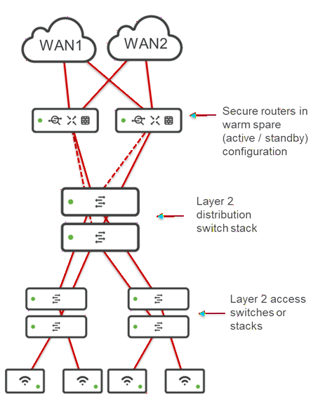
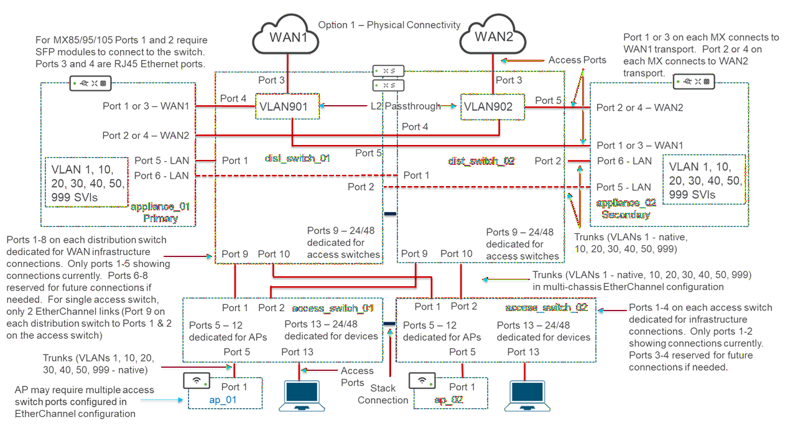
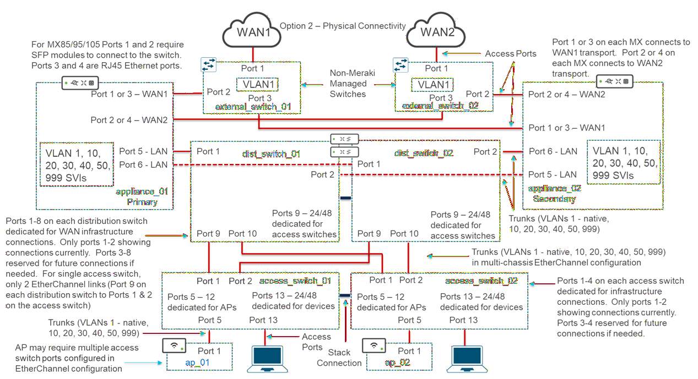
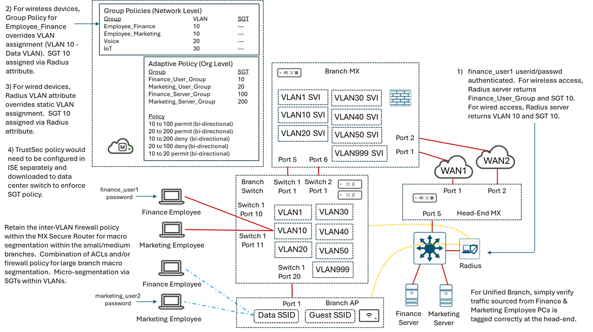

# Unified Branch - Layer 2 Large Branch System Functional Specification

## 1.0 Overview

Phase 2 of Unified Branch supports a network design for small, medium, and large branch sites.  The original large branch design was based around the implementation of a layer 3 distribution switch stack within the branch.  However, the current release of the [Create Network Switch Stack Routing Interface](https://developer.cisco.com/meraki/api-v1/create-network-switch-stack-routing-interface/) API does not support the necessary parameters (**upLinkV4** and/or **candidataUpLinkV4**) for automating the configuration of the preferred uplink between layer 3 switch stack and the secure router.  This is necessary in order to automate the provisioning of any additional layer 3 routed interfaces (SVIs) on the distribution switch stack as well.  Hence, without this, there is no capability of automating a layer 3 switch stack within the large branch design.  The timeframe for getting the necessary upates to the API are potentially Q1 FY27.  Since this is outside the desired timeframe for releasing Phase 2 of Unified Branch, the large branch design must be modified to support a layer 2 distribution switch within the branch, instead.

This SFS document discusses the new layer 2 large branch design.  Note, that this will still be referred to as the large branch design in the Unified Branch Phase 2 release. 

## 2.0 Large Branch High-Level Design

The high-level layout of the large branch design is shown below.

**Figure 1. Large Branch - High Level Overview**

The large branch network design consists of the following components:

 - Two Cisco secure routers in an active/standby configuration, each with up to 2 WAN uplinks for redundancy.

 - A single cloud managed layer 2 distribution switch stack, where the number of switches supported in the stack is the maximum number of switches supported in a stack configuration for the model of switch deployed.

 - Multiple cloud managed layer 2 access switches or switch stacks, where the number of switches supported in the stack is the maximum number of switches supported in a stack configuration for the model of switch deployed.  The number of access switches or switch stacks depends on the requirements (number of wiring closets, etc.) within the large branch.

 - Multiple WLAN Access Points (APs), where the maximum number of APs deployed within the site depends upon the requirements (number of people within the branch, number of devices per person, throughput per person, floor space, etc.) of the large branch site. 

## 3.0 Physical Connectivity

Figure 1 above shows both landline WAN service providers connected to both secure routers.  In reality, there is only a single physical Ethernet handoff from each WAN service provider, which needs to connect to both the primary and secondary secure routers.  This results in the same two options discussed in the medium branch design:

 - Option 1:  Creating two VLANs (VLANs 901 & 902) on the L2 distribution switch/switch stack.

 - Option 2:  Implementing separate non-Meraki managed (IOS XE autonomous) switches to "split" the Ethernet handoff from each landline WAN service provider.
 
 ### 3.1 Option 1

 With Option 1, VLANS 901 and 902 are configured on the L2 distribution switch stack of the large branch, simply to provide L2 passthrough connectivity from the WAN service provider physical Ethernet handoff to the Gigabit Ethernet ports (WAN1 and WAN2 respectively) of the secure routers, as shown in the figure below.

**Figure 2. Large Branch - Physical Connectivity Option 1**

For Option 1, the following would be the port configurations based on each layer 2 distribution switch (assuming a 2 switch distribution stack and 2 switch access stacks):

**Table 1. Option 1 Dist_Switch_01 Port Connections**

| Dist_Switch_01 | Connected To | Switch Port Configuration |
| ---------------| ------------ | ------------------------- |
| Port 1 | appliance_01, Port 5 | Trunk Port - VLANs 1 (native), 10, 20, 30, 40, 50, 999 |
| Port 2 | appliance_02, Port 5 | Trunk Port - VLANs 1 (native), 10, 20, 30, 40, 50, 999 |
| Port 3 | WAN1 Ethernet Handoff | Access Port - VLAN 901 | 
| Port 4 | appliance_01, Port 1 or 3 | Access Port - VLAN 901 |
| Port 5 | appliance_02, Port 1 or 3 | Access Port - VLAN 901 |
| Ports 6-8 | Infrastructure Reserved | Shutdown |
| Port 9 | access_switch_01, Port 1 | Trunk Port - VLANs 1 (native), 10, 20, 30, 40, 50, 999 |
| Port 10 | access_switch_02, Port 1 | Trunk Port - VLANs 1 (native), 10, 20, 30, 40, 50, 999 |
| Ports 11-24/48 | Reserved for Access Switch Connections | Shutdown |

**Table 2. Option 1 Dist_Switch_02 Port Connections**

| Dist_Switch_02 | Connected To | Switch Port Configuration |
| ---------------| ------------ | ------------------------- |
| Port 1 | appliance_01, Port 6 | Trunk Port - VLANs 1 (native), 10, 20, 30, 40, 50, 999 |
| Port 2 | appliance_02, Port 6 | Trunk Port - VLANs 1 (native), 10, 20, 30, 40, 50, 999 |
| Port 3 | WAN2 Ethernet Handoff | Access Port - VLAN 902 | 
| Port 4 | appliance_01, Port 2 or 4 | Access Port - VLAN 902 |
| Port 5 | appliance_02, Port 2 or 4 | Access Port - VLAN 902 |
| Ports 6-8 | Infrastructure Reserved | Shutdown |
| Port 9 | access_switch_01, Port 2 | Trunk Port - VLANs 1 (native), 10, 20, 30, 40, 50, 999 |
| Port 10 | access_switch_02, Port 2 | Trunk Port - VLANs 1 (native), 10, 20, 30, 40, 50, 999 |
| Ports 11-24/48 | Reserved for Access Switch Connections | Shutdown |

**Table 3. Option 1 Access_Switch_01 Port Connections**

| Access_Switch_01 | Connected To | Switch Port Configuration |
| -----------------| ------------ | ------------------------- |
| Port 1 | dist_switch_01, Port 9 | Trunk Port - VLANs 1 (native), 10, 20, 30, 40, 50, 999 |
| Port 2 | dist_switch_02, Port 9 | Trunk Port - VLANs 1 (native), 10, 20, 30, 40, 50, 999 |
| Ports 3-4 | Reserved for Distribution Switch Connections | Shutdown |
| Ports 5-12 | Dedicated for APs | Trunk Port - VLANs 1, 10, 20, 30, 40, 50, 999 (native) |
| Ports 13-24/48 | Dedicated for Devices | Access Ports |

**Table 4. Option 1 Access_Switch_02 Port Connections**

| Access_Switch_02 | Connected To | Switch Port Configuration |
| -----------------| ------------ | ------------------------- |
| Port 1 | dist_switch_01, Port 10 | Trunk Port - VLANs 1 (native), 10, 20, 30, 40, 50, 999 |
| Port 2 | dist_switch_02, Port 10 | Trunk Port - VLANs 1 (native), 10, 20, 30, 40, 50, 999 |
| Ports 3-4 | Reserved for Distribution Switch Connections | Shutdown |
| Ports 5-12 | Dedicated for APs | Trunk Port - VLANs 1, 10, 20, 30, 40, 50, 999 (native) |
| Ports 13-24/48 | Dedicated for Devices | Access Ports |

Infrastructure reserved ports and ports dedicated for access switch connections which are unused should be shutdown. 

 ### 3.2 Option 2

 Option 2 is for customers who are uncomfortable with using the large branch L2 distribution layer switches to provide both the WAN and LAN connectivity.  This is often due to potential security concerns regarding possible misconfiguration or in the event that the switch platforms are returned to a factory default configuration, or simply due to additional complexity when initially standing up the branch.  
 
 With Option 2, a pair of separate non-Meraki dashboard managed (IOS XE autonomous) switches are deployed within the large branch simply to provide L2 passthrough connectivity from the WAN service provider physical Ethernet handoff to the Gigabit Ethernet ports (WAN1 and WAN2 respectively) of the Cisco secure routers, as shown in the figure below.

**Figure 3. Large Branch - Physical Connectivity Option 2**

Note, this is the same as if the WAN service provider provided two physical Ethernet handoffs for each WAN connection.

For Option 2, the following would be the port configurations based on each layer 2 distribution switch (assuming a 2 switch distribution stack and 2 switch access stacks):

**Table 5. Option 2 Dist_Switch_01 Port Connections**

| Dist_Switch_01 | Connected To | Switch Port Configuration |
| ---------------| ------------ | ------------------------- |
| Port 1 | appliance_01, Port 5 | Trunk Port - VLANs 1 (native), 10, 20, 30, 40, 50, 999 |
| Port 2 | appliance_02, Port 5 | Trunk Port - VLANs 1 (native), 10, 20, 30, 40, 50, 999 |
| Ports 3-8 | Infrastructure Reserved | Shutdown |
| Port 9 | access_switch_01, Port 1 | Trunk Port - VLANs 1 (native), 10, 20, 30, 40, 50, 999 |
| Port 10 | access_switch_02, Port 1 | Trunk Port - VLANs 1 (native), 10, 20, 30, 40, 50, 999 |
| Ports 11-24/48 | Reserved for Access Switch Connections | Shutdown |

**Table 6. Option 2 Dist_Switch_02 Port Connections**

| Dist_Switch_02 | Connected To | Switch Port Configuration |
| ---------------| ------------ | ------------------------- |
| Port 1 | appliance_01, Port 6 | Trunk Port - VLANs 1 (native), 10, 20, 30, 40, 50, 999 
| Port 2 | appliance_02, Port 6 | Trunk Port - VLANs 1 (native), 10, 20, 30, 40, 50, 999 
| Ports 3-8 | Infrastructure Reserved | Shutdown |
| Port 9 | access_switch_01, Port 2 | Trunk Port - VLANs 1 (native), 10, 20, 30, 40, 50, 999 |
| Port 10 | access_switch_02, Port 2 | Trunk Port - VLANs 1 (native), 10, 20, 30, 40, 50, 999 |
| Ports 11-24/48 | Reserved for Access Switch Connections | Shutdown |

**Table 7. Option 2 Access_Switch_01 Port Connections**

| Access_Switch_01 | Connected To | Switch Port Configuration |
| -----------------| ------------ | ------------------------- |
| Port 1 | dist_switch_01, Port 9 | Trunk Port - VLANs 1 (native), 10, 20, 30, 40, 50, 999 |
| Port 2 | dist_switch_02, Port 9 | Trunk Port - VLANs 1 (native), 10, 20, 30, 40, 50, 999 |
| Ports 3-4 | Reserved for Distribution Switch Connections | Shutdown |
| Ports 5-12 | Dedicated for APs | Trunk Port - VLANs 1, 10, 20, 30, 40, 50, 999 (native) |
| Ports 13-24/48 | Dedicated for Devices | Access Ports |

**Table 8. Option 2 Access_Switch_02 Port Connections**

| Access_Switch_02 | Connected To | Switch Port Configuration |
| -----------------| ------------ | ------------------------- |
| Port 1 | dist_switch_01, Port 10 | Trunk Port - VLANs 1 (native), 10, 20, 30, 40, 50, 999 |
| Port 2 | dist_switch_02, Port 10 | Trunk Port - VLANs 1 (native), 10, 20, 30, 40, 50, 999 |
| Ports 3-4 | Reserved for Distribution Switch Connections | Shutdown |
| Ports 5-12 | Dedicated for APs | Trunk Port - VLANs 1, 10, 20, 30, 40, 50, 999 (native) |
| Ports 13-24/48 | Dedicated for Devices | Access Ports |

**Table 9. Option 2 External_switch_01 Port Connections**

| External_Switch_01 | Connected To | Configuration |
| -------------------| ------------ | ------------- |
| Port 1 | WAN1 Ethernet Handoff | Access Port | 
| Port 2 | appliance_01, Port 1 or 3 | Access Port |
| Port 3 | appliance_02, Port 1 or 3 | Access Port |

**Table 10. Option 2 External_switch_02 Port Connections**

| External_Switch_02 | Connected To | Configuration |
| -------------------| ------------ | ------------- |
| Port 1 | WAN2 Ethernet Handoff | Access Port | 
| Port 2 | appliance_02, Port 2 or 4 | Access Port |
| Port 3 | appliance_01, Port 2 or 4 | Access Port |

Infrastructure reserved ports and ports dedicated for APs which are unused should be shutdown.

The native VLAN on ports connecting access switches to APs has been moved from VLAN 1 to VLAN 999.  This is due to not having an API (and therefore no Terraform Provider resource) to change the native VLAN on APs themselves from VLAN 1 to VLAN 999 via automation.  Note, this is not necessarily inline with Cisco best practices to have the native VLAN of the AP set to VLAN 1 while the native VLAN of the switch port to which the AP is trunked set to VLAN 999. Using the Alternative Management Interface (AMI) is another option that may need to be looked at in the future to get around the issue of not having a programmatic way of simply moving the management VLAN from VLAN 1 to VLAN 999 on APs.

### 3.5 Common to all Options

#### 3.5.1 PCI VLAN 

 In each of the options shown above, an extra VLAN (VLAN 40) has been added.  VLAN 40 is targeted as the 'PCI VLAN'. This is technically no longer needed for the large branch design, as all inter-VLAN traffic within the branch now passes through the secure router which has stateful firewalling capabilities.  This is technically not needed for the small and medium branch designs also - as it is just another VLAN and does not need to be called out.  
 
 With the previous large branch design of Phase 2, the layer 3 boundary was shifted from the Cisco secure router down to the layer 3 distribution switch stack.  In order to maintain stateful firewalling of the PCI VLAN from the other VLANs within the large branch - which is generally a requirement for PCI certification - the PCI VLAN would need to be handled differently in the large branch design.  The PCI VLAN would need to be extended up to the secure router.  Hence the SVI definition for VLAN 40 (PCI VLAN) would need to exist within the secure router platforms, and not the L3 distribution switch stacks.  VLAN 40 (PCI VLAN) would be simply trunked through the L3 distribution layer switch stack from the L2 access layer switches / switch stacks.  Note that backhauling a VLAN through the layer 3 distribution switch stack in order to provide stateful firewalling of the VLAN within the large branch network was never considered to be in line with Cisco best practices for large branch designs.  It is a result of the fact that the Meraki platform does not currently support standalone firewalls, such as the Cisco Secure 200, 1000, 1200, or 3100 Series Firewalls - as would typically be deployed for east-west firewalling within a large branch design.
 
 Note that the inclusion of a VLAN called 'PCI VLAN' does not indicate a fully PCI compliant large branch design, as additional design considerations may need to be accounted for.  It was included merely to demonstrate stateful firewalling of a VLAN within the previous large branch design which is generally a minimal requirement for PCI compliance.

#### 3.5.1 Access Layer Switch vs Switch Stack

In addition, it has been determined through testing that a switch stack containing only one switch is not a valid Meraki dashboard configuration anymore.  For the Unified Branch Phase 2, we are mandating a layer 2 switch stack for the distribution layer of the large branch design.  Hence, the only option is a switch stack.  However, for the small and medium branch designs, options will need to be provided for either a switch or a switch stack within the Branch as Code YAML.  Further, within the large branch design, each individual wiring closet could have either a switch or a switch stack.  Hence options must be provided within the Branch as Code YAML.

For each of the choices above regarding configuration of switches or switch stacks, IP addressing must be via DHCP since there is no other alternative with current automation.  The choices of whether individual switches or switch stacks are deployed within each wireing closet at the access layer, will need to be configured as separate sections of the YAML file where the customer can uncomment or comment sections in order to create the right configuration for his/her branch.  This will be confusing to the customer and will likely result in errors and frustrations for the customer.  However, there is currently no branching structure within the Branch as Code automation to make this any easier for the customer.

The use of the Alternative Management Interface (AMI) has not been considered for Unified Branch designs because AMI requires layer 3 routing to be enabled on switches.  The current small and medium branch designs call for L2 switches or switch stacks.  The new large branch design calls for L2 switches at both the distribution and access layers, due to the issues discussed in the introduction section of this SFS.  Hence introducing the Alternative Management Interface (AMI) is not considered feasible at this time.  However, it may be necessary to move to designs which utilizes Alternative Management Interfaces (AMIs) for both switches and APs in future phases.

#### 3.5.2 Uplinks Between the Access and Distribution Layer Switches / Switch Stacks

For each of the two options discussed above, the number of uplinks between access switches or switch stacks and the distribution switch stack depends on various factors including bandwidth requirements, availability of uplink speeds greater than 1 Gbps at the distribution and access switches, desired level of oversubscription of the access layer uplinks, etc.  For Unified Branch Phase 2 - Branch as Code, knowledge of supported port speeds per port (based on switch model number and port number) and/or whether optional modules supporting higher port speeds are being used in the either the distribution or access layer platform, would be needed in order to provision anything other than multiple 1 Gbps connections between the distribution and access layer switches.  Since this information is not currently collected and held with the netascode module and/or data model, there is no feasible way to provision anything other than a standard set of ports between the distribution and access layer switches.

For Phase 2 of Unified Branch - Branch as Code, it will be assumed that a distribution switch stack of at least two switches is always deployed for redundancy at the distribution layer.  For wiring closets with access layer switch stacks consisting of at least two switches a total of 4 x 1 Gbps links will be deployed between the distribution and access layer switches as discussed in Tables 1 - 4 above.  It will be assumed that all 4 links will be configured in a single cross-stack link aggregation (MLAG) configuration. For wiring closets with a single access layer switch stack, it will be assumed that only 2 of the 4 links will be active, although the configuration on the distribution layer switch will be the same - as though the acces layer was as switch stack.  Although this is somewhat more wasteful of switch ports at the distribution switch stack, it also standardizes the configuration between the distribution and access layers without having separate configurations when implementing an access layer switch versus a switch stack, and allows for upgrading a wiring closet from a single switch to a switch stack with minimal effort.  It is understood that this is not inline with Cisco best practices, which are to provision the necessary 1, 2.5, 5 or 10 Gbps links in a MLAG configuration in order to provide the desired oversubscription ratio and redundancy between the access and distribution layer switches.  However, the current automation tools have no means of doing this.  It is up to the customer to manually modify the YAML files to accomplish this if needed. 

#### 3.5.2 Uplinks Between the APs and Access Layer Switches / Switch Stacks

It should also be noted that with the support of the C9178 AP in Phase 2 of Unified Branch, more than one physical Ethernet port can be used to connect the access layer switch / stack to an AP.  When multiple ports are used, the switchports should be configured in a link aggregation (EtherChannel) configuration. Again, knowledge of supported port speeds per port (based on switch model number and port number) as well as the model number of the AP is needed to automate multiple switch ports in a link aggregation (Etherchannel) configuration.  Since this information is not currently collected and held within the netascode module and data model, there is no feasible way to provision anything other than a standard single Ethernet port between the access layer switch and the AP.  Again, it is understood that this is not inline with Cisco best practices, which are to provision the necessary 1, 2.5, 5 or 10 Gbps links in a MLAG configuration in order to provide the desired throughput and redundancy between the APs and the access layer switches.  However, the current automation tools have no means of doing this.  It is up to the customer to manually modify the YAML files to accomplish this if needed. 

It should be called out within the comments within the YAML configuration of the Github repository, as well as within the CVD, that this configuration is provided as an example for reference.  The customer / partner, with full knowledge of the platforms deployed per branch at both the distribution and access layers, as well as the APs, can - and in many cases should - customize the number of ports, port numbers used, and the port speeds to provide the appropriate amount of bandwidth between the access and distribution layers within each wiring closet, as well as between the access layer switch and each AP - as this cannot be feasibly done currently in Unified Branch - Branch as Code.

### 3.6 Large Branch Inventory Config Template - Router, Switch, and AP Configurations

#### 3.6.1 YAML Configuration - *small_branch_inventory*, *medium_branch_inventory*, and *large_branch_inventory* templates

The following is an example of the *small_branch_inventory*, *medium_branch_inventory*, and *large_branch_inventory* templates which will be needed within the [*templates-inventory.nac.yaml*](https://github.com/netascode/nac-branch/blob/main/data/templates-inventory.nac.yaml) file within the existing Cisco Unified Branch GitHub Repository for supporting the small, medium, and large branch designs of Unified Branch Phase 2.

    # The below code does the following:
    #
    # This YAML file defines the following inventory related template:
    #
    # - Small Branch Inventory (small_branch_inventory)
    #   - small_branch_inventory template defines 1 Secure Router 
    #     (Security Appliance), 1 Switch Stack with 2 Switches, 
    #      and 2 Access Points.
    #
    # - Medium Branch Inventory (medium_branch_inventory)
    #  - medium_branch_inventory trmplate defines 2 Secure Routers
    #    (Security Appliances), 1 Switch Stack with 2 Switches,
    #    and 2 Access Points.
    #
    # - Large Inventory (large_branch_inventory)
    #  - large_branch_inventory trmplate defines 2 Secure Routers
    #    (Security Appliances), 1 Distribution Switch Stack with 
    #    2 Switches, 1 Access Switch Stack with 2 Switches, 
    #    and 2 Access Points.
    #
    # Each template defines network-level configuration which is
    # applicable to the inventory - meaning the secure router,
    # switch, and AP devices - within the site.
    #
    meraki:
      template:
        networks:
          #
          # The below code does the following:
          #
          # small_branch_inventory configuration template.
          #
          # The small_branch_inventory configuration template defines
          # the devices (security appliance, switches, and access points)
          # and configures parameters specific to those devices
          # within the site/network to which the template is applied.
          #
          # Note that this repository uses the words appliance, 
          # security appliance, and secure router to all refer 
          # to the MX security appliance.
          #
          - name: small_branch_inventory
            type: model
            configuration:
              name:
              devices:
                #
                # The below code does the following:
                #
                # Primary secure router (Appliance) configuration
                #
                # Defines the name, serial number, geolocation coordinates
                # (latitude & longitude), and address variables for the
                # primary Cisco secure router (appliance_01) within the site
                # to which the template is applied.
                #
                - name: ${appliance_01_name}
                  serial: ${appliance_01_serial}
                  tags:
                    - small_branch
                    - UBaC          # Is this the right tag for Unified Branch - Branch as Code?
                  lat: ${lat}
                  lng: ${lng}
                  address: ${address}
                  notes: Small Branch Secure Router
                #
                # The below code does the following:
                #
                # Small branch switch configurations
                #
                # Defines the name, serial number, geolocation coordinates
                # (latitude & longitude), and address variables for the
                # first and second switches within the site to which the
                # template is applied. 
                #
                #  Hardcodes ports 1, 2, 9 - 12 of both access switches
                #  to be trunk ports allowing VLANs 1, 10, 20, 30, 40,
                #  50, and 999.  For uplink ports 1-2, VLAN 1 is configured
                #  as the native VLAN. For AP ports 9 - 12, VLAN 999 is 
                #  configured as the native VLAN.
                #
                #  Note: For certain MS switch stacks (including the MS-150), 
                #  a potential issue with switches within in a stack which are not
                #  directly attached to the secure router or distribution switch
                #  (when deployed as an access-layer stack in the large branch 
                #  design) has been identified.  Under certain circumstances
                #  the management VLAN of these switches gets stuck in VLAN 1
                #  instead of moving to VLAN 999 as configured.  This can cause
                #  the management IP address of these switches to change. Functions
                #  such as Radius authentication which rely on a fixed source IP 
                #  address can stop working. As a workaround, the native VLAN
                #  on the trunk between the secure router and the MS
                #  switch stack can be moved to VLAN 999 on the secure router.
                #  Simultaneously, the native VLAN on trunks between the
                #  switch stack and APs must be moved back to VLAN 1.
                #  This may result in a VLAN mismatch error generated
                #  by the Meraki Dashboard, but should force these switches
                #  to receive IP addresses on VLAN 999 (instead of VLAN 1), 
                #  restoring connectivity to the centrally located RADIUS servers.
                #  
                #  Hardcodes ports 3 - 8 of both access switches to be
                #  access ports on VLAN 1 and shutdown.  Reserved for 
                #  infrastructure use.
                #
                #  Hardcodes ports 12 - 24/48 of both access switches to
                #  be access ports on VLAN 10 (data) with voice VLAN 20.
                # 
                #  Rapid Spanning-Tree Protocol (RTSP) is enabled by default 
                #  on the trunk ports. Link negotiation (speed and duplex)
                #  is set to auto negotiate by default.
                #
                #  RSTP is enabled by default with BPDU guard and storm
                #  control also enabled for access ports. Link negotiation
                #  (speed and duplex) is set to auto negotiate.
                #
                #  Note, you may need to change the port_id_ranges
                #  depending upon which switch models you choose to 
                #  deploy within your branch.
                #
                  - name: ${access_switch_01_name}
                    serial: ${access_switch_01_serial}
                    tags:
                      - UBaC          #Is this the right tag for Unified Branch - Branch as Code?
                    lat: ${lat}
                    lng: ${lng}
                    address: ${address}
                    notes: Small Branch Notes Switch 1
                    switch:
                      ports:
                      - port_id_ranges:
                        - from: 1
                          to: 2
                        name: Uplink Trunk Port
                        enabled: true
                        type: trunk
                        tags:
                          - uplink
                          - trunk
                        vlan: 1
                        allowed_vlans: 1,10,20,30,40,50,999
                        link_negotiation: Auto negotiate
                        udld: Alert only
                        storm_control: true
                        rstp: true
                        peer_sgt_capable: $(sgt_pass)
                        adaptive_policy_group_name: ${adaptive_policy_group}
                      - port_id_ranges:
                        - from: 3
                          to: 8
                        name: Reserved for Infrastructure
                        enabled: false
                        type: access
                        tags:
                          - access
                        vlan: 1
                        link_negotiation: Auto negotiate
                        storm_control: true
                        rstp: true                    
                        stp_guard: bpdu guard
                      - port_id_ranges:
                        - from: 9
                          to: 12
                        name: AP Trunk Port
                        enabled: true
                        type: trunk
                        tags:
                          - uplink
                          - trunk
                        vlan: 999
                        allowed_vlans: 1,10,20,30,40,50,999
                        link_negotiation: Auto negotiate
                        udld: Alert only
                        storm_control: true
                        rstp: true
                        peer_sgt_capable: $(sgt_pass)
                        adaptive_policy_group_name: ${adaptive_policy_group}
                      - port_id_ranges:
                        - from: 13
                          to: 24
                        name: Access Port
                        enabled: true
                        type: access
                        tags:
                          - access
                        vlan: 10
                        voice_vlan: 20
                        link_negotiation: Auto negotiate
                        storm_control: true
                        rstp: true
                        stp_guard: bpdu guard
                  - name: ${access_switch_02_name}
                    serial: ${access_switch_02_serial}
                    tags:
                      - UBaC          #Is this the right tag for Unified Branch - Branch as Code?
                    lat: ${lat}
                    lng: ${lng}
                    address: ${address}
                    notes: Small Branch Notes Switch 2
                    switch:
                      ports:
                      - port_id_ranges:
                        - from: 1
                          to: 2
                        name: Uplink Trunk Port
                        enabled: true
                        type: trunk
                        tags:
                          - uplink
                          - trunk
                        vlan: 1
                        allowed_vlans: 1,10,20,30,40,50,999
                        link_negotiation: Auto negotiate
                        udld: Alert only
                        storm_control: true
                        rstp: true
                        peer_sgt_capable: $(sgt_pass)
                        adaptive_policy_group_name: ${adaptive_policy_group}
                      - port_id_ranges:
                        - from: 3
                          to: 8
                        name: Reserved for Infrastructure
                        enabled: false
                        type: access
                        tags:
                          - access
                        vlan: 1
                        link_negotiation: Auto negotiate
                        storm_control: true
                        rstp: true                    
                        stp_guard: bpdu guard
                      - port_id_ranges:
                        - from: 9
                          to: 12
                        name: AP Trunk Port
                        enabled: true
                        type: trunk
                        tags:
                          - uplink
                          - trunk
                        vlan: 999
                        allowed_vlans: 1,10,20,30,40,50,999
                        link_negotiation: Auto negotiate
                        udld: Alert only
                        storm_control: true
                        rstp: true
                        peer_sgt_capable: $(sgt_pass)
                        adaptive_policy_group_name: ${adaptive_policy_group}
                      - port_id_ranges:
                        - from: 13
                          to: 24
                        name: Access Port
                        enabled: true
                        type: access
                        tags:
                          - access
                        vlan: 10
                        voice_vlan: 20
                        link_negotiation: Auto negotiate
                        storm_control: true
                        rstp: true
                        stp_guard: bpdu guard
                  #
                  # The below code does the following:
                  #
                  # Access point configurations
                  #
                  # Defines the name, serial number, geolocation coordinates
                  # (latitude & longitude), and address variables for the
                  # access points within the site to which the template
                  # is applied. Assigns the AP to the RF profile. 
                  # 
                  # Note: If you wish to configure the AP back to the default
                  # "indoor" or "outdoor" RF profiles, this must be done either
                  # by creating a new RF profile with the same settings as the 
                  # default "indoor" or "outdoor" RF profile and assigning 
                  # the AP to the RF profile; or by going into the Dashboard
                  # and setting the AP back to the default "indoor" or "outdoor"
                  # RF profile.
                  #
                  # First access point configuration
                  # 
                  - name: ${ap_01_name}
                    serial: ${ap_01_serial}
                    tags:
                      - UBaC          #Is this the right tag for Unified Branch - Branch as Code?
                    lat: ${lat}
                    lng: ${lng}
                    address: ${address}
                    notes: Small Branch Notes Access Point 1
                    wireless:
                      radio_settings:
                        rf_profile_name: Corp wireless rf profile
                  #
                  # The below code does the following:
                  #
                  # Second access point configuration
                  #            
                  - name: ${ap_02_name}
                    serial: ${ap_02_serial}
                    tags:
                      - UBaC          #Is this the right tag for Unified Branch - Branch as Code?
                    lat: ${lat}
                    lng: ${lng}
                    address: ${address}
                    notes: Small Branch Notes Access Point 2
                    wireless:
                      radio_settings:
                        rf_profile_name: Corp wireless rf profile
                  #
                  # Copy access point configuration sections as needed
                  # to support the number of access points within the 
                  # small branch.
                  #
              #
              # The below code does the following:
              #
              # medium_branch_inventory configuration template.
              #
              # The medium_branch_inventory configuration template defines
              # the devices (security appliances, switches, and access points)
              # and configures parameters specific to those devices
              # within the site/network to which the template is applied.
              #
              # Note that this repository uses the words appliance, 
              # security appliance, and secure router to all refer 
              # to the MX security appliance.
              #
              - name: medium_branch_inventory
                type: model
                configuration:
                  name:
                devices:
                  #
                  # The below code does the following:
                  #
                  # Primary secure router (appliance) configuration
                  #
                  # Defines the name, serial number, geolocation coordinates
                  # (latitude & longitude), and address variables for the
                  # primary secure router (appliance_01) within the site
                  # to which the template is applied.
                  #
                  - name: ${appliance_01_name}
                    serial: ${appliance_01_serial}
                    tags:
                      - UBaC          #Is this the right tag for Unified Branch - Branch as Code?
                    lat: ${lat}
                    lng: ${lng}
                    address: ${address}
                    notes: Medium Branch Primary Secure Router
                  #
                  # The below code does the following:
                  #
                  # Secondary secure router (appliance) configuration
                  #
                  # Defines the name, serial number, geolocation coordinates
                  # (latitude & longitude), and address variables for the
                  # secondary (warm spare) Cisco secure router (appliance_02)
                  # within the site to which the template is applied.
                  #
                  # Note that since both Cisco secure routers are located
                  # within the same site, the lat, lng, and address variables
                  # are the same as with appliance_01 above.
                  #
                  - name: ${appliance_02_name}
                    serial: ${appliance_02_serial}
                    tags:
                      - UBaC          #Is this the right tag for Unified Branch - Branch as Code?
                    lat: ${lat}
                    lng: ${lng}
                    address: ${address}
                    notes: Medium Branch Secondary Secure Router
                  #
                  # The below code does the following:
                  #
                  # Medium branch switch configurations
                  #
                  # Defines the name, serial number, geolocation coordinates
                  # (latitude & longitude), and address variables for the
                  # first and second switches within the site to which the
                  # template is applied.
                  #
                  # There are 2 possible combinations of connectivity for the 
                  # medium branch depending upon whether the access switches
                  # are used as passthrough devices for WAN connectivity or
                  # whether separate non-Meraki managed (autonomous IOS XE) 
                  # switches are used for WAN connectivity.  These design
                  # choices are discussed in the Cisco Unified Branch CVD.
                  #
                  # Decide which option you will be deploying for your medium
                  # branch and uncomment either Option 1 or Option 2 in the 
                  # template below.  
                  #
                  # Option 1: 
                  #  Hardcodes ports 1, 2, 9 - 12 of both access switches
                  #  to be trunk ports allowing VLANs 1, 10, 20, 30, 40,
                  #  50, and 999.  For uplink ports 1-2, VLAN 1 is configured
                  #  as the native VLAN. For AP ports 9 - 12, VLAN 999 is 
                  #  configured as the native VLAN.
                  #
                  #  Note: For certain MS switch stacks (including the MS-150), 
                  #  a potential issue with switches within in a stack which are not
                  #  directly attached to the secure router or distribution switch
                  #  (when deployed as an access-layer stack in the large branch 
                  #  design) has been identified.  Under certain circumstances
                  #  the management VLAN of these switches gets stuck in VLAN 1
                  #  instead of moving to VLAN 999 as configured.  This can cause
                  #  the management IP address of these switches to change. Functions
                  #  such as Radius authentication which rely on a fixed source IP 
                  #  address can stop working. As a workaround, the native VLAN
                  #  on the trunk between the secure router and the MS
                  #  switch stack can be moved to VLAN 999 on the secure router.
                  #  Simultaneously, the native VLAN on trunks between the
                  #  switch stack and APs must be moved back to VLAN 1.
                  #  This may result in a VLAN mismatch error generated
                  #  by the Meraki Dashboard, but should force these switches
                  #  to receive IP addresses on VLAN 999 (instead of VLAN 1), 
                  #  restoring connectivity to the centrally located Radius servers.
                  #
                  #  Hardcodes ports 3 - 5 of access_switch_01 to be access
                  #  ports on VLAN 901 (passthrough VLAN).
                  #
                  #  Hardcodes ports 3 - 5 of access_switch_02 to be access 
                  #  ports on VLAN 902 (passthrough VLAN).
                  #  
                  #  Hardcodes ports 6 - 8 of both access switches to be
                  #  access ports on VLAN 1 and shutdown.  Reserved for 
                  #  infrastructure use.
                  #
                  #  Hardcodes ports 12 - 24/48 of both access switches to
                  #  be access ports on VLAN 10 (data) with voice VLAN 20.
                  # 
                  #  Rapid Spanning-Tree Protocol (RSTP) is enabled by default 
                  #  on the trunk ports. Link negotiation (speed and duplex)
                  #  is set to auto negotiate by default.
                  #
                  #  RSTP is enabled by default with BPDU guard and storm
                  #  control also enabled for access ports. Link negotiation
                  #  (speed and duplex) is set to auto negotiate.
                  #
                  #  Note, you may need to change the port_id_ranges
                  #  depending upon which switch models you choose to 
                  #  deploy within your branch.
                  #
                  - name: ${access_switch_01_name}
                    serial: ${access_switch_01_serial}
                      tags:
                        - UBaC          #Is this the right tag for Unified Branch - Branch as Code?
                      lat: ${lat}
                      lng: ${lng}
                      address: ${address}
                      notes: Medium Branch Notes Switch 1
                      switch:
                        ports:
                        - port_id_ranges:
                          - from: 1
                            to: 2
                          name: Uplink Trunk Port
                          enabled: true
                          type: trunk
                          tags:
                            - uplink
                            - trunk
                          vlan: 1
                          allowed_vlans: 1,10,20,30,40,50,999
                          link_negotiation: Auto negotiate
                          udld: Alert only
                          storm_control: true
                          rstp: true
                            peer_sgt_capable: $(sgt_pass)
                            adaptive_policy_group_name: ${adaptive_policy_group}
                        - port_id_ranges:
                          - from: 3
                            to: 5
                          name: WAN Passthrough Port
                          enabled: true
                          type: access
                          tags:
                            - access
                          vlan: 901
                          link_negotiation: Auto negotiate
                          storm_control: true
                          rstp: true                    
                          stp_guard: bpdu guard
                        - port_id_ranges:
                          - from: 6
                            to: 8
                          name: Reserved for Infrastructure
                          enabled: false
                          type: access
                          tags:
                            - access
                          vlan: 1
                          link_negotiation: Auto negotiate
                          storm_control: true
                          rstp: true                    
                          stp_guard: bpdu guard
                        - port_id_ranges:
                          - from: 9
                            to: 12
                          name: AP Trunk Port
                          enabled: true
                          type: trunk
                          tags:
                            - uplink
                            - trunk
                          vlan: 999
                          allowed_vlans: 1,10,20,30,40,50,999
                          link_negotiation: Auto negotiate
                          udld: Alert only
                          storm_control: true
                          rstp: true
                          peer_sgt_capable: $(sgt_pass)
                          adaptive_policy_group_name: ${adaptive_policy_group}
                        - port_id_ranges:
                          - from: 13
                            to: 24
                          name: Access Port
                          enabled: true
                          type: access
                          tags:
                            - access
                          vlan: 10
                          voice_vlan: 20
                          link_negotiation: Auto negotiate
                          storm_control: true
                          rstp: true
                          stp_guard: bpdu guard
                  - name: ${access_switch_02_name}
                    serial: ${access_switch_02_serial}
                      tags:
                        - UBaC          #Is this the right tag for Unified Branch - Branch as Code?
                      lat: ${lat}
                      lng: ${lng}
                      address: ${address}
                      notes: Medium Branch Notes Switch 2
                      switch:
                        ports:
                        - port_id_ranges:
                          - from: 1
                            to: 2
                          name: Uplink Trunk Port
                          enabled: true
                          type: trunk
                          tags:
                            - uplink
                            - trunk
                          vlan: 1
                          allowed_vlans: 1,10,20,30,40,50,999
                          link_negotiation: Auto negotiate
                          udld: Alert only
                          storm_control: true
                          rstp: true
                          peer_sgt_capable: $(sgt_pass)
                          adaptive_policy_group_name: ${adaptive_policy_group}
                        - port_id_ranges:
                          - from: 3
                            to: 5
                          name: WAN Passthrough Port
                          enabled: true
                          type: access
                          tags:
                            - access
                          vlan: 902
                          link_negotiation: Auto negotiate
                          storm_control: true
                          rstp: true                    
                          stp_guard: bpdu guard
                        - port_id_ranges:
                          - from: 6
                            to: 8
                          name: Reserved for Infrastructure
                          enabled: false
                          type: access
                          tags:
                            - access
                          vlan: 1
                          link_negotiation: Auto negotiate
                          storm_control: true
                          rstp: true                    
                          stp_guard: bpdu guard
                        - port_id_ranges:
                          - from: 9
                            to: 12
                          name: AP Trunk Port
                          enabled: true
                          type: trunk
                          tags:
                            - uplink
                            - trunk
                          vlan: 999
                          allowed_vlans: 1,10,20,30,40,50,999
                          link_negotiation: Auto negotiate
                          udld: Alert only
                          storm_control: true
                          rstp: true
                          peer_sgt_capable: $(sgt_pass)
                          adaptive_policy_group_name: ${adaptive_policy_group}
                        - port_id_ranges:
                          - from: 13
                            to: 24
                          name: Access Port
                          enabled: true
                          type: access
                          tags:
                            - access
                          vlan: 10
                          voice_vlan: 20
                          link_negotiation: Auto negotiate
                          storm_control: true
                          rstp: true
                          stp_guard: bpdu guard
                  #
                  # Option 2: 
                  #  Hardcodes ports 1, 2, 9 - 12 of both access switches
                  #  to be trunk ports allowing VLANs 1, 10, 20, 30, 40,
                  #  50, and 999.  For uplink ports 1-2, VLAN 1 is configured
                  #  as the native VLAN. For AP ports 9 - 12, VLAN 999 is 
                  #  configured as the native VLAN.
                  #
                  #  Note: For certain MS switch stacks (including the MS-150), 
                  #  a potential issue with switches within in a stack which are not
                  #  directly attached to the secure router or distribution switch
                  #  (when deployed as an access-layer stack in the large branch 
                  #  design) has been identified.  Under certain circumstances
                  #  the management VLAN of these switches gets stuck in VLAN 1
                  #  instead of moving to VLAN 999 as configured.  This can cause
                  #  the management IP address of these switches to change. Functions
                  #  such as Radius authentication which rely on a fixed source IP 
                  #  address can stop working. As a workaround, the native VLAN
                  #  on the trunk between the secure router and the MS
                  #  switch stack can be moved to VLAN 999 on the secure router.
                  #  Simultaneously, the native VLAN on trunks between the
                  #  switch stack and APs must be moved back to VLAN 1.
                  #  This may result in a VLAN mismatch error generated
                  #  by the Meraki Dashboard, but should force these switches
                  #  to receive IP addresses on VLAN 999 (instead of VLAN 1), 
                  #  restoring connectivity to the centrally located Radius servers.                 
                  #  
                  #  Hardcodes ports 3 - 8 of both access switches to be access
                  #  ports on VLAN 1 and shutdown.  Reserved for infrastructure use.
                  #
                  #  Hardcodes ports 12 - 24/48 of both access switches to
                  #  be access ports on VLAN 10 (data) with voice VLAN 20. 
                  # 
                  #  Rapid Spanning-Tree Protocol (RSTP) is enabled by 
                  #  default on the trunk ports. Link negotiation (speed
                  #  and duplex) is set to auto negotiate by default.
                  #
                  #  RSTP is enabled by default with BPDU guard and storm
                  #  control also enabled for access ports. Link negotiation
                  #  (speed and duplex) is set to auto negotiate.
                  #
                  #  Note, you may need to change the port_id_ranges
                  #  depending upon which switch models you choose to 
                  #  deploy within your branch.
                  #
                  #  - name: ${access_switch_01_name}
                  #    serial: ${access_switch_01_serial}
                  #     tags:
                  #       - UBaC          #Is this the right tag for Unified Branch - Branch as Code?
                  #     lat: ${lat}
                  #     lng: ${lng}
                  #     address: ${address}
                  #     notes: Medium Branch Notes Switch 1
                  #     switch:
                  #       ports:
                  #       - port_id_ranges:
                  #         - from: 1
                  #           to: 2
                  #         name: Uplink Trunk Port
                  #         enabled: true
                  #         type: trunk
                  #         tags:
                  #           - uplink
                  #           - trunk
                  #         vlan: 1
                  #         allowed_vlans: 1,10,20,30,40,50,999
                  #         link_negotiation: Auto negotiate
                  #         udld: Alert only
                  #         storm_control: true
                  #         rstp: true
                  #         peer_sgt_capable: $(sgt_pass)
                  #         adaptive_policy_group_name: ${adaptive_policy_group}
                  #       - port_id_ranges:
                  #         - from: 3
                  #           to: 8
                  #         name: Reserved for Infrastructure
                  #         enabled: false
                  #         type: access
                  #         tags:
                  #           - access
                  #         vlan: 1
                  #         link_negotiation: Auto negotiate
                  #         storm_control: true
                  #         rstp: true                    
                  #         stp_guard: bpdu guard
                  #       - port_id_ranges:
                  #         - from: 9
                  #           to: 12
                  #         name: AP Trunk Port
                  #         enabled: true
                  #         type: trunk
                  #         tags:
                  #           - uplink
                  #           - trunk
                  #         vlan: 999
                  #         allowed_vlans: 1,10,20,30,40,50,999
                  #         link_negotiation: Auto negotiate
                  #         udld: Alert only
                  #         storm_control: true
                  #         rstp: true
                  #         peer_sgt_capable: $(sgt_pass)
                  #         adaptive_policy_group_name: ${adaptive_policy_group}
                  #       - port_id_ranges:
                  #         - from: 13
                  #           to: 24
                  #         name: Access Port
                  #         enabled: true
                  #         type: access
                  #         tags:
                  #           - access
                  #         vlan: 10
                  #         voice_vlan: 20
                  #         link_negotiation: Auto negotiate
                  #         storm_control: true
                  #         rstp: true
                  #         stp_guard: bpdu guard
                  #  - name: ${access_switch_02_name}
                  #    serial: ${access_switch_02_serial}
                  #     tags:
                  #       - UBaC          #Is this the right tag for Unified Branch - Branch as Code?
                  #     lat: ${lat}
                  #     lng: ${lng}
                  #     address: ${address}
                  #     notes: Medium Branch Switch 2 Notes
                  #     switch:
                  #       ports:
                  #       - port_id_ranges:
                  #         - from: 1
                  #           to: 2
                  #         name: Uplink Trunk Port
                  #         enabled: true
                  #         type: trunk
                  #         tags:
                  #           - uplink
                  #           - trunk
                  #         vlan: 1
                  #         allowed_vlans: 1,10,20,30,40,50,999
                  #         link_negotiation: Auto negotiate
                  #         udld: Alert only
                  #         storm_control: true
                  #         rstp: true
                  #         peer_sgt_capable: $(sgt_pass)
                  #         adaptive_policy_group_name: ${adaptive_policy_group}
                  #       - port_id_ranges:
                  #         - from: 3
                  #           to: 8
                  #         name: Reserved for Infrastructure
                  #         enabled: false
                  #         type: access
                  #         tags:
                  #           - access
                  #         vlan: 1
                  #         link_negotiation: Auto negotiate
                  #         storm_control: true
                  #         rstp: true                    
                  #         stp_guard: bpdu guard
                  #       - port_id_ranges:
                  #         - from: 9
                  #           to: 12
                  #         name: AP Trunk Port
                  #         enabled: true
                  #         type: trunk
                  #         tags:
                  #           - uplink
                              - trunk
                  #         vlan: 999
                  #         allowed_vlans: 1,10,20,30,40,50,999
                  #         link_negotiation: Auto negotiate
                  #         udld: Alert only
                  #         storm_control: true
                  #         rstp: true
                  #         peer_sgt_capable: $(sgt_pass)
                  #         adaptive_policy_group_name: ${adaptive_policy_group}
                  #       - port_id_ranges:
                  #         - from: 13
                  #           to: 24
                  #         name: Access Port
                  #         enabled: true
                  #         type: access
                  #         tags:
                  #           - access
                  #         vlan: 10
                  #         voice_vlan: 20
                  #         link_negotiation: Auto negotiate
                  #         storm_control: true
                  #         rstp: true
                  #         stp_guard: bpdu guard
                  # 
                  # The below code does the following:
                  #
                  # Access point configurations
                  #
                  # Defines the name, serial number, geolocation coordinates
                  # (latitude & longitude), and address variables for the
                  # access points within the site to which the template
                  # is applied. Assigns the AP to the RF profile. 
                  # 
                  # Note: If you wish to configure the AP back to the default
                  # "indoor" or "outdoor" RF profiles, this must be done either
                  # by creating a new RF profile with the same settings as the 
                  # default "indoor" or "outdoor" RF profile and assigning 
                  # the AP to the RF profile; or by going into the Dashboard
                  # and setting the AP back to the default "indoor" or "outdoor"
                  # RF profile.
                  #
                  # First access point configuration
                  # 
                  - name: ${ap_01_name}
                    serial: ${ap_01_serial}
                    tags:
                      - UBaC          #Is this the right tag for Unified Branch - Branch as Code?
                    lat: ${lat}
                    lng: ${lng}
                    address: ${address}
                    notes: Medium Branch Notes Access Point 1
                    wireless:
                      radio_settings:
                        rf_profile_name: Corp wireless rf profile
                  #
                  # The below code does the following:
                  #
                  # Second access point configuration
                  #         
                  - name: ${ap_02_name}
                    serial: ${ap_02_serial}
                    tags:
                      - UBaC          #Is this the right tag for Unified Branch - Branch as Code?
                    lat: ${lat}
                    lng: ${lng}
                    address: ${address}
                    notes: Medium Branch Notes Access Point 2
                    wireless:
                      radio_settings:
                        rf_profile_name: Corp wireless rf profile
                  #
                  # Copy access point configuration sections as needed
                  # to support the number of access points within the 
                  # medium branch.
                  #
          #
          # The below code does the following:
          #
          # large_branch_inventory configuration template.
          #
          # The large_branch_inventory configuration template
          # defines the devices (security appliances, switches,
          # and access points) and configures parameters specific
          # to those devices within the network to which 
          # the template is applied.
          #
          # Note that this repository uses the words appliance, 
          # security appliance, and secure router to all refer 
          # to the MX security appliance.
          #
          - name: large_branch_inventory
            type: model
            configuration:
              name:
              devices:
                #
                # The below code does the following:
                #
                # Primary secure router (appliance) configuration
                #
                # Defines the name, serial number, geolocation coordinates
                # (latitude & longitude), and address variables for the
                # primary secure router (appliance_01) within the 
                # site to which the template is applied.
                #
                - name: ${appliance_01_name}
                  serial: ${appliance_01_serial}
                  tags:
                    - UBaC        # Is this the correct tag for Unified Branch as Code?
                  lat: ${lat}
                  lng: ${lng}
                  address: ${address}
                  notes: Large Branch Primary Router Notes
                #
                # The below code does the following:
                #
                # Secondary secure router (appliance) configuration
                #
                # Defines the name, serial number, geolocation coordinates
                # (latitude & longitude), and address variables for the
                # secondary (warm spare) Cisco secure router (appliance_02)
                # within the site to which the template is applied.
                #
                # Note that since both Cisco secure routers are located
                # within the same site, the lat, lng, and address variables
                # are the same as with appliance_01 above.
                #
                - name: ${appliance_02_name}
                  serial: ${appliance_02_serial}
                  tags:
                    - UBaC        # Is this the correct tag for Unified Branch as Code?
                  lat: ${lat}
                  lng: ${lng}
                  address: ${address}
                  notes: Large Branch Secondary Router Notes
                #
                # The below code does the following:
                #
                # Large branch switch configuration
                #
                #   Note that this design does not take into account the port speed 
                #   of the uplinks between the distribution and access layers of the
                #   large branch design.  This would require specific knowledge of 
                #   the platform models deployed in both the distribution and access
                #   layers in order to determine which ports support 1, 2.5, 5, 10 Gbps,
                #   or higher link speeds.  Since this is outside the current scope 
                #   of the Branch as Code model, a generic design using N x 1 Gbps 
                #   links is shown.  For access layer switch stacks, a total of 4 x 1 Gbps
                #   links is shown.  For a single access layer switch, a total of 
                #   2 x 1 Gbps is shown.  The customer / partner will need to modify
                #   the YAML file directly to change the number of ports connecting 
                #   the distribution and access layer switches and their port speeds
                #   to accomodate the desired oversubscription ratio and required 
                #   bandwidth between the distribution and access layers within the 
                #   large branch design.
                #
                #   Note, you may also need to change the port_id_ranges depending upon
                #   which switch models you choose to deploy within your branch.
                #
                #   Distribution switch stack:
                #
                #     There are two possible combinations of connectivity for the 
                #     large branch distribution switch stack, depending upon whether the 
                #     distribution switch stack is used as passthrough devices for WAN 
                #     connectivity or whether separate non-Meraki dashboard managed
                #     (autonomous IOS XE) switches are used for WAN connectivity.
                #     These design choices are discussed in the Cisco Unified Branch - 
                #     Branch as Code CVD.
                #
                #     Common to distribution switch options:
                #
                #       Defines the name, serial number, geolocation coordinates
                #       (latitude & longitude), and address variables for the
                #       first and second switches within the site to which the
                #       template is applied.
                #
                #       Rapid Spanning-Tree Protocol (RSTP) is enabled by default
                #       on the trunk ports. Link negotiation (speed and duplex) is
                #       set to auto negotiate by default.
                #
                #       RSTP is enabled by default with BPDU guard and storm control
                #       also enabled for access ports. Link negotiation (speed and 
                #       duplex) is set to auto negotiate.
                #
                #     From a large branch distribution switch stack perspective
                #     Option 1 and Option 2 have the same configuration.  Decide
                #     which option you will be deploying for your large branch and
                #     uncomment either Option 1 or Option 2 in the template below.  
                #
                #     Option 1: 
                #
                #       Hardcodes ports 1 and 2 of both distribution switches within
                #       the switch stack to be trunk ports allowing VLANs 1 (native), 
                #       10, 20, 30, 40, 50, and 999.  These connect to LAN ports 5 and 6
                #       of each of the Secure Routers within the large branch.
                #
                #       Note: For certain MS switch stacks (including the MS-150), 
                #       a potential issue with switches within in a stack which are not
                #       directly attached to the secure router or distribution switch
                #       (when deployed as an access-layer stack in the large branch 
                #       design) has been identified.  Under certain circumstances
                #       the management VLAN of these switches gets stuck in VLAN 1
                #       instead of moving to VLAN 999 as configured.  This can cause
                #       the management IP address of these switches to change. Functions
                #       such as Radius authentication which rely on a fixed source IP 
                #       address can stop working. As a workaround, the native VLAN
                #       on the trunk between the secure router and the MS
                #       switch stack can be moved to VLAN 999 on the secure router
                #       only. Simultaneously, the native VLAN on trunks between the
                #       switch stack and APs must be moved back to VLAN 1.
                #       This may result in a VLAN mismatch error generated
                #       by the Meraki dashboard, but should force these switches
                #       to receive IP addresses on VLAN 999 (instead of VLAN 1), 
                #       restoring connectivity to the centrally located Radius servers.              
                #
                #       Hardcodes ports 3 - 5 of dist_switch_01 to be access ports
                #       on VLAN 901 (passthrough VLAN).
                #
                #       Hardcodes ports 3 - 5 of dist_switch_02 to be access ports 
                #       on VLAN 902 (passthrough VLAN).
                #  
                #       Hardcodes ports 6 - 8 of both distribution switches within 
                #       the switch stack to be access ports on VLAN 1 and shutdown.
                #       Reserved for future WAN use.
                #
                #       Hardcodes ports 9 and 10 of both distribution switches within
                #       the switch stack to be trunk ports allowing VLANs 1 (native), 
                #       10, 20, 30, 40, 50, and 999 (native) in a cross-stack link aggregation
                #       (MLAG) configuration.  These connect to ports 1 and 2 of each
                #       switch within the access-layer switch stack. Note that if the
                #       access layer is a single switch, rather than a switch stack,
                #       then only port 9 of each distribution switch may need to be 
                #       provisioned, depending on required bandwidth.
                #
                #       Hardcodes ports 11 - 24/48 of both distribution switches within
                #       the switch stack to be access ports on VLAN 1 and shutdown.
                #       Reserved for connections to additional access switch stacks
                #       as needed. This YAML configure shows a single access switch
                #       stack.  Configure pairs of ports similar to ports 9 and 10 
                #       discussed above for more than one access switch stack.
                #
                - name: ${dist_switch_01_name}
                  serial: ${dist_switch_01_serial}
                    tags:
                      - UBaC        # Is this the correct tag for Unified Branch as Code?
                    lat: ${lat}
                    lng: ${lng}
                    address: ${address}
                    notes: Distribution Switch 01 Notes
                    switch:
                      ports:
                      - port_id_ranges:
                        - from: 1
                          to: 2
                        name: WAN Router Uplink Trunk Port
                        enabled: true
                        type: trunk
                        tags:
                          - uplink
                          - trunk
                        vlan: 1
                        allowed_vlans: 1,10,20,30,40,50,999
                        link_negotiation: Auto negotiate
                        udld: Alert only
                        storm_control: true
                        rstp: true
                        peer_sgt_capable: $(sgt_pass)
                        adaptive_policy_group_name: ${adaptive_policy_group}
                      - port_id_ranges:
                        - from: 3
                          to: 5
                        name: WAN Passthrough Port
                        enabled: true
                        type: access
                        tags:
                          - access
                        vlan: 901
                        link_negotiation: Auto negotiate
                        storm_control: true
                        rstp: true                    
                        stp_guard: bpdu guard
                      - port_id_ranges:
                        - from: 6
                          to: 8
                        name: Reserved for WAN Infrastructure
                        enabled: false
                        type: access
                        tags:
                          - access
                        vlan: 1
                        link_negotiation: Auto negotiate
                        storm_control: true
                        rstp: true                    
                        stp_guard: bpdu guard
                      - port_id_ranges:
                        - from: 9
                          to: 10
                        name: Switch Uplink Trunk Port
                        enabled: true
                        type: trunk
                        tags:
                          - uplink
                          - trunk
                        vlan: 1
                        allowed_vlans: 1,10,20,30,40,50,999
                        link_negotiation: Auto negotiate
                        udld: Alert only
                        storm_control: true
                        rstp: true
                        peer_sgt_capable: $(sgt_pass)
                        adaptive_policy_group_name: ${adaptive_policy_group}
                      - port_id_ranges:
                        - from: 11
                          to: 24
                        name: Reserved for Switch Uplink Trunk Ports
                        enabled: false
                        type: access
                        tags:
                          - access
                        vlan: 1
                        link_negotiation: Auto negotiate
                        storm_control: true
                        rstp: true                    
                        stp_guard: bpdu guard
                - name: ${dist_switch_02_name}
                  serial: ${dist_switch_02_serial}
                    tags:
                      - UBaC        # Is this the correct tag for Unified Branch as Code?
                    lat: ${lat}
                    lng: ${lng}
                    address: ${address}
                    notes: Distribution Switch 02 Notes
                    switch:
                      ports:
                      - port_id_ranges:
                        - from: 1
                          to: 2
                        name: WAN Router Uplink Trunk Port
                        enabled: true
                        type: trunk
                        tags:
                          - uplink
                          - trunk
                        vlan: 1
                        allowed_vlans: 1,10,20,30,40,50,999
                        link_negotiation: Auto negotiate
                        udld: Alert only
                        storm_control: true
                        rstp: true
                        peer_sgt_capable: $(sgt_pass)
                        adaptive_policy_group_name: ${adaptive_policy_group}
                      - port_id_ranges:
                        - from: 3
                          to: 5
                        name: WAN Passthrough Port
                        enabled: true
                        type: access
                        tags:
                          - access
                        vlan: 902
                        link_negotiation: Auto negotiate
                        storm_control: true
                        rstp: true                    
                        stp_guard: bpdu guard
                      - port_id_ranges:
                        - from: 6
                          to: 8
                        name: Reserved for WAN Infrastructure
                        enabled: false
                        type: access
                        tags:
                          - access
                        vlan: 1
                        link_negotiation: Auto negotiate
                        storm_control: true
                        rstp: true                    
                        stp_guard: bpdu guard
                      - port_id_ranges:
                        - from: 9
                          to: 10
                        name: Switch Uplink Trunk Port
                        enabled: true
                        type: trunk
                        tags:
                          - uplink
                          - trunk
                        vlan: 1
                        allowed_vlans: 1,10,20,30,40,50,999
                        link_negotiation: Auto negotiate
                        udld: Alert only
                        storm_control: true
                        rstp: true
                        peer_sgt_capable: $(sgt_pass)
                        adaptive_policy_group_name: ${adaptive_policy_group}
                      - port_id_ranges:
                        - from: 11
                          to: 24
                        name: Reserved for Switch Uplink Trunk Ports
                        enabled: false
                        type: access
                        tags:
                          - access
                        vlan: 1
                        link_negotiation: Auto negotiate
                        storm_control: true
                        rstp: true                    
                        stp_guard: bpdu guard
                #
                #     Option 2: 
                #
                #       Hardcodes ports 1 and 2 of both distribution switches within
                #       the switch stack to be trunk ports allowing VLANs 1 (native), 
                #       10, 20, 30, 40, 50, and 999.  These connect to LAN ports 5 and 6
                #       of each of the Secure Routers within the large branch.
                #
                #       Note: For certain MS switch stacks (including the MS-150), 
                #       a potential issue with switches within in a stack which are not
                #       directly attached to the secure router or distribution switch
                #       (when deployed as an access-layer stack in the large branch 
                #       design) has been identified.  Under certain circumstances
                #       the management VLAN of these switches gets stuck in VLAN 1
                #       instead of moving to VLAN 999 as configured.  This can cause
                #       the management IP address of these switches to change. Functions
                #       such as Radius authentication which rely on a fixed source IP 
                #       address can stop working. As a workaround, the native VLAN
                #       on the trunk between the secure router and the MS
                #       switch stack can be moved to VLAN 999 on the secure router.
                #       Simultaneously, the native VLAN on trunks between the
                #       switch stack and APs must be moved back to VLAN 1.
                #       This may result in a VLAN mismatch error generated
                #       by the Meraki Dashboard, but should force these switches
                #       to receive IP addresses on VLAN 999 (instead of VLAN 1), 
                #       restoring connectivity to the centrally located Radius servers.
                #  
                #       Hardcodes ports 3 - 8 of both distribution switches within
                #       the switch stack to be access ports on VLAN 1 and shutdown.
                #       Reserved for future WAN use.
                #
                #       Hardcodes ports 9 and 10 of both distribution switches within
                #       the switch stack to be trunk ports allowing VLANs 1 (native), 
                #       10, 20, 30, 40, 50, and 999 in a cross-stack link aggregation
                #       (MLAG) configuration.  These connect to ports 1 and 2 of each
                #       switch within the access-layer switch stack. Note that if the
                #       access layer is a single switch, rather than a switch stack,
                #       then only port 9 of each distribution switch may need to be 
                #       provisioned, depending on required bandwidth.
                #
                #       Hardcodes ports 11 - 24/48 of both distribution switches within
                #       the switch stack to be access ports on VLAN 1 and shutdown.
                #       Reserved for connections to additional access switch stacks 
                #       as needed.  This YAML configure shows a single access switch
                #       stack.  Configure additional pairs of ports similar to ports
                #       9 and 10 discussed above for more than one access switch stack.
                #
                #  - name: ${dist_switch_01_name}
                #    serial: ${dist_switch_01_serial}
                #      tags:
                #       - UBaC        # Is this the correct tag for Unified Branch as Code?
                #      lat: ${lat}
                #      lng: ${lng}
                #      address: ${address}
                #      notes: Distribution Switch 01 Notes
                #      switch:
                #        ports:
                #        - port_id_ranges:
                #          - from: 1
                #            to: 2
                #          name: WAN Router Uplink Trunk Port
                #          enabled: true
                #          type: trunk
                #          tags:
                #            - uplink
                #            - trunk
                #          vlan: 1
                #          allowed_vlans: 1,10,20,30,40,50,999
                #          link_negotiation: Auto negotiate
                #          udld: Alert only
                #          storm_control: true
                #          rstp: true
                #          peer_sgt_capable: $(sgt_pass)
                #          adaptive_policy_group_name: ${adaptive_policy_group}
                #        - port_id_ranges:
                #          - from: 3
                #            to: 8
                #          name: Reserved for WAN Infrastructure
                #          enabled: false
                #          type: access
                #          tags:
                #            - access
                #          vlan: 1
                #          link_negotiation: Auto negotiate
                #          storm_control: true
                #          rstp: true                    
                #          stp_guard: bpdu guard
                #        - port_id_ranges:
                #          - from: 9
                #            to: 10
                #          name: Switch Uplink Trunk Port
                #          enabled: true
                #          type: trunk
                #          tags:
                #            - uplink
                #            - trunk
                #          vlan: 1
                #          allowed_vlans: 1,10,20,30,40,50,999
                #          link_negotiation: Auto negotiate
                #          udld: Alert only
                #          storm_control: true
                #          rstp: true
                #          peer_sgt_capable: $(sgt_pass)
                #          adaptive_policy_group_name: ${adaptive_policy_group}
                #        - port_id_ranges:
                #          - from: 11
                #            to: 24
                #          name: Reserved for Switch Uplink Trunk Ports
                #          enabled: false
                #          type: access
                #          tags:
                #            - access
                #          vlan: 1
                #          link_negotiation: Auto negotiate
                #          storm_control: true
                #          rstp: true                    
                #          stp_guard: bpdu guard
                #  - name: ${dist_switch_02_name}
                #    serial: ${dist_switch_02_serial}
                #      tags:
                #        - UBaC        # Is this the correct tag for Unified Branch as Code?
                #      lat: ${lat}
                #      lng: ${lng}
                #      address: ${address}
                #      notes: Distribution Switch 02 Notes
                #      switch:
                #        ports:
                #        - port_id_ranges:
                #          - from: 1
                #            to: 2
                #          name: WAN Router Uplink Trunk Port
                #          enabled: true
                #          type: trunk
                #          tags:
                #            - uplink
                #            - trunk
                #          vlan: 1
                #          allowed_vlans: 1,10,20,30,40,50,999
                #          link_negotiation: Auto negotiate
                #          udld: Alert only
                #          storm_control: true
                #          rstp: true
                #          peer_sgt_capable: $(sgt_pass)
                #          adaptive_policy_group_name: ${adaptive_policy_group}
                #        - port_id_ranges:
                #          - from: 3
                #            to: 8
                #          name: Reserved for WAN Infrastructure
                #          enabled: false
                #          type: access
                #          tags:
                #            - access
                #          vlan: 1
                #          link_negotiation: Auto negotiate
                #          storm_control: true
                #          rstp: true                    
                #          stp_guard: bpdu guard
                #        - port_id_ranges:
                #          - from: 9
                #            to: 10
                #          name: Switch Uplink Trunk Port
                #          enabled: true
                #          type: trunk
                #          tags:
                #            - uplink
                #            - trunk
                #          vlan: 1
                #          allowed_vlans: 1,10,20,30,40,50,999
                #          link_negotiation: Auto negotiate
                #          udld: Alert only
                #          storm_control: true
                #          rstp: true
                #          peer_sgt_capable: $(sgt_pass)
                #          adaptive_policy_group_name: ${adaptive_policy_group}
                #        - port_id_ranges:
                #          - from: 11
                #            to: 24
                #          name: Reserved for Switch Uplink Trunk Ports
                #          enabled: false
                #          type: access
                #          tags:
                #            - access
                #          vlan: 1
                #          link_negotiation: Auto negotiate
                #          storm_control: true
                #          rstp: true                    
                #          stp_guard: bpdu guard
                #
                #   Access layer switches / switch stacks
                #
                #   Hardcodes ports 1 and 2 of each switch within the access layer 
                #   switch stack to be trunk ports allowing VLANS 1 (native), 
                #   10, 20, 30, 40, 50, and 999 in a cross-stack link aggregation
                #   # (MLAG) configuration.  These connect to ports 9 and 10
                #   of each switch within the distribution layer switch stack. Note 
                #   that if the access layer is a single switch, rather than a switch
                #   stack, then only port 1 of each access switch may need to be
                #   provisioned, depending on required bandwidth.
                #
                #   Hardcodes ports 3 ad 4 of both access switches within the switch 
                #   stack to be access ports on VLAN 1 and shutdown. Reserved for 
                #   additional uplinks to the distribution switches.
                #
                #   Hardcodes ports 5 - 12 as trunk ports allowing VLANS 1, 10, 20, 
                #   30, 40, 50, and 999 (native).  These are for AP uplink connections.
                #
                #   Hardcodes ports 13 - 24/48 of both access switches to be access
                #   ports on VLAN 10 (data) with voice VLAN 20. 
                #
                - name: ${access_switch_01_name}
                  serial: ${access_switch_01_serial}
                    tags:
                      - UBaC        # Is this the correct tag for Unified Branch as Code?
                    lat: ${lat}
                    lng: ${lng}
                    address: ${address}
                    notes: Large Branch Access Switch 01 Notes
                    switch:
                      ports:
                      - port_id_ranges:
                        - from: 1
                          to: 2
                        name: Uplink Trunk Port
                        enabled: true
                        type: trunk
                        tags:
                          - uplink
                          - trunk
                        vlan: 1
                        allowed_vlans: 1,10,20,30,40,50,999
                        link_negotiation: Auto negotiate
                        udld: Alert only
                        storm_control: true
                        rstp: true
                        peer_sgt_capable: $(sgt_pass)
                        adaptive_policy_group: ${adaptive_policy_group}
                      - port_id_ranges:
                        - from: 3
                          to: 4
                        name: Reserved for Switch Uplink Trunk Ports
                        enabled: false
                        type: access
                        tags:
                          - access
                        vlan: 1
                        link_negotiation: Auto negotiate
                        storm_control: true
                        rstp: true                    
                        stp_guard: bpdu guard
                      - port_id_ranges:
                        - from: 5
                          to: 12
                        name: AP Trunk Port
                        enabled: true
                        type: trunk
                        tags:
                          - uplink
                          - trunk
                        vlan: 999
                        allowed_vlans: 1,10,20,30,40,50,999
                        link_negotiation: Auto negotiate
                        udld: Alert only
                        storm_control: true
                        rstp: true
                        peer_sgt_capable: $(sgt_pass)
                        adaptive_policy_group: ${adaptive_policy_group}
                      - port_id_ranges:
                        - from: 13
                          to: 24
                        name: Access Port
                        enabled: true
                        type: access
                        tags:
                          - access
                        vlan: 10
                        voice_vlan: 20
                        link_negotiation: Auto negotiate
                        storm_control: true
                        rstp: true
                        stp_guard: bpdu guard
                - name: ${access_switch_02_name}
                  serial: ${access_switch_02_serial}
                    tags:
                      - UBaC        # Is this the correct tag for Unified Branch as Code?
                    lat: ${lat}
                    lng: ${lng}
                    address: ${address}
                    notes: Large Branch Access Switch 02 Notes
                    switch:
                      ports:
                      - port_id_ranges:
                        - from: 1
                          to: 2
                        name: Uplink Trunk Port
                        enabled: true
                        type: trunk
                        tags:
                          - uplink
                          - trunk
                        vlan: 1
                        allowed_vlans: 1,10,20,30,40,50,999
                        link_negotiation: Auto negotiate
                        udld: Alert only
                        storm_control: true
                        rstp: true
                        peer_sgt_capable: $(sgt_pass)
                        adaptive_policy_group: ${adaptive_policy_group}
                      - port_id_ranges:
                        - from: 3
                          to: 4
                        name: Reserved for Switch Uplink Trunk Ports
                        enabled: false
                        type: access
                        tags:
                          - access
                        vlan: 1
                        link_negotiation: Auto negotiate
                        storm_control: true
                        rstp: true                    
                        stp_guard: bpdu guard
                      - port_id_ranges:
                        - from: 5
                          to: 12
                        name: AP Trunk Port
                        enabled: true
                        type: trunk
                        tags:
                          - uplink
                          - trunk
                        vlan: 999
                        allowed_vlans: 1,10,20,30,40,50,999
                        link_negotiation: Auto negotiate
                        udld: Alert only
                        storm_control: true
                        rstp: true
                        peer_sgt_capable: $(sgt_pass)
                        adaptive_policy_group: ${adaptive_policy_group}
                      - port_id_ranges:
                        - from: 13
                          to: 24
                        name: Access Port
                        enabled: true
                        type: access
                        tags:
                          - access
                        vlan: 10
                        voice_vlan: 20
                        link_negotiation: Auto negotiate
                        storm_control: true
                        rstp: true
                        stp_guard: bpdu guard
                #
                # The below code does the following:
                #
                # Access point configurations
                #
                # Defines the name, serial number, geolocation coordinates
                # (latitude & longitude), and address variables for the
                # second access point within the site to which the template
                # is applied. Assigns the AP to the RF profile. 
                # 
                # Note: If you wish to configure the AP back to the default
                # "indoor" or "outdoor" RF profiles, this must be done either
                # by creating a new RF profile with the same settings as the 
                # default "indoor" or "outdoor" RF profile and assigning 
                # the AP to the RF profile; or by going into the Dashboard
                # and setting the AP back to the default "indoor" or "outdoor"
                # RF profile.
                #
                # First access point configuration
                # 
                - name: ${ap_01_name}
                  serial: ${ap_01_serial}
                  tags:
                    - UBaC        # Is this the correct tag for Unified Branch as Code?
                  lat: ${lat}
                  lng: ${lng}
                  address: ${address}
                  notes: Large Branch AP 01 Notes
                  wireless:
                    radio_settings:
                      rf_profile_name: Corp wireless rf profile
                #
                # The below code does the following:
                #
                # Second access point configuration
                #            
                - name: ${ap_02_name}
                  serial: ${ap_02_serial}
                  tags:
                    - UBaC        # Is this the correct tag for Unified Branch as Code?
                  lat: ${lat}
                  lng: ${lng}
                  address: ${address}
                  notes: Large Branch AP 02 Notes
                  wireless:
                    radio_settings:
                      rf_profile_name: Corp wireless rf profile
                #
                # Copy access point configuration sections as needed to 
                # support the number of access points within the large branch
                #

Note that the choice of the switch ports for connecting APs is hardcoded in the YAML configurations above to ports 5 - 12.  This does not take into account any consideration as to whether these switch ports can supply the necessary power to operate the APs.  This is not necessarily inline with Cisco best practices which are to select the proper switch platforms and ports necessary to power individual APs, and whether the overall power budget of the switch and/or switch stack is sufficient for all devices which require PoE during normal operations as well as in the event of the failure of a power supply.  Because the current automation within Branch as Code has no means of identifying the switch model being deployed, there is no means of optimizing the switch ports for such best practices.  It is therefore up to the customer to modify the YAML configuration as necessary to achieve the optimal results.

In the *templates-wireless.nac.yaml* file in the Unified Branch Phase 1 GitHub repository, a custom RF profile named *Corp wireless rf profile* was created.  However, that profile was never set as the default indoor or outdoor profile.  Looking at the Wireless RF Profiles Configuration section of the data model in netascode.cisco.com as well as in the schema - there is no support for the *is_indoor_default* and *is_outdoor_default* parameters, which are in the *meraki_wireless_rf_profile* Terraform provider resource.  A customer who looked at setting those parameters via native Terraform also alerted Cisco to some issues which have since been confirmed.  We can assign the custom RF profile as the default indoor and/or outdoor profile, but we cannot move it back to the built-in *indoor* or *outdoor* profiles created by the Meraki Dashboard.  So, there are two issues:

  - 1. The data model currently doesn't support the *is_indoor_default* and *is_outdoor_default* parameters.
  
  - 2. Even if those parameters were in the data model, they work one-way.  

However, we can assign individual APs to specific wireless RF profiles within the netascode data model.  It can be done within the inventory templates in the *templates-inventory.nac.yaml* file, as shown above. 

The APs were never assigned to any wireless RF profile for Phase 1, so technically the wireless design wasn't working correctly.  Rather than messing with adding support for making custom wireless RF profiles the default indoor and default outdoor profiles, for Unified Branch Phase 2 the decision has been made to leave the built-in *indoor* and *outdoor* wireless RF profiles as the default profiles.  When adding the new custom wireless RF profile the automation will just assign all APs in the branch to that profile.  That solves the API behavior issue discussed above, and solves the issue that if a customer wants to alter the YAML to support more than one RF profile, he/she can do so, and assign APs as needed manually to the profiles.

Unfortunately, setting the RF Profile within the *meraki_wireless_radio_settings* resource has it's own challenges.  You can set it to a custom RF profile and move it to another custom RF profile.  However the issue is setting it back to the built-in default *indoor* and *outdoor* RF profiles again.  It is not as easy as importing the built-in "indoor" and "outdoor" RF profiles and referencing their IDs.  It turns out their IDs are *indoor* and *outdoor*.  Attempts to use those values in both Terraform and directly via the API, results in an error indicating it is not a valid RF Profile ID.  After looking at the [API](https://developer.cisco.com/meraki/api-v1/update-device-wireless-radio-settings/) again, it has been discovered that the documentation indicates to leave the *rfProfileId* field at null to go back to the default *indoor* or *outdoor* profile based on the type of AP.  If the *rfProfilId* fiels is left as null in the API, it works fine.  However, in the Terraform provider an error is generated indicating  one of the parameters in the *two_four_ghz* or *five_ghz* or *rf_profile_id* has to be something other than null.  So, as of now, it will just be document in the repository YAML that in order to move back to the default *indoor* or *outdoor* RF profile, the customer has to either create a new custom RF profile with settings that match one of those profiles and then move the AP to the new custom RF profile; or the customer has to do this via the Meraki Dashboard.

## 4.0 Supported Platforms

Phase 2 will support all platform models from Phase 1, as well as additional platform models.

### 4.1 Secure Router Platforms

For Unified Branch Phase 1, the large branch network design supports dual secure routers for WAN connectivity.  The secure routers must be the same within an individual large branch site.  The following platforms are supported:

-	MX67
- MX68
- MX75 (Added per discussion in 12/11 technical meeting)
- MX85
-	MX95
-	MX105
- MX250
- MX450

For the MX67 and MX68, all models are supported (per discussion in 12/11 technical meeting), however the integrated wireless and/or cellular functions are not supported.  Also, a switch or switch stack is required for LAN connectivity within the branch.

Unified Branch Phase 2 will support the follow additional Cisco secure router platforms.

- C8121-MX
- C8455-MX

Note that although the Cisco's guidance may recommend these new platforms for medium and/or large branch designs, there is nothing stopping the customer from implementing any of the Cisco secure router platforms for any of the branch designs (small, medium, or large).  Cisco will not be implementing any type of validation checks within automation such as Branch as Code or Workflows to ensure that the serial number of a given Cisco secure router platform corresponds to a model which is recommended for the type of branch being deployed.

> :information_source:
>Throughout this document, the terms "Cisco secure router", “MX security appliance”, “MX appliance”, “security appliance”, "secure router", "router" or “appliance” will be used interchangeably to refer to any one of the C8455-MX, C8121-MX, MX67/68/75/85/95/105/250/450 appliances unless the model is specified. 

### 4.2 Switch Platforms

For Unified Branch Phase 1, the large branch network design supports a single L2 distribution switch stack and a minimum of one L2 access switch or switch stack which provides wired LAN connectivity.  The following platforms are supported:

- C9200L-M
- 9300-M
- MS150
- MS130

Unified Branch Phase 2 will support the follow additional switch platforms.

- C9350

Note again that although the Cisco's guidance may recommend this new platform for the distribution layer of large branch designs, there is nothing stopping the customer from implementing any of the switch platforms above in any role (distribution or access layer switch) for any of the branch designs (small, medium, or large).  Again, Cisco will not be implementing any type of validation checks within Branch as Code to ensure that the serial number of a given switch platform corresponds to a model which is recommended for the type of branch being deployed and the role the switch is being used for within that branch.

### 4.3 Access Point Platforms

For Unified Branch Phase 1, the large branch network design supports the required number of access points to provide the necessary RF coverage for the large branch site - up to the number of physical switch ports required to connect and provider PoE for the APs.  The following platforms are supported:

- C9172
- C9176

Unified Branch Phase 2 will support the follow additional access point platforms.

- C9178

Note again that although the Cisco's guidance may recommend these new platforms for medium and/or large branch designs, there is nothing stopping the customer from implementing any of the access point platforms for any of the branch designs (small, medium, or large).  Cisco will not be implementing any type of validation checks within Branch as Code to ensure that the serial number of a given access point platform corresponds to a model which is recommended for the type of branch being deployed.

## 5.0 Unified Branch Services

This section discusses only the additional services provided by the Cisco secure router, switch, and APs within the large branch design for Phase 2 of Unified Branch.  These services are added on top of the services already supported by the small branch design from Unified Branch Phase 1, which are assumed to also be supported by the medium and large branch designs.

### 5.1 Addition of Layer 2 Distribution Switch Stack

This section discusses the addition of a distribution layer to the LAN configuration within the large branch design.  For Unified Branch Phase 2, the distribution layer will consist of a switch stack with two switches for redundancy purposes, operating as a layer 2 switch stack.

#### 5.1.1 VLAN Modifications for Phase 2

Phase 2 introduces a PCI VLAN (VLAN 40), as discussed in *Section 3.5.1 PCI VLAN*.  The addition of the PCI VLAN (VLAN 40) results in additions to the *app_vlans* template within the *templates-appliance.nac.yaml* file which will apply to all branch designs (small, medium, and large) for Unified Branch Phase 2.

##### 5.1.1.1 YAML Configuration - *app_vlans* Template

Note that since the large branch design has been changed to include an L2 distribution switch, the routed interfaces (VLANs) defined within the secure router are now the same across small, medium, and large branch designs. A single updated *app_vlans* template needs to be defined for Unified Branch Phase 2, as shown below:

The following is the updated *app_vlans* template for the small, medium, and large branch designs.

        meraki:
          template:
            networks:
              #
              # The below code does the following:
              #
              # Security appliance VLAN configuration template
              # for small, medium, and large branch designs.
              #
              # This template hardcodes the configuration for 6 VLANs -
              # VLAN 10 (Data), VLAN 20 (Voice), VLAN 30 (IoT), 
              # VLAN 40 (PCI), VLAN 50 (Guest), and 
              # VLAN 999 (infra).  For each VLAN, the IPv4 subnet and 
              # address of the security appliance are defined as variables.
              # The VLAN names are hardcoded. IPv6 is disabled for each VLAN.
              #
              # For VLANs 10 (Data), 20 (Voice), 30 (IoT), and 40 (PCI)
              # the configuration specifies relaying DHCP back to centralized
              # corporate DHCP servers, configured as variables.  
              #
              # For VLANs 1 (Default), 50 (Guest), and 999 (Infra), separate DHCP 
              # server instances are configured within each VLAN to assign
              # IP addresses to client devices for the VLAN, with the 
              # following example configuration:
              #
              # - Mandatory IP address assignment for VLAN 1 (Default) and
              #   VLAN 50 (Guest)
              # - DNS server specified as openDNS for VLANs 1 and 50. 
              #   User defined DNS servers for VLAN 999 (Infra)
              # - No DHCP boot options specified
              # - DHCP lease time of 1 day for VLANs 50 and 999, and 
              #   30 minutes for VLAN 1.
              # - Fixed IP address assignments within VLAN 999 
              #   corresponding to the management interfaces of APs and
              #   switches or switch stacks.  For each switch and AP in
              #   the network, ensure there is an object entry which includes
              #   the name, IP address, and MAC address of the device,
              #   with values specified as variables.
              #
              # Fixed IP address assignments are used to ensure network devices
              # have a consistent IP address for sourcing syslog, NetFlow,
              # SNMP, RADIUS, etc.
              #
              # For L2 native IOS XE switch stacks there is a single 
              # switch stack management IP address.  This IP address
              # corresponds to the VLAN 999 (Infra) SVI automatically
              # configured on the switch.  Hence, a single IP address, 
              # assigned as a fixed IP address via DHCP is sufficient 
              # to cover this switch or switch stack, and must be configured 
              # within the DHCP server for VLAN 999 (Infra) if you are using 
              # native IOS XE switches or switch stacks in the small, medium, 
              # or large branch designs.
              #
              # For L2 CS switches or switch stacks, there is no VLAN 999 (Infra) 
              # SVI address configured.  The management IP address is assigned 
              # via DHCP through a fixed IP address assignment.
              #
              # For L2 MS switches or switch stacks, there are individual management
              # IP addresses for each switch in the stack. These management
              # IP addresses are assigned via DHCP through fixed IP address 
              # assignments.  There is no VLAN 999 (Infra) SVI address configured.
              #
              # Add the number of fixed IP address assignments as needed for the 
              # small, medium, or large branch as needed.
              #
              - name: app_vlans
                appliance:
                  vlans:
                    - vlan_id: 10
                      name: "Data"
                      subnet: ${vlan10_subnet}
                      appliance_ip: ${vlan10_appliance_ip}
                      dhcp_handling: "Relay DHCP to another server"
                      dhcp_relay_server_ips:
                        - ${corp_dhcp_server1}
                        - ${corp_dhcp_server2}
                      mandatory_dhcp: false
                    - vlan_id: 20
                      name: "Voice"
                      subnet: ${vlan20_subnet}
                      appliance_ip: ${vlan20_appliance_ip}
                      dhcp_handling: "Relay DHCP to another server"
                      dhcp_relay_server_ips:
                        - ${corp_dhcp_server1}
                        - ${corp_dhcp_server2}
                      mandatory_dhcp: false
                    - vlan_id: 30
                      name: "Iot"
                      subnet: ${vlan30_subnet}
                      appliance_ip: ${vlan30_appliance_ip}
                      dhcp_handling: "Relay DHCP to another server"
                      dhcp_relay_server_ips:
                        - ${corp_dhcp_server1}
                        - ${corp_dhcp_server2}
                      mandatory_dhcp: false
                    - vlan_id: 40
                      name: "PCI"
                      subnet: ${vlan40_subnet}
                      appliance_ip: ${vlan40_appliance_ip}
                      dhcp_handling: "Relay DHCP to another server"
                      dhcp_relay_server_ips:
                        - ${corp_dhcp_server1}
                        - ${corp_dhcp_server2}
                      mandatory_dhcp: false
                    - vlan_id: 50
                      name: "Guest"
                      subnet: ${vlan50_subnet}
                      appliance_ip: ${vlan50_appliance_ip}
                      dns_nameservers: opendns
                      dhcp_handling: "Run a DHCP server"
                      dhcp_lease_time: "1 day"
                      dhcp_boot_options: false
                      mandatory_dhcp: true
                    - vlan_id: 999
                      name: "Infra"
                      subnet: ${vlan999_subnet}
                      appliance_ip: ${vlan999_appliance_ip}
                      dns_nameservers: ${dns_server_1}\n${dns_server_1} `# This should be a ist of custom DNS servers specified as variables.
                      dhcp_handling: "Run a DHCP server"
                      dhcp_lease_time: "1 day"
                      dhcp_boot_options: false
                      mandatory_dhcp: false
                      # fixed_ip_assignments:                           # Moved to app_fixed_ip_assignments template
                      #  - name: "Distribution Switch 1 Management IP"
                      #     ip: ${fixed_ip_dist_sw1}
                      #     mac: ${dist_switch_1_mac}
                      #   - name: "Distribution Switch 2 Management IP"
                      #     ip: ${fixed_ip_dist_sw2}
                      #     mac: ${dist_switch_2_mac}                      
                      #   - name: "Switch 1 Management IP"
                      #     ip: ${fixed_ip_sw1}
                      #     mac: ${switch_1_mac}
                      #   - name: "Switch 2 Management IP"
                      #     ip: ${fixed_ip_sw2}
                      #     mac: ${switch_2_mac}
                      #   - name: "AP 1 Management IP"
                      #     ip: ${fixed_ip_ap1}
                      #     mac: ${ap_1_mac}
                      #   - name: "AP 2 Management IP"
                      #     ip: ${fixed_ip_ap2}
                      #     mac: ${ap_2_mac}
                    # If we want to change the dhcp_lease_time on VLAN 1 do we need to
                    # create it here, or do we import it????
                    - vlan_id: 1
                      name: "Default"
                      subnet: "192.168.128.0/24"
                      appliance_ip: "192.168.128.1"
                      dns_nameservers: opendns
                      dhcp_handling: "Run a DHCP server"
                      dhcp_leas_time: "30 minutes"
                      mandatory_dhcp: true
              - name: app_fixed_ip_assignments
                type: file
                file: data/fixed_ip_assignments.yaml.tftpl

Note that in the above template, the use of DHCP relay for VLANs 10 (Data), 20 (Voice), 30 (IoT) should be corrected from Phase 1 and now supported.  Also, note that VLAN 40 (PCI) has been added as another VLAN to the small, medium, and large branch designs.  

It should be noted that a best practice would be to manually configure IP addresses for infrastructure equipment in order to guarantee that the IP addresses do not change from a management perspective.  However, currently there is no API (and hence no Terraform Provider resource) for manually configuring the IP addresses of individual switches and APs.

The fixed IP assignments for VLAN 999 has been moved to a separate template named *app_fixed_ip_assignments*.  The template has the following structure:

        appliance:
          vlans:
            - vlan_id: 999
              fixed_ip_assignments:
        %{ for entry in fixed_ip_assignments ~}
                - name: ${entry.name}
                  ip: ${entry.ip}
                  mac: ${entry.mac}
        %{ endfor ~}

The will allow for the ability to configure different numbers of fixed IP addresses for switches and/or switch stacks for different branch sizes, as well as different numbers of APs per branch.  The separtion of the *fixed_ip_assignments* template also allows the use of a single *app_vlans* template across the small, medium, and large branches.

#### 5.1.2 VLAN Modifications for Phase 2

Phase 2 introduces a PCI VLAN (VLAN 40), as discussed in *Section 3.5.1 PCI VLAN*.  The addition of the PCI VLAN (VLAN 40) results in modifications to the *app_ports* template within the *templates-appliance.nac.yaml* file which will apply to all branch designs (small, medium, and large) for Unified Branch Phase 2, to allow for the VLAN across the trunk ports.

##### 5.1.2.1 YAML Configuration - *app_ports* Template

The following is the updated *app_ports* template for the small, medium, and large branch designs.

The existing *app_ports* template within the [*templates-appliance.nac.yaml*](https://github.com/netascode/nac-branch/blob/main/data/templates-inventory.nac.yaml) file within the existing Cisco Unified Branch GitHub repository will still need to remain, but modified to include VLAN 40 (PCI VLAN) as follows:

          # The below code does the following:
          #
          # Security appliance LAN port configuration template.
          #
          # Configures and enables LAN ports 5, 6, 13, & 14 as 
          # trunks to the branch switch.  The ports shown in the 
          # configuration below are specific to the MX85 secure router.
          # Use either ports 5 - 6 (RJ-45) or ports 13 & 14 (SFP) 
          # for redundant connectivity. For MX95/105 secure routers
          # the SFP LAN ports are ports 9 & 10.  If you are using an
          # MX67 with two WAN ports, the LAN port range is ports 3 - 5.
          # If you are using an MX68 the LAN port range is ports 3 - 12,
          # with ports 11 & 12 supporting POE+.  Depending upon the 
          # secure router model you are deploying, you will need to change
          # the port_id_ranges you wish to enable and configure as trunks.
          #
          # Allows VLANs 1, 10, 20, 30, 40, 50, and 999. Native VLAN 1 
          # on the trunk serves to allow devices downstream of the security
          # appliance to initially get IP addresses and communicate with 
          # the Cisco (formerly Meraki) cloud. Upon receiving their 
          # configurations, devices downstream of the secure router are 
          # configured with VLAN 999 (infra) as their manangement VLAN.
          # VLANs 10, 20, 30, 40, and 50 correspond to Data, Voice, IoT,
          # PCI, and Guest VLANs.
          #
          # Shutdown unused LAN ports on the secure routers. 
          # Note that the behavior of MX secure routers is that 
          # the configuration of the port must be removed when shutting
          # down the LAN port.  Hence the LAN port must be re-configured
          # when enabled.
          #
          # For the MX85 secure router shown in this example,
          # this corresponds to ports 7 - 12 along with either 5, 6 or 
          # 13, 14 depending on whether you use (RJ-45) or (SFP) connections
          # between the secure router and the switch / switch stack.
          #
          - name: app_ports
            appliance:
              ports:
                - port_id_ranges:
                  - from: 5
                    to: 6
                  - from: 13
                    to: 14
                  enabled: true
                  type: trunk
                  allowed_vlans: "1,10,20,30,40,50,999"
                  vlan: 1
                  # peer_sgt_capable: $(sgt_pass)  # This does not currently exist in the provider or data model
                  # adaptive_policy_group_name: ${adaptive_policy_group}  #This does not currently exist in the provider or data model
                - port_id_ranges:
                  - from: 7
                    to: 12
                  enabled: false  

The recommendation for unused secure router ports is to shut those ports down.  This is reflected within the YAML shown in the  *app_ports* template above.  

Due to the way the Meraki Dashboard, APIs, and Terraform Provider resource works, when shutting down an unused port on an MX secure router, all port configuration must be removed.  When setting the *enable* parameter to *false* within the PUT action of the[update_network_appliance_port](https://developer.cisco.com/meraki/api-v1/update-network-appliance-port/) API call, this is the only parameter which can be included within the body of the call.  Since the PUT action updates the configuration of the port, this effectively serves a dual role - it removes the existing secure router LAN port configuration and it disables the port.  Hence when enabling the port, it must be reconfigured again.  This is somewhat inconvenient for troubleshooting, since every time a secure router LAN port is shut down, it has to be re-configured when it is enabled again.  This behavior should be documented within the API as well as the Meraki Devnet Terraform Provider resource.  Best practices would call for shutting down unused ports on networking equipment such as the secure router.  

Note that enabling 802.1x authentication was considered as an additional mechanism to secure these ports.  However, that would require additional configuration for enabling 802.1x using the centralized Radius server model as is done for the APs and switches within the large branch.  The customer is free to enable this manually if desired within the YAML configuration.  Note however, this would also simply point out that there is no 802.1x authentication of the secure router to the switch in the Unified Branch design (again, not consistent with Cisco best practices) - mostly due to the complications of needing to establish a control connection to the Meraki cloud before the switch can be configured, along with the lack of an 802.1x supplicant on switch platforms.  The assumption for Unified Branch Phase 2 will be the same as for Phase 1, that the router and switches are physically secure within the facility.

#### 5.1.3 Large Branch MLAG Definitions Between Distribution and Access Switches

This section defines the multi-chassis link aggregation (MLAG) configuration between the distribution-layer switch stack and each access-layer switc or switch stack.

##### 5.1.3.1 MLAG Definitions - Terraform Provider #####

In order to support multi-chassis link aggragation (MLAG) definitions on the layer 2 distribution switch stack, and the layer 2 access-layer switch stacks, the [*meraki_switch_link_aggregation*](https://registry.terraform.io/providers/CiscoDevNet/meraki/latest/docs/resources/switch_link_aggregation) or [*meraki_switch_link_aggregations*](https://registry.terraform.io/providers/CiscoDevNet/meraki/latest/docs/resources/switch_link_aggregations) resource within the Cisco DevNet Meraki Terraform Provider can be leveraged.  The *meraki_switch_link_aggregations* resource has the following form:

        resource "meraki_switch_link_aggregations" "example" {
          network_id      = "L_123456"
          organization_id = "123456"
          items = [{
            switch_ports = [
              {
                port_id = "1"
                serial  = "Q234-ABCD-0001"
              }
            ]
          }]
        }

- *organization_id* - String (required) is the organization in which the switches or stacks belongs.  This should be specified as a variable.

- *network_id* - String (required) is the network in which the switches or stacks belongs.  This should be specified as a variable.

- *items* - List of Attributes (required) containing switch ports to be added to the link aggregation group.

  - *switch_ports* - List of Attributes (optional) containing an array of switch or stack ports for creating an aggregation group. Minimum 2 and maximum 8 ports are supported.

    - *port_id* - String (required) containing the port identifier of switch port.

    - *serial* - String (required) containing the serial number of the switch.

##### 5.1.3.2 YAML Configuration - *switch* and *switch_large* templates

Since the MLAG configuration between the L2 distribution switch stack and the L2 access switches or switch stacks is needed only for the large branch design, a new template named *switch_large* will need to be added to the *templates-switch.nac.yaml* file.

The following YAML configuration is the updated *templates-switch.nac.yaml* file.  It contains both the *switch* template which is applicable to the medium and small branches; and the large branch *switch_large* template.  The switch access policy has been moved to the *switch_access_policy.yaml.tftpl* file referenced within the *switch_access_policy* template.  This allows for a variable number of Radius and Radius accounting servers to be defined per network. The structure of the *switch_access_policy.yaml.tftpl* file is as follows:

        switch:
          access_policies:
            - name: "Wired Access Policy"
              radius_servers:
        %{ for s in radius_servers ~}
                - host: ${s.host}
                  port: ${s.port}
                  secret: ${s.secret}
        %{ endfor ~}
              radius_accounting_servers:
        %{ for s in radius_accounting_servers ~}
                - host: ${s.host}
                  port: ${s.port}
                  secret: ${s.secret}
        %{ endfor ~}
              radius_accounting: true
              radius_coa_support: true
              radius_testing: true
              radius_group_attribute: ""
              host_mode: Multi-Auth
              voice_vlan_clients: true
              access_policy_type: Hybrid authentication
              radius:
                re_authentication_interval: 86400
              dot1x_control_direction: both
          url_redirect_walled_garden: false

The following YAML configuration is the updated *templates-switch.nac.yaml* file. 

      # This template defines comprehensive network configuration templates for Meraki infrastructure.
      # Templates are applied at the network/site level and configure device behaviors across the deployment.
      #
      # Note: These are NetasCode templates for infrastructure-as-code, not Meraki Dashboard templates.
      # Variables use ${variable_name} syntax and sensitive data uses !env for environment variables.
      # 
      #
      meraki:
        templates:
          networks:
            #
            # The below code does the following:
            # 
            # Switch configuration including switch heirachy and setup, access control, QoS
            # and network policies
            #
            # This template configures the complete switching infrastructure:
            #
            # Access Policies: - Configures a wired radius policy for authentication endpoints to the wire.
            #
            # - 802.1x hybrid authentication with RADIUS for wired network access control
            # - RADIUS accounting for audit trails and session tracking
            # - Change of Authorization (CoA) support for dynamic policy updates
            # - Multi-auth mode allowing multiple devices per port
            # - Voice VLAN domain support for IP phones
            #
            # Switch Settings:
            # - Management VLAN 999 for out-of-band management (migrates from VLAN 1 after onboarding)
            # - Uplink client sampling for traffic analytics
            # - Jumbo frame support with MTU configuration configured as a variable
            # - IGMP snooping for multicast optimization
            #
            # Quality of Service:
            # - Default switch DSCP to CoS (queue) mappings (explicitly configured)
            # - Per-VLAN QoS rules for traffic classification and marking
            #    - Guest traffic re-marked to default (DSCP 0)
            #    - Data, Voice, IoT, and PCI traffic trusted 
            #
            # Network Protection:
            # - Storm control limiting broadcast/multicast/unknown unicast traffic
            # - Rapid Spanning Tree Protocol (RSTP) with tuned priorities
            # - Switch stack configuration for redundancy
            #
            # Variables:
            # - ${radius_server1_host/port}: Primary RADIUS server details
            # - !env radius_server1_secret: RADIUS shared secret (from environment)
            # - ${radius_accounting_server1_host/port}: RADIUS accounting server
            # - ${switch_mtu_size}: Maximum transmission unit size (default 9176)
            # - ${dist_stack_01_name}: Distribution switch stack identifier
            # - ${access_stack_01_name}: Switch stack identifier
            # - ${access_switch_01_serial_number/02_serial_number}: Individual switch serial numbers
            #
            - name: switch_access_policy
              type: file
              file: data/switch_access_policy.yaml.tftpl
            #
            - name: switch
              type: model
              configuration:
                switch:
                #
                #  Access policies moved to switch_access_policy.yaml.tftpl file.
                #
                #  access_policies:
                #    - name: "Wired Access Policy"
                #      radius_servers:
                #        - host: ${radius_server1_host}
                #          port: ${radius_server1_port}
                #          secret: !env radius_server1_secret
                #      radius_accounting_servers:
                #        - host: ${radius_accounting_server1_host}
                #          port: ${radius_accounting_server1_port}
                #          secret: !env radius_accounting_server1_secret
                #      radius_accounting: true
                #      radius_coa_support: true
                #      radius_testing: true
                #      radius_group_attribute: ""
                #      radius:
                #        re_authentication_interval: 86400
                #      host_mode: Multi-Auth
                #      voice_vlan_clients: true
                #      access_policy_type: Hybrid authentication
                #      dot1x_control_direction: both
                #      url_redirect_walled_garden: false
                  settings:
                    vlan: 999
                    use_combined_power: false
                    uplink_client_sampling: true
                    mac_blocklist: false
                  mtu:
                    default_mtu_size: ${switch_mtu_size}
                  routing_multicast:
                    default_settings:
                      igmp_snooping: true
                      flood_unknown_multicast_traffic: false
                  dscp_to_cos_mappings:
                    - cos: 0
                      dscp: 0
                      title: default
                    - cos: 0
                      dscp: 10
                      title: AF11
                    - cos: 1
                      dscp: 18
                      title: AF21
                    - cos: 2
                      dscp: 26
                      title: AF31
                    - cos: 3
                      dscp: 34
                      title: AF41
                    - cos: 3
                      dscp: 46
                      title: EF voice
                  qos_rules:
                    - vlan: 50
                      protocol: ANY
                      dscp: 0
                      qos_rule_name: Remark_Guest_to_Default
                    - vlan: 10
                      protocol: ANY
                      dscp: -1
                      qos_rule_name: Trust_Data_VLAN
                    - vlan: 20
                      protocol: ANY
                      dscp: -1
                      qos_rule_name: Trust_Voice_VLAN
                    - vlan: 30
                      protocol: ANY
                      dscp: -1
                      qos_rule_name: Trust_IoT_VLAN
                    - vlan: 40
                      protocol: ANY
                      dscp: -1
                      qos_rule_name: Trust_PCI_VLAN
                  storm_control:
                      broadcast_threshold: 20
                      multicast_threshold: 30
                      unknown_unicast_threshold: 10
                  # Note, this section is a non-ideal workaround for the small and medium branch designs
                  # for Unified Branch Phase 2.  It will not work for the large branch design which requires
                  # different configuration for the distribution switch stack as well as an undetermined 
                  # number and combination of access switches and switch stacks. 
                  stp:
                    stp_bridge_priority:
                      - stp_priority: 4096
                        # Uncomment switches section and comment out stacks section if 
                        # you do not have switch stacks in your deployment.
                        #
                        # switches:
                        #  - ${access_switch_01_serial_number}
                        stacks:
                          - ${access_stack_01_name}
                    rstp: true
                # Comment out switch_stacks section if you do not have switch stacks in your deploymnet
                switch_stacks:
                  - name: ${access_stack_01_name}
                    devices:
                      - ${access_switch_01_serial_number}
                      - ${access_switch_02_serial_number}
            #
            # The below code does the following:
            # 
            # Large branch switch configuration including switch
            # heirachy and setup, access control, QoS and network
            # policies.
            #
            # This template configures the complete large branch 
            # switching infrastructure:
            #
            # Access Policies: - Configures a wired radius policy 
            # for authentication endpoints to the wire.
            #
            # - 802.1x hybrid authentication with Radius for wired 
            #   access control
            # - Radius accounting for audit trails and session tracking
            # - Change of Authorization (CoA) support for dynamic policy
            #   updates
            # - Multi-host mode allowing multiple devices per port
            # - Voice VLAN domain support for IP phones
            # - Filter-Id attribute (11) maps to Meraki group policies for 
            #   policy assignment
            #
            # Switch Settings:
            # - Management VLAN 999 for out-of-band management
            #   (migrates from VLAN 1 after onboarding)
            # - Uplink client sampling for traffic analytics
            # - Jumbo frame support with MTU configuration configured at 9176
            # - IGMP snooping for multicast optimization
            #
            # Quality of Service:
            # - Default switch DSCP to CoS (queue) mappings (explicitly configured)
            # - Per-VLAN QoS rules for traffic classification and marking
            #    - Guest traffic re-marked to default (DSCP 0)
            #    - Data, Voice, IoT, and PCI traffic trusted 
            #
            # Network Protection:
            # - Storm control limiting broadcast/multicast/unknown unicast to 30%
            # - Rapid Spanning Tree Protocol (RSTP) with tuned priorities
            # - Distribution and access layer switch stack configuration for redundancy
            #
            # Link Aggregation:
            # - Defines a mult-chassis link aggregation (MLAG) group, "LAG1" across 
            #   both distribution layer switches of the distribution stack and 
            #   across both access layer switches of the access-layer stack.
            #   If the access layer switch is not a stack, remove port 10 on 
            #   each distribution switch from the LAG and remove access_switch_02
            #   from the LAG. Repeat the MLAG configuration for additional access-layer
            #   switch stacks, incrementing the distribution-layer switch ports.
            #
            # Variables:
            # - ${switch_mtu_size}: Maximum transmission unit size (default 9176)
            # - ${access_stack_01_name}: First access switch stack identifier
            # - ${access_switch_01_name/02_name}: Individual access switch serial numbers
            # Add additional access switch stacks manually within the YAML as needed.
            # - $(dist_stack_01_name): Distribution switch stack identifier
            # - ${dist_switch_01_name/02_name}: Individual distributionswitch serial numbers
            #
            - name: switch_large
              type: model
              configuration:
                switch:
                  settings:
                    vlan: 999
                    use_combined_power: false
                    uplink_client_sampling: true
                    mac_blocklist: false
                  mtu:
                    default_mtu_size: ${switch_mtu_size}
                  routing_multicast:
                    default_settings:
                      igmp_snooping: true
                      flood_unknown_multicast_traffic: false
                  dscp_to_cos_mappings:
                    - cos: 0
                      dscp: 0
                      title: default
                    - cos: 0
                      dscp: 10
                      title: AF11
                    - cos: 1
                      dscp: 18
                      title: AF21
                    - cos: 2
                      dscp: 26
                      title: AF31
                    - cos: 3
                      dscp: 34
                      title: AF41
                    - cos: 3
                      dscp: 46
                      title: EF voice
                  qos_rules:
                    - vlan: 50
                      protocol: ANY
                      dscp: 0
                      qos_rule_name: Remark_Guest_to_Default
                    - vlan: 10
                      protocol: ANY
                      dscp: -1
                      qos_rule_name: Trust_Data_VLAN
                    - vlan: 20
                      protocol: ANY
                      dscp: -1
                      qos_rule_name: Trust_Voice_VLAN
                    - vlan: 30
                      protocol: ANY
                      dscp: -1
                      qos_rule_name: Trust_IoT_VLAN
                    - vlan: 40
                      protocol: ANY
                      dscp: -1
                      qos_rule_name: Trust_PCI_VLAN
                  storm_control:
                      broadcast_threshold: 20
                      multicast_threshold: 30
                      unknown_unicast_threshold: 10
                  # Note, this section is a non-ideal workaround for the
                  # large branch design for Unified Branch Phase 2.
                  stp:
                    stp_bridge_priority:
                      - stp_priority: 4096
                        stacks:
                          - ${dist_stack_01_name}
                      - stp_priority: 8192
                        # Add as many stacks as are needed for the large branch.  
                        # Comment out stacks section if you do not have them in your deployment.
                        stacks:
                          - ${access_stack_01_name}
                        # Uncomment switches section if you have them in your deployment.
                        # Add as many switches as are needed for the large branch.
                        #
                        # switches:
                        #   - ${access_switch_03_serial_number}
                    rstp: true
                    #
                    # Note: Needs to be determined if this is one LAG with 
                    # both the distribution and access switch stacks or two 
                    # LAGs with the same name, corresponding to each side -
                    # as is shown in the Meraki Data model on the netascode
                    # website.  Remove this comment before publishing.
                    #
                  link_aggregations:
                    - link_aggregation_name: "LAG1"
                      switch_ports:
                        - port_id: 09
                          device: ${dist_switch_01_serial}
                        - port_id: 10
                          device: ${dist_switch_01_serial}
                        - port_id: 09
                          device: ${dist_switch_02_serial}
                        - port_id: 10
                          device: ${dist_switch_02_serial}
                    - link_aggregation_name: "LAG1"
                      switch_ports:
                        - port_id: 01
                          device: ${access_switch_01_serial}
                        - port_id: 02
                          device: ${access_switch_01_serial}
                        - port_id: 01
                          device: ${access_switch_02_serial}
                        - port_id: 02
                          device: ${access_switch_02_serial}
                switch_stacks:
                  - name: ${dist_stack_01_name}
                    devices:
                      - ${dist_switch_01_serial}
                      - ${dist_switch_02_serial}
                  # Add as many access stacks as are needed for the large branch.                   
                  # Comment out section if you do not have access switch stacks in 
                  # your deployment
                  - name: ${access_stack_01_name}
                    devices:
                      - ${access_switch_01_serial}
                      - ${access_switch_02_serial}

For the large branch design, a multi-chassis LAG is created between the distribution layer switch stack and each access-layer switch or switch stack. If the access-layer is a single switch, then remove port 10 of each distribution switch from the MLAG group, and remove the second access-layer switch from the MLAG group.  Repeat the MLAG configuration for additional access-layer switch stacks, incrementing the distribution-layer switch ports.  

#### 5.1.4 Large Branch Distribution and Access Switch RSTP Definitions

This section defines the Rapid Spanning-Tree Protocol (RSTP) configuration for the distribution-layer switch stack and access-layer switches or switch stacks for the large branch design.

##### 5.1.4.1 RSTP Definitions - Terraform Provider #####

In order to support Rapid Spanning-Tree Protocol (RSTP) definitions on the layer 2 distribution switch stack and the layer 2 access-layer switches or switc stacks, the [*meraki_switch_stp*](https://registry.terraform.io/providers/CiscoDevNet/meraki/latest/docs/resources/switch_stp) resource within the Cisco DevNet Meraki Terraform Provider can be leveraged.  The *meraki_switch_stp* resource has the following form:

        resource "meraki_switch_stp" "example" {
          network_id   = "L_123456"
          rstp_enabled = true
          stp_bridge_priority = [
            {
              stp_priority    = 4096
              switches        = ["Q234-ABCD-0001"]
              stacks          = []
              switch_profiles = []
            }
          ]
        }

- *network_id* - String (required) is the network in which the switches or stacks belongs.  This should be specified as a variable.
  
- *rstp_enabled* - Boolean (optional) is the spanning tree protocol status (enabled or disabled) of the network. 

- *stp_bridge_priority* - List of Attributes (optional) containing the STP bridge priority for switches/stacks or switch templates.  An empty array will clear the STP bridge priority settings.

  - *stp_priority* - Integer (required) indicating the STP priority for the following switch, stacks, or switch templates. 
  
  - *switches* - List of Strings (optional) containing switch serial numbers.

  - *stacks* - List of Strings (optional) containing switch stack identifiers.

  - *switch_profiles* - List of Strings (required) containing switch template IDs.

##### 5.1.3.2 YAML Configuration - *switch*, and *switch_large* templates

The *switch* and *switch_large* templates within the *templates_switch.nac.yaml* file shown in section **5.1.3.2 YAML Configuration - switch and switch_large templates** include the YAML configuration for STP for each branch type.  

Note, that for the *switch* template this is a non-ideal workaround for the small and medium branch design for Unified Branch Phase 2.  Small and medium branch designs can support either a switch or switch stack.  the number of switches within a stack can also vary between small and medium branches.  Hence, a single template in which different parts of the YAML is commented out or un-commented will not work for multiple small and medium branches, each with different numbers of switches.  The customer / partner would need to copy and rename the *switch* template for each type of branch.

Note also that for the *switch_large* template, this is also a non-ideal workaround for the large branch design for Unified Branch Phase 2.  Although a  distribution switch stack is mandatory for the large branch design for resiliency, the number of access switches or switch stacks, or combinations of both deployed within each large branch cannot be mandated or hardcoded.  Hence again, a single template in which different parts of the YAML is commented out or un-commented will not work for multiple large branches, each with different numbers of access switches or switch stacks.  The customer / partner would need to copy and rename the *switch_large* template for each type of large branch.

### 5.2 Redundant WAN Routers – Active/Standby

For Unified Branch Phase 2, it is mandatory for the large branch design to include redundant secure routers in an active/standby configuration.

> :information_source:
> As of 12/01/2025, the current stable version of MX software is 19.1.11.  The targeted release date of Unified Branch Phase 2 is 05/2026.  Hence, Unified Branch Phase 2 is expected to be based on MX software release 20.1.x.  However, Meraki is not expected to support active/active pairs of Cisco secure routers within a single network until MX software release 20.2.x – after release of Unified Branch Phase 2.  Hence, Unified Branch Phase 2 will only support active/standby pairs of secure routers for the medium and large branch designs.

The business-level requirement/justification for the addition of the second secure router is hardware-level redundancy for high-availability.  A single secure router (as defined in the Unified Branch small branch design) only provides WAN-level redundancy through the support of up to 2 WAN interfaces, each connected to different WAN providers.

**Figure 4. Small Branch WAN-Level Redundancy**

 
With the small branch design, business continuity can be preserved during an outage of the service of one of the WAN providers, or the hardware failure of a single physical interface on the Cisco secure router itself.  However, the small branch design does not provide a high-availability solution should the Cisco secure router fail.  The cost of implementing a second Cisco secure router is considered greater than the benefit of business continuity resulting from the loss of the Cisco secure router itself.  This may simply be the result of business analysis concluding that the loss of an entire Cisco secure router is a relatively rare occurrence which can be handled by adequate on-prem or nearby sparing and/or service contracts to replace the hardware as soon as possible.  Alternatively, customers may simply be directed to another nearby small branch – as in the case where the small branch is an ATM machine connected to the network of a financial services organization.

For the medium and large branch designs, the benefits of maintaining business continuity should the Cisco secure router fail are considered greater than the cost of implementing a second Cisco secure router.  

**Figure 5. Large Branch Hardware-Level Redundancy**

To accommodate the large branch design, a new template called *large_branch_inventory* will need to be added to [*templates-inventory.nac.yaml*](https://github.com/netascode/nac-branch/blob/main/data/templates-inventory.nac.yaml) file within the existing Cisco Unified Branch GitHub Repository.  The new template is discussed in section *3.6.1 YAML Configuration - *small_branch_inventory*, *medium_branch_inventory*, and *large_branch_inventory* templates* of this document.

#### 5.2.1 Warm Spare

Unified Branch Phase 2 will only support active/standby pairs of Cisco secure routers for the medium and large branch designs.  This is also referred to as implmenting a warm spare.

The [*meraki_appliance_warm_spare resource*](https://registry.terraform.io/providers/CiscoDevNet/meraki/latest/docs/resources/appliance_warm_spare) within the CiscoDevNet Meraki Terraform Provider will be leveraged to provide a high-availability design for the medium and large branch designs. 

The resource has the form shown below.

        resource "meraki_appliance_warm_spare" "example" {
          network_id   = "L_123456"
          enabled      = true
          spare_serial = "Q234-ABCD-5678"
          uplink_mode  = "virtual"
          virtual_ip1  = "1.2.3.4"
          virtual_ip2  = "2.3.4.5"
        }

For the large branch design the following are the configuration for the parameters:

- *network_id* - String (required) which is the network to which the warm spare feature will be enabled.

- *enabled* - Boolean (required) which should be hardcoded to true.  For the medium and large branch designs a warm spare Cisco secure router is mandatory.

- *spare_serial* - String (optional) which is the serial number of the Cisco secure router which serves as the secondary within the network.  This should be specified as a variable.

- *uplink_mode* - String (optional) can be set to 'public' or 'virtual'.  For Phase 2 of Unified Branch, uplink_mode should be hardcoded to 'virtual' since that is the method we are choosing to support for Phase 2 of Unified Branch. This method requires a separate virtual IP address that is shared between the active and standby Cisco secure routers for each WAN interface.

- *virtual_1* and *virtual_2* - Strings (optional) which represent the virtual IP addresses of the two WAN interfaces when uplink_mode is set to 'virtual'. These two parameters should be specified as variables.

The following is an example of the YAML configuration for a new template to be included with the medium and large branch designs called *app_warm_spare* which provides the high-availability design for the medium and large branch designs for Phase 2 of Unified Branch.

        meraki:
          template:
            networks:
              #
              # The below code does the following:
              #
              # Configures the second Cisco secure router as a warm
              # spare within the network. Only virtual uplink_mode is
              # supported for Unified Branch.  This requies a virtual
              # IP address configured for each WAN interface. The
              # virtual IP address is shared between the primary
              # and secondary Cisco secure routers.
              #
              # This template is mandatory for the medium and large
              # branch designs within Unified Branch.  For the small
              # branch design, this template is not supported, since
              # adding it would result in the medium branch design. 
              #
              - name: app_warm_spare
                appliance:
                  warm_spare:
                    enabled: true
                    uplink_mode: virtual
                    virtual_ip1: ${virtual_ip1}
                    virtual_ip2: ${virtual_ip2}
                    spare_device: ${appliance_02_serial}

This will need to be added to the existing [*templates-appliance.nac.yaml*](https://github.com/netascode/nac-branch/blob/main/data/templates-inventory.nac.yaml) file within the Cisco Unified Branch GitHub Repository.

### 5.3 ZTNA / Adaptive Policy with External Radius Server

For this document, Adaptive Policy will be used in place of ZTNA, since the specific technology used to implement ZTNA for Phase 2 of Unified Branch is Adaptive Policy.  The Adaptive Policy use case for the large branch design is the same as the medium branch design for Phase 2.

The use case to be developed for Adaptive Policy with Phase 2 is to maintain the inter-VLAN segmentation via the Cisco secure router firewall for the medium branch design, but introduce micro-segmentation within VLAN 10 (Data) through the use of SGTs.  We will still want to authenticate the user/device, to an external Radius server. 

Meraki Access Manager has been removed for Phase 2 due to APIs not being available to select Meraki Access Manager for authentication and authorization within the Switching and Wireless sections of the Meraki Dashboard.  

For wireless (APs) access, the external Radius server will hand back a Group Policy name which contains the VLAN assignment and separately an SGT via Radius attribute.  For wired (switches) access Group Policy for assignment of VLANs is still not supported.  The Radius server will had back the VLAN assignment and an SGT directly via Radius attributes.  

The following figure shows the use case for Adaptive Policy with an external Radius server for Phase 2 of Unified Branch.

**Figure 6. large branch Adaptive Policy with External Radius Server Use Case**

 Since the secure router does not currently enforce SGTs, it simply ignores them and continues to enforce the VLAN-to-VLAN firewall policy.  For Phase 2, we will simply verify that the SGT is passed through the AutoVPN tunnel to the head-end secure router, and is passed onto the Ethernet network at that point.  Validation testing for Phase 2 will not involve implementing TrustSec via ISE and enforcing the SGT at the data center switch.
 
 The flow for authentication and authorization for devices is as follows:
 
 1) The userid/password from the end-user device is checked against the external Radius server.  For wireless devices the Radius server returns the Group to which the end-user is a part of.  For wired devices the Radius server returns the VLAN assignment as a Radius attribute.

 2) For wireless devices, the Group will then be used to map to a pre-configured Group Policy within the Meraki Dashboard.  Within that Group Policy, the VLAN assignment of the end-user will be hardcoded.

 3) For wired and wireless devices, the SGT will be returned separately via a Radius attribute - along with the Group Policy for wireless devices, and the VLAN assignment for wired devices.  With this design, the SGT is not defined within the Group Policy configuration for wireless devices.

 Phase 2 will not address Step 4 in the figure above - the configuration of TrustSec policy within ISE to enforce the SGT at the data center switch.

 #### 5.3.1 Adaptive Policy Group Configuration

The [*meraki_organization_adaptive_policy_groups*](https://registry.terraform.io/providers/CiscoDevNet/meraki/latest/docs/resources/adaptive_policy_groups) resource within the CiscoDevNet [Meraki Terraform Provider](https://registry.terraform.io/providers/CiscoDevNet/meraki/latest/docs) will be leveraged to create Adaptive Policy Groups.  The resource has the form shown below.

        resource "meraki_organization_adaptive_policy_groups" "example" {
          organization_id = "123456"
          items = [{
            description = "Group of XYZ Corp Employees"
            name        = "Employee Group"
            sgt         = 1000
            policy_objects = [
              {
                id   = "2345"
                name = "Example Policy Object"
              }
            ]
          }]
        }

- *organization_id* - String (required) containing the organization ID in which Adaptive Policy Group is being defined.

- *items* - Set of Attributes (required) containing the Adaptive Policy Groups.
  
  - *description* - String (optional) containing the name of the Adaptive Policy Group.
  
  - *name* - String (required) containing the name of the Adaptive Policy Group.
  
  - *sgt* - Integer (required) containing the SGT of the Adaptive Policy Group.
 
  - *policy_objects* - List of Attributes (optional) containing the policy objects that belong to the Adaptive Policy Group. Default is an empty list [].

    - *id* - String (required) containing the ID of the policy object.

    - *name* - String (required) containing the name of the policy object.

The following table shows the parameters for the four Adaptive Policy Groups which will need to be created for the Adaptive Policy example shown in Phase 2 of Unified Branch.

**Table 7. Adaptive Policy Groups**

| Name | SGT Value | Description | Policy Objects |
| -----| --------- | ----------- | -------------- |
| Finance_User_Group | 10 | Employee Finance User Group | None |
| Marketing_User_Group | 20 | Employee Marketing User Group | None |
| Finance_Server_Group | 100| Finance Server Group | None |
| Marketing_Server_Group | 200 | Marketing Server Group | None |

#### 5.3.2 Adaptive Policies Configuration

The [*meraki_organization_adaptive_policies*](https://registry.terraform.io/providers/CiscoDevNet/meraki/latest/docs/resources/organization_adaptive_policies) resource within the CiscoDevNet [Meraki Terraform Provider](https://registry.terraform.io/providers/CiscoDevNet/meraki/latest/docs) will be leveraged to create Adaptive Polices.  The resource has the form shown below.

        resource "meraki_organization_adaptive_policies" "example" {
          organization_id = "123456"
          items = [{
            last_entry_rule        = "allow"
            destination_group_id   = "333"
            destination_group_name = "IoT Servers"
            destination_group_sgt  = 51
            source_group_id        = "222"
            source_group_name      = "IoT Devices"
            source_group_sgt       = 50
            acls = [
              {
                id   = "444"
                name = "Block web"
              }
            ]
          }]
        }

- *organization_id* - String (required) containing the organization ID in which Adaptive Policies being defined.

- *items* - Set of Attributes (required) containing the Adaptive Policies.
  
  - *acls* - List of Attributes (optional) containing an ordered array of Adaptive Policy ACLs (each requiring one unique attribute) that apply to this Adaptive Policy (default: []).
  - 
    - *id* - String (optional) containing the ID of the Adaptive Policy ACL.
  
    - *name* - String (optional) containing the name of the Adaptive Policy ACL.
  
- *destination_group_id* - String (optional) containing the ID of the destination Adaptive Policy Group.
  
- *destination_group_name* - String (optional) containing the name of the destination Adaptive Policy Group.

- *destination_group_sgt* - Number (optonal) containing the SGT of the destination Adaptive Policy Group.

- *last_entry_rule* - String (optional) containing the rule to apply if there is no matching ACL (default: *default*). Choices are: *allow*, *default*, *deny*

- *source_group_id* - String (optional) containing the ID of the source Adaptive Policy Group

- *source_group_name* - String (optional) containing the name of the destination Adaptive Policy Group

- *destination_group_sgt* - Number (optonal) containing the SGT of the source Adaptive Policy Group.

The following table shows the Adaptive Policies to be created for Phase 2 of Unified Branch.

**Table 8. Adaptive Policies**

| Source Group | Source SGT | Destination Group | Destination SGT | Permission |
| -------------| ---------- | ----------------- | --------------- | ---------- |
| Finance_User_Group | 10 | Finance_Server_Group | 100 | Allow |
| Finance_Server_Group | 100 | Finance_User_Group | 10 | Allow |
| Marketing_User_Group | 20 | Marketing_Server_Group | 200 | Allow |
| Marketing_Server_Group | 200 | Marketing_User_Group | 20 | Allow |
| Finance_User_Group | 10 | Marketing_Server_Group | 200 | Deny |
| Marketing_Server_Group | 200 | Finance_User_Group | 10 | Deny |
| Marketing_User_Group | 20 | Finance_Server_Group | 100 | Deny |
| Finance_Server_Group | 100 | Marketing_User_Group | 20 | Deny |
| Finance_User_Group | 10 | Marketing_User_Group | 20 | Allow |
| Marketing_User_Group | 20 | Finance_User_Group | 10 | Allow |
| Finance_User_Group | 10 | Unknown | 0 | Allow |
| Unknown | 0 | Finance_User_Group | 10 | Allow |
| Marketing_User_Group | 20 | Unknown | 0 | Allow |
| Unknown | 0 | Marketing_User_Group | 20 | Allow |
| Finance_Server_Group | 100 | Unknown | 0 | Allow |
| Unknown | 0 | Finance_Server_Group | 100 | Allow |
| Marketing_Server_Group | 200 | Unknown | 0 | Allow |
| Unknown | 0 | Marketing_Server_Group | 200 | Allow |
| Finance_User_Group | 10 | Infrastructure | 2 | Allow |
| Infrastructure | 2 | Finance_User_Group | 10 | Allow |
| Marketing_User_Group | 20 | Infrastructure | 2 | Allow |
| Infrastructure | 2 | Marketing_User_Group | 20 | Allow |
| Finance_Server_Group | 100 | Infrastructure | 2 | Allow |
| Infrastructure | 2 | Finance_Server_Group | 100 | Allow |
| Marketing_Server_Group | 200 | Infrastructure | 2 | Allow |
| Infrastructure | 2 | Marketing_Server_Group | 200 | Allow |

The configuration below allows Infrastructure (SGT 2) and Unknown (SGT 0) to access Finance_Users (SGT 10), Finance_Servers (SGT 100), Marketing_Users (SGT 20), and Marketing_Servers (SGT 200). The less restrictive security stance was considered more conducive for troubleshooting (for example testing reachability between Marketing Servers and their default gateway).  Documentation will indicate the less restrictive security stance deployed within the CVD for troubleshooting purposes, and that the customer must decide where to balance the trade-off between the ability to troubleshoot and locking down access.

#### 5.3.3. Adaptive Policy Settings

The [*meraki_organization_adaptive_policy_settings*](https://registry.terraform.io/providers/CiscoDevNet/meraki/latest/docs/resources/organization_adaptive_policy_settings) resource within the CiscoDevNet [Meraki Terraform Provider](https://registry.terraform.io/providers/CiscoDevNet/meraki/latest/docs) will be leveraged to assign the Adaptive Policy Groups and Adaptive Policies to individual small, medium, and large branch networks selected by the partner or customer deploying Unified Branch.  

The resource has the form shown below.

        resource "meraki_organization_adaptive_policy_settings" "example" {
          organization_id  = "123456"
          enabled_networks = ["L_11111111"]
        }

- *organization_id* - String (required) containing the organization ID in which Adaptive Policy is being implemented.

- *enabled_networks* - List of Strings (optional) containing the IDs of the Networks within the organization in which Adaptive Policy is enabled. 

#### 5.3.4 YAML Configuration - Updates to the *org_global.nac.yaml* File for Adaptive Policy Groups, Policies, and Settings

The following is an example of the YAML configuration for creation of the Adaptive Policy Groups and Adaptive Policies, as well as the application of the Adaptive Policies to the networks (via the list of network names under the *settings_enabled_networks* parameter) used in the example for the small, medium, and large branch designs for Phase 2 of Unified Branch.

This will need to be added to the existing [*org_global.nac.yaml*](https://github.com/netascode/nac-branch/data/org_global.nac.yaml) file within the Cisco Unified Branch GitHub Repository, as shown below.

      meraki:
        domains:
          - name: !env domain
            administrator:
              name: admin
            organizations:
              - name: !env org_name
                managed: false
                login_security:
                  enforce_password_expiration: false # Boolean indicating whether users are forced to change their password every X number of days.
                  password_expiration_days: 40 # Number of days after which users will be forced to change their password.
                  enforce_different_passwords: true # Boolean indicating whether users, when setting a new password, are forced to choose a new password that is different from any past passwords.
                  num_different_passwords: 3 # Number of recent passwords that new password must be distinct from.
                  enforce_strong_passwords: true # Boolean indicating whether users will be forced to choose strong passwords for their accounts. Strong passwords are at least 8 characters that contain 3 of the following: number, uppercase letter, lowercase letter, and symbol
                  enforce_account_lockout: true # Boolean indicating whether users' Dashboard accounts will be locked out after a specified number of consecutive failed login attempts.
                  account_lockout_attempts: 5 # Number of consecutive failed login attempts after which users' accounts will be locked.
                  enforce_idle_timeout: true # Boolean indicating whether users will be logged out after being idle for the specified number of minutes.
                  idle_timeout_minutes: 90 # Number of minutes users can remain idle before being logged out of their accounts.
                  enforce_two_factor_auth: false # Boolean indicating whether users in this organization will be required to use an extra verification code when logging in to Dashboard. This code will be sent to their mobile phone via SMS, or can be generated by the authenticator application.
                  enforce_login_ip_ranges: false # Boolean indicating whether organization will restrict access to Dashboard (including the API) from certain IP addresses.
                  login_ip_ranges: [] # List of acceptable IP ranges. Entries can be single IP addresses, IP address ranges, and CIDR subnets.
                  api_authentication:
                    enabled: false
                    ranges: []
                snmp:
                  v2c: false
                  v3: true
                  v3_auth_mode: MD5
                  v3_auth_pass: !env v3_auth_pass
                  v3_priv_mode: AES128
                  v3_priv_pass: !env v3_priv_pass
                  peer_ips: []
                #
                # The below code does the following:
                #
                #  Creates four Adaptive Policy Groups and assigns
                #  SGTs for each group.  Note that Policy Objects
                #  are not included within each group and has been
                #  omitted from the YAML configuration.  Please refer 
                #  to the following URL for the full data model for 
                #  configuring Adaptive Policy.
                #
                # https://netascode.cisco.com/docs/data_models/meraki/organizations/adaptive_policy/
                #
                adaptive_policy:
                  name: Adaptive Policy
                  settings_enabled_networks:
                    - small_branch_01_network_name            # Add the networks manually to the YAML
                    - medium_branch_01_network_name
                    - large_branch_01_network name
                  groups:
                    - name: Finance_User_Group
                      description: Employee Finance User Group
                      sgt: 10
                    - name: Marketing_User_Group
                      description: Employee Marketing User Group
                      sgt: 20
                    - name: Finance_Server_Group
                      description: Finance Server Group
                      sgt: 100
                    - name: Marketing_Server_Group
                      description: Marketing Server Group
                      sgt: 200
                  #
                  #  Creates the following bi-directional policies:
                  #  - Allows Finance Users to Finance Servers
                  #  - Allows Marketing Users to Marketing Servers
                  #  - Denies Finance Users to Marketing Servers
                  #  - Denies Marketing Users to Finance Servers
                  #  - Allows Finance Users to Marketing Users
                  #  - Allows Finance Users to Unknown
                  #  - Allows Marketing Users to Unknown
                  #  - Allows Finance Servers to Unknown
                  #  - Allows Marketing Servers to Unknown
                  #  - Allows Finance Users to Infrastructure
                  #  - Allows Marketing Users to Infrastructure
                  #  - Allows Finance Servers to Infrastructure
                  #  - Allows Marketing Servers to Infrastructure
                  #
                  policies:
                    - organization_name: !env org_name
                      name: Finance Users to Finance Servers
                      source_group:
                        name: Finance_User_Group
                        sgt: 10
                      destination_group:
                        name: Finance_Server_Group
                        sgt: 100
                      last_entry_rule: allow
                    - organization_name: !env org_name
                      name: Finance Servers to Finance Users
                      source_group:
                        name: Finance_Server_Group
                        sgt: 100
                      destination_group:
                        name: Finance_Users_Group
                        sgt: 10
                      last_entry_rule: allow
                    - organization_name: !env org_name
                      name: Marketing Users to Marketing Servers
                      source_group:
                        name: Marketing_User_Group
                        sgt: 20
                      destination_group:
                        name: Marketing_Server_Group
                        sgt: 200
                      last_entry_rule: allow
                    - organization_name: !env org_name
                      name: Marketing Servers to Marketing Users
                      source_group:
                        name: Marketing_Server_Group
                        sgt: 200
                      destination_group:
                        name: Marketing_User_Group
                        sgt: 20
                      last_entry_rule: allow
                    - organization_name: !env org_name
                      name: Finance Users to Marketing Servers
                      source_group:
                        name: Finance_User_Group
                        sgt: 10
                      destination_group:
                        name: Marketing_Server_Group
                        sgt: 200
                      last_entry_rule: deny
                    - organization_name: !env org_name
                      name: Marketing Servers to Finance Users
                      source_group:
                        name: Marketing_Server_Group
                        sgt: 200
                      destination_group:
                        name: Finance_Users_Group
                        sgt: 10
                      last_entry_rule: deny
                    - organization_name: !env org_name
                      name: Marketing Users to Finance Servers
                      source_group:
                        name: Marketing_User_Group
                        sgt: 20
                      destination_group:
                        name: Finance_Server_Group
                        sgt: 100
                      last_entry_rule: deny
                    - organization_name: !env org_name
                      name: Finance Servers to Marketing Users
                      source_group:
                        name: Finance_Server_Group
                        sgt: 100
                      destination_group:
                        name: Marketing_User_Group
                        sgt: 20
                      last_entry_rule: deny
                    - organization_name: !env org_name
                      name: Finance Users to Marketing Users
                      source_group:
                        name: Finance_User_Group
                        sgt: 10
                      destination_group:
                        name: Marketing_User_Group
                        sgt: 20
                      last_entry_rule: allow
                    - organization_name: !env org_name
                      name: Marketing Users to Finance Users
                      source_group:
                        name: Marketing_User_Group
                        sgt: 20
                      destination_group:
                        name: Finance_Users_Group
                        sgt: 10
                      last_entry_rule: allow        
                    - organization_name: !env org_name
                      name: Finance Users to Unknown
                      source_group:
                        name: Finance_User_Group
                        sgt: 10
                      destination_group:
                        name: Unknown
                        sgt: 0
                      last_entry_rule: allow                
                    - organization_name: !env org_name
                      name: Unknown to Finance Users
                      source_group:
                        name: Unknown
                        sgt: 0
                      destination_group:
                        name: Finance_User_Group
                        sgt: 10
                      last_entry_rule: allow
                    - organization_name: !env org_name
                      name: Marketing Users to Unknown
                      source_group:
                        name: Marketing_User_Group
                        sgt: 20
                      destination_group:
                        name: Unknown
                        sgt: 0
                      last_entry_rule: allow                
                    - organization_name: !env org_name
                      name: Unknown to Marketing Users
                      source_group:
                        name: Unknown
                        sgt: 0
                      destination_group:
                        name: Marketing_User_Group
                        sgt: 20
                      last_entry_rule: allow 
                    - organization_name: !env org_name
                      name: Finance Servers to Unknown
                      source_group:
                        name: Finance_Server_Group
                        sgt: 100
                      destination_group:
                        name: Unknown
                        sgt: 0
                      last_entry_rule: allow                
                    - organization_name: !env org_name
                      name: Unknown to Finance Servers
                      source_group:
                        name: Unknown
                        sgt: 0
                      destination_group:
                        name: Finance_Servers_Group
                        sgt: 100
                      last_entry_rule: allow
                    - organization_name: !env org_name
                      name: Marketing Servers to Unknown
                      source_group:
                        name: Marketing_Servers_Group
                        sgt: 200
                      destination_group:
                        name: Unknown
                        sgt: 0
                      last_entry_rule: allow                
                    - organization_name: !env org_name
                      name: Unknown to Marketing Servers
                      source_group:
                        name: Unknown
                        sgt: 0
                      destination_group:
                        name: Marketing_Servers_Group
                        sgt: 200
                      last_entry_rule: allow  
                      - organization_name: !env org_name
                      name: Finance Servers to Infrastructure
                      source_group:
                        name: Finance_Server_Group
                        sgt: 100
                      destination_group:
                        name: Infrastructure
                        sgt: 2
                      last_entry_rule: allow                
                    - organization_name: !env org_name
                      name: Infrastructure to Finance Servers
                      source_group:
                        name: Infrastructure
                        sgt: 2
                      destination_group:
                        name: Finance_Servers_Group
                        sgt: 100
                      last_entry_rule: allow
                    - organization_name: !env org_name
                      name: Marketing Servers to Infrastructure
                      source_group:
                        name: Marketing_Servers_Group
                        sgt: 200
                      destination_group:
                        name: Infrastructure
                        sgt: 2
                      last_entry_rule: allow                
                    - organization_name: !env org_name
                      name: Infrastructure to Marketing Servers
                      source_group:
                        name: Infrastructure
                        sgt: 2
                      destination_group:
                        name: Marketing_Servers_Group
                        sgt: 200
                      last_entry_rule: allow
                    - organization_name: !env org_name
                      name: Finance Users to Infrastructure
                      source_group:
                        name: Finance_Server_Group
                        sgt: 10
                      destination_group:
                        name: Infrastructure
                        sgt: 2
                      last_entry_rule: allow                
                    - organization_name: !env org_name
                      name: Infrastructure to Finance Users
                      source_group:
                        name: Infrastructure
                        sgt: 2
                      destination_group:
                        name: Finance_Servers_Group
                        sgt: 10
                      last_entry_rule: allow
                    - organization_name: !env org_name
                      name: Marketing Users to Infrastructure
                      source_group:
                        name: Marketing_Servers_Group
                        sgt: 20
                      destination_group:
                        name: Infrastructure
                        sgt: 2
                      last_entry_rule: allow                
                    - organization_name: !env org_name
                      name: Infrastructure to Marketing Users
                      source_group:
                        name: Infrastructure
                        sgt: 2
                      destination_group:
                        name: Marketing_Servers_Group
                        sgt: 20
                      last_entry_rule: allow
                #
                # The below code does the following:
                # 
                # third_party_vpn_peers for integration 
                # to Cisco Secure Access.
                #
                # Defines peers for the primary and secondary
                # data centers for Cisco Secure Access.
                #
                # The peer is applies to the network based on the
                # value of the tag parameter which is set as "SSE".
                # A tag variable is configured in the nw_setup template
                # within the templates-network-related.nac.yaml file.
                # To add the VPN peers corresponding to Cisco Secure
                # access to a given network, set the tag variable to
                # "SSE" when you include the nw_setup template within 
                # the network.
                #
                # Note: If you are not implementing using Cisco Secure 
                # Access within your organization, comment out the 
                # third_party_vpn_peers section. 
                #
                # Note: The "umbrella" preset policy within the Terraform 
                # Provider corresponds to the "Umbrella (Deprecated) preset
                # policy within the Meraki Dashboard.  There is no Terraform
                # Provider preset policy that conforms to the settings within
                # the Meraki Dashboard preset policy of "Umbrella".  Therefore,
                # a custom policy is used to match the settings. Because of 
                # this, SSE integration is supported only for greenfield 
                # deployments where there are no other third party VPN tunnels
                # configured within the organization.  This is due to the APIs
                # currently only supporting GET (read) and PUT (update) actions.
                # PUT (update) actions require first reading the existing
                # list of third party VPN tunnels and then appending to or deleting 
                # from the existing list - before pushing out the updated list. 
                # Hence reading in a list that contains a preset policy such as
                # "Umbrella" and subsequently trying to update the list that 
                # contains the preset policy will fail.  Updating the list with
                # only the new SSE tunnels within the YAML could result in the loss
                # of the configuration of any existing third party VPN tunnels.  
                # Hence, this configuration should only be used in greenfield 
                # organizations without existing third party VPN tunnels. 
                #
                third_party_vpn_peers:
                  - name: peer1_primary_name
                    public_ip: 1.1.1.1
                    private_subnets:
                      - 0.0.0.0/0
                    secret: !env peer1_secret
                    ike_version: 2
                    local_id: peer1_primary_local_id
                    ipsec_policies:
                      ike_auth_algo:
                        - sha1
                      ike_cipher_algo:
                        - aes256
                      ike_diffie_hellman_group:
                        - group14
                      ike_prf_algo:
                        - prfsha1
                      ike_lifetime: 14400
                      child_auth_algo:
                        - sha1
                      child_cipher_algo:
                        - aes256
                      child_pfs_group:
                        - disabled
                      child_lifetime: 3600
                    network_tags:
                      - "SSE"
                    is_route_based: false                     # Cannot find this in schema or netascode Meraki data model
                    priority_in_group: 1                      # Cannot find this in schema or netascode Meraki data model
                    group_active_active_tunnel: true          # Cannot find this in schema or netascode Meraki data model
                    group_number: 1                           # Increments for each tunnel group. Cannot find this in schema or netascode Meraki data model
                    group_failover_direct_to_internet: false  # Cannot find this in schema or netascode Meraki data model
                    sla_policy_id: peer1_sla_policy_id        # Cannot find this in schema or netascode Meraki data model
                  - name: peer1_secondary_name
                    public_ip: 2.2.2.2
                    private_subnets:
                      - 0.0.0.0/0
                    secret: !env peer1_secret
                    ike_version: 2
                    local_id: peer1_secondary_local_id
                    ipsec_policies:
                      ike_auth_algo:
                        - sha1
                      ike_cipher_algo:
                        - aes256
                      ike_diffie_hellman_group:
                        - group14
                      ike_prf_algo:
                        - prfsha1
                      ike_lifetime: 14400
                      child_auth_algo:
                        - sha1
                      child_cipher_algo:
                        - aes256
                      child_pfs_group:
                        - disabled
                      child_lifetime: 3600
                    network_tags:
                      - "SSE"
                    is_route_based: false                     # Cannot find this in schema or netascode Meraki data model
                    priority_in_group: 2                      # Cannot find this in schema or netascode Meraki data model
                    group_active_active_tunnel: true          # Cannot find this in schema or netascode Meraki data model. Not sure this can be set on secondary tunnel.
                    group_number: 1                           # Increments for each tunnel group. Cannot find this in schema or netascode Meraki data model
                    group_failover_direct_to_internet: false  # Cannot find this in schema or netascode Meraki data model
                    sla_policy_id: peer1_sla_policy_id        # Cannot find this in schema or netascode Meraki data model
                #
                # The below code does the following:
                #
                # Creates two policy object groups:
                #
                # - "Branch 1 Printers" contains two 
                #   policy objects - "Branch 1 Printer 1",
                #   and "Branch 1 Printer 1" corresponding 
                #   to printers with specific IP addresses 
                #   located on the IoT VLAN of the Unified
                #   Branch design, based on the Unified 
                #   Branch CVD.
                #
                # - "Corp Shared Services" contains four
                #   policy objects - "Corp RADIUS", 
                #   "Corp DNS-DHCP", "Corp Mgt", and
                #   "Corp SNMP" corresponding to IP addresses
                #   of servers which provide their respective
                #   functions, located within the hub location
                #   of the Unified Branch design, based on the
                #   Unified Branch CVD.
                #
                #  The policy_objects_groups section is provided
                #  as an example of the use of policy objects 
                #  and policy object groups within the firewall
                #  policy of the secure router of the Unified 
                #  Branch design, matching the configuration and
                #  IP addressing shown within the Unified Branch
                #  CVDs. Modify the configuration as necessary 
                #  to meet the requirements of your deployment
                #  before deploying. 
                # 
                policy_objects_groups:
                  - name: Corp Shared Services
                    category: NetworkObjectGroup
                    object_names:
                      - Corp RADIUS
                      - Corp DNS-DHCP
                      - Corp Mgt
                      - Corp SNMP
                  - name: Branch 1 Printers
                    category: NetworkObjectGroup
                    object_names:
                      - Branch 1 Printer 1
                      - Branch 1 Printer 2
                #
                # The below code does the following:
                #
                # Creates 11 policy objects:
                #
                # - "Data Subnet" corresponds to the IP
                #   subnet range (10.10.0.0/16) of VLAN 10
                #   (Data) within the Unified Branch CVD.
                #
                # - "Corp RADIUS" corresponds to the 
                #   IP address of the external RADIUS server
                #   used for authentication and authorization
                #   within the Unified Branch CVD.
                #
                # - "Corp DNS-DHCP" corresponds to the 
                #   IP address of the DNS and DHCP server
                #   used for VLANs 10 (Data), 20 (Voice), 
                #   30 (IoT), and 40 (PCS) within the Unified
                #   Branch CVD.  These VLANs make use 
                #   of centralized DHCP services via 
                #   DHCP relay functionality configured on
                #   the secure router.
                #   
                # - "Corp Mgt" corresponds to the 
                #   IP address of a centralized management
                #   server located within the hub sites
                #   within the Unified Branch CVD.
                #
                # - "Corp SNMP" corresponds to the 
                #   IP address of a centralized SNMP
                #   server located within the hub sites
                #   within the Unified Branch CVD.
                #
                # - "Voice Subnet" corresponds to the IP
                #   subnet range (10.20.0.0/16) of VLAN 20
                #   (Voice) within the Unified Branch CVD.
                #
                # - "INFRA Subnet" corresponds to the IP
                #   subnet range (10.250.0.0/16) of VLAN 999
                #   (Infra) within the Unified Branch CVD.
                #
                # - "IoT Subnet" corresponds to the IP
                #   subnet range (10.30.0.0/16) of VLAN 30
                #   (IoT) within the Unified Branch CVD.
                #
                # - "PCI Subnet" corresponds to the IP
                #   subnet range (10.40.0.0/16) of VLAN 40
                #   (PCI) within the Unified Branch CVD.
                #
                # - "Branch 1 Printer 1" corresponds to the IP 
                #   address of the first printer located in the
                #   shared services / IoT VLAN within the 
                #   Unified Branch CVD.
                #
                # - "Branch 2 Printer 2" corresponds to the IP 
                #   address of the second printer located in the
                #   shared services / IoT VLAN within the 
                #   Unified Branch CVD.          
                #
                # These policy objects and their associated policy 
                # groups are provided as an example of the use of 
                # policy objects and policy object groups within 
                # the firewall policy of the secure router of the 
                # Unified Branch design, matching the configuration
                # and IP addressing shown within the Unified Branch
                # CVDs. Modify the configuration as necessary to meet
                # the requirements of your deployment before deploying.
                #
                policy_objects:
                  - name: "DATA Subnet"
                    category: network
                    type: cidr
                    cidr: "10.10.0.0/16"
                  - name: "Corp RADIUS"
                    category: network
                    type: cidr
                    cidr: "10.102.1.157"
                    group_names:
                      - Corp Shared Services
                  - name: "Corp DNS-DHCP"
                    category: network
                    type: cidr
                    cidr: "10.102.1.160"
                    group_names:
                      - Corp Shared Services
                  - name: "Corp Mgt"
                    category: network
                    type: cidr
                    cidr: "10.102.1.160"
                    group_names:
                      - Corp Shared Services
                  - name: "Corp SNMP"
                    category: network
                    type: cidr
                    cidr: "10.102.1.161"
                    group_names:
                      - Corp Shared Services
                  - name: "Voice Subnet"
                    category: network
                    type: cidr
                    cidr: "10.20.0.0/16"
                  - name: "INFRA Subnet"
                    category: network
                    type: cidr
                    cidr: "10.250.0.0/16"
                  - name: "IoT Subnet"
                    category: network
                    type: cidr
                    cidr: "10.30.0.0/16"
                  - name: "Branch 1 Printer 1"
                    category: network
                    type: cidr
                    cidr: "10.30.1.101"
                    group_names:
                      - Branch 1 Printers
                  - name: "Branch 1 Printer 2"
                    category: network
                    type: cidr
                    cidr: "10.30.1.102"
                    group_names:
                      - Branch 1 Printers
                  - name: "PCI Subnet"
                    category: network
                    type: cidr
                    cidr: "10.40.0.0/16"
                appliance:
                  #
                  # The below code does the following:
                  #
                  # Configured organization-wide outbound
                  # firewall rules.  These rules apply to
                  # traffic leaving secure routers entering
                  # AutoVPN tunnels across all networks within
                  # the organization.
                  #
                  # This section references policy objects
                  # and policy groups created above.
                  #
                  vpn_firewall_rules:
                    rules:
                      - comment: "Shared Services"
                        destination_cidr: "10.102.1.157,10.102.1.160,10.102.1.161"
                        destination_port: "Any"
                        policy: allow
                        protocol: any
                        source_cidr: "10.10.0.0/16,10.30.0.0/16,10.20.0.0/16,10.250.0.0/16,10.40.0.0/16"
                        source_port: "Any"
                        syslog: false
                      - comment: "Shared Services"
                        destination_cidr: "10.10.0.0/16,10.30.0.0/16,10.20.0.0/16,10.250.0.0/16,10.40.0.0/16"
                        destination_port: "Any"
                        policy: allow
                        protocol: any
                        source_cidr: "10.102.1.157,10.102.1.160,10.102.1.161"
                        source_port: "Any"
                        syslog: false
                      - comment: "Data Access"
                        destination_cidr: "10.30.0.0/16,10.20.0.0/16,10.250.0.0/16,10.40.0.0/16"
                        destination_port: "Any"
                        policy: deny
                        protocol: any
                        source_cidr: "10.10.0.0/16"
                        source_port: "Any"
                        syslog: false
                      - comment: "IoT Access"
                        destination_cidr: "10.10.0.0/16,10.20.0.0/16,10.250.0.0/16,10.40.0.0/16"
                        destination_port: "Any"
                        policy: deny
                        protocol: any
                        source_cidr: "10.30.0.0/16"
                        source_port: "Any"
                        syslog: false
                      - comment: "Infra Access"
                        destination_cidr: "10.10.0.0/16,10.20.0.0/16,10.30.0.0/16,10.40.0.0/16"
                        destination_port: "Any"
                        policy: deny
                        protocol: any
                        source_cidr: "10.250.0.0/16"
                        source_port: "Any"
                        syslog: false
                      - comment: "Voice Access"
                        destination_cidr: "10.10.0.0/16,10.250.0.0/16,10.30.0.0/16,10.40.0.0/16"
                        destination_port: "Any"
                        policy: deny
                        protocol: any
                        source_cidr: "10.20.0.0/16"
                        source_port: "Any"
                        syslog: false
                      - comment: "PCI Access"
                        destination_cidr: "10.10.0.0/16,10.250.0.0/16,10.30.0.0/16,10.20.0.0/16"
                        destination_port: "Any"
                        policy: deny
                        protocol: any
                        source_cidr: "10.40.0.0/16"
                        source_port: "Any"
                        syslog: false
                    syslog_default_rule: false

Note that since variables are not currently supported at the organization level within the netascode data model, variables have been replaced with hardcoded values which will need to be set by the customer / partner when implementing Branch as Code. Values within the 

#### 5.3.5 Modifications to Switch Ports from Phase 1 to Pass SGT Tags and Switch Port Assignment Changes

During dashboard configuration of Adaptive Policy it has been noted that in order to pass SGT tags to upstream devices, Meraki switches must explicitly be configured to pass SGT tags.  This must be configured on all trunk ports after Adaptive Policy support for the network in which the switch resides has been enabled.  

From a dashboard perspective, configuring ports to pass SGT tags is done through clicking *details -> configuration* next to individual switch ports from the *switching -> monitor -> switchports page.  A pop-up window appears as follows:

**Figure 7. Configuring switch ports to pass SGT tags**

The configuration for passing SGT tags will only appear on trunk ports, and only when the devices are licensed for support of Adaptive Policy and after Adaptive Policy has been enabled for the network in which the devices reside.  

##### 5.3.5.1 Terraform Provider

The [*meraki_switch_port*](https://registry.terraform.io/providers/CiscoDevNet/meraki/latest/docs/resources/switch_port) and [*meraki_switch_ports*](https://registry.terraform.io/providers/CiscoDevNet/meraki/latest/docs/resources/switch_ports) resources within the CiscoDevnet Meraki Terraform Provider support the *peer_sgt_capable* and *adaptive_policy_group_id* parameters as of version 1.9.0 to enable switch trunk ports to pass SGT tags.  The resource has the form shown below.

        resource "meraki_switch_port" "example" {
          serial                      = "1234-ABCD-1234"
          port_id                     = "1"
          access_policy_type          = "Sticky MAC allow list"
          adaptive_policy_group_id    = "pre-defined group id"
          allowed_vlans               = "1,3,5-10"
          dai_trusted                 = false
          enabled                     = true
          isolation_enabled           = false
          link_negotiation            = "Auto negotiate"
          name                        = "My switch port"
          peer_sgt_capable            = true
          poe_enabled                 = true
          rstp_enabled                = true
          sticky_mac_allow_list_limit = 5
          stp_guard                   = "disabled"
          type                        = "access"
          udld                        = "Alert only"
          vlan                        = 10
          voice_vlan                  = 20
          profile_enabled             = false
          sticky_mac_allow_list       = ["34:56:fe:ce:8e:b0"]
          tags                        = ["tag1"]
        }

  - *peer_sgt_capable* - Boolean (optional) indicating whether the upstream device connected to the switch trunk port supports the passing of SGT tags.  This should be configured as a variable, so that when the customer / partner is deploying a branch which supports Adaptive Policy, the *peer_sgt_capable* paramater can be set to true. Otherwise, it should be set to false.

  - *adaptive_policy_group_id* - String (optional) containing the ID of an existing Adaptive Policy Group pre-confgured for the network.  Based on discussions within the technical meetings, the decision is to set this value to Group 2 - Infrastructure on secure router and switch trunk ports.

The *peer_sgt_capable* and potentially *adaptive_policy_group_id* configuration needs to be done on all trunk switch ports to accommodate both APs connected to switch trunk ports, and the secure routers which connect to switch trunk ports.

##### 5.3.5.2 YAML Configuration - Updates to the *switch* and *switch_large* Templates within the *templates-switch.nac.yaml* File for Adaptive Policy

The necessary YAML configurations for *peer_sgt_capable* and *adaptive_policy_group_name* have been noted in the *small_branch_inventory*, *medium_branch_inventory*, and *large_branch_inventory* templates within *templates-inventory.nac.yaml* file as discussed in the section titled **3.6.1 YAML Configuration - *small_branch_inventory*, *medium_branch_inventory*, and *large_branch_inventory* templates** within this document.

These parameters will need to be supported by the netascode Meraki data model before Adaptive Policy can be supported for Unified Branch Phase 2.

#### 5.3.6 Modifications to Secure Router LAN Ports from Phase 1 to Pass SGT Tags

During dashboard configuration of Adaptive Policy it has also been noted that in order to pass SGT tags to upstream devices, secure routers must explicitly be configured to pass SGT tags.  This must be configured on all LAN-side trunk ports after Adaptive Policy support for the network in which the secure router resides has been enabled.

From a dashboard perspective, configuring secure router LAN ports to pass SGT tags is done by selecting the LAN port and clicking the *edit* button  in the *Per-port VLAN Settings* section of the *Security & SD-WAN -> Addressing & VLANs* page.  A pop-up window appears as follows:

**Figure 8. Configuring secure router LAN ports to pass SGT tags**

The configuration for passing SGT tags will only appear on LAN trunk ports, and only when the devices are licensed for support of Adaptive Policy and after Adaptive Policy has been enabled for the network in which the devices reside.

##### 5.3.6.1 Terraform Provider

The [*meraki_appliance_port*](https://registry.terraform.io/providers/CiscoDevNet/meraki/latest/docs/resources/appliance_port) resource within the CiscoDevnet Meraki Terraform Provider does not support the *peer_sgt_capable* and *adaptive_policy_group_id* parameters as of version 1.10.0 to enable secure router trunk ports to pass SGT tags.

Support for *peer_sgt_capable* and *adaptive_policy_group_id* parameters will need to be added to the Terraform Provider in order to support Adaptive Policy for Phase 2 of Unified Branch.

##### 5.3.6.2 Meraki API

Support for configuring *peer_sgt_capable* and *adaptive_policy_group_id* parameters is only available in Early Access APIs within the Meraki dashboard, as shown in the following figure.

**Figure 9. APIs for secure router LAN ports to pass SGT tags**

The specific API which would be leveraged is the PUT action of the */networks/{networkId}/appliance/ports/{portId}* API endpoint.

The Terraform Provider will need to pick up support for the *peerSgtCapable* and *adaptivePolicyGroupId* parameters from Early Access APIs to support Adaptive Policy for Phase 2 of Unified Branch.

##### 5.3.6.3 YAML Configuration - Updates to the *app_ports* Template within the *templates-appliance.nac.yaml* File for Adaptive Policy

The necessary YAML configurations for *peer_sgt_capable* and *adaptive_policy_group_name* have been noted in the *app_ports* template within *templates-appliance.nac.yaml* file as discussed in the section titled **5.1.2.1 YAML Configuration - *app_ports* Template** within this document.

These parameters will need to be supported by the netascode Meraki data model before Adaptive Policy can be supported for Unified Branch Phase 2.

#### 5.3.7 Modifications to Secure Router AutoVPN Configuration from Phase 1 to Pass SGT Tags

During dashboard configuration of Adaptive Policy it has also been noted that in order to pass SGT tags to upstream devices, secure routers must explicitly be configured to pass SGT tags.  This must be explicitly configured across the AutoVPN tunnels as well.

From a dashboard perspective, configuring secure routers to pass SGT tags across the AutoVPN tunnels is done by selecting *Enable* next to the *Peer SGT capable* setting in the *VPN Settings* section of the *Security & SD-WAN -> Site-to-site VPN* page.  A pop-up window appears as follows:

**Figure 10. Configuring secure router AutoVPN to pass SGT tags**

The configuration for passing SGT tags will only appear on the secure router, when the devices are licensed for support of Adaptive Policy and after Adaptive Policy has been enabled for the network in which the devices reside.

##### 5.3.7.1 Terraform Provider

The [*meraki_appliance_site_to_site_vpn*](https://registry.terraform.io/providers/CiscoDevNet/meraki/latest/docs/resources/appliance_site_to_site_vpn) resource within the CiscoDevnet Meraki Terraform Provider does not support the *peer_sgt_capable* parameter as of version 1.10.0 to enable secure router AutoVPN tunnels to pass SGT tags.

Support for the *peer_sgt_capable* and parameter will need to be added to the Terraform Provider in order to support Adaptive Policy for Phase 2 of Unified Branch.

##### 5.3.7.2 Meraki API

Support for configuring *peer_sgt_capable* parameters appears to be available in the */networks/{networkId}/appliance/vpn/siteToSiteVpn* API endpoint within the Meraki dashboard.  However, it does not appear to be documented within the API documentation for the GET or PUT actions within https://developer.cisco.com/meraki/api-v1/update-network-appliance-vpn-site-to-site-vpn/.  Likewise, it does not appear in the spec2.json or spe3.json files within the GitHub repository https://github.com/meraki/openapi/tree/master/openapi.

The specific API which needs to be leveraged is the PUT action of the */networks/{networkId}/appliance/vpn/siteToSiteVpn* API endpoint.

Support for the *peer_sgt_capable* parameters will need to documented within the API endpoint in order for the Terraform provider to be updated to support Adaptive Policy for Phase 2 of Unified Branch.

##### 5.3.7.3 YAML Configuration - Updates to *app_spoke* Template within the *templates-appliance.nac.yaml* File to Pass SGT Tags

The *app_spoke* template within the [*templates-appliance.nac.yaml file*](https://github.com/netascode/nac-branch/blob/main/data/templates-appliance.nac.yaml) within the existing Github repository will need to be updated (once the Terraform Provider and netascode Meraki data model are updated) to support the ability to enable passing SGT tags across the AutoVPN tunnels. 

Note that since the large branch design has been changed to include an L2 distribution switch, the subnets defined within the secure router are the same as the medium branch design.  Further, since the small branch design will now support the choice of deploying SSE and dual hub sites, a single updated *app_spoke* template needs to be defined for Unified Branch Phase 2, as shown below:

An example of the configuration is as follows:

        meraki
          template
            networks
              #
              # The below code does the following:
              #
              # Security appliance AutoVPN configuration template
              # for branch networks.
              #
              # Configures the branch network to which the template
              # is applied as a spoke with dual hub routers.  The names
              # of the hubs are specified a variables.  The use_default_route
              # parameter is also specified as a variable for Unified Branch 
              # Phase 2.
              #
              # Advertises the VLAN 10 (Data), VLAN 20 (Voice), VLAN 30
              # (IoT), VLAN 40 (PCI) which has been added for Unified 
              # Branch Phase 2, and VLAN 999 (infra) subnets across the
              # VPN to the cloud. VLAN 50 (Guest) is not advertised across 
              # the VPN.  The default VLAN (VLAN 1) is automatically
              # configured by the secure router and does not appear 
              # within the YAML.
              #
              # IP address and subnets for VLANs are specified as
              # variables.  The values of the variables are entered in 
              # the pods_variables.nac.yaml file.
              #
              # The peer_sgt_capable parameter, which has been added for
              # Unified Branch Phase 2, allows SGT tags to be passed through
              # AutoVPN tunnels.  This is specified as a variable which can
              # be enabled for branches that support Adaptive Policy.  Note
              # that Adaptive Policy must be enabled at the network level 
              # for the branch in order for the peer_sgt_capable parameter
              # to be valid within the app_spoke template.
              #
              # For Unified Branch Phase 2, the use_default_route paramater
              # for the hubs has been changed from true to variables called
              # ${hub_01_default_route} and ${hub_02_default_router}.  This 
              # is to accomodate SSE / Cisco Secure Access integration at the 
              # branch.  When SSE / Cisco Secure Access integration is enabled,
              # the default route for all Internet bound traffic that does not 
              # have a specific exclusion will be sent to the Cisco Secure Access 
              # data centers.  Therefore, the use_default_route parameter should
              # be set to false when enabling SSE / Cisco Secure Access integration. 
              # Otherwise, the use_default_route parameter should be set to true as 
              # was done for the app_spoke template for Unified Branch Phase 1.
              #
              # To summarize the setting of the use_default_route parameter:
              #
              #  - If SSE / Cisco Secure Access is not configured for 
              #    the branch, use_default_route should be set to true.
              #
              #  - if SSE / Cisco Secure Access is configured for the
              #    branch, use_default_route should be set for false.
              #
              - name: app_spoke
                appliance:
                  vpn_site_to_site_vpn:
                    mode: spoke
                    hubs:
                      - hub_network_name: ${hub_01_network_name}
                        use_default_route: ${hub_01_default_route}
                      - hub_network_name: ${hub_02_network_name}
                        use_default_route: ${hub_02_default_route}
                    subnets:
                      - local_subnet: ${vlan10_subnet}
                        use_vpn: true
                      - local_subnet: ${vlan20_subnet}
                        use_vpn: true
                      - local_subnet: ${vlan30_subnet}
                        use_vpn: true
                      - local_subnet: ${vlan40_subnet}
                        use_vpn: true
                      - local_subnet: ${vlan50_subnet}
                        use_vpn: false
                      - local_subnet: ${vlan999_subnet}
                        use_vpn: true
                    peer_sgt_capable: ${peer_sgt_capable}   # Currently not in data model.

The *peer_sgt_capable* parameter (currently not in the Meraki Netascode data model) will need to be configured as a variable, so that the customer / partner has the choice of enabling / disabling it per branch.

In addition, it has been noted in the YAML configuration that VLAN 40 (PCI) has been added for Unified Branch Phase 2.

Finally, it has been noted in the YAML configuration that the *use_default_route* parameter has been changed from being hardcoded to a value of true in Unified Branch Phase 1, to being a variable *$(hub_default_route)* in Phase 2.  This is to accomodate SSE / Cisco Secure Access Integration in Phase 2. As noted in the comments within the YAML configuration above, When SSE / Cisco Secure Access Cloud integration is enabled, the default route for all Internet bound traffic that does not have a specific exclusion will be sent to the Cisco Secure Access data centers.  Therefore, the *use_default_route* parameter should be set to *false* when enabling SSE / Cisco Secure Access Cloud integration.  Otherwise, the use_default_route parameter should be set to *true* as was done for the *app_spoke* template for Unified Branch Phase 1.

### 5.4 SSE / Cisco Secure Access Cloud Integration

For Unified Branch Phase 2, the use case for SSE / Cisco Secure Access Cloud integration will be to tunnel Internet-bound traffic through an IPsec VPN tunnel (non-AutoVPN) to the Cisco Secure Access Cloud.  The following figure shows the use case.

**Figure 11. SSE / Cisco Secure Access Integration Use Case**

The following use cases will not be covered in Phase 2:

- Access to data center resources located in a private VPC or vNet within IaaS public cloud providers such as AWS or Azure

- Site-to-site (branch-to-branch, branch-to-hub, or hub-to-hub) traffic sent to SSE / Cisco Secure Access Cloud

- Remote access (RA) VPN traffic terminating within the SSE / Cisco Secure Access Cloud and backhauled into corporate (branch or hub) sites

Future Unified Branch phases may address these use cases.

#### 5.4.1 Terraform Provider

From a Branch as Code automation perspective, the [*meraki_appliance_third_party_vpn_peers*](https://registry.terraform.io/providers/CiscoDevNet/meraki/latest/docs/resources/appliance_third_party_vpn_peers) resource within the CiscoDevNet Meraki Terraform Provider can be used to configure VPN peering between the Cisco secure routers within the branches and the Cisco Secure Access Cloud.

The resource has the form shown below:

        resource "meraki_appliance_third_party_vpn_peers" "example" {
          organization_id = "123456"
          peers = [
            {
              ike_version                             = "2"
              is_route_based                          = false
              local_id                                = "myMXId@meraki.com"
              name                                    = "Peer Name"
              priority_in_group                       = 1
              public_ip                               = "123.123.123.1"
              remote_id                               = "miles@meraki.com"
              secret                                  = "Sample Password"
              group_active_active_tunnel              = false
              group_number                            = 1
              group_failover_direct_to_internet       = false
              ipsec_policies_child_lifetime           = 28800
              ipsec_policies_ike_lifetime             = 28800
              ipsec_policies_child_auth_algo          = ["sha1"]
              ipsec_policies_child_cipher_algo        = ["aes128"]
              ipsec_policies_child_pfs_group          = ["disabled"]
              ipsec_policies_ike_auth_algo            = ["sha1"]
              ipsec_policies_ike_cipher_algo          = ["tripledes"]
              ipsec_policies_ike_diffie_hellman_group = ["group2"]
              ipsec_policies_ike_prf_algo             = ["prfsha1"]
              network_tags                            = ["none"]
              private_subnets                         = ["192.168.1.0/24"]
            }
          ]
        }

- *organization_id* - String (required) containing the organization to which the peer connections will be added. Third party VPN peer configurations are defined at an organization level.  The *organization_id* should be specified as a variable for all organization-level configuration orchestrated by Branch as Code.

- *peers* - List of orbjects (required) containing the configuration of all third party VPN peers configured for the organization.  For Cisco Secure Access, there needs to be a primary and secondary peer configured, since there is no parameter for adding the second peer automatically, as is done within the Meraki dashboard.

Note that the [Meraki API endpoint](https://developer.cisco.com/meraki/api-v1/get-organization-appliance-vpn-third-party-vpn-peers/) for third party VPN peers only includes read (GET) and update (PUT) actions. There are no create (POST) or delete (DELETE) actions.  This implies that in order to delete a third party VPN peer, it must be removed from the list; and when updating a peer the entire list must be sent.  This should not be an issue for the Terraform Provider, as Terraform will maintain the state of all the third party VPN peers once provisioned.  However, when configuring Branch as Code in an existing organization, there could be issues with regard to existing third party VPN connections already configured manually within the organization.

- *ike_version* - String (optional) specifying  the version of Internet Key Exchange (IKE) protocol.  Choices are '1' or '2' with the default being '1'.  This should be hardcoded to use IKEv2 for Cisco Secure Access integration.

- *is_route_based* - Boolean (optional) specifying whether a routing protocol (eBGP) is used across the tunnel.  The default is false.  For the secure Internet access use case supported in Cisco Unified Branch Phase 2, the third party VPN tunnel will be configured for NAT / Outbound only.  Hence, this should be hardcoded to false.

When *is_route_based* is set to false, the *ebgpNeighbor* parameter is ignored.  The following are the configurations under *ebgpNeighbor* which will also be ignored.

  - *ebgp_neighbor_ebgp_hold_timer* - Integer containing the eBGP hold timer in seconds for each neighbor. The eBGP hold timer must be an integer between 12 and 240. 
  
  - *ebgp_neighbor_ebgp_multihop* - Integer (optional) configured only this if the neighbor is not adjacent. The eBGP multi-hop must be an integer between 1 and 255.
  
  - *ebgp_neighbor_ip_version* - Integer containing the IP version of the neighbor.  Choices are '4' or '6'.

  - *ebgp_neighbor_multi_exit_discriminator* - Integer that configures the local metric associated with routes received from the remote peer. Routes from peers with lower metrics are will be preferred. Must be an integer between 0 and 4294967295. MED is 6th in the decision tree when identical routes from multiple peers exist.

  - *ebgp_neighbor_neighbor_ip* - String containing the IPv4/IPv6 address of the neighbor
  
  - *ebgp_neighbor_path_prepend* - List of Integers which prepends the AS_PATH BGP Attribute associated with routes received from the remote peer. Configurable value of ASNs to prepend. Length of the array may not exceed 10, and each ASN in the array must be an integer between 1 and 4294967295. AS_PATH is 4th in the decision tree when identical routes from multiple peers exist.

  - *ebgp_neighbor_remote_as_number* - Integer containing the remote ASN of the neighbor. The remote ASN must be an integer between 1 and 4294967295
  
  - *ebgp_neighbor_source_ip* - String containing the source IP of eBGP neighbor

  - *ebgp_neighbor_weight* - Integer that configures the local metric associated with routes received from the remote peer. Routes from peers with lower metrics are will be preferred. Must be an integer between 0 and 4294967295. MED is 6th in the decision tree when identical routes from multiple peers exist.

- *local_id*  - String (optional) used to identify the MX to the remote peer.  For Cisco Secure Access integration, for the primary peer, this is set to the Primary Tunnel ID for the Network Tunnel Group.  For the secondary peer, this is set to the Secondary Tunnel ID for the Network Tunnel Group. This needs to be specified as a variable for Branch as Code.

- *name* - String (required) specifying the name of the peer.  Assuming multiple VPN peers need to be configured - a primary and a secondary peer per network - this needs to be sepcified as a variable for Branch as Code.

- *priority_in_group* - Integer (optional) representing the order of the peer inside the group.  Choices are '1' or '2'. For the primary peer this should be hardcoded to 1.  For the secondary peer, this should be hardcoded to 2.

- *public_ip* - String (optional) containing the public IP address of the peer (Cisco Secure Access cloud).  For the primary peer this should correspond to the IP address used to connect to the Secure Access Network Tunnel Group Primary Data Center. For the secondary peer this should correspond to the IP address used to connect to the Secure Access Network Tunnel Group Secondary Data Center. This needs to be specified as a variable for Branch as Code.

- *remote_id* - String (optional) containing either a valid IPv4 Address, FQDN or User FQDN that is used to identify the connecting VPN peer. This should be left blank since the *public_ip* is used to identify the remote peer.  The *remote_id* setting can be excluded from Branch as Code YAML configuration.

- *secret* - String (required) containing the shared secret / passphrase for the Cisco Secure Access Tunnel Group.  The passphrase should be the same for the primary and secondary tunnel IDs configured within Cisco Secure Access.  This should be specified as an environmental variable that is not exposed within the GIT repository.  

Note that within the GET action of the [Meraki Dashboard API](https://developer.cisco.com/meraki/api-v1/get-organization-appliance-vpn-third-party-vpn-peers/) the secret is exposed in clear text.  We should note whether the secret is stored in clear text within the Terraform state during validation testing. 

- *group_active_active_tunnel* - Boolean (optional) for determining whether tunnels from primary and secondary WAN interfaces are both active. This should be hardcoded to true.

- *group_number* - Integer (optional) representing the ordering of the primary and backup tunnel group.  This should be set as a variable which is sequential for each tunnel pair. 

- *group_failover_direct_to_internet* - Boolean (optional) determines whether traffic will be sent directly to the Internet when both the primary and secondary tunnels to Cisco Secure Access are down. This setting depends on the use case to be supported.  For the Unified Branch Phase 2 design, when the tunnels are down, the desired behavior is that traffic will be sent back to a hub location where the required security functionality can be applied before sending it to the Internet - rather than directly to the Internet.  Sending traffic directly to the Internet in a fallback scenario could represent a security vulnerability - provided the branch MX does not support all required security functionality (web firewall, AMP with SSL termination, Data Loss Prevention (DLP), etc.).

- *ipsec_policies_preset* - String (optional) containing one of the following available presets: 'default', 'aws', 'azure', 'umbrella', 'zscaler'.  The choice of 'umbrella' within the Terraform Provider results in a preset policy of "Umbrella (Deprecated)" instead of "Umbrella" within the Meraki Dashboard. For integration with Cisco Secure Access, the *ipsec_policies_preset* parameter should be hardcoded to 'umbrella_short_lived'.  Unfortunately this is currently not a choice within the Terraform Provider.  The only way around this is to set *ipsec_policies_preset* to null, indicating a 'custom' policy, and then manually configuing the individual parameters under *ipsec_policies* 

When *ipsec_policies_preset* is set to null, the *ipsecPolicies* parameter will be used.  The following are the configurations under *ipsecPolicies* which will need to be set to match the "Umbrella" policy within the Meraki Dashboard.

  - *ipsec_policies_child_lifetime* - Integer (optional) containing the lifetime of the IPsec Phase 2 SA in seconds.  This should be set to 3600, since that is the value when selecting 'umbrella' within the Meraki Dashboard.

  - *ipsec_policies_ike_lifetime* - Integer (optional) containing the lifetime of the IPsec Phase 1 SA in seconds.  This should be set to 14400, since that is the value when selecting 'umbrella' within the Meraki Dashboard.

  - *ipsec_policies_child_auth_algo* - List of Strings which contains the authentication algorithm to be used in IPsec Phase 1. The value can be an array with one of the following algorithms: 'sha256', 'sha1', 'md5'. This should be set to ["sha1"], since that is the value when selecting 'umbrella' within the Meraki Dashboard.

  - *ipsec_policies_child_cipher_algo* - List of Strings (optional) containing the cipher algorithms to be used in IPsec Phase 2. The value can be an array with one or more of the following algorithms: 'aes256', 'aes192', 'aes128', 'tripledes', 'des', 'null'.  This should be set to ["aes256"], since that is the value when selecting 'umbrella' within the Meraki Dashboard.

  - *ipsec_policies_child_pfs_group* - List of Strings (optional) containing the Diffie-Hellman group to be used for Perfect Forward Secrecy (PFS) in IPsec Phase 2. The value can be an array with one of the following values: 'disabled', 'group14', 'group5', 'group2', 'group1'.  This should be set to ["disabled'], since that is the value when selecting 'umbrella' within the Meraki Dashboard.

  - *ipsec_policies_ike_auth_algo* - List of Strings (optional) containing the authentication algorithm to be used in IPsec Phase 1. The value should be an array with one of the following algorithms: 'sha256', 'sha1', 'md5'. This should be set to ["sha1"], since that it the value when selecting 'umbrella' within the Meraki Dashboard.

  - *ipsec_policies_ike_cipher_algo* - List of Strings (optional) containing the cipher algorithms to be used in IPsec Phase 1. The value should be an array with one or more of the following algorithms: 'aes256', 'aes192', 'aes128', 'tripledes', 'des'.  This should be set to ["aes256"], since that is the value when selecting 'umbrella' within the Meraki Dashboard.

  - *ipsec_policies_ike_diffie_hellman_group* - List of Strings (optional) containing the Diffie-Hellman group to be used in IPsec Phase 1. The value should be an array with one of the following algorithms: 'group14', 'group5', 'group2', 'group1'.  This should be set to ["group14"], since that is the value when selecting 'umbrella' within the Meraki Dashboard.

  - *ipsec_policies_ike_prf_algo* - List of Strings (optional) containing the pseudo-random function to be used in IKE_SA. The value should be an array with one of the following algorithms: 'prfsha256', 'prfsha1', 'prfmd5', 'default'. The default option can be used to default to the Authentication algorithm.  This should be set to {"prfsha1"], since that is the value when selecting 'umbrella' within the Meraki Dashboard.

- *network_tags* - List of Strings (optional) containing a list of network tags that will connect with this peer. Use [all] for all networks. Use [none] for no networks. If not included, the default is [all].  If a single set of peers (primary & secondary) can be used for all networks, then network tags are not needed.  However, if different networks requires a different set of peers, then tags will need to be configured.  These will need to be specified as variables or hardcoded in the GitHub repository to a value such as "SSE".

- *private_subnets* - List of Strings (required) containing the list of the private subnets of the VPN peer.  For Unified Branch Phase 2, the use case for SSE / Cisco Secure Access integration will be to tunnel Internet-bound traffic through an IPsec VPN tunnel (non-AutoVPN) to the Cisco Secure Access cloud.  For this use case, the list of private subnets should be hardcoded to ["0.0.0.0/0"]

- *sla_policy_id* - String (optional) identifying the ID of the SLA policy applied to this peer. SLA policies are defined within the *meraki_appliance_vpn_site_to_site_ipsec_peers_slas* Terraform resource, and discussed in section *5.3.3 Third Party VPN Tunnel Health Check*.

- *public_hostname* - String (optional) The public hostname of the VPN peer.  This can be left blank as the *public_ip* will be used to identify the remote peer.

Note that the preset policy of "umbrella" within the Terraform Provider cannot be used for Unified Branch Phase 2.  Testing has indicated that the preset policy "Umbrella" within the Meraki Dashboard does not correspond to the preset policy of "umbrella" within the [Update Organization Appliance Vpn Third Party VPNPeers](https://developer.cisco.com/meraki/api-v1/update-organization-appliance-vpn-third-party-vpn-peers/) API.  Instead, it corresponds to the preset policy of "umbrella_short_lived" within the API.  However, the API has not been updated and documented to accept the "unbrella_short_lived" preset policy within an API call.  The result is that, although a GET action can return the name of the preset policy "umbrella_short_lived", any attempts to update the list of third party VPN peers with the preset policy "umbrella_short_lived" results in an error.  Hence, only custom policies can be supported currently for Unified Branch Phase 2. Further, the current API around third party VPN connections only supports two actions, GET (read) and PUT (update).  The API does not support the POST (create) or DELETE (delete) actions.  Hence, in order to create new third party VPN tunnels through the Terraform Provider resource, the provider must first read (GET action) in the current list of third party VPN tunnels, then append (PUT action) the new SSE tunnels to that list.  Due to the previously mentioned issues with preset policies, combined with the support for only GET (read) and PUT (update) actions, for Unified Branch Phase 2, the only alternative is to assume a greenfield deployment in which the customer has no other third party VPN connections within the entire organization. When the API has been updated and the Terraform Provider resource tested to function correctly (and/or updated if necessary), this constraint can be removed.

#### 5.4.2 YAML Configuration - Updates to the *org_global.nac.yaml* File for Third Party VPN Peers for SSE 

The *org_global.nac.yaml* file shown in section **5.3.4 YAML Configuration - Updates to the *org_global.nac.yaml* File for Adaptive Policy Groups, Policies, and Settings** includes the YAML configuration third party VPN peers for SSE.

Note that there are several parameters noted above that appear within the [*meraki_appliance_third_party_vpn_peers*](https://registry.terraform.io/providers/CiscoDevNet/meraki/latest/docs/resources/appliance_third_party_vpn_peers) resource within the CiscoDevNet Meraki Terraform Provider, but do not appear within the [Third Party VPN Peers Configuration](https://netascode.cisco.com/docs/data_models/meraki/networks_appliance/vpn_third_party_vpn/) of the Meraki data model on the [netascode](https://netascode.cisco.com/) website.  This must be resolved in order to support SSE / Cisco Secure Access Integration within Unified Branch Phase 2.

Note also that since variables are not currently supported at the organization level within the netascode data model, variables have been replaced with hardcoded values which will need to be set by the customer / partner when implementing Branch as Code. 

#### 5.4.3 Third Party VPN Tunnel Health Check

Each third party VPN peer supports the ability to configure a single health check for tunnel health, as shown in the following figure.

**Figure 12. Configuring a Health Check for a 3rd Party VPN Tunnel**

##### 5.4.3.1 Terraform Provider

Although this is specified as a health check in the Meraki dashboard, from an automation perpective it configured through the *sla_policy_id* parameter of the  [*meraki_appliance_third_party_vpn_peers*](https://registry.terraform.io/providers/CiscoDevNet/meraki/latest/docs/resources/appliance_third_party_vpn_peers) resource within the CiscoDevNet Meraki Terraform Provider.

The [meraki_appliance_vpn_site_to_site_ipsec_peers_slas](https://registry.terraform.io/providers/CiscoDevNet/meraki/latest/docs/resources/appliance_vpn_site_to_site_ipsec_peers_slas) resource within the CiscoDevNet Meraki Terraform Provider can be used to configure the health check / SLA itself. The resource has the following form:

resource "meraki_appliance_vpn_site_to_site_ipsec_peers_slas" "example" {
  organization_id = "123456"
  items = [
    {
      name = "sla policy"
      uri  = "http://checkthisendpoint.com"
    }
  ]
}

- *organization_id* - String (required) containing the organization to which the SLA policy will be added. SLA policy configurations are defined at an organization level.  The *organization_id* should be specified as a variable for all organization-level configuration orchestrated by Branch as Code.

- *items* - Set of Attributes (required) containing the SLA.

  - *name* - String (required) containing the name of the SLA policy.

  = *uri* - String (required) containing the URI of the health check destination.

Note that the schema for the [Update Organization Appliance Vpn Site To Site Ipsec Peers Slas](https://developer.cisco.com/meraki/api-v1/update-organization-appliance-vpn-site-to-site-ipsec-peers-slas/) API indicates that it returns an ID for each entry within *items*.  There can be multiple SLA targets defined, but only one can be chosen per third party VPN tunnel.  Hence, the item ID is necessary. However the [meraki_appliance_vpn_site_to_site_ipsec_peers_slas](https://registry.terraform.io/providers/CiscoDevNet/meraki/latest/docs/resources/appliance_vpn_site_to_site_ipsec_peers_slas) resource does not indicate an ID per item.  This must be resolved in order to support Health Checks for the SSE / Cisco Secure Access Integration within Unified Branch Phase 2.

##### 5.4.3.2 YAML Configuration

The [meraki_appliance_vpn_site_to_site_ipsec_peers_slas](https://registry.terraform.io/providers/CiscoDevNet/meraki/latest/docs/resources/appliance_vpn_site_to_site_ipsec_peers_slas) resource does not appear to be currently supported within the schema and the [Meraki data model](https://netascode.cisco.com/docs/data_models/meraki/overview/) of the netascode site.

This will need to be resolved in order to support a health check for the third party IPsec VPN tunnel which is configured for SSE / Cisco Secure Access integration.

### 5.5 ThousandEyes Integration

For Unified Branch Phase 2, the option to enable ThousandEyes integration is desired to be supported.

Current [Meraki documentation](https://documentation.meraki.com/SASE_and_SD-WAN/MX/Integrations/MI_-_Meraki_Insight/Product_Information_and_Configuration/Meraki_MX_ThousandEyes_Configuration_Guide) indicates support for the following platforms:

- MX Models: MX67, MX67W, MX67C, MX68, MX68W, MX68CW, MX75, MX85, MX95, MX105, MX250, MX450

Support for Cisco C8121-MX and C8455-MX will need to be verified.  

Documentation also indicates that MX secure routers configured in an HA pair is supported. However, the TE agent only runs on the primary router of the HA pair.  This should be verified and noted in the CVD that ThousandEyes monitoring and tests are not available during failovers to the secondary router. 

From a dashboard perspective, integration of ThousandEyes is done through clicking *Insight -> Active Application Monitoring*. Once on the *Active Application Monitoring page*, clicking *Log in* results in a re-direction into the ThousandEyes website in order to login or create a new account.  Either a new account is created on the ThousandEyes website, or credentials are entered and authentication is done, again on the ThousandEyes website.  Because this occurs as a re-direct to the ThousandEyes website, there is no Meraki DevNet Terraform provider resource or Meraki API for this functionality.  At this point there does not appear to be a clear way to automate the initial integration of the Meraki organization with a ThousandEyes account. 

#### 5.5.1 Terraform Provider

From a Branch as Code automation perspective, the only functionality which is available is that the *meraki_organization_extensions_thousand_eyes_network* resource within the [CiscoDevNet Meraki Terraform Provider](https://registry.terraform.io/providers/CiscoDevNet/meraki/latest/docs/resources/organization_extensions_thousand_eyes_network) appears to be available to be used to enable the ThousandEyes agent on the secure router within the network.

The resource has the form shown below:

        resource "meraki_organization_extensions_thousand_eyes_network" "example" {
          organization_id = "123456"
          enabled         = true
          network_id      = "N_123456"
          tests = [
            {
              network_id                  = "N_123456"
              template_id                 = "123abc"
              template_user_inputs_tenant = "cisco"
            }
          ]
        }

- *organization_id* - String (required) containing the organization to which the peer connections will be added.

- *network_id* - String (required) containing the network where the ThousandEyes agent will be installed on the MX secure routers (primary router in an HA pair).

- *enabled* - Boolean (required) indicating whether the ThousandEyes agent is enabled for the network. This should be specified as a variable to allow the partner / customer to choose whether to enable or not for the given branch network.

- *tests* - List of Attributes (optional) containing an array of tests to be created.  The Terraform provider indicates this can only be configured during resource creation and cannot be changed afterwards.

  - *network_id* - String containing the network specific to the test.

  - *template_id* - String containing the ID of the template.

  - *template_user_inputs_temant* - String containing the tenante value. 

*Template_id* seems to refer to a set of test templates corresponding to sample applications that a customer may choose to monitor, as shown in the figure below, taken from the following [Meraki documentation](https://www.thousandeyes.com/integrations/meraki-mx).

**Figure 13. ThousandEyes Integration - Application Monitor Templates**

There does not appear to be a way of determining the ID of these pre-configured templates or any custom templates created.  There appear to be no APIs which return this information either.  Hence, it is unknown whether the *tests* list of attributes can even be automated.

*Template_user_inputs_tenant* seems to refer to a sub-domain or tenant for the application indicated by the *tenant_id* parameter, as shown in the figure below. 

**Figure 14. ThousandEyes Integration - Tenant Configuration**

There appears to be no documentation listing valid string choices for tenants for any particular application.  Hence, it is again unknown whether the *tests* list of attribtutes can even be automated.  If the list of valid string choices can be obtained, these could be added to the netascode website to document the choice of tests a customer has when enabling ThousandEyes within a network using Branch as Code automation.

#### 5.5.2 API Configuration

Support for reading, creating, updating and deleting the ThousandEyes agent on the secure routers within a network, as well an array of tests for the network has been added to the v1.69.0-beta.0 API release (https://developer.cisco.com/meraki/api-v1/create-organization-extensions-thousand-eyes-network/).  

Unfortunately the [Get Organization Extensions Thousand Eyes Networks](https://developer.cisco.com/meraki/api-v1/get-organization-extensions-thousand-eyes-networks/) and [Get Organization Extensions Thousand Eyes Network](https://developer.cisco.com/meraki/api-v1/get-organization-extensions-thousand-eyes-network/) API calls only seems to return *agentId*, *networkId*, and *enabled* values.  They do not return the list of *tests*  discussed in section **5.5.1 Terraform Provider** above.  

Unfortunately the [Create Organization Extensions Thousand Eyes Test](https://developer.cisco.com/meraki/api-v1/create-organization-extensions-thousand-eyes-test/) API call only supports a create (POST) action.  Hence, this cannot be used to return the *template_id* discussed section **5.5.1 Terraform Provider** above.

To repeat the points above, there does not appear to be a way of determining the ID of these pre-configured templates or any custom templates created.  There appear to be no APIs which return this information either.  Hence, it is unknown whether the *tests* list of attributes can even be automated.  

Further, there appears to be no documentation listing valid string choices for tenants for any particular application.  Hence, it is again unknown whether the *tests* list of attribtutes can even be automated.  If the list of valid string choices can be obtained, these could be added to the netascode website to document the choice of tests a customer has when enabling ThousandEyes within a network using Branch as Code automation.

#### 5.5.3 YAML Configuration

The [Meraki data model](https://netascode.cisco.com/docs/data_models/meraki/overview/) within the netascode website does not appear to support ThousandEyes integration currently.  This must be added to the data model if it is to be supported in Unified Branch Phase 2.  

Based on the unknowns around configuring *tests* it is also recommended for Unified Branch Phase 2, that the *tests* parameter be omitted from the YAML configuration.  In other words, the Branch as Code automation will only enable / disable the TE agent for the branch.  The customer / partner can modify the YAML file directly to add a list of *test* attributes by consulting the [Meraki data model]() within the netascode website.

At this point, it may not be possible to integrate ThousandEyes with the Meraki dashboard via automation for Unified Branch Phase 2.

### 5.6 XDR Integration

For Unified Branch Phase 2, the option to enable XDR integration is targeted to be supported.

Current [Meraki documentation](https://documentation.meraki.com/SASE_and_SD-WAN/MX/Integrations/XDR/XDR_FAQ) indicates as of April 2025 the following models (all variations) are supported with minimum MX firmware release of 19.1.4.

- Z4
- MX: 67, 68, 75, 85, 95, 105, 250, 450
- vMX: S, M, L (Note: XL support is pending)

Support for Cisco C8121-MX and C8455-MX will need to be verified.  

XDR integration can be enabled via the Meraki dashboard as discussed in the Meraki [XDR User Guide](https://documentation.meraki.com/SASE_and_SD-WAN/MX/Integrations/XDR/XDR_User_Guide).  

Also, there does appear to be API support for enabling & disabling (POST actions) XDR integration in the [Meraki version 1.65.0 API Reference](https://developer.cisco.com/meraki/api-v1/enable-organization-integrations-xdr-networks/) as well as returning (GET action) information regarding which networks within an organization have XDR integration enabled. 

#### 5.6.1 Terraform Provider

From a Branch as Code automation perspective, there does not appear to be a resource within the [Meraki version 1.9.0 Terraform Provider](https://registry.terraform.io/providers/CiscoDevNet/meraki/latest/docs/resources/organization) supporting the enabling / disabling XDR integration for networks within the organization.  This will need to be developed if XDR is to be supported in Branch as Code for Unified Branch Phase 2.

#### 5.6.2 YAML Configuration

The [Meraki data model](https://netascode.cisco.com/docs/data_models/meraki/overview/) within the netascode website does not appear to support XDR integration currently.  This must be added to the data model if it is to be supported in Unified Branch Phase 2.

###  5.7 Modifications from Unified Branch Phase 1

This section discusses changes to the Unified Branch design from Phase 1.

#### 5.7.1 802.1x Switch Access Policy

This section documents the changes to the switch configuration for Unified Branch Phase 2 for alignment with the CVD.

##### 5.7.1.1 802.1x Switch Access Policy

Meraki switch access ports can be configured in one of the following ways:

- Single-Host
- Multi-Domain
- Multi-Auth
- Multi-Host

For Phase 1 of Unified Branch, the CVD shows a configuration using Single-Host, while the Branch as Code repository shows a configuration using Multi-Auth.  For Phase 2, there is a desire to converge on a single example configuration for both the CVD and the Branch as Code repository.

The following is an brief explanation of each choice.

1) Single-Host. As noted in the [MS Switch Access Policies document](https://documentation.meraki.com/Switching/MS_-_Switches/Design_and_Configure/Configuration_Guides/Access_Control/MS_Switch_Access_Policies_(802.1X)),  single-host mode isn't the right choice for the use case of an IP Phone with a PC chained off the back - which is a use case for Unified Branch.

2) Multi-Domain. This seems to be the configuration for the use-case of an IP phone with a PC chained off the back. Access Manager can be configured to send Cisco-AVPair: device-traffic-class=voice when configured. So this is a possiblity for Unified Branch.

3) Multi-Auth. This seems to allow multiple devices on the same port, as long as they are on the same VLAN. There are some exceptions for the MS390 and C9300-M noted in the document. It also seems to work with the use case of IP phones. However, multiple clients are connecting off the same port could point to some unmanaged hub allowing multiple devices connecting to the same physical switch port, which would not be a favorable configuraiton.  

4) Multi-host. This seems to indicate that the first successful authentication puts the port into forwarding state. Other devices then do not need to authenticate. Again, for a wired port (not connected to an AP) this brings up the question of how multiple clients are connecting off the same physical switch port. Again. since unmanaged hubs are generally frowned upon by IT, and also the security folks may consider this insecure, this may not be an optimal configuration.

Based upon team members experience deploying ISE, some customers do prefer the multi domain approach but only if they can guarantee quite a rigid and predictable environment, with a single PC, connected and single phone per port.  However, this does not work well in many real-world deployments involving devices which have hub-like behaviors, devices with docking stations, thin clients, virtual devices, etc.; which could have multiple mac addresses of credential requirements. Hence, a more conservative approach for enterprise customers would be to start with Multi-Auth. Then, once the customer has stabilised their implementation and has a clear understanding of assets and the credential requirements, they can optionally move to Multi-Domain as it is marginally more secure.

Hence, for Phase 2, we should converge on Multi-Auth configuration for access switch ports (change the CVD to match the configuration in the Branch as Code repository).  The discussion of why Multi-Auth is shown should be included within the CVD.  For those customers who are able to implement tighter security environments where they can guarantee one phone and one device / mac address, then they can choose to modify the YAML to use Multi-Domain if needed.

The *radius_group_attribute* parameter is currently set to "11" indicating the use of the "Filter-ID" attribute for returning a Group Policy name.  However, as indicated in the [Creating and Applying Group Policies](https://documentation.meraki.com/Platform_Management/Dashboard_Administration/Operate_and_Maintain/How-Tos/Creating_and_Applying_Group_Policies) document, for MS Switches the Group Policy can only be used to apply L3 ACLs on the MS switch.  Hence, the Filter-ID attribute cannot be used to set the VLAN number via Group Policy for MS switches.  This will need to be set by having the Radius server directly send back the VLAN number to the switch after authentication of the wired client.  In addition, the Radius server will also need to directly send back the SGT number to the switch after authentication of the wired client when Adaptive Policy is implemented.  The *radius_group_attribute* parameter should be set to "" indicating None for Unified Branch Phase 2.

##### 5.7.1.2 STP Priority Switch Setting

The [Configuring Spanning Tree on Meraki Switches document](https://documentation.meraki.com/Switching/MS_-_Switches/Design_and_Configure/Configuration_Guides/Port_and_VLAN_Configuration/Configuring_Spanning_Tree_on_Meraki_Switches_(MS)) seems to indicate that Meraki does support Rapid-PVSTP+ on some switches. However, it may be switch dependent. There is no need or reason for STP to be defined on a per-VLAN level for either the medium or small branch designs. So, RSTP will be used for Unified Branch designs. 

The doc does mention a few recommendations as follows:

  The default priority for all Meraki switches is 32768. It is recommended that you set the priority of your desired root bridge to 4096 to ensure its election. The root bridge should be a switch in the center of the network, near high traffic sources (such as servers), to optimize traffic flow across the network. Using priority 0 is also acceptable for the root, but leaves no room for modification when replacing a core switch in production or modifying behavior temporarily.

  It is best practices to set a layered approach to the STP priorities in a network. For instance, if there is a clear Core <> Distribution <> Access Layer, priorities should be Core (4096), Distribution (16384), and Access (61440). At no point in a production network should you leave the any switch at its default configurations.

In the current Branch as Code repository we are setting the root bridge priority to 8192:

        stp:
          stp_bridge_priority:
          - stp_priority: 8192
          stacks:
          - ${access_stack_01_name}
          rstp: true

In the CVD we are showing a configuration where it is set to 4096.  Whether it's 4096 or 8192 is irrelevant, however, for consistency and to be in allignment with the Meraki documentation, for Phase 2 of Unified Branch, *stp_priority* should be set to 4096.

##### 5.7.1.3 Switch Stacks Configuration

The GitHub repository for Unified Branch Phase 1 contained a switch stack definition for the small branch.  The intent of this configuration was that a single switch deployment would be a stack of only 1 switch.  Testing has indicated that an error will be gnereated if a switch stack contains less than two switches.  For the large branch design, the requirement will be for a distribution switch stack. However, there is no requirment for switch stacks for any of the access switches connected to the distribution switch stack. Therefore, the *stp* and *switch_stacks* sections of the *switch* template also needs to be modified.  For the large branch designs, the fastest way of mitigating this issue is to include both switch and switch stack parameters under the *stp* definition under a new *switch_large* as follows:

        stp:
          stp_bridge_priority:
            - stp_priority: 4096
              stacks:
                - ${dist_stack_01_name}
            - stp_priority: 8192
              # Comment out switches or stacks if you do not have them in your deployment
              switches:
                - ${access_switch_03_serial_number}
              stacks:
                - ${access_stack_01_name}
          rstp: true
      switch_stacks:
        - name: ${dist_stack_01_name}
          devices:
            - ${dist_switch_01_serial_number}
            - ${dist_switch_02_serial_number}
        # Comment out section if you do not have access switch stacks in your deployment
        - name: ${access_stack_01_name}
          devices:
            - ${access_switch_01_serial_number}
            - ${access_switch_02_serial_number}

The YAML will default to a switch stack configuration for the distribution switch stack, under the *stp_priority* of 4096.  Additionally it will contain both *switches* and *stacks* definitions for the access layer switches, under the *stp_priority* of 8192.

If the customer has access switch stack configurations, then he/she will need to add the necessary switch stack names to the list under *switch_stacks*  He/she will then need to add the necessary switch names in the list under *devices* within each stack.  If the customer has individual access switches in a non-stack configuration, he/she will need to add the appropriate serial numbers of the access switches. The customer will also have to comment out the various parts of the configuration above to match their environment.  

This configuration is not ideal, but potentially a workable solution (pending testing) for Phase 2.  However, if the customer has different branches - some with switches and others with switch stacks - this will force the customer to duplicate the entire *switch_large* template.  This will result in duplication of configuration for the *access_settings*, *settings*, *mtu*, *routing_multicast*, *dscp_to_cos*, *qos_rules*, and *storm_control* sections which may be common across all branches. Hence it should be considered if the *stp* and *switch_stacks* sections should be split out into separate one or two separate templates. 

Again, the issue to be resolved is how to accomodate the customer having different branches - small, medium, and large - in which the large branches could also have different numbers of access switches and/or switch stacks.  A single *switch_large* template will not likely be flexible enough. 

##### 5.7.1.4 Storm Control Settings

Switch storm control settings should be consistent between the GitHub repository and the CVD.  The GitHub repository for Phase 1 set the broadcase_threshold, multicast_threshold, and unknown_unicast_thresholds all to 30%.  The CVD sets the broadcast_threshold to 20%, the multicast_threshold to 30%, and the unknown_unicast_threshold to 10%.  The updated Unified Branch Phase 2 settings should reflect the CVD.

##### 5.7.1.5 QoS Settings

QoS settings should be consistent between the GitHub repository and the CVD.  The GitHub repository for Phase 1 showed the mapping of DSCP to CoS (queues) in alignment with Cisco's 12-Class QoS model based on IETF RFC 4594.  Although the 12-Class QoS model covers the full range of DSCP values typically seen within customer deployment; by itself it has no meaning unless the customer has traffic which is either marked by the end device and trusted at the ingress switch port, or if an ingress classification & marking policy identifies traffic and sets the DSCP value based on policy.  Such QoS policy would typically leverage NBAR to automatically classify traffic at the application level.  Given the lack of NBAR support for ingress classification & marking currently in Meraki MS switch platforms, and the limited ability of end devices to set the DSCP value of various application traffic, the default DSCP to CoS (queue) mapping is implemented for Unified Branch Phase 2.  A simplified ingress & classification policy is implemented - where all Guest traffic (VLAN 50) is re-marked to DSCP 0 (default) and all Data (VLAN 10), Voice (VLAN 20), IoT (VLAN 30), and PCI (VLAN 40) traffic is trusted inbound on the switch ports for Unified Branch Phase 2.  Both are consistent with the Phase 2 CVD. 

##### 5.7.1.6 YAML Configuration

Modifications to the *switch* and *switch_large* templates based on this section have already been reflected in the YAML configuration within section **5.1.3.2 YAML Configuration - *switch* and *switch_large* templates**.

#### 5.7.3 Sync VPN Firewall Policy with CVD

Within the Phase 1 Unified Branch release, the example shown for policy objects, policy object groups, and the VPN firewall policy rules was not consistent with the CVD.    The reasoning behind this was that the customer would have to determine the specific VPN firewall rules specific to their deployment.  VPN firewall policy rules control what traffic is allowed outbound across the AutoVPN tunnels of the secure routers in all networks across the organization.  

However, the marketing message has been that Cisco is taking the best practices design from the CVD and encoding it in the YAML files within Branch as Code as well as within Workflows.  Hence, there is an inconsistency with the marketing message and what is being delivered within the automation.  Further, if the desire is to train an AI agent to return specific configuration, based on the Branch as Code YAML files, corresponding to the design within the CVD, then the VPN firewall policy rules within the Branch as Code YAML files should match the CVD design.  

An additional issue is that policy objects and policy object groups - as defined within the data model and schema - do not seem to support the use of arbitrary names, used to group IP addresses, CIDR ranges, etc.  In other words, the functionality of policy objects and policy groups within the data model and schema do not appeaar to match the functionality within the Meraki dashboard.  However, this may be rectified by not utilizing policy objects and policy object groups within the Branch as Code YAML files, until the functionality is added.

The changes to the [*org_global.nac.yaml*](https://github.com/netascode/nac-branch/blob/main/data/org_global.nac.yaml) suggested synchronize the policy objects, policy object groups, and VPN firewall policy with the CVD are already reflected in the YAML configuration within section ***5.3.4 YAML Configuration - Updates to the *org_global.nac.yaml* File for Adaptive Policy Groups, Policies, and Settings***.

As mentioned earlier the configuration of policy objects and policy object groups may not be necessary, due to differences in their implementation within the Meraki dashboard (use of names to aggregate IP adresses, CIDR ranges, etc.) and within the schema and data model within Branch as Code.

#### 5.7.5 Sync WAN Traffic Shaping and Uplink Selection Policy with CVD

Within the Phase 1 Unified Branch release, the example shown within the traffic shaping template *app_ts* was not consistent with the CVD.  The reasoning behind this was that the customer would have to determine the specific uplink selection rules for traffic sent across the AutoVPN tunnels, specific to their deployment.  

However, the marketing message has been that Cisco is taking the best practices design from the CVD and encoding it in the YAML files within Branch as Code as well as within Workflows.  Hence, there is an inconsistency with the marketing message and what is being delivered within the automation.  Further, if the desire is to train an AI agent to return specific configuration, based on the Branch as Code YAML files, corresponding to the design within the CVD, then the uplink selection policy within the Branch as Code YAML files should match the CVD design.

The following changes to the *app_ts* template within the [*templates-wan-ts.nac.yaml*](https://github.com/netascode/nac-branch/blob/main/data/templates-wan-ts.nac.yaml) file are suggested synchronize the WAN uplink policy with the CVD.

        # ===============================================================
        # WAN TRAFFIC SHAPPING
        # ===============================================================
        #
        # The below code does the following:
        #
        # Secure router traffic shaping configuration template.
        #
        # This template applies to VPN (tunneled) traffic across the WAN
        # interfaces of the security appliance.  It consists of the
        # following sections:
        #
        # - global_bandwidth_limits
        # - custom_performance_classes
        # - rules
        # - uplink_bandwidth_limits
        # - uplink_selection
        #
        meraki:
          template:
            networks:
              - name: app_ts
                type: model
                configuration:
                  appliance:
                    traffic_shaping:
                      #
                      # ==============================================================
                      # VPN exclusions
                      #
                      # The VPN exclusion section excludes traffic from the 
                      # AutoVPN tunnels, allowing the traffic to reach the 
                      # Internet directly from the branch.
                      # ===============================================================
                      #
                      vpn_exclusions:
                        major_applications:
                          - meraki:vpnExclusions/application/1
                          - meraki:vpnExclusions/application/6
                        custom:
                          - protocol: udp
                            port: 443
                            destination: 64.62.142.12/32
                          - protocol: any
                            port: 443
                            destination: 158.115.128.0/19
                          - protocol: any
                            port: 443
                            destination: 209.206.48.0/20
                          - protocol: any
                            port: 443
                            destination: 216.157.128.0/20
                      #
                      #  ==============================================================
                      # Global bandwidth 
                      #
                      # The global_bandwidth_limits section configures per-client
                      # rate-limiting both upstream and downstream.
                      #
                      # For the Unified Branch CVD, these are set to unlimited. 
                      # This can be accomplished by setting ${wan_limit_up} and 
                      # ${wan_limit_down} to 0.
                      #
                      # The custom_performance_classes section defines two example custom
                      # (non-builtin) performance classes, also discussed within the 
                      # Unified Branch CVD.
                      #
                      #  - The first performance class, named "SaaS_Traffic", sets the max
                      #    latency at 150 ms, the max jitter tolerance at 50 milliseconds,
                      #    and the max loss percentage at 5% in order for traffic to be within
                      #    the SLA of the performance class.  
                      #
                      #  - The second performance class, named "Critical_Apps", sets the max
                      #    latency at 150 ms, the max jitter tolerance at 20 milliseconds,
                      #    and the max loss percentage at 2% in order for traffic to be within
                      #    the SLA of the performance class.  
                      #
                      #  - A third performance class, named "Default_SLA", is automatically
                      #    created by the Meraki dashboard, and does not appear within the 
                      #    YAML configuration below.  It sets no maximum latency, 
                      #    a max jitter tolerance of 100 milliseconds, and a max loss 
                      #    percentage of 5% in order for traffic to be within the SLA of
                      #    the performance class.
                      #
                      # Note that performance classes can apply to either VPN or 
                      # non-VPN (Internet) traffic across WAN uplinks.
                      #
                      # ==============================================================
                      #
                      global_bandwidth_limits:
                        limit_up: ${wan_limit_up}
                        limit_down: ${wan_limit_down}
                      custom_performance_classes:
                        - name: SaaS_Traffic
                          max_latency: 150
                          max_jitter: 50
                          max_loss_percentage: 5
                        - name: Critical_Apps
                          max_latency: 150
                          max_jitter: 20
                          max_loss_percentage: 2
                      #
                      # ==============================================================
                      # Traffic shaping rules
                      #
                      # Traffic shaping rules can be applied per client and per application
                      # to optimize network performance and ensure critical applications
                      # receive the necessary bandwidth.
                      #
                      # Rule actions:
                      #   Actions include setting bandwidth limits (upload/download),
                      #   prioritizing traffic (High, Normal, Low),
                      #   and applying DSCP tagging for QoS prioritization.
                      #
                      # The following are examples based on the Unified Branch 
                      # CVD, which do the following:
                      #
                      #  - Set Guest traffic (172.16.99.0/14) to DSCP value 
                      #    of default (0) and priority to low.
                      #
                      #  - Set traffic to the Critical Apps server
                      #    (10.102.1.161/32, port 443) to DSCP value of 
                            AF21 (18) and priority of high.
                      #
                      # Update the rules as needed to fit your requirements.
                      # ==============================================================
                      #
                      rules:
                        rules:
                          - name: Rule 01
                            definitions:
                              - type: "localNet"
                                value: "172.16.99.0/24"
                            per_client_bandwidth_limits:
                                settings: "ignore"
                            dscp_tag_value: 0
                            priority: high
                          - name: Rule 02
                            definitions:
                              - type: "ipRange"
                                value: "10.102.1.161/32:443"
                            per_client_bandwidth_limits:
                                settings: ignore
                            dscp_tag_value: 18
                            priority: high
                        default_rules: true
                      #
                      #  ==============================================================
                      # Uplink bandwidth limits
                      #
                      # The uplink_bandwidth_limits section sets the uplink and downlink
                      # bandwidth limits for all traffic from all clients on each WAN uplink.
                      # This is essentially equivalent to sub-line rate limiting to the
                      # speed of carrier, even though the physical connection may be 1 Gbps
                      # Ethernet.
                      #
                      # The Unified Branch CVD configuration sets the rate-limit to 
                      # 400,000 Kbps(400 Mbps) upstream and downstream for WAN 1 uplinks
                      # and # 500 Mbps for WAN 2. The limits within the YAML below are
                      # configured as variables so that they can be easily adjusted to 
                      # your deployment.
                      #
                      # ==============================================================
                      #
                      uplink_bandwidth_limits:
                        wan1:
                          limit_up: ${wan1_limit_up}
                          limit_down: ${wan1_limit_down}
                        wan2:
                          limit_up: ${wan2_limit_up}
                          limit_down: ${wan2_limit_down}
                        cellular:
                          limit_up: 0
                          limit_down: 0
                      #
                      #  ==============================================================
                      # Uplink selection
                      #
                      # Uplink selection is configured to match the Unified Branch 
                      # CVD.  AutoVPN tunnels are set to be created over both
                      # uplinks.  Fallback is set to graceful, which allows active
                      # sessions continue on the old link until they expire,
                      # instead of forcing the traffic to move immediately
                      # to the new path.  Load-balancing of Internet traffic is 
                      # disabled, with WAN1 configured as the primary uplink.
                      #
                      # ==============================================================
                      #
                      uplink_selection:
                        default_uplink: wan1
                        active_active_auto_vpn: true
                        load_balancing: false
                        failover_and_failback_immediate: false
                        #
                        # VPN traffic uplink preferences
                        #
                        # This section is for VPN traffic uplink preferences on . 
                        # secure routers (appliances) the following three rules
                        # are configured in the Unified Branch CVD:
                        #
                        # - VoIP & videoconferencing traffic uses WAN2 
                        #   unless outside the SLA of the builtin VoIP
                        #   performance class.
                        #
                        # - Traffic to server 10.102.1.161 uses WAN2
                        #   unless outside the SLA of the custom
                        #   Critical_Apps performance class. Note, 
                        #   this example uses an IP address within the 
                        #   hub network, specific to the Unified Branch
                        #   CVD.  Customize as needed for your deployment.
                        #
                        # - All other traffic across the AutoVPN tunnels 
                        #   uses WAN1 unless outside the SLA of the
                        #   automatically created Default_SLA performance
                        #   class.
                        # ==============================================================
                        #
                        vpn_traffic_uplink_preferences:
                        - name: policy 1
                          preferred_uplink: wan2
                          traffic_filters:
                            - type: applicationCategory
                              value:
                                id: meraki:layer7/category/16
                          fail_over_criterion: poorPerformance
                          performance_class:
                            type: builtin
                            builtin_performance_class_name: VoIP
                        - name: policy 2
                          preferred_uplink: wan2
                          traffic_filters:
                            - type: "custom"
                              value:
                                protocol: tcp
                                source:
                                  port: any
                                  cidr: any
                                destination:
                                  port: 443
                                  cidr: "10.102.1.161/32"
                          fail_over_criterion: poorPerformance
                          performance_class:
                            type: custom
                            custom_performance_class_name: Critical_Apps
                        - name: policy 3
                          preferred_uplink: wan1
                          traffic_filters:
                            - type: "custom"
                              value:
                                protocol: any
                                source:
                                  port: any
                                  cidr: any
                                destination:
                                  port: any
                                  cidr: any
                          fail_over_criterion: poorPerformance
                          performance_class:
                            type: custom
                            custom_performance_class_name: Default_SLA

The following changes to the *internet_policies* template within the [*templates-internet-policies.nac.yaml*](https://github.com/netascode/nac-branch/blob/main/data/templates-internet-policies.nac.yaml) file are suggested synchronize the WAN uplink policy with the CVD.

        # ===============================================================
        # SD-WAN INTERNET TRAFFIC POLICIES
        # ===============================================================
        #
        # The below code does the following:
        #
        # Security appliance traffic steering configuration template.
        #
        # This template provides an example of how to configure SD-WAN policies for
        # Internet traffic (SD-Internet). The SD-Internet function is to steer customer
        # traffic to SaaS or public cloud-based applications (outside of any transport
        # tunnel) over the best-performing WAN connection at the time the traffic is
        # forwarded. 
        #
        # The policies are configured as examples only, which match the policies within
        # the Unified Branch CVD. Network administrator should configure Internet 
        # traffic-steering policies based on the requirements the of their individual
        # organizations.
        #
        # !!! NOTE !!!
        #
        # Don't use wan_traffic_uplink_preferences (see templates-wan-ts.nac.yaml)
        # together with networks[].appliance.sdwan_internet_policies.
        #
        # The latter is a strictly better version of the former, though it requires
        # a license.  The 2 resources share the same set of data in the API,
        # and preferences/policies with e.g. matching source get overridden by 
        # the resource created last.  Also, deletion of any of the resources deletes
        # the data from the other as well.
        #
        # Network as Code Documentation:
        # https://netascode.cisco.com/docs/data_models/meraki/networks_appliance/sdwan_internet_policies/
        #
        meraki:
          templates:
            networks:
              - name: internet_policies
                type: model
                configuration:
                  appliance:
                      sdwan_internet_policies:
                        - name: policy 1
                          traffic_filters:
                            - type: custom
                              value: 
                                protocol "any"
                                source:
                                  port: any
                                  cidr: ${vlan20_subnet}
                                destination:
                                  port: any
                                  cidr: any
                          preferred_uplink: "wan2"
                          fail_over_criterion: "uplinkDown"
                        - name: policy 2
                          traffic_filters:
                            - type: application
                              value:
                                protocol "any"
                                source:
                                  port: any
                                  cidr: ${vlan10_subnet}
                                destination:
                                  applications:
                                    - id: "meraki:layer7/application/182"
                                      name: "Office 365"
                                      type: "nbar"
                                    - id: "meraki:layer7/application/161"
                                      name: "WebEx"
                                      type: "nbar"
                          preferred_uplink: "wan2"
                          fail_over_criterion: "poorPerformance"
                          performance_class:
                            type: custom
                            custom_performance_class_name: SaaS_Traffic

#### 5.7.6 Sync *app_fw* Template with CVD

Within the Phase 1 Unified Branch release, the example shown within the secure router firewall template *app_fw* was not consistent with the CVD.  The reasoning behind this was that the customer would have to determine the specific firewall policy rules for traffic sent between VLANs and to the Internet, specific to their deployment.  

However, the marketing message has been that Cisco is taking the best practices design from the CVD and encoding it in the YAML files within Branch as Code as well as within Workflows.  Hence, there is an inconsistency with the marketing message and what is being delivered within the automation.  Further, if the desire is to train an AI agent to return specific configuration, based on the Branch as Code YAML files, corresponding to the design within the CVD, then the secure router firewall policy within the Branch as Code YAML files should match the CVD design.

The following changes to the *app_fw* template within the [*templates-appliance.nac.yaml*](https://github.com/netascode/nac-branch/blob/main/data/templates-appliance.nac.yaml) file are suggested synchronize the WAN uplink policy with the CVD.

Note that since the large branch design has been changed to include an L2 distribution switch, the firewall policy defined within the secure router is now the same across small, medium, and large branch designs. A single updated *app_fw* template needs to be defined for Unified Branch Phase 2, as shown below:

        meraki:
          templates:
            networks:
              #
              # The below code does the following:
              #
              # Secure router (appliance) L3 & L7 firewall configuration
              # and firewalled services template for the large branch.
              #
              # This template hardcodes the following L3 firewall rules on the
              # secure router.  The rules are configured as examples only which
              # match the configuretion and IP addressing within the Unified
              # Branch CVD.  Network administrators should modify the firewall
              # rules based on the security policy and requirements of their 
              # individual organizations.
              #
              # - Outbound Layer 3 firewall rules:
              #   - Allow direct Internet access for all devices on the 
              #     default VLAN (VLAN 1), the Infra VLAN (VLAN 999), the
              #     Data VLAN (VLAN 10), and Guest VLAN (VLAN 50).
              #   - Deny all other connectivity. 
              #   
              #     Note that the use of VLANs within the L3 firewall rules 
              #     is not allowed when deploying redundant secure routers
              #     in a warm spare (active/standby) configuration.
              #
              # - Services available / blocked from the outside interface of
              #   the secure router:
              #   - ICMP services allowed
              #   - Web services blocked
              #   - SNMP services blocked
              #
              # - No Outbound Layer 7 firewall rules configured for the 
              #   Unified Branch CVD design. 
              #
              - name: app_fw_large
                type: model
                configuration:
                  appliance:
                    firewall:
                      l3_firewall_rules:
                        rules:
                        - comment: "Allow DIA"
                          policy: allow
                          protocol: any
                          source_cidr: "10.250.0.0/16,10.10.0.0/16,10.50.0.0/16,192.168.128.0/24"
                          source_port: any
                          destination_cidr: any
                          destination_port: any
                        - comment: "Deny All"
                          policy: deny
                          protocol: any
                          source_cidr: any
                          source_port: any
                          destination_cidr: any
                          destination_port: any
                        # We should not have to explicitly configure the default rule
                        # - comment: "Default Rule"
                        #   policy: allow
                        #   protocol: any
                        #   source_cidr: any
                        #   source_port: any
                        #   destination_cidr: any
                        #   destination_port: any
                      firewalled_services:
                          - service_name: "ICMP"
                            access: "unrestricted"
                          - service_name: "Web"
                            access: "blocked"
                          - service_name: "SNMP"
                            access: "blocked"
                      # No L7 firewall rules in the Unified Branch CVD.
                      #
                      # l7_firewall_rules:
                      #

#### 5.7.6 Sync Modifications to *templates-wireless.nac.yaml* with CVD

For Unified Branch Phase 2, Radius authentication for wireless devices has been moved to a new template called *wireless_radius*.  The *wireless_radius* template references a new file *wireless_radius.yaml.tftpl* which has the following structure:

        wireless:
          ssids:
            - name: ${data_wireless_ssid_name}
              radius:
                accounting_servers:
        %{ for s in wireless_radius_accounting_servers ~}
                  - host: ${s.host}
                    port: ${s.port}
                    secret: ${s.secret}
        %{ endfor ~}
                servers:
        %{ for s in wireless_radius_servers ~}
                  - host: ${s.host}
                    port: ${s.port}
                    secret: ${s.secret}
        %{ endfor ~}

This allows for a variable number of Radius and Radius accounting servers to be defined as variables within the *pods_variables.nac.yaml* file for each network added to the file. 

The *wireless* template has also been modified to change the *ssid_number* of the Guest SSID to *1* and the Data SSID to *4*. This is in preparation for supporting SSID groups in a future release.  SSID groups are necessary to support Wi-Fi 7 on an AP which also supports an open SSID. This feature is currently still in Beta, and has therefore been deferred from Unified Branch Phase 2. 

The following is the updated *templates-wireless.nac.yaml* file showing both the *wireless_radius* and *wireless* templates for Unified Branch Phase 2 for small, medium, and large branches. Note that for large branch designs, it may be desireable to create multple RF profiles.  This can be accomplished by copying the existing *Corp wireless rf profile*, changing the name along with any settings, and adding it to the YAML configuration below. Likewise additional SSIDs can be added to the YAML configuration as needed.  

        # This template defines comprehensive network configuration templates for Meraki infrastructure.
        # Templates are applied at the network/site level and configure device behaviors across the deployment.
        #
        # Note: These are NetasCode templates for infrastructure-as-code, not Meraki Dashboard templates.
        # Variables use ${variable_name} syntax and sensitive data uses !env for environment variables.
        # 
        #
        meraki:
          templates:
            networks:
              # 
              # The below code does the following:
              #
              # wireless configuration template.
              #
              # The wireless template configures various parameters under three main 
              # categories - settings, rf_profiles, and ssids for the access points within
              # the network to which the template is applied.  The parameters defined
              # within this section provide an example configuration based on best-practices
              # consistent with Cisco Validated Designs.  However, as with all network deployments,
              # the specific configuration parameters should be modified and implemented based upon
              # the business requirements of the organization to which they are applied.
              #
              # settings:  The settings sections configures various network-wide wireless 
              # device (AP) settings.
              #
              # - There are two parameters specified under settings: First is the upgrade strategy which is 
              # hardcoded to minimize the time it takes to upgrade the APs.  The second is to disable wireless
              # meshing, which prevents the APs from meshing.  All other parameters not specified are left at default values.
              #
              #  Please refer to the following URL for a full definition of the parameters 
              # available under wireless settings:
              #
              #  https://netascode.cisco.com/docs/data_models/meraki/networks_wireless/settings/
              #
              #
              # rf-profiles:  The rf_profiles section configures a single profile named
              # "Corp wireless rf profile".  
              # 
              # - Clients are steered to the best available AP during association (client balancing).
              # This is the default setting and does not appear within the YAML configuration.
              #
              # - Minimum bit rate supported is specified per RF band - 2.4, 5, 6 GHz, Rather than 
              #   per AP.  Minimum bit rates are left at their default settings per band.
              #
              # - Selection of RF bands is configured on a per-SSID level, rather than across 
              # all SSIDs to which the RF profile is applied.
              #
              # - For the 2.4 GHz RF band the settings are left at their defaults which depend on 
              # the regulatory domain where the AP is operating.
              #
              # - For the 5 GHz RF band the settings are left at their defaults which depend on 
              # the regulatory domain where the AP is operating.  
              #
              # - For the 6 GHz RF band the settings are left at their defaults which depend on
              # the regulatory domain where the AP is operating.  
              #
              # - Enables radio transmission.
              #
              #  Please refer to the following URL and associated URLs for a full definition of the 
              #  parameters available within an RF Profile:
              #
              #  https://netascode.cisco.com/docs/data_models/meraki/networks_wireless/ssid_settings/ssid_base/
              #
              # ssid:  The SSIDs section hardcodes two SSIDs  - Data (SSID 5) and Guest (SSID 1).
              #
              # - For the Data SSID:
              #     - The name of the SSID is defined as a variable (although it 
              #       will be referred to as the Data SSID within this document).
              #
              #     - All SSIDs are hardcoded to be enabled, advertised on all APs,
              #       and visible in beacons for the small branch design.
              #
              #     - Authentication mode is set to 802.1x / WPA-EAP authentication 
              #       via an external Radius server.  Radius Accounting is enabled. 
              #       The first Radius and Radius Accounting servers (host, port, 
              #       and secret) are defined as variables.  Additional servers can 
              #       be added by modifying the YAML code.  If multiple Radius and
              #       Radius Accounting servers are added, load-balancing is round-robin.
              #       If the Radius servers are unavailable access is denied.
              #
              #     - Wi-Fi Protected Access (WPA) encryption mode is set for WPA 
              #       Transition Mode.  802.11w Management Frame Protection (dot11w) 
              #       is enabled but not mandatory, allowing for support for WPA3
              #       with backward compatibility for WPA2.  
              #
              #     - VLAN tagging is enabled with the assignment of the VLAN to which 
              #       the Data SSID is assigned hardcoded to VLAN 10.  The Radius server 
              #       overrides the default VLAN ID assigned to the Data SSID via group policy
              #       returned through the Filter-Id attribute. This is used to assign the
              #       VLAN to which wireless clients are assigned once authenticated.
              #
              #     - 802.11r Fast Transition (dot11r) and Radius Change of Authorization (coa) 
              #       are mutually exclusive for the version of wireless firmware which this
              #       document is currently based on.  For the Data SSID, 802.11r Fast 
              #       Transition has been enabled and Radius CoA disabled.  Should CoA be
              #       desired, simply reverse the settings within the YAML code for the
              #       Data SSID.  Future wireless firmware versions will support simultaneously
              #       enabling both parameters.
              #
              #     - Per-client and per-SSID rate limits do not appear within the YAML
              #       configuration - meaning they are set to the default which is unlimited 
              #       (no rate-limiting).
              #
              #     - Traffic shaping is enabled on the Data SSID, using the 4 default traffic shaping
              #       rules.  No Layer 7 firewall rules section appears within the YAML, since no
              #       no Layer 7 firewall rules have been defined for the small branch design.  Should
              #       Layer 7 firewall rules be desired, the YAML code can be modified to add this
              #       section. 
              #
              #     - Wireless clients on the Data SSID are allowed to communicate with eachother and
              #       with wired clients on the LAN. 
              #
              #     - IP address assignment for wireless clients is via DHCP server (bridged mode), 
              #       although not explicitely configure to be mandatory.
              #
              #     - Enabling / disabling SSID availability via a schedule is configured as a variable.
              #       If enabled, the example schedule within the YAML code provides a basic example 
              #       which can be modified to meet requirements.
              #
              # - For the Guest SSID:
              #     - The name of the SSID is defined as a variable (although it 
              #       will be referred to as the Guest SSID within this document).
              #
              #     - All SSIDs are hardcoded to be enabled, advertised on all APs,
              #       and visible in beacons for the small branch design.
              #
              #     - Authentication mode is set to open (no encryption).
              #
              #     - VLAN tagging is enabled with the assignment of the VLAN to which 
              #       the Guest SSID is hardcoded to be VLAN 50.
              #
              #     - Per-client and per-SSID rate limits are defined as variables
              #       within the YAML for the Guest SSID.
              #
              #     - Traffic shaping is enabled on the Guest SSID, using the 4 default traffic shaping
              #       rules.  No Layer 7 firewall rules section appears within the YAML, since no
              #       no Layer 7 firewall rules have been defined for the small branch design.  Should
              #       Layer 7 firewall rules be desired, the YAML code can be modified to add this
              #       section.
              #
              #     - Wireless clients on the Guest SSID are not allowed to communicate with eachother
              #       or with wired clients on the LAN. 
              #
              #     - IP address assignment for wireless clients is via DHCP server (bridged mode), 
              #       and also explicitely configure to be mandatory.
              #
              #     - Enabling / disabling SSID availability via a schedule is configured as a variable.
              #       If enabled, the example schedule within the YAML code provides a basic example 
              #       which can be modified to meet requirements. 
              #
              #     - A click-through splash-page is enabled for guest traffic with a variable defined
              #       for the splash-page welcome message.
              # 
              #     - Enabling / disabling SSID availability via a schedule is configured as a variable.
              #       If enabled, the example schedule within the YAML code provides a basic example 
              #       which can be modified to meet requirements. 
              #
              #  Please refer to the following URL and associated URLs for a full definition of the 
              #  parameters available within an SSID:
              #
              #  https://netascode.cisco.com/docs/data_models/meraki/networks_wireless/ssid_settings/ssid_base/
              #
              - name: wireless_radius
                type: file
                file: data/wireless_radius.yaml.tftpl
              - name: wireless
                type: model
                configuration:
                  wireless:
                    settings:
                      upgrade_strategy: minimizeUpgradeTime
                      meshing: false
                    rf_profiles:
                      - name: Corp wireless rf profile
                        band_selection_type: ssid
                        min_bitrate_type: band
                        per_ssid_settings:
                          - ssid_name: ${guest_wireless_ssid_name}
                            band_operation_mode: dual
                            band_steering: true
                            bands:
                              - "2.4"
                              - "5"
                          - ssid_name: ${data_wireless_ssid_name}
                            band_operation_mode: dual
                            band_steering: true
                            bands:
                              - "2.4"
                              - "5"
                              - "6"
                        transmission: true
                    ssids:
                      - name: ${data_wireless_ssid_name}
                        auth_mode: 8021x-radius
                        available_on_all_aps: true
                        band_selection: Dual band operation with Band Steering
                        default_vlan_id: 10
                        dot11r:
                          enabled: true
                        dot11w:
                          enabled: true
                          required: false
                        enabled: true             
                        encryption_mode: wpa-eap
                        firewall_l3_firewall_rules:
                          allow_lan_access: true
                        ip_assignment_mode: Bridge mode
                        lan_isolation: false
                        radius:
                          accounting: true
                          attribute_for_group_policies: Filter-Id
                          coa: false
                          override: true
                          testing: true
                        unavailability_schedules:
                          enabled: ${data_ssid_schedules_enabled}
                          ranges:
                            - start_day: Sunday
                              start_time: 00:00:00
                              end_time: 06:00:00
                              end_day: Sunday
                            - start_day: Saturday
                              start_time: 00:00:00
                              end_time: 06:00:00
                              end_day: Saturday
                        ssid_number: '4'
                        traffic_shaping_rules:
                          traffic_shaping: true
                          default_rules: true
                        use_vlan_tagging: true
                        visible: true
                        wpa_encryption_mode: WPA3 Transition Mode
                      - name: ${guest_wireless_ssid_name}
                        auth_mode: open
                        available_on_all_aps: true
                        band_selection: Dual band operation
                        default_vlan_id: 50
                        enabled: true 
                        firewall_l3_firewall_rules:
                          allow_lan_access: false
                        ip_assignment_mode: Bridge mode
                        lan_isolation: true
                        mandatory_dhcp: true
                        per_client_bandwidth_limit_down: ${guest_wireless_client_bw_down}
                        per_client_bandwidth_limit_up: ${guest_wireless_client_bw_up}
                        per_ssid_bandwidth_limit_down: ${guest_wireless_ssid_bw_down}
                        per_ssid_bandwidth_limit_up: ${guest_wireless_ssid_bw_up}
                        unavailability_schedules:
                          enabled: ${guest_ssid_schedules_enabled}
                          ranges:
                            - start_day: Sunday
                              start_time: 00:00:00
                              end_time: 06:00:00
                              end_day: Sunday
                            - start_day: Saturday
                              start_time: 00:00:00
                              end_time: 06:00:00
                              end_day: Saturday
                        splash_page: Click-through splash page
                        splash_settings:
                          welcome_message: ${guest_ssid_welcome_message}
                        ssid_number: '1'
                        traffic_shaping_rules:
                          traffic_shaping: true
                          default_rules: true
                        use_vlan_tagging: true
                        visible: true

### 5.8 Splunk Integration

Splunk integration is technically already supported via the Syslog configuration from Unified Branch Phase 1, as discussed in this [YouTube video](https://www.youtube.com/watch?v=5jkwb2xgBQs&t=40s).  Splunk integration is also technically already supported from Unified Branch Phase 1 via API-based data collection through the [Cisco Meraki Add-on for Splunk](https://splunkbase.splunk.com/app/5580).  No additional configuration is needed on the Meraki side, since it leverages the existing Meraki REST-based APIs.  Both of these options should be mentioned within the updated CVD for Phase 2.

For Unified Branch Phase 2, the third option, Real-Time Webhooks, discussed in this [YouTube video](https://www.youtube.com/watch?v=aHrzaTOui10) and [document] (https://documentation.meraki.com/Platform_Management/Dashboard_Administration/Operate_and_Maintain/How-Tos/Cisco_Meraki_Add-on_for_Splunk) should be added as an option for the customer / partner to enable.

##### 5.8.1 Terraform Provider

From a Branch as Code automation perspective, the [*meraki_network_webhook_http_server*](https://registry.terraform.io/providers/CiscoDevNet/meraki/latest/docs/resources/network_webhook_http_server) and [*meraki_network_webhook_payload_template*](https://registry.terraform.io/providers/CiscoDevNet/meraki/latest/docs/resources/network_webhook_payload_template) resources within the CiscoDevNet Meraki Terraform Provider can be used to enable Splunk integration via Real-Time Webhooks within the branch network.

The *meraki_network_webhook_payload_template* resource should be created first, since it is referenced within the *meraki_network_webhook_http_server* resource.  

The *meraki_network_webhook_payload_template* resource has the form shown below:

        resource "meraki_network_webhook_payload_template" "example" {
          network_id = "L_123456"
          body       = "{\"event_type\":\"{{alertTypeId}}\",\"client_payload\":{\"text\":\"{{alertData}}\"}}"
          body_file  = "some_filename"
          name       = "Custom Template New"
          headers = [
            {
              name     = "Authorization"
              template = "Bearer {{sharedSecret}}"
            }
          ]
        }

- *network_id* - String (required) containing the network where the Splunk integration via Real-Time Webhooks will be enabled.

Either *body* or *body_file* must be specified. 

- *body* - String (optional) containing the liquid template used for the body of the webhook message.

- *body_file* - String (optional) containing file containing liquid template used for the body of the webhook message.

An example of the content of *body* should be provided as follows based on the [Cisco Meraki Add-on for Splunk ](https://documentation.meraki.com/Platform_Management/Dashboard_Administration/Operate_and_Maintain/How-Tos/Cisco_Meraki_Add-on_for_Splunk) document:

        "{
          "sourcetype": "meraki:webhook",
          "event": {
            "version": "0.1",
            "sentAt": "{{sentAt}}",
            "organizationId": "{{organizationId}}",
            "organizationName": "{{organizationName}}",
            "organizationUrl": "{{organizationUrl}}",
            "networkId": "{{networkId}}",
            "networkName": "{{networkName}}",
            "networkUrl": "{{networkUrl}}",
            "networkTags": {{ networkTags | jsonify }},
            "deviceSerial": "{{deviceSerial}}",
            "deviceMac": "{{deviceMac}}",
            "deviceName": "{{deviceName}}",
            "deviceUrl": "{{deviceUrl}}",
            "deviceTags": {{ deviceTags | jsonify }},
            "deviceModel": "{{deviceModel}}",
            "alertId": "{{alertId}}",
            "alertType": "{{alertType}}",
            "alertTypeId": "{{alertTypeId}}",
            "alertLevel": "{{alertLevel}}",
            "occurredAt": "{{occurredAt}}",
            "alertData": {{ alertData | jsonify }}
          }
        }"

- *name* - String (required) containing the name of the new liquid template. This should be set to something like 'splunk' to identify the liquid template is a custom template for sending Webhook alerts to Splunk.

- *headers* - List of attributes (optional) containing the necessary information to be placed in the HTTP header for authorization to the Webhooks HTTP server.

- *name* - String (optional) which must contain the string "Authorization".

- *template* - String (optional) which must contain the string "Bearer" along with the shared HTTP Event Collector (HEC) token from when the HTTP event collector was created within Splunk, as discussed in this [Cisco Meraki Add-on for Splunk ](https://documentation.meraki.com/Platform_Management/Dashboard_Administration/Operate_and_Maintain/How-Tos/Cisco_Meraki_Add-on_for_Splunk) document.

The *meraki_network_webhook_http_server* resource has the form shown below:

        resource "meraki_network_webhook_http_server" "example" {
          network_id                           = "L_123456"
          name                                 = "Example Webhook Server"
          shared_secret                        = "shhh"
          url                                  = "https://example.com"
          payload_template_name                = "Meraki (included)"
          payload_template_payload_template_id = "wpt_00001"
        }

- *network_id* - String (required) containing the network where the Splunk integration via Real-Time Webhooks will be enabled.

- *name* - String (required) containing a name to reference the HTTP server.  Note, this is not a FQDN.

- *url* - String (required) containing the URL of the HTTP (Splunk) server. Once set, cannot be updated.

- *shared_secret* -  String (optional) containing a shared secret that will be included in POSTs sent to the HTTP server. This secret can be used to verify that the request was sent by Meraki.  Since the HEC token was included within *headers* when the new liquid template was created, this field should not be needed and can be omitted.

- *payload_template_name* - String (optional) should be set to the name of the new liquid template created above.

- *payload_template_payload_template_id* - String (optional) containing the ID of the payload template. Defaults to wpt_00001 for the Meraki template. For Meraki-included templates: for the Webex (included) template use wpt_00002; for the Slack (included) template use wpt_00003; for the Microsoft Teams (included) template use wpt_00004; for the ServiceNow (included) template use wpt_00006.  Documentation is unclear whether either *payload_template_name* or *payload_template_payload_template_id* is needed.  If the *payload_template_payload_template_id* is needed, this will have to be obtained when Terraform creates the *meraki_network_webhook_payload_template* resource and somehow inserted here.

##### 5.8.2 YAML Configuration - Addition of *webhooks* template to *templates-network-related.nac.yaml* file

The follow is an example of the YAML configuration for the configuration of Splunk integration via Real-Time Webhooks.

A new template called *webhooks* will need to be added to *templates-network-related.nac.yaml* file within the existing [Cisco Unified Branch GitHub Repository](https://github.com/netascode/nac-branch).  The new template will support Splunk integration via Real-Time Webhooks as follows:

        meraki:
          templates:
            networks:
              - name: nw_setup
                type: model
                configuration:
                  product_types:
                          - appliance
                          - switch
                          - wireless
                          - cellularGateway
                  time_zone: ${time_zone}
                  notes: ${network_notes}
                  tags:
                    - ${network_tag_1}
                    - ubac
              - name: nw_management
                type: model
                configuration:
                  settings:
                    local_status_page_enabled: true
                    remote_status_page: true
                    secure_port: false
                    local_status_page_authentication:
                      username: !env local_page_username
                      password: !env local_page_password
                    named_vlans: true
                  snmp:
                    access: users
                    users:
                      - username: !env snmp_username
                        passphrase: !env snmp_passphrase
                  syslog_servers:
                    - host: ${syslog_server}
                      port: ${syslog_port}
                      roles:
                        - Switch Event log
                        - Air Marshal events
                        - Flows
                        - URLs
                        - Wireless Event log
                        - Appliance Event log
                  netflow:
                    collector_ip: ${netflow_server}
                    collector_port: ${netflow_port}
                    reporting: true
                    eta:  false   
              - name: group_policies
                type: model
                configuration:
                  group_policies:
                    - name: ${data_vlan_group_policy}
                      vlan_tagging:
                        vlan_id: 10
                    - name: ${voice_vlan_group_policy}
                      vlan_tagging:
                        vlan_id: 20
                    - name: ${iot_vlan_group_policy}
                      vlan_tagging:
                        vlan_id: 30
              #
              # The below code does the following:
              #
              # webhooks template.
              #
              # The webhooks template contains the definition of the webhooks_payload_template
              # and webhooks_http_server for supporting Splunk integration via real-time 
              # webhooks alerts for branch networks.
              #
              # Customers / partners who wish to leverage real-time webhooks alerts within 
              # branch networks will need to edit the YAML as needed to meet their requirments
              # and include the template within the list of templates included within the given
              # branch definition within the *pods_variables.nac.yaml* file. 
              #
              # The liquid template definition included within the *body* parameter within 
              # *webhooks_payload_templates* is based on the pre-configured Meraki template 
              # included with Meraki dashboard.  This is intended as an example, which can be
              # modified by the customer to meet their business requirements. 
              #
              - name: webhooks
                type: model
                configuration:
                  webhooks_payload_templates:
                    - name: splunk_template
                      headers:
                        - name: "Authorization"
                          template: "Bearer ${splunk_hec_token}"
                      body: '{"sourcetype": "meraki:webhook", "event": {"version": "0.1", "sentAt": "{{sentAt}}", "organizationId": "{{organizationId}}", "organizationName": "{{organizationName}}", "organizationUrl": "{{organizationUrl}}", "networkId": "{{networkId}}", "networkName": "{{networkName}}", "networkUrl": "{{networkUrl}}", "networkTags": {{ networkTags | jsonify }}, "deviceSerial": "{{deviceSerial}}", "deviceMac": "{{deviceMac}}", "deviceName": "{{deviceName}}", "deviceUrl": "{{deviceUrl}}", "deviceTags": {{ deviceTags | jsonify }}, "deviceModel": "{{deviceModel}}", "alertId": "{{alertId}}", "alertType": "{{alertType}}", "alertTypeId": "{{alertTypeId}}", "alertLevel": "{{alertLevel}}", "occurredAt": "{{occurredAt}}", "alertData": {{ alertData | jsonify }} }}'
                  webhooks_http_servers:
                    - name: splunk_server
                      payload_template:
                        name: splunk_template /// check this one
                      url: ${splunk_webhooks_server_url}

### 5.9 Addition of Large Branch Network to *pods_variables.nac.yaml* File

The *pods_variables.nac.yaml* file will need to be updated to add a large branch network along with the necessary templates and variables files. The following is an example.

      meraki:
        domains:
          - name: !env domain
            administrator:
              name: admin
            organizations:
              - name: !env org_name
                managed: false
                networks:          
                  #
                  # Large Branch
                  #
                  - name: Unified Branch 3
                    templates:
                      - app_settings
                      - app_spoke
                      - app_ports
                      - app_vlans                      - 
                      - app_warm_spare
                      - app_fw
                      - app_content
                      - app_intrusion
                      - app_mal
                      - internet_policies  
                      - large_branch_inventory
                      - nw_setup
                      - nw_management
                      - group_policies
                      - webhooks
                      - switch_access_policy
                      - switch_large
                      - app_ts
                      - medium_wan_dhcpx2
                      - wireless_radius
                      - wireless
                    variables:
                      hub_01_network_name: Unified Hub
                      hub_02_network_name: vMX Network 
                      hub_01_default_route: true
                      hub_02_default_route: true
                      vlan10_subnet: 10.1.10.0/24
                      vlan10_appliance_ip: 10.1.10.1
                      vlan20_subnet: 10.1.20.0/24
                      vlan20_appliance_ip: 10.1.20.1
                      vlan30_subnet: 10.1.30.0/24
                      vlan30_appliance_ip: 10.1.30.1
                      vlan40_subnet: 10.1.40.0/24
                      vlan40_appliance_ip: 10.1.40.1
                      vlan50_subnet: 10.1.50.0/24
                      vlan50_appliance_ip: 10.1.50.1
                      vlan999_subnet: 10.1.255.0/24
                      vlan999_appliance_ip: 10.1.255.1
                      # peer_sgt_capable: true                            # Not in data model yet
                      # adaptive_policy_group: Infrastructure             # Not in data model yet
                      ## corp_dhcp_server1 and corp_dhcp_server2 IPs must be reoutable from the MX appliance
                      corp_dhcp_server1: 10.1.1.2
                      corp_dhcp_server2: 10.1.1.3
                      # dns_server_1: 10.102.1.160
                      # dns_server_2: 10.102.1.160
                      fixed_ip_assignments:
                        - name: "Distribution Switch 1 Management IP"
                          ip: 10.1.255.95
                          mac: aa:bb:cc:dd:ee:fe
                        - name: "Distribution Switch 2 Management IP"
                          ip: 10.1.255.96
                          mac: aa:bb:cc:dd:ee:ff
                        - name: Switch 1 Management IP
                          ip: 10.1.255.91
                          mac: aa:bb:cc:dd:ee:fa
                        - name: Switch 2 Management IP
                          ip: 10.1.255.92
                          mac: aa:bb:cc:dd:ee:fb
                        - name: AP 1 Management IP
                         ip: 10.1.255.93
                         mac: aa:bb:cc:dd:ee:fc
                        - name: AP 2 Management IP
                          ip: 10.1.255.94
                          mac: aa:bb:cc:dd:ee:fd
                      virtual_ip1: 10.0.244.199
                      virtual_ip2: 10.0.244.198
                      appliance_01_name: Branch1-appliance-01
                      appliance_02_name: Branch1-appliance-02
                      appliance_01_serial: !env Me_Appliance_1
                      appliance_02_serial: !env Me_Appliance_2
                      ap_01_name: Branch1-ap-01
                      ap_02_name: Branch1-ap-02
                      ap_01_serial: !env Me_Ap_1
                      ap_02_serial: !env Me_Ap_2
                      radius_servers:
                        - host: 172.16.2.1
                          port: 1812
                          secret: !env radius_server1_secret
                        - host: 172.16.2.2
                          port: 1812
                          secret: !env radius_server2_secret
                      radius_accounting_servers:
                        - host: 172.16.2.1
                          port: 1813
                          secret: !env radius_accounting_server1_secret
                        - host: 172.16.2.2
                          port: 1813
                          secret: !env radius_accounting_server2_secret
                      dist_switch_01_name: Branch1-dist-Cat9300-01
                      dist_switch_02_name: Branch1-dist-Cat9300-02
                      dist_switch_01_serial: !env Me_Dist_Switch_1
                      dist_switch_02_serial: !env Me_Dist_Switch_2
                      access_switch_01_name: Branch1-Cat9300-01
                      access_switch_02_name: Branch1-Cat9300-02
                      access_switch_01_serial: !env Me_Switch_1
                      access_switch_02_serial: !env Me_Switch_2
                      # access_switch_03_serial: !env Me_Switch_3         # Uncomment if switches are used instead of stacks
                      lat: 37.41809510000001
                      lng: -122.098531
                      address: Wake Forest, N.C.
                      network_tag_1: large_branch
                      time_zone: America/New_York
                      network_notes: This is a medium branch network created via Netascode.
                      syslog_server: 3.4.5.6
                      syslog_port: 514
                      netflow_server: 4.5.6.7
                      netflow_port: 2055
                      data_vlan_group_policy: Employees
                      voice_vlan_group_policy: Voice
                      iot_vlan_group_policy: Iot
                      switch_mtu_size: 9176
                      dist_stack_01_name: Dist-Stack-01
                      access_stack_01_name: Access-Stack-01
                      wan_limit_down: 0
                      wan_limit_up: 0
                      wan1_limit_down: 400000
                      wan1_limit_up: 400000
                      wan2_limit_down: 500000
                      wan2_limit_up: 500000
                      wan1_enabled: true
                      wan2_enabled: true
                      wireless_radius_servers:
                        - host: 172.16.2.1
                          port: 1812
                          secret: !env wireless_radius_server1_secret
                        - host: 172.16.2.2
                          port: 1812
                          secret: !env wireless_radius_server2_secret
                      wireless_radius_accounting_servers:
                        - host: 172.16.2.1
                          port: 1813
                          secret: !env wireless_radius_accounting_server1_secret
                        - host: 172.16.2.2
                          port: 1813
                          secret: !env wireless_radius_accounting_server2_secret
                      data_wireless_ssid_name: Data
                      guest_wireless_ssid_name: Guest
                      data_ssid_schedules_enabled: true
                      guest_ssid_schedules_enabled: true
                      guest_wireless_client_bw_down: 0
                      guest_wireless_client_bw_up: 0
                      guest_wireless_ssid_bw_down: 0
                      guest_wireless_ssid_bw_up: 0
                      guest_ssid_welcome_message: Unauthorized access is prohibited.
                      # splash_reply_to_email_address: example@example.com         # Are we using this?
                  - name: Unified Hub
                    managed: false
                  - name: vMX Network
                    managed: false

## 6.0 Removed from Unified Branch Phase 2 ##

Features removed from Unified Branch Phase 2 have not been carried forward to this L2 Large Branch SFS document. Please refer to the previous Large_Branch_SFS.md document for features that were removed from Unified Branch Phase 2.