# Unified Branch - Large Branch System Functional Specification

# This document is deprecated and should not be used.  The large branch design, consisting of a layer 3 distribution switch, cannot be automated today with the current set of APIs.  Therefore, a new large branch design, consisting of a layer 2 distribution switch, has been developed instead.  Please refer to the L2_Large_Branch_SFS.md document within this repository for the updated Phase 2 large branch design. 

## 1.0 Overview ##

Phase 2 of Unified Branch supports a network design for small, medium, and large branch sites.  This SFS document discusses the large branch design. 

## 2.0 Large Branch High-Level Design ##

The high-level layout of the large branch design is shown below.

**Figure 1. Large Branch - High Level Overview**

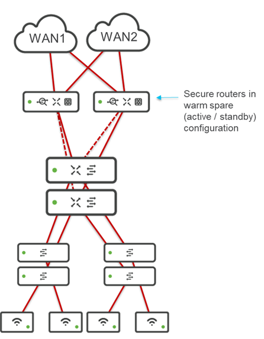

The large branch network design consists of the following components:

 - Two Cisco secure routers in an active/standby configuration, each with up to 2 WAN uplinks for redundancy.

 - A single cloud managed Layer 3 distribution switch stack, where the number of switches supported in the stack is the maximum number of switches supported in a stack configuration for the model of switch deployed.

 - Multiple cloud managed Layer 2 access switches or switch stacks, where the number of switches supported in the stack is the maximum number of switches supported in a stack configuration for the model of switch deployed.  The number of access switches or switch stacks depends on the requirements (number of wiring closets, etc.) within the large branch.

 - Multiple WLAN Access Points (APs), where the maximum number of APs deployed within the site depends upon the requirements (number of people within the branch, number of devices per person, throughput per person, floor space, etc.) of the large branch site. 

## 3.0 Physical Connectivity ##

- This section was last updated on 03/11/2026 to modify the native VLAN on access switch ports connecting to APs from VLAN 1 to VLAN 999.  This is due to not having an API (and therefore no Terraform Provider resource) to change the native VLAN on APs themselves from VLAN 1 to VLAN 999 via automation.  Note that it is not necessarily inline with Cisco best practices to have the native VLAN of the AP set to VLAN 1 while the native VLAN of the switch port to which the AP is trunked set to VLAN 999. Using the Alternative Management Interface (AMI) is another option that may need to be looked at in the future to get around the issue of not having a programmatic way of simply moving the management VLAN from VLAN 1 to VLAN 999. 

Figure 1 above shows both landline WAN service providers connected to both Cisco secure routers.  In reality, there is only a single physical Ethernet handoff from each WAN service provider, which needs to connect to both the primary and secondary Cisco secure routers.  This results in the following two options:

 - Option 1:  Creating two VLANs (VLANs 901 & 902) on the L3 distribution switch/switch stack.

 - Option 2:  Implementing separate non-Meraki managed (IOS XE autonomous) switches to "split" the Ethernet handoff from each landline WAN service provider.
 
 ### 3.1 Option 1 ###

 With Option 1, VLANS 901 and 902 are configured on the large branch L3 distribution switch stack simply to provide L2 passthrough connectivity from the WAN service provider physical Ethernet handoff to the Gigabit Ethernet ports (WAN1 and WAN2 respectively) of the Cisco secure routers, as shown in the figure below.

**Figure 2. Large Branch - Physical Connectivity Option 1**

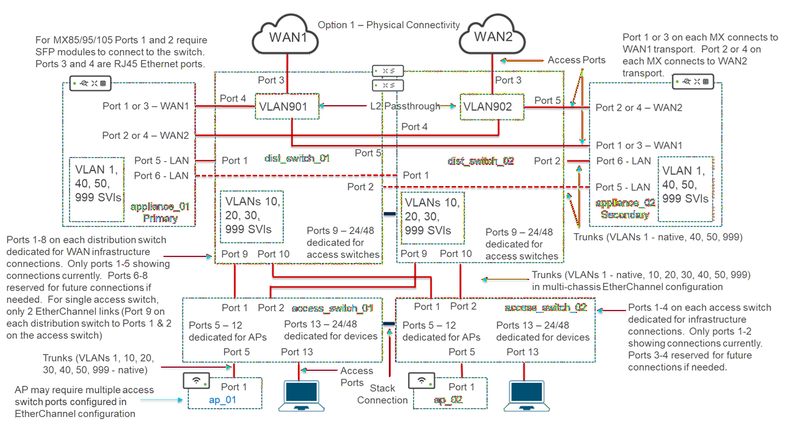

For Option 1, the following would be the port configurations based on each Layer 3 distribution switch (assuming a 2 switch distribution stack and 2 switch access stacks):

**Table 1. Option 1 Dist_Switch_01 Port Connections**

| Dist_Switch_01 | Connected To | Switch Port Configuration |
| ---------------| ------------ | ------------------------- |
| Port 1 | appliance_01, Port 5 | Trunk Port - VLANs 1 (native), 40, 50, 999 |
| Port 2 | appliance_02, Port 5 | Trunk Port - VLANs 1 (native), 40, 50, 999 |
| Port 3 | WAN1 Ethernet Handoff | Access Port - VLAN 901 | 
| Port 4 | appliance_01, Port 1 or 3 | Access Port - VLAN 901 |
| Port 5 | appliance_02, Port 1 or 3 | Access Port - VLAN 901 |
| Ports 6-8 | Infrastructure Reserved | Shutdown |
| Port 9 | access_switch_01, Port 1 | Trunk Port - VLANs 1 (native), 10, 20, 30, 40, 50, 999 |
| Port 10 | access_switch_02, Port 1 | Trunk Port - VLANs 1 (native), 10, 20, 30, 40, 50, 999 |
| Ports 11-24/48 | Reserved for Access Switch Connections | Shutdown |

**Table 2. Option 1 Dist_Switch_02 Port Connections**

| Dist_Switch_02 | Connected To | Switch Port Configuration |
| ---------------| ------------ | ------------------------- |
| Port 1 | appliance_01, Port 6 | Trunk Port - VLANs 1 (native), 40, 50, 999 |
| Port 2 | appliance_02, Port 6 | Trunk Port - VLANs 1 (native), 40, 50, 999 |
| Port 3 | WAN2 Ethernet Handoff | Access Port - VLAN 902 | 
| Port 4 | appliance_01, Port 2 or 4 | Access Port - VLAN 902 |
| Port 5 | appliance_02, Port 2 or 4 | Access Port - VLAN 902 |
| Ports 6-8 | Infrastructure Reserved | Shutdown |
| Port 9 | access_switch_01, Port 2 | Trunk Port - VLANs 1 (native), 10, 20, 30, 40, 50, 999 |
| Port 10 | access_switch_02, Port 2 | Trunk Port - VLANs 1 (native), 10, 20, 30, 40, 50, 999 |
| Ports 11-24/48 | Reserved for Access Switch Connections | Shutdown |

**Table 3. Option 1 Access_Switch_01 Port Connections**

| Access_Switch_01 | Connected To | Switch Port Configuration |
| -----------------| ------------ | ------------------------- |
| Port 1 | dist_switch_01, Port 9 | Trunk Port - VLANs 1 (native), 10, 20, 30, 40, 50, 999 |
| Port 2 | dist_switch_02, Port 9 | Trunk Port - VLANs 1 (native), 10, 20, 30, 40, 50, 999 |
| Ports 3-4 | Reserved for Distribution Switch Connections | Shutdown |
| Ports 5-12 | Dedicated for APs | Trunk Port - VLANs 1, 10, 20, 30, 40, 50, 999 (native) |
| Ports 13-24/48 | Dedicated for Devices | Access Ports |

**Table 4. Option 1 Access_Switch_02 Port Connections**

| Access_Switch_02 | Connected To | Switch Port Configuration |
| -----------------| ------------ | ------------------------- |
| Port 1 | dist_switch_01, Port 10 | Trunk Port - VLANs 1 (native), 10, 20, 30, 40, 50, 999 |
| Port 2 | dist_switch_02, Port 10 | Trunk Port - VLANs 1 (native), 10, 20, 30, 40, 50, 999 |
| Ports 3-4 | Reserved for Distribution Switch Connections | Shutdown |
| Ports 5-12 | Dedicated for APs | Trunk Port - VLANs 1, 10, 20, 30, 40, 50, 999 (native) |
| Ports 13-24/48 | Dedicated for Devices | Access Ports |

Infrastructure reserved ports and ports dedicated for access switch connections which are unused should be shutdown. 

 ### 3.2 Option 2 ###

 Option 2 is for customers who are uncomfortable with using the large branch L3 distribution layer switches to provide both the WAN and LAN connectivity.  This is often due to potential security concerns regarding possible misconfiguration or in the event that the switch platforms are returned to a factory default configuration, or simply due to additional complexity when initially standing up the branch.  
 
 With Option 2, a pair of separate non-Meraki dashboard managed (IOS XE autonomous) switches are deployed within the large branch simply to provide L2 passthrough connectivity from the WAN service provider physical Ethernet handoff to the Gigabit Ethernet ports (WAN1 and WAN2 respectively) of the Cisco secure routers, as shown in the figure below.

**Figure 3. Large Branch - Physical Connectivity Option 2**

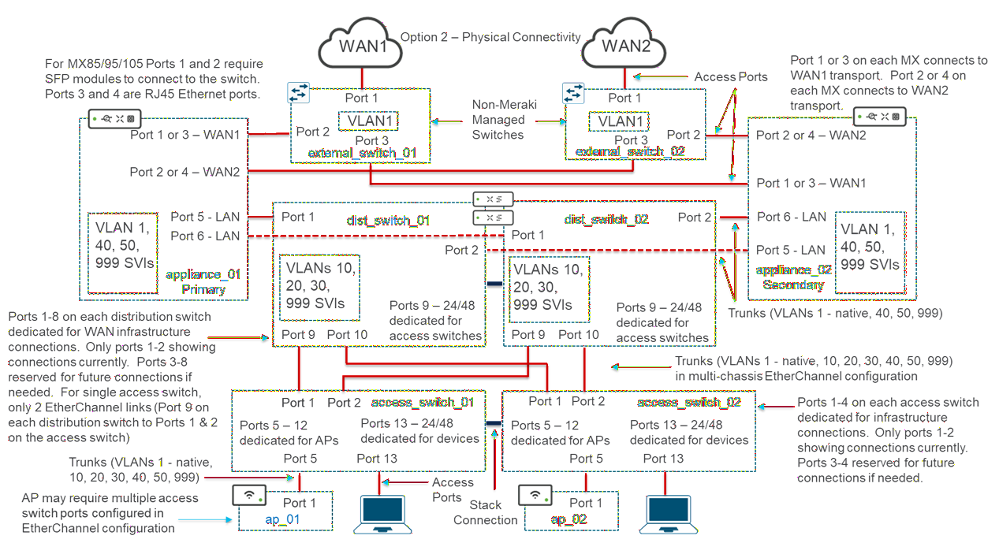

For Option 2, the following would be the port configurations based on each Layer 3 distribution switch (assuming a 2 switch distribution stack and 2 switch access stacks):

**Table 5. Option 2 Dist_Switch_01 Port Connections**

| Dist_Switch_01 | Connected To | Switch Port Configuration |
| ---------------| ------------ | ------------------------- |
| Port 1 | appliance_01, Port 5 | Trunk Port - VLANs 1 (native), 40, 50, 999 |
| Port 2 | appliance_02, Port 5 | Trunk Port - VLANs 1 (native), 40, 50, 999 |
| Ports 3-8 | Infrastructure Reserved | Shutdown |
| Port 9 | access_switch_01, Port 1 | Trunk Port - VLANs 1 (native), 10, 20, 30, 40, 50, 999 |
| Port 10 | access_switch_02, Port 1 | Trunk Port - VLANs 1 (native), 10, 20, 30, 40, 50, 999 |
| Ports 11-24/48 | Reserved for Access Switch Connections | Shutdown |

**Table 6. Option 2 Dist_Switch_02 Port Connections**

| Dist_Switch_02 | Connected To | Switch Port Configuration |
| ---------------| ------------ | ------------------------- |
| Port 1 | appliance_01, Port 6 | Trunk Port - VLANs 1 (native), 40, 50, 999 
| Port 2 | appliance_02, Port 6 | Trunk Port - VLANs 1 (native), 40, 50, 999 
| Ports 3-8 | Infrastructure Reserved | Shutdown |
| Port 9 | access_switch_01, Port 2 | Trunk Port - VLANs 1 (native), 10, 20, 30, 40, 50, 999 |
| Port 10 | access_switch_02, Port 2 | Trunk Port - VLANs 1 (native), 10, 20, 30, 40, 50, 999 |
| Ports 11-24/48 | Reserved for Access Switch Connections | Shutdown |

**Table 7. Option 2 Access_Switch_01 Port Connections**

| Access_Switch_01 | Connected To | Switch Port Configuration |
| -----------------| ------------ | ------------------------- |
| Port 1 | dist_switch_01, Port 9 | Trunk Port - VLANs 1 (native), 10, 20, 30, 40, 50, 999 |
| Port 2 | dist_switch_02, Port 9 | Trunk Port - VLANs 1 (native), 10, 20, 30, 40, 50, 999 |
| Ports 3-4 | Reserved for Distribution Switch Connections | Shutdown |
| Ports 5-12 | Dedicated for APs | Trunk Port - VLANs 1, 10, 20, 30, 40, 50, 999 (native) |
| Ports 13-24/48 | Dedicated for Devices | Access Ports |

**Table 8. Option 2 Access_Switch_02 Port Connections**

| Access_Switch_02 | Connected To | Switch Port Configuration |
| -----------------| ------------ | ------------------------- |
| Port 1 | dist_switch_01, Port 10 | Trunk Port - VLANs 1 (native), 10, 20, 30, 40, 50, 999 |
| Port 2 | dist_switch_02, Port 10 | Trunk Port - VLANs 1 (native), 10, 20, 30, 40, 50, 999 |
| Ports 3-4 | Reserved for Distribution Switch Connections | Shutdown |
| Ports 5-12 | Dedicated for APs | Trunk Port - VLANs 1, 10, 20, 30, 40, 50, 999 (native) |
| Ports 13-24/48 | Dedicated for Devices | Access Ports |

**Table 9. Option 2 External_switch_01 Port Connections**

| External_Switch_01 | Connected To | Configuration |
| -------------------| ------------ | ------------- |
| Port 1 | WAN1 Ethernet Handoff | Access Port | 
| Port 2 | appliance_01, Port 1 or 3 | Access Port |
| Port 3 | appliance_02, Port 1 or 3 | Access Port |

**Table 10. Option 2 External_switch_02 Port Connections**

| External_Switch_02 | Connected To | Configuration |
| -------------------| ------------ | ------------- |
| Port 1 | WAN2 Ethernet Handoff | Access Port | 
| Port 2 | appliance_02, Port 2 or 4 | Access Port |
| Port 3 | appliance_01, Port 2 or 4 | Access Port |

Infrastructure reserved ports and ports dedicated for APs which are unused should be shutdown.

### 3.5 Common to all Options ###

 In each of the options shown above, an extra VLAN (VLAN 40) has been added.  VLAN 40 is targeted as the 'PCI VLAN'.  This is technically not needed for the small and medium branch designs, as it is just another VLAN and does not need to be called out.  However, with large branch design of Phase 2, the Layer 3 boundary is shifted from the Cisco secure router down to the Layer 3 distribution switch stack.  In order to maintain stateful firewalling of the PCI VLAN from the other VLANs within the large branch - which is generally a requirement for PCI certification - the PCI VLAN will need to be handled differently in the large branch design.  The PCI VLAN will need to be extended up to the Cisco secure router.  Hence the SVI definition for VLAN 40 (PCI VLAN) exists within the Cisco Secure router platforms, and not the L3 distribution switch stacks.  VLAN 40 (PCI VLAN) is simply trunked through the L3 distribution layer switch stack from the L2 access layer switches / switch stacks.  Note that the inclusion of a VLAN called 'PCI VLAN' does not indicate a fully PCI compliant large branch design, as additional design considerations may need to be accounted for.  It is merely to demonstrate stateful firewalling of a VLAN within the large branch design which is generally a minimal requirement for PCI compliance.

 Note that backhauling a VLAN through the Layer 3 distribution switch stack in order to provide stateful firewalling of the VLAN within the large branch network is not in line with Cisco best practices for large branch designs.  It is a result of the fact that the Meraki platform does not currently support standalone firewalls, such as the Cisco Secure 200, 1000, 1200, or 3100 Series Firewalls - as would typically be deployed for east-west firewalling within a large branch design.

 In each of the options shown above, VLAN 999 (Infra) serves as both the management VLAN as well as the routed connection between the Cisco secure router platforms and the L3 distribution layer switch stack.  As a routed link, the SVI definitions are in both the Cisco secure router platforms and the L3 distribution layer switch stack.  This design is a direct result of the way the management interface of native IOS XE switches operate within the Meraki dashboard.  As of the current IOS XE release, management of IOS XE switches and switch stacks is via an SVI interface configuration.  This SVI interface configuration has a default route pointing to the SVI interface configured on the MX router within the same VLAN.  There is no ability to configure a separate management interface on a separate VLAN with IOS XE switches and switch stacks today, other than the use of the Alternative Management Interface (AMI).  Hence, VLAN 999 (Infra) serves a dual purpose when implementing Layer 3 IOS XE switches in the large branch design - both as the management VLAN and as the routed link between the SVI definitions configured on the Layer 3 switch or switch stack and the MX router.  This is not an optimal design nor necessarily in line with best practices, but it is the way Layer 3 native IOS XE switches work today.

Meraki MS and IOS XE switches and switch stacks which run the Meraki MS OS within a container (referred to as a CS switch) operate differently than native IOS XE switches and switch stacks.  Meraki MS and IOS XE switches and switch stacks which run the Meraki MS in a container have a management interface separate from the Layer 3 SVI interface of the switch or switch stack.  With these switches, VLAN 999 (Infra) which is used as the management VLAN could be separated from the routed link between the MX router and the Layer 3 switch stack by introducing another VLAN - VLAN 100 (Uplink).  This would however result in two different large branch designs depending upon whether the customer implements a native IOS XE switch stack or a Meraki MS or CS switch stack.  The current Branch as Code implementation cannot distinguish between these options.  Hence, it would be up to the customer to manually uncomment parts of the YAML files and comment other parts of the YAML file to support this ability.  This adds further complexity, to the overall solution, which is supposed to result in operational simplicity.  As an alternative, we can again use VLAN 999 (infra) in a dual role with Meraki MS and CS switches - both as the management VLAN and as the routed link between the SVI definitions configured on the Layer 3 switch or switch stack and the MX router.  This is not an optimal design nor necessarily in line with best practices, but results in a simpler design and less confusion for customer when deploying Unified Branch for large branches.

In addition, the number of IP addresses needed for the management interface(s) of switch stacks (both Layer 2 and Layer 3) differ between native IOS XE switch stacks, IOS XE switches which run Meraki OS in a container (referred to as CS switch stacks), and MS switch stacks as follows:

- With native IOS XE switch stacks, there is one management interface shared across the switch stack.  This management interface is the IP address of the SVI interface to which the default route is configured.  Additionally, the MAC address used for this IP address is a virtual MAC address taken from a pool of addresses that is the same across all native IOS XE switch stacks.  When multiple switch stacks can exist in a network (as with the large branch design) each switch stack selects the first MAC address in the pool and ARPs to see if the MAC address is in use.  If the MAC address is not in use, the switch stack associates that MAC address with the IP address.  If the MAC address is in use, the switch stack moves to the next MAC address and repeats the process until it finds an unused MAC address.  Because of this behavior, it is possible that the MAC address of a switch stack could change under certain scenarios.  For example, if a switch stack was powered off while a new switch stack was added to the same network, it is possible the new switch stack would take the MAC address used by the previous switch stack.  When the switch stack was powered back on, it would simply use another MAC address.  This makes the use of DHCP (and in particular fixed IP address assignments within DHCP) unfeasible for IOS XE switch stacks.  RADIUS sessions must be initiated from the management interface of the switch stack.  Because the switch definition within the RADIUS server includes the IP address and credentials of the NAC (the switch stack in this case), the IP address of the switch stack should not ever change.  When using DHCP for assignment of IP addresses, this can be accomplished through fixed IP address assignments, where the specific MAC address of the device is hardcoded to an IP address within the DHCP server.  However, if the MAC address can change, as is the case for native IOS XE switch stacks, this could result in the wrong IP address being assigned the switch stack.  This would cause RADIUS authentication on the switch to suddenly and unexplainably stop working.  Hence assignment of IP addresses to native IOS XE switch stacks via DHCP fixed IP addresses (as was done in Unified Branch Phase 1) is deemed to be unfeasible. Best practices for assigning IP addresses to network infrastructure devices has always been to manually assign them.  Fortunately, this can be done via automation with native IOS XE switches and switch stacks.  The Branch as Code YAML files will need to be mofified to show that configuration.

- With IOS XE switches and switch stacks running MS OS in a container (referred to as a CS switch stack), there is also one management interface shared across the switch stack.  For a Layer 3 switch stack, this management interface can be separate from the SVI interface representing the routed link between the Layer 3 switch stack and the MX router, or the same IP address as discussed above.  However, the MAC address used for this IP address is a burned-in MAC address that appears to be persistent (however this would need to be confirmed).  Additionally, there is no API for manually assigning the IP address of a CS switch or switch stack.  So, although the best practice would be to assign the IP address of the switch stack manually, this is not possible with the current automation toolset.  Hence the only mechanism available for setting the IP address of CS switches and switch stacks is via DHCP, as was done in Unified Branch Phase 1.  Since the IP address of the CS switch or switch stack should never change due to the RADIUS source IP address needing to be consistent, this leaves us with fixed IP address assignment within the DHCP server as the only option.  Since the MAC address used by the CS switch or switch stack is apparently persistent, this should be a feasible (although not necessarily a best practice) solution.  Note also that the Meraki dashboard not seem to support the ability to support both native IOS XE switches / stacks and CS switch stacks in the same network.

- With MS switches and switch stacks, each switch is configured with a separate management interface.  For a Layer 3 switch stack, these management interfaces can be separate from the SVI interface representing the routed link between the Layer 3 switch stack and the MX router, or the same IP address as discussed above.  The MAC addresses used for these IP address are burned-in MAC address of each switch.  Additionally, there is no API for manually assigning the IP addresses of each MS switch.  So, although the best practice would be to assign the IP address of each switch within the stack manually, this is not possible with the current automation toolset.  Hence the only mechanism available for setting the IP addresses of MS switches and switch stacks is via DHCP, as was done in Unified Branch Phase 1.  Since the IP addresses of the MS switch or switch stack should never change due to the RADIUS source IP address needing to be consistent, this leaves us with fixed IP address assignments within the DHCP server as the only option.  Since the MAC address used by the MS switch or switch stack is apparently persistent, this should be a feasible (although not necessarily a best practice) solution.  The difference between MS switch stacks and CS switch stacks is that the customer will need to understand that each switch within an MS switch stack will need it's own IP address, and therefore configure the necessary fixed IP addresses in the DHCP server (running on the MX router) for the number of switches within the switch stack.  This is because Branch as Code has no means of identifying whether the switches within a stack are running native IOS XE, running the MX OS inside a container within IOS XE (referred to as a CS switch stack), or are just running the MX OS (referred to as an MS switch stack).

In addition, it has been determined that a switch stack containing only one switch is not a valid Meraki dashboard configuration.  For the Unified Branch Phase 2, we are mandating a Layer 3 switch stack for the distribution layer of the large branch design.  Hence, the only option is a switch stack.  However, for the small and medium branch designs, options will need to be provided for either a switch or a switch stack within the Branch as Code YAML.  Further, within large branch design, each individual wiring closet could have either a switch or a switch stack.  Hence options must be provided within the Branch as Code YAML.

For each of the choices above regarding configuration of switches or switch stacks, IP addressing via DHCP, or manually configuring IP addressing via the SVI address, etc., these choices need to be configured as separate sections of the YAML file where the customer can uncomment or comment sections in order to create the right configuration for his/her branch.  This will be confusing to the customer and will likely result in errors and frustrations for the customer.  However, there is currently no branching structure within the Branch as Code automation to make this any easier for the customer. 

Note that the use of the Alternative Management Interface (AMI) has not been considered for Unified Branch designs because AMI requires Layer 3 routing to be enabled on switches.  The current small and medium branch designs call for L2 switches or switch stacks, while the large branch design calls for an L3 distribution switch with multiple L2 swiches or switch stacks.  Hence introducing the Alternative Management Interface (AMI) would create inconsistencies within the Unified Branch designs, unless all designs include L3 capabilities both in the access layer and distribution layer to account for AMI.  It may be necessary to move to designs which utilizes Alternative Management Interfaces (AMIs) for both switches and APs in future phases, due to all the shortcomings and lack of automation capabilities of moving the management interface from VLAN 1 to VLAN 999.

For each of the two options discussed above, the number of uplinks between access switches/stacks and the distribution switch stack depends on various factors including bandwidth requirements, availability of uplink speeds greater than 1 Gbps at the distribution and access switches, desired level of oversubscription of the access layer uplinks, etc.  For Unified Branch Phase 2 - Branch as Code, knowledge of supported port speeds per port (based on switch model number and port number) and/or whether optional modules supporting higher port speeds are being used in the either the distribution or access layer platform, would be needed in order to provision anything other than multiple 1 Gbps connections between the distribution and access layer switches.  Since this information is not currently collected and held with the netascode module and/or data model, there is no feasible way to provision anything other than a standard set of ports between the distribution and access layer switches.

For Phase 2 of Unified Branch - Branch as Code, it will be assumed that a distribution switch stack of at least two switches is always deployed for redundancy at the distribution layer.  For wiring closets with access layer switch stacks consisting of at least two switches a total of 4 x 1 Gbps links will be deployed between the distribution and access layer switches as discussed in Tables 1 - 4 above.  It will be assumed that all 4 links will be configured in a single cross-stack link aggregation (MLAG) configuration. For wiring closets with a single access layer switch stack, it will be assumed that only 2 of the 4 links will be active, although the configuration on the distribution layer switch will be the same - as though the acces layer was as switch stack.  Although this is somewhat more wasteful of switch ports at the distribution switch stack, it also standardizes the configuration between the distribution and access layers without having separate configurations when implementing an access layer switch versus a switch stack, and allows for upgrading a wiring closet from a single switch to a switch stack with minimal effort.  It is understood that this is not inline with Cisco best practices, which are to provision the necessary 1, 2.5, 5 or 10 Gbps links in a MLAG configuration in order to provide the desired oversubscription ratio and redundancy between the access and distribution layer switches.  However, the current automation tools have no means of doing this.  It is up to the customer to manually modify the YAML files to accomplish this if needed. 

It should also be noted that with the support of the C9178 AP in Phase 2 of Unified Branch, more than one physical Ethernet port can be used to connect the access layer switch to an AP.  When multiple ports are used, the switchports should be configured in a link aggregation (EtherChannel) configuration. Again, knowledge of supported port speeds per port (based on switch model number and port number) as well as the model number of the AP is needed to automate multiple switch ports in a link aggregation (Etherchannel) configuration.  Since this information is not currently collected and held within the netascode module and data model, there is no feasible way to provision anything other than a standard single Ethernet port between the access layer switch and the AP.  Again, it is understood that this is not inline with Cisco best practices, which are to provision the necessary 1, 2.5, 5 or 10 Gbps links in a MLAG configuration in order to provide the desired throughput and redundancy between the APs and the access layer switches.  However, the current automation tools have no means of doing this.  It is up to the customer to manually modify the YAML files to accomplish this if needed. 

It should be called out within the comments within the YAML configuration of the Github repository, as well as within the CVD, that this configuration is provided as an example for reference.  The customer / partner, with full knowledge of the platforms deployed per branch at both the distribution and access layers, as well as the APs, can - and in many cases should - customize the number of ports, port numbers used, and the port speeds to provide the appropriate amount of bandwidth between the access and distribution layers within each wiring closet, as well as between the access layer switch and each AP - as this cannot be feasibly done currently in Unified Branch - Branch as Code.

### 3.6 Large Branch Inventory Config Template - Router, Switch, and AP Configurations ###

- This section was updated on 04/07/2026 back to the recommendation of shutting down unused secure router ports within the YAML shown in the  *app_ports* template.  Due to the way the Meraki Dashboard, APIs, and Terraform Provider resource works, when shutting down an unused port on an MX secure router, all port configuration must be removed.  When setting the *enable* parameter to false within the PUT action of the[update_network_appliance_port](https://developer.cisco.com/meraki/api-v1/update-network-appliance-port/) API call, this is the only parameter which can be included within the body of the call.  Since the PUT action updates the configuration of the port, this effectively serves a dual role - it removes the existing MX LAN port configuration and it disables the port.  Hence when enabling the port, it must be reconfigured again.  This is somewhat inconvenient for troubleshooting, since every time an MX LAN port is shut down, it has to be re-configured when it is enabled again.  This behavior should be documented within the API as well as the Meraki Devnet Terraform Provider resource.  Best practices would call for shutting down unused ports on networking equipment such as the Secure Router.  

Note that enabling 802.1x authentication was considered as an additional mechanism to secure these ports.  However, that would require additional configuration for enabling 802.1x using the Centralized RADIUS server model as is done for the APs and switches within the large branch.  The customer is free to enable this manually if desired within the YAML configuration.  Note however, this would also simply point out that there is no 802.1x authentication of the Secure Router to the switch in the Unified Branch design (again, not consistent with Cisco best practices) - mostly due to the complications of needing to establish a control connection to the Meraki Cloud before the switch can be configured, along with the lack of an 802.1x supplicant on switch platforms.  The assumption for Unified Branch Phase 2 will be the same as for Phase 1, that the router and switches are physically secure within the facility.

- This section was updated on 03/22/2026 to modify the access point configurations to manually assign the RF profile to each AP within the small, medium, and large branch inventory templates.

In templates-wireless.nac.yaml file in the Unified Branch Phase 1 GitHub repository, we created a custom RF profile named "Corp wireless rf profile".  However, we never set that profile as the default indoor or outdoor profile.  Looking at the Wireless RF Profiles Configuration section of the data model in netascode.cisco.com as well as in the schema - I don't even see support for the "is_indoor_default" and "is_outdoor_default" parameters, which are in the "meraki_wireless_rf_profile" Terraform provider resource.  A customer who looked at setting those parameters via native Terraform alerted us to some issues which we have since confirmed.  We can assign the custom RF profile as the default indoor and/or outdoor profile, but we cannot move it back to the built-in "indoor" and "outdoor" profiles created by the Meraki Dashboard.  So, we have 2 issues: 1. The data model currently doesn't support the "is_indoor_default" and "is_outdoor_default" parameters.  2. Even if those parameters were in the data model, they work one-way.  However, we can assign individual APs to specific wireless RF profiles within the data model.  It can be done within the inventory templates in the templates-inventory.nac.yaml file. 

We never assigned the APs to any wireless RF profile for Phase 1, so technically our wireless design wasn't working correctly.  Rather than messing with adding support for making custom wireless RF profiles the default indoor and default outdoor profiles, for Unified Branch Phase 2 we will just leave the built-in "indoor" and "outdoor" wireless RF profiles as the default profiles.  When we add our new custom wireless RF profile we just assign all APs in the branch to that profile.  That solves the API behavior issue discussed above, and solves the issue that if a customer wants to alter the YAML to support more than one RF profile, he/she can do so, and assign APs as needed manually to the profiles.

Unfortunately, setting the RF Profile within the meraki_wireless_radio_settings resource has it's own challenges.  You can set it to a custom RF profile and move it to another custom RF profile.  However the issue is setting it back to the built-in default "indoor" and "outdoor" RF profiles again.  I thought it would be as easy as importing the built-in "indoor" and "outdoor" RF profiles and referencing their IDs.  It turns out their IDs are "indoor" and "outdoor".  I've tried those values in both Terraform and directly via the API, and it throws an error that it's not a valid RF Profile ID.  After looking at the API again (https://developer.cisco.com/meraki/api-v1/update-device-wireless-radio-settings/), I discovered that the documentation indicates to leave the rfProfileId field at null to go back to the default "indoor" or "outdoor" profile based on the type of AP.  I can leave the rfProfileId as null in the API and it works fine.  However, in the Terraform provider I get an error that one of the parameters in the two_four_ghz or five_ghz or rf_profile_id has to be something other than null.  So, as of now, we will just document in the repository YAML that in order to move back to the default "indoor" or "outdoor" profile, the customer has to either create a new custom RF profile with settings that match one of those profiles and then move the AP to the new custom RF profile; or the customer has to do this via the dashboard.

#### 3.6.1 YAML Configuration ####

- This section updated 04/07 to add comment for dealing with MS-150 switch stack issue when the management VLAN gets stuck in VLAN 1.

The following is an example of the *small_branch_inventory*, *medium_branch_inventory*, and *large_branch_inventory* templates which will be needed within the [*templates-inventory.nac.yaml*](https://github.com/netascode/nac-branch/blob/main/data/templates-inventory.nac.yaml) file within the existing Cisco Unified Branch GitHub Repository for supporting the small, medium, and large branch designs of Unified Branch Phase 2.

      # The below code does the following:
      #
      # This YAML file defines the following inventory related template:
      #
      # - Small Branch Inventory (small_branch_inventory)
      #   - small_branch_inventory template defines 1 Secure Router 
      #     (Security Appliance), 1 Switch Stack with 2 Switches, 
      #      and 2 Access Points.
      #
      # - Medium Branch Inventory (medium_branch_inventory)
      #  - medium_branch_inventory trmplate defines 2 Secure Routers
      #    (Security Appliances), 1 Switch Stack with 2 Switches,
      #    and 2 Access Points.
      #
      # - Large Inventory (large_branch_inventory)
      #  - large_branch_inventory trmplate defines 2 Secure Routers
      #    (Security Appliances), 1 Distribution Switch Stack with 
      #    2 Switches, 1 Access Switch Stack with 2 Switches, 
      #    and 2 Access Points.
      #
      # Each template defines network-level configuration which is
      # applicable to the inventory - meaning the secure router,
      # switch, and AP devices - within the site.
      #
      # Note that these templates are not related to templates
      # configured within the Cisco (formerly Meraki) dashboard.
      #
      #
      meraki:
        template:
          networks:
            #
            # The below code does the following:
            #
            # small_branch_inventory configuration template.
            #
            # The small_branch_inventory configuration template defines
            # the devices (security appliance, switches, and access points)
            # and configures parameters specific to those devices
            # within the site/network to which the template is applied.
            #
            # Note that this repository uses the words appliance, 
            # security appliance, and secure router to all refer 
            # to the MX security appliance.
            #
            - name: small_branch_inventory
              type: model
              configuration:
                name:
                devices:
                  #
                  # The below code does the following:
                  #
                  # Primary secure router (Appliance) configuration
                  #
                  # Defines the name, serial number, geolocation coordinates
                  # (latitude & longitude), and address variables for the
                  # primary Cisco secure router (appliance_01) within the site
                  # to which the template is applied.
                  #
                  - name: ${appliance_01_name}
                    serial: ${appliance_01_serial}
                    tags:
                      - small_branch
                    lat: ${lat}
                    lng: ${lng}
                    address: ${address}
                    notes: Small Branch MX
                  #
                  # The below code does the following:
                  #
                  # Small branch switch configurations
                  #
                  # Defines the name, serial number, geolocation coordinates
                  # (latitude & longitude), and address variables for the
                  # first and second switches within the site to which the
                  # template is applied.
                  #
                  #  Hardcodes ports 1, 2, 9 - 12 of both access switches
                  #  to be trunk ports allowing VLANs 1, 10, 20, 30, 40,
                  #  50, and 999.  For uplink ports 1-2, VLAN 1 is configured
                  #  as the native VLAN. For AP ports 9 - 12, VLAN 999 is 
                  #  configured as the native VLAN.
                  #
                  #  Note: For certain MS switch stacks (including the MS-150), 
                  #  a potential issue with switches within in a stack which are not
                  #  directly attached to the Secure Router (MX) or distribution switch
                  #  (when deployed as an access-layer stack in the large branch 
                  #  design) has been identified.  Under certain circumstances
                  #  the management VLAN of these switches gets stuck in VLAN 1
                  #  instead of moving to VLAN 999 as configured.  This can cause
                  #  the management IP address of these switches to change. Functions
                  #  such as RADIUS authentication which rely on a fixed source IP 
                  #  address can stop working. As a workaround, the native VLAN
                  #  on the trunk between the Secure Router (MX) and the MS
                  #  switch stack can be moved to VLAN 999 on the Secure Router (MX)
                  #  only. Simultaneously, the native VLAN on trunks between the
                  #  switch stack and APs must be moved back to VLAN 1.
                  #  This may result in a VLAN mismatch error generated
                  #  by the Meraki dashboard, but should force these switches
                  #  to receive IP addresses on VLAN 999 (instead of VLAN 1), 
                  #  restoring connectivity to the centrally located RADIUS servers.
                  #  
                  #  Hardcodes ports 3 - 8 of both access switches to be
                  #  access ports on VLAN 1 and shutdown.  Reserved for 
                  #  infrastructure use.
                  #
                  #  Hardcodes ports 12 - 24/48 of both access switches to
                  #  be access ports on VLAN 10 (data) with voice VLAN 20.
                  # 
                  #  Rapid Spanning-Tree Protocol (RTSP) is enabled by default 
                  #  on the trunk ports. Link negotiation (speed and duplex)
                  #  is set to auto negotiate by default.
                  #
                  #  RTSP is enabled by default with BPDU guard and storm
                  #  control also enabled for access ports. Link negotiation
                  #  (speed and duplex) is set to auto negotiate.
                  #
                  #  Note, you may need to change the port_id_ranges
                  #  depending upon which switch models you choose to 
                  #  deploy within your branch.
                  #
                    - name: ${access_switch_01_name}
                      serial: ${access_switch_01_serial}
                      tags:
                        - test  # Do we need to include this test tag?
                      lat: ${lat}
                      lng: ${lng}
                      address: ${address}
                      notes: Small Branch Notes Switch 1
                      switch:
                        ports:
                        - port_id_ranges:
                          - from: 1
                            to: 2
                          name: Uplink Trunk Port
                          enabled: true
                          type: trunk
                          tags:
                            - uplink
                            - trunk
                          vlan: 1
                          allowed_vlans: 1,10,20,30,40,50,999
                          link_negotiation: Auto negotiate
                          udld: Alert only
                          storm_control: true
                          rstp: true
                          # peer_sgt_capable: $(sgt_pass)  # This does not currently exist in the data model
                          # adaptive_policy_group: ${adaptive_policy_group}  #This does not currently exist in the data model
                        - port_id_ranges:
                          - from: 3
                            to: 8
                          name: Reserved for Infrastructure
                          enabled: false
                          type: access
                          tags:
                            - access
                          vlan: 1
                          link_negotiation: Auto negotiate
                          storm_control: true
                          rstp: true                    
                          stp_guard: bpdu guard
                        - port_id_ranges:
                          - from: 9
                            to: 12
                          name: AP Trunk Port
                          enabled: true
                          type: trunk
                          tags:
                            - uplink
                            - trunk
                          vlan: 999
                          allowed_vlans: 1,10,20,30,40,50,999
                          link_negotiation: Auto negotiate
                          udld: Alert only
                          storm_control: true
                          rstp: true
                          # peer_sgt_capable: $(sgt_pass)  # This does not currently exist in the data model
                          # adaptive_policy_group: ${adaptive_policy_group}  #This does not currently exist in the data model
                        - port_id_ranges:
                          - from: 13
                            to: 24
                          name: Access Port
                          enabled: true
                          type: access
                          tags:
                            - access
                          vlan: 10
                          voice_vlan: 20
                          link_negotiation: Auto negotiate
                          storm_control: true
                          rstp: true
                          stp_guard: bpdu guard
                    - name: ${access_switch_02_name}
                      serial: ${access_switch_02_serial}
                      tags:
                        - test  # Do we need to include this test tag?
                      lat: ${lat}
                      lng: ${lng}
                      address: ${address}
                      notes: Small Branch Notes Switch 2
                      switch:
                        ports:
                        - port_id_ranges:
                          - from: 1
                            to: 2
                          name: Uplink Trunk Port
                          enabled: true
                          type: trunk
                          tags:
                            - uplink
                            - trunk
                          vlan: 1
                          allowed_vlans: 1,10,20,30,40,50,999
                          link_negotiation: Auto negotiate
                          udld: Alert only
                          storm_control: true
                          rstp: true
                          # peer_sgt_capable: $(sgt_pass)  # This does not currently exist in the data model
                          # adaptive_policy_group: ${adaptive_policy_group}  #This does not currently exist in the data model
                        - port_id_ranges:
                          - from: 3
                            to: 8
                          name: Reserved for Infrastructure
                          enabled: false
                          type: access
                          tags:
                            - access
                          vlan: 1
                          link_negotiation: Auto negotiate
                          storm_control: true
                          rstp: true                    
                          stp_guard: bpdu guard
                        - port_id_ranges:
                          - from: 9
                            to: 12
                          name: AP Trunk Port
                          enabled: true
                          type: trunk
                          tags:
                            - uplink
                            - trunk
                          vlan: 999
                          allowed_vlans: 1,10,20,30,40,50,999
                          link_negotiation: Auto negotiate
                          udld: Alert only
                          storm_control: true
                          rstp: true
                          # peer_sgt_capable: $(sgt_pass)  # This does not currently exist in the data model
                          # adaptive_policy_group: ${adaptive_policy_group}  #This does not currently exist in the data model
                        - port_id_ranges:
                          - from: 13
                            to: 24
                          name: Access Port
                          enabled: true
                          type: access
                          tags:
                            - access
                          vlan: 10
                          voice_vlan: 20
                          link_negotiation: Auto negotiate
                          storm_control: true
                          rstp: true
                          stp_guard: bpdu guard
                    #
                    # The below code does the following:
                    #
                    # Access point configurations
                    #
                    # Defines the name, serial number, geolocation coordinates
                    # (latitude & longitude), and address variables for the
                    # second access point within the site to which the template
                    # is applied. Assigns the AP to the RF profile. 
                    # 
                    # Note: If you wish to configure the AP back to the default
                    # "indoor" or "outdoor" RF profiles, this must be done either
                    # by creating a new RF profile with the same settings as the 
                    # default "indoor" or "outdoor" RF profile and assigning 
                    # the AP to the RF profile; or by going into the Dashboard
                    # and setting the AP back to the default "indoor" or "outdoor"
                    # RF profile.
                    #
                    # First access point configuration
                    # 
                    - name: ${ap_01_name}
                      serial: ${ap_01_serial}
                      tags:
                        - test
                      lat: ${lat}
                      lng: ${lng}
                      address: ${address}
                      notes: Small Branch Notes Access Point 1
                      wireless:
                        radio_settings:
                          rf_profile_name: Corp wireless rf profile
                    #
                    # The below code does the following:
                    #
                    # Second access point configuration
                    #            
                    - name: ${ap_02_name}
                      serial: ${ap_02_serial}
                      tags:
                        - test
                      lat: ${lat}
                      lng: ${lng}
                      address: ${address}
                      notes: Small Branch Notes Access Point 2
                      wireless:
                        radio_settings:
                          rf_profile_name: Corp wireless rf profile
                    #
                    # Copy access point configuration sections as needed
                    # to support the number of access points within the 
                    # small branch.
                    #
                #
                # The below code does the following:
                #
                # medium_branch_inventory configuration template.
                #
                # The medium_branch_inventory configuration template defines
                # the devices (security appliances, switches, and access points)
                # and configures parameters specific to those devices
                # within the site/network to which the template is applied.
                #
                # Note that this repository uses the words appliance, 
                # security appliance, and secure router to all refer 
                # to the MX security appliance.
                #
                - name: medium_branch_inventory
                  type: model
                  configuration:
                    name:
                  devices:
                    #
                    # The below code does the following:
                    #
                    # Primary secure router (appliance) configuration
                    #
                    # Defines the name, serial number, geolocation coordinates
                    # (latitude & longitude), and address variables for the
                    # primary Cisco secure router (appliance_01) within the site
                    # to which the template is applied.
                    #
                    - name: ${appliance_01_name}
                      serial: ${appliance_01_serial}
                      tags:
                        - test    # Do we need to include this test tag?
                      lat: ${lat}
                      lng: ${lng}
                      address: ${address}
                      notes: Medium Branch Primary Secure Router
                    #
                    # The below code does the following:
                    #
                    # Secondary secure router (appliance) configuration
                    #
                    # Defines the name, serial number, geolocation coordinates
                    # (latitude & longitude), and address variables for the
                    # secondary (warm spare) Cisco secure router (appliance_02)
                    # within the site to which the template is applied.
                    #
                    # Note that since both Cisco secure routers are located
                    # within the same site, the lat, lng, and address variables
                    # are the same as with appliance_01 above.
                    #
                    - name: ${appliance_02_name}
                      serial: ${appliance_02_serial}
                      tags:
                        - test    # Do we need to include this test tag?
                      lat: ${lat}
                      lng: ${lng}
                      address: ${address}
                      notes: Medium Branch Secondary Secure Router
                    #
                    # The below code does the following:
                    #
                    # Medium branch switch configurations
                    #
                    # Defines the name, serial number, geolocation coordinates
                    # (latitude & longitude), and address variables for the
                    # first and second switches within the site to which the
                    # template is applied.
                    #
                    # There are 2 possible combinations of connectivity for the 
                    # medium branch depending upon whether the access switches
                    # are used as passthrough devices for WAN connectivity or
                    # whether separate non-Meraki managed (autonomous IOS XE) 
                    # switches are used for WAN connectivity.  These design
                    # choices are discussed in the Cisco Unified Branch CVD.
                    #
                    # Decide which option you will be deploying for your medium
                    # branch and uncomment either Option 1 or Option 2 in the 
                    # template below.  
                    #
                    # Option 1: 
                    #  Hardcodes ports 1, 2, 9 - 12 of both access switches
                    #  to be trunk ports allowing VLANs 1, 10, 20, 30, 40,
                    #  50, and 999.  For uplink ports 1-2, VLAN 1 is configured
                    #  as the native VLAN. For AP ports 9 - 12, VLAN 999 is 
                    #  configured as the native VLAN.
                    #
                    #  Note: For certain MS switch stacks (including the MS-150), 
                    #  a potential issue with switches within in a stack which are not
                    #  directly attached to the Secure Router (MX) or distribution switch
                    #  (when deployed as an access-layer stack in the large branch 
                    #  design) has been identified.  Under certain circumstances
                    #  the management VLAN of these switches gets stuck in VLAN 1
                    #  instead of moving to VLAN 999 as configured.  This can cause
                    #  the management IP address of these switches to change. Functions
                    #  such as RADIUS authentication which rely on a fixed source IP 
                    #  address can stop working. As a workaround, the native VLAN
                    #  on the trunk between the Secure Router (MX) and the MS
                    #  switch stack can be moved to VLAN 999 on the Secure Router (MX)
                    #  only. Simultaneously, the native VLAN on trunks between the
                    #  switch stack and APs must be moved back to VLAN 1.
                    #  This may result in a VLAN mismatch error generated
                    #  by the Meraki dashboard, but should force these switches
                    #  to receive IP addresses on VLAN 999 (instead of VLAN 1), 
                    #  restoring connectivity to the centrally located RADIUS servers.
                    #
                    #  Hardcodes ports 3 - 5 of access_switch_01 to be access
                    #  ports on VLAN 901 (passthrough VLAN).
                    #
                    #  Hardcodes ports 3 - 5 of access_switch_02 to be access 
                    #  ports on VLAN 902 (passthrough VLAN).
                    #  
                    #  Hardcodes ports 6 - 8 of both access switches to be
                    #  access ports on VLAN 1 and shutdown.  Reserved for 
                    #  infrastructure use.
                    #
                    #  Hardcodes ports 12 - 24/48 of both access switches to
                    #  be access ports on VLAN 10 (data) with voice VLAN 20.
                    # 
                    #  Rapid Spanning-Tree Protocol (RTSP) is enabled by default 
                    #  on the trunk ports. Link negotiation (speed and duplex)
                    #  is set to auto negotiate by default.
                    #
                    #  RTSP is enabled by default with BPDU guard and storm
                    #  control also enabled for access ports. Link negotiation
                    #  (speed and duplex) is set to auto negotiate.
                    #
                    #  Note, you may need to change the port_id_ranges
                    #  depending upon which switch models you choose to 
                    #  deploy within your branch.
                    #
                    - name: ${access_switch_01_name}
                      serial: ${access_switch_01_serial}
                        tags:
                          - test  # Do we need to include this test tag?
                        lat: ${lat}
                        lng: ${lng}
                        address: ${address}
                        notes: Medium Branch Notes Switch 1
                        switch:
                          ports:
                          - port_id_ranges:
                            - from: 1
                              to: 2
                            name: Uplink Trunk Port
                            enabled: true
                            type: trunk
                            tags:
                              - uplink
                              - trunk
                            vlan: 1
                            allowed_vlans: 1,10,20,30,40,50,999
                            link_negotiation: Auto negotiate
                            udld: Alert only
                            storm_control: true
                            rstp: true
                            # peer_sgt_capable: $(sgt_pass)  # This does not currently exist in the data model
                            # adaptive_policy_group: ${adaptive_policy_group}  #This does not currently exist in the data model
                          - port_id_ranges:
                            - from: 3
                              to: 5
                            name: WAN Passthrough Port
                            enabled: true
                            type: access
                            tags:
                              - access
                            vlan: 901
                            link_negotiation: Auto negotiate
                            storm_control: true
                            rstp: true                    
                            stp_guard: bpdu guard
                          - port_id_ranges:
                            - from: 6
                              to: 8
                            name: Reserved for Infrastructure
                            enabled: false
                            type: access
                            tags:
                              - access
                            vlan: 1
                            link_negotiation: Auto negotiate
                            storm_control: true
                            rstp: true                    
                            stp_guard: bpdu guard
                          - port_id_ranges:
                            - from: 9
                              to: 12
                            name: AP Trunk Port
                            enabled: true
                            type: trunk
                            tags:
                              - uplink
                              - trunk
                            vlan: 999
                            allowed_vlans: 1,10,20,30,40,50,999
                            link_negotiation: Auto negotiate
                            udld: Alert only
                            storm_control: true
                            rstp: true
                            # peer_sgt_capable: $(sgt_pass)  # This does not currently exist in the data model
                            # adaptive_policy_group: ${adaptive_policy_group}  #This does not currently exist in the data model
                          - port_id_ranges:
                            - from: 13
                              to: 24
                            name: Access Port
                            enabled: true
                            type: access
                            tags:
                              - access
                            vlan: 10
                            voice_vlan: 20
                            link_negotiation: Auto negotiate
                            storm_control: true
                            rstp: true
                            stp_guard: bpdu guard
                    - name: ${access_switch_02_name}
                      serial: ${access_switch_02_serial}
                        tags:
                          - test  # Do we need to include this test tag?
                        lat: ${lat}
                        lng: ${lng}
                        address: ${address}
                        notes: Medium Branch Notes Switch 2
                        switch:
                          ports:
                          - port_id_ranges:
                            - from: 1
                              to: 2
                            name: Uplink Trunk Port
                            enabled: true
                            type: trunk
                            tags:
                              - uplink
                              - trunk
                            vlan: 1
                            allowed_vlans: 1,10,20,30,40,50,999
                            link_negotiation: Auto negotiate
                            udld: Alert only
                            storm_control: true
                            rstp: true
                            # peer_sgt_capable: $(sgt_pass)  # This does not currently exist in the data model
                            # adaptive_policy_group: ${adaptive_policy_group}  #This does not currently exist in the data model
                          - port_id_ranges:
                            - from: 3
                              to: 5
                            name: WAN Passthrough Port
                            enabled: true
                            type: access
                            tags:
                              - access
                            vlan: 902
                            link_negotiation: Auto negotiate
                            storm_control: true
                            rstp: true                    
                            stp_guard: bpdu guard
                          - port_id_ranges:
                            - from: 6
                              to: 8
                            name: Reserved for Infrastructure
                            enabled: false
                            type: access
                            tags:
                              - access
                            vlan: 1
                            link_negotiation: Auto negotiate
                            storm_control: true
                            rstp: true                    
                            stp_guard: bpdu guard
                          - port_id_ranges:
                            - from: 9
                              to: 12
                            name: AP Trunk Port
                            enabled: true
                            type: trunk
                            tags:
                              - uplink
                              - trunk
                            vlan: 999
                            allowed_vlans: 1,10,20,30,40,50,999
                            link_negotiation: Auto negotiate
                            udld: Alert only
                            storm_control: true
                            rstp: true
                            # peer_sgt_capable: $(sgt_pass)  # This does not currently exist in the data model
                            # adaptive_policy_group: ${adaptive_policy_group}  #This does not currently exist in the data model
                          - port_id_ranges:
                            - from: 13
                              to: 24
                            name: Access Port
                            enabled: true
                            type: access
                            tags:
                              - access
                            vlan: 10
                            voice_vlan: 20
                            link_negotiation: Auto negotiate
                            storm_control: true
                            rstp: true
                            stp_guard: bpdu guard
                    #
                    # Option 2: 
                    #  Hardcodes ports 1, 2, 9 - 12 of both access switches
                    #  to be trunk ports allowing VLANs 1, 10, 20, 30, 40,
                    #  50, and 999.  For uplink ports 1-2, VLAN 1 is configured
                    #  as the native VLAN. For AP ports 9 - 12, VLAN 999 is 
                    #  configured as the native VLAN.
                    #
                    #  Note: For certain MS switch stacks (including the MS-150), 
                    #  a potential issue with switches within in a stack which are not
                    #  directly attached to the Secure Router (MX) or distribution switch
                    #  (when deployed as an access-layer stack in the large branch 
                    #  design) has been identified.  Under certain circumstances
                    #  the management VLAN of these switches gets stuck in VLAN 1
                    #  instead of moving to VLAN 999 as configured.  This can cause
                    #  the management IP address of these switches to change. Functions
                    #  such as RADIUS authentication which rely on a fixed source IP 
                    #  address can stop working. As a workaround, the native VLAN
                    #  on the trunk between the Secure Router (MX) and the MS
                    #  switch stack can be moved to VLAN 999 on the Secure Router (MX)
                    #  only. Simultaneously, the native VLAN on trunks between the
                    #  switch stack and APs must be moved back to VLAN 1.
                    #  This may result in a VLAN mismatch error generated
                    #  by the Meraki dashboard, but should force these switches
                    #  to receive IP addresses on VLAN 999 (instead of VLAN 1), 
                    #  restoring connectivity to the centrally located RADIUS servers.                 
                    #  
                    #  Hardcodes ports 3 - 8 of both access switches to be access
                    #  ports on VLAN 1 and shutdown.  Reserved for infrastructure use.
                    #
                    #  Hardcodes ports 12 - 24/48 of both access switches to
                    #  be access ports on VLAN 10 (data) with voice VLAN 20. 
                    # 
                    #  Rapid Spanning-Tree Protocol (RTSP) is enabled by 
                    #  default on the trunk ports. Link negotiation (speed
                    #  and duplex) is set to auto negotiate by default.
                    #
                    #  RTSP is enabled by default with BPDU guard and storm
                    #  control also enabled for access ports. Link negotiation
                    #  (speed and duplex) is set to auto negotiate.
                    #
                    #  Note, you may need to change the port_id_ranges
                    #  depending upon which switch models you choose to 
                    #  deploy within your branch.
                    #
                    #  - name: ${access_switch_01_name}
                    #    serial: ${access_switch_01_serial}
                    #     tags:
                    #       - test # Do we need to include this test tag?
                    #     lat: ${lat}
                    #     lng: ${lng}
                    #     address: ${address}
                    #     notes: Medium Branch Notes Switch 1
                    #     switch:
                    #       ports:
                    #       - port_id_ranges:
                    #         - from: 1
                    #           to: 2
                    #         name: Uplink Trunk Port
                    #         enabled: true
                    #         type: trunk
                    #         tags:
                    #           - uplink
                    #           - trunk
                    #         vlan: 1
                    #         allowed_vlans: 1,10,20,30,40,50,999
                    #         link_negotiation: Auto negotiate
                    #         udld: Alert only
                    #         storm_control: true
                    #         rstp: true
                    #         peer_sgt_capable: $(sgt_pass)  # This does not currently exist in the data model
                    #         adaptive_policy_group: ${adaptive_policy_group}  #This does not currently exist in the data model
                    #       - port_id_ranges:
                    #         - from: 3
                    #           to: 8
                    #         name: Reserved for Infrastructure
                    #         enabled: false
                    #         type: access
                    #         tags:
                    #           - access
                    #         vlan: 1
                    #         link_negotiation: Auto negotiate
                    #         storm_control: true
                    #         rstp: true                    
                    #         stp_guard: bpdu guard
                    #       - port_id_ranges:
                    #         - from: 9
                    #           to: 12
                    #         name: AP Trunk Port
                    #         enabled: true
                    #         type: trunk
                    #         tags:
                    #           - uplink
                    #           - trunk
                    #         vlan: 999
                    #         allowed_vlans: 1,10,20,30,40,50,999
                    #         link_negotiation: Auto negotiate
                    #         udld: Alert only
                    #         storm_control: true
                    #         rstp: true
                    #         peer_sgt_capable: $(sgt_pass)  # This does not currently exist in the data model
                    #         adaptive_policy_group: ${adaptive_policy_group}  #This does not currently exist in the data model
                    #       - port_id_ranges:
                    #         - from: 13
                    #           to: 24
                    #         name: Access Port
                    #         enabled: true
                    #         type: access
                    #         tags:
                    #           - access
                    #         vlan: 10
                    #         voice_vlan: 20
                    #         link_negotiation: Auto negotiate
                    #         storm_control: true
                    #         rstp: true
                    #         stp_guard: bpdu guard
                    #  - name: ${access_switch_02_name}
                    #    serial: ${access_switch_02_serial}
                    #     tags:
                    #       - test # Do we need to include this test tag?
                    #     lat: ${lat}
                    #     lng: ${lng}
                    #     address: ${address}
                    #     notes: Medium Branch Switch 2 Notes
                    #     switch:
                    #       ports:
                    #       - port_id_ranges:
                    #         - from: 1
                    #           to: 2
                    #         name: Uplink Trunk Port
                    #         enabled: true
                    #         type: trunk
                    #         tags:
                    #           - uplink
                    #           - trunk
                    #         vlan: 1
                    #         allowed_vlans: 1,10,20,30,40,50,999
                    #         link_negotiation: Auto negotiate
                    #         udld: Alert only
                    #         storm_control: true
                    #         rstp: true
                    #         peer_sgt_capable: $(sgt_pass)  # This does not currently exist in the data model
                    #         adaptive_policy_group: ${adaptive_policy_group}  #This does not currently exist in the data model
                    #       - port_id_ranges:
                    #         - from: 3
                    #           to: 8
                    #         name: Reserved for Infrastructure
                    #         enabled: false
                    #         type: access
                    #         tags:
                    #           - access
                    #         vlan: 1
                    #         link_negotiation: Auto negotiate
                    #         storm_control: true
                    #         rstp: true                    
                    #         stp_guard: bpdu guard
                    #       - port_id_ranges:
                    #         - from: 9
                    #           to: 12
                    #         name: AP Trunk Port
                    #         enabled: true
                    #         type: trunk
                    #         tags:
                    #           - uplink
                                - trunk
                    #         vlan: 999
                    #         allowed_vlans: 1,10,20,30,40,50,999
                    #         link_negotiation: Auto negotiate
                    #         udld: Alert only
                    #         storm_control: true
                    #         rstp: true
                    #         peer_sgt_capable: $(sgt_pass)  # This does not currently exist in the data model
                    #         adaptive_policy_group: ${adaptive_policy_group}  #This does not currently exist in the data model
                    #       - port_id_ranges:
                    #         - from: 13
                    #           to: 24
                    #         name: Access Port
                    #         enabled: true
                    #         type: access
                    #         tags:
                    #           - access
                    #         vlan: 10
                    #         voice_vlan: 20
                    #         link_negotiation: Auto negotiate
                    #         storm_control: true
                    #         rstp: true
                    #         stp_guard: bpdu guard
                    # 
                    #
                    # The below code does the following:
                    #
                    # Access point configurations
                    #
                    # Defines the name, serial number, geolocation coordinates
                    # (latitude & longitude), and address variables for the
                    # second access point within the site to which the template
                    # is applied. Assigns the AP to the RF profile. 
                    # 
                    # Note: If you wish to configure the AP back to the default
                    # "indoor" or "outdoor" RF profiles, this must be done either
                    # by creating a new RF profile with the same settings as the 
                    # default "indoor" or "outdoor" RF profile and assigning 
                    # the AP to the RF profile; or by going into the Dashboard
                    # and setting the AP back to the default "indoor" or "outdoor"
                    # RF profile.
                    #
                    # First access point configuration
                    # 
                    - name: ${ap_01_name}
                      serial: ${ap_01_serial}
                      tags:
                        - test
                      lat: ${lat}
                      lng: ${lng}
                      address: ${address}
                      notes: Medium Branch Notes Access Point 1
                      wireless:
                        radio_settings:
                          rf_profile_name: Corp wireless rf profile
                    #
                    # The below code does the following:
                    #
                    # Second access point configuration
                    #         
                    - name: ${ap_02_name}
                      serial: ${ap_02_serial}
                      tags:
                        - test
                      lat: ${lat}
                      lng: ${lng}
                      address: ${address}
                      notes: Medium Branch Notes Access Point 2
                      wireless:
                        radio_settings:
                          rf_profile_name: Corp wireless rf profile
                    #
                    # Copy access point configuration sections as needed
                    # to support the number of access points within the 
                    # medium branch.
                    #
            #
            # The below code does the following:
            #
            # large_branch_inventory configuration template.
            #
            # The large_branch_inventory configuration template
            # defines the devices (security appliances, switches,
            # and access points) and configures parameters specific
            # to those devices within the site/network to which 
            # the template is applied.
            #
            # Note that this repository uses the words appliance, 
            # security appliance, and secure router to all refer 
            # to the MX security appliance.
            #
            - name: large_branch_inventory
              type: model
              configuration:
                name:
                devices:
                  #
                  # The below code does the following:
                  #
                  # Primary secure router (appliance) configuration
                  #
                  # Defines the name, serial number, geolocation coordinates
                  # (latitude & longitude), and address variables for the
                  # primary Cisco secure router (appliance_01) within the 
                  # site to which the template is applied.
                  #
                  - name: ${appliance_01_name}
                    serial: ${appliance_01_serial}
                    tags:
                      - test    # Do we need to include this test tag?
                    lat: ${lat}
                    lng: ${lng}
                    address: ${address}
                    notes: Large Branch Primary Router Notes
                  #
                  # The below code does the following:
                  #
                  # Secondary secure router (appliance) configuration
                  #
                  # Defines the name, serial number, geolocation coordinates
                  # (latitude & longitude), and address variables for the
                  # secondary (warm spare) Cisco secure router (appliance_02)
                  # within the site to which the template is applied.
                  #
                  # Note that since both Cisco secure routers are located
                  # within the same site, the lat, lng, and address variables
                  # are the same as with appliance_01 above.
                  #
                  - name: ${appliance_02_name}
                    serial: ${appliance_02_serial}
                    tags:
                      - test    # Do we need to include this test tag?
                    lat: ${lat}
                    lng: ${lng}
                    address: ${address}
                    notes: Large Branch Secondary Router Notes
                  #
                  # The below code does the following:
                  #
                  # Large branch switch configuration
                  #
                  #   Note that this design does not take into account the port speed 
                  #   of the uplinks between the distribution and access layers of the
                  #   large branch design.  This would require specific knowledge of 
                  #   the platform models deployed in both the distribution and access
                  #   layers in order to determine which ports support 1, 2.5, 5, 10 Gbps,
                  #   or higher link speeds.  Since this is outside the current scope 
                  #   of the Branch as Code model, a generic design using N x 1 Gbps 
                  #   links is shown.  For access layer switch stacks, a total of 4 x 1 Gbps
                  #   links is shown.  For a single access layer switch, a total of 
                  #   2 x 1 Gbps is shown.  The customer / partner will need to modify
                  #   the YAML file directly to change the number of ports connecting 
                  #   the distribution and access layer switches and their port speeds
                  #   to accomodate the desired oversubscription ratio and required 
                  #   bandwidth between the distribution and access layers within the 
                  #   large branch design.
                  #
                  #   Note, you may also need to change the port_id_ranges depending upon
                  #   which switch models you choose to deploy within your branch.
                  #
                  #   Distribution switch stack:
                  #
                  #     There are two possible combinations of connectivity for the 
                  #     large branch distribution switch stack, depending upon whether the 
                  #     distribution switch stack is used as passthrough devices for WAN 
                  #     connectivity or whether separate non-Meraki dashboard managed
                  #     (autonomous IOS XE) switches are used for WAN connectivity.
                  #     These design choices are discussed in the Cisco Unified Branch - 
                  #     Branch as Code CVD.
                  #
                  #     Common to distribution switch options:
                  #
                  #       Defines the name, serial number, geolocation coordinates
                  #       (latitude & longitude), and address variables for the
                  #       first and second switches within the site to which the
                  #       template is applied.
                  #
                  #       Rapid Spanning-Tree Protocol (RTSP) is enabled by default
                  #       on the trunk ports. Link negotiation (speed and duplex) is
                  #       set to auto negotiate by default.
                  #
                  #       RSTP is enabled by default with BPDU guard and storm control
                  #       also enabled for access ports. Link negotiation (speed and 
                  #       duplex) is set to auto negotiate.
                  #
                  #     From a large branch distribution switch stack perspective
                  #     Option 1 and Option 2 have the same configuration.  Decide
                  #     which option you will be deploying for your large branch and
                  #     uncomment either Option 1 or Option 2 in the template below.  
                  #
                  #     Option 1: 
                  #
                  #       Hardcodes ports 1 and 2 of both distribution switches within
                  #       the switch stack to be trunk ports allowing VLANs 1 (native), 
                  #       40, 50, and 999.  These connect to LAN ports 5 and 6 of
                  #       each of the Secure Routers within the large branch.
                  #
                  #       Note: For certain MS switch stacks (including the MS-150), 
                  #       a potential issue with switches within in a stack which are not
                  #       directly attached to the Secure Router (MX) or distribution switch
                  #       (when deployed as an access-layer stack in the large branch 
                  #       design) has been identified.  Under certain circumstances
                  #       the management VLAN of these switches gets stuck in VLAN 1
                  #       instead of moving to VLAN 999 as configured.  This can cause
                  #       the management IP address of these switches to change. Functions
                  #       such as RADIUS authentication which rely on a fixed source IP 
                  #       address can stop working. As a workaround, the native VLAN
                  #       on the trunk between the Secure Router (MX) and the MS
                  #       switch stack can be moved to VLAN 999 on the Secure Router (MX)
                  #       only. Simultaneously, the native VLAN on trunks between the
                  #       switch stack and APs must be moved back to VLAN 1.
                  #       This may result in a VLAN mismatch error generated
                  #       by the Meraki dashboard, but should force these switches
                  #       to receive IP addresses on VLAN 999 (instead of VLAN 1), 
                  #       restoring connectivity to the centrally located RADIUS servers.              
                  #
                  #       Hardcodes ports 3 - 5 of dist_switch_01 to be access ports
                  #       on VLAN 901 (passthrough VLAN).
                  #
                  #       Hardcodes ports 3 - 5 of dist_switch_02 to be access ports 
                  #       on VLAN 902 (passthrough VLAN).
                  #  
                  #       Hardcodes ports 6 - 8 of both distribution switches within 
                  #       the switch stack to be access ports on VLAN 1 and shutdown.
                  #       Reserved for future WAN use.
                  #
                  #       Hardcodes ports 9 and 10 of both distribution switches within
                  #       the switch stack to be trunk ports allowing VLANs 1 (native), 
                  #       10, 20, 30, 40, 50, and 999 (native) in a cross-stack link aggregation
                  #       (MLAG) configuration.  These connect to ports 1 and 2 of each
                  #       switch within the access-layer switch stack. Note that if the
                  #       access layer is a single switch, rather than a switch stack,
                  #       then only port 9 of each distribution switch may need to be 
                  #       provisioned, depending on required bandwidth.
                  #
                  #       Hardcodes ports 11 - 24/48 of both distribution switches within
                  #       the switch stack to be access ports on VLAN 1 and shutdown.
                  #       Reserved for connections to additional access switch stacks
                  #       as needed. This YAML configure shows a single access switch
                  #       stack.  Configure pairs of ports similar to ports 9 and 10 
                  #       discussed above for more than one access switch stack.
                  #
                  - name: ${dist_switch_01_name}
                    serial: ${dist_switch_01_serial}
                      tags:
                        - test  # Do we need to include this test tag?
                      lat: ${lat}
                      lng: ${lng}
                      address: ${address}
                      notes: Distribution Switch 01 Notes
                      switch:
                        ports:
                        - port_id_ranges:
                          - from: 1
                            to: 2
                          name: WAN Router Uplink Trunk Port
                          enabled: true
                          type: trunk
                          tags:
                            - uplink
                            - trunk
                          vlan: 1
                          allowed_vlans: 1,40,50,999
                          link_negotiation: Auto negotiate
                          udld: Alert only
                          storm_control: true
                          rstp: true
                          # peer_sgt_capable: $(sgt_pass)  # This does not currently exist in the data model
                          # adaptive_policy_group: ${adaptive_policy_group}  #This does not currently exist in the data model
                        - port_id_ranges:
                          - from: 3
                            to: 5
                          name: WAN Passthrough Port
                          enabled: true
                          type: access
                          tags:
                            - access
                          vlan: 901
                          link_negotiation: Auto negotiate
                          storm_control: true
                          rstp: true                    
                          stp_guard: bpdu guard
                        - port_id_ranges:
                          - from: 6
                            to: 8
                          name: Reserved for WAN Infrastructure
                          enabled: false
                          type: access
                          tags:
                            - access
                          vlan: 1
                          link_negotiation: Auto negotiate
                          storm_control: true
                          rstp: true                    
                          stp_guard: bpdu guard
                        - port_id_ranges:
                          - from: 9
                            to: 10
                          name: Switch Uplink Trunk Port
                          enabled: true
                          type: trunk
                          tags:
                            - uplink
                            - trunk
                          vlan: 1
                          allowed_vlans: 1,10,20,30,40,50,999
                          link_negotiation: Auto negotiate
                          udld: Alert only
                          storm_control: true
                          rstp: true
                          # peer_sgt_capable: $(sgt_pass)  # This does not currently exist in the data model
                          # adaptive_policy_group: ${adaptive_policy_group}  #This does not currently exist in the data model
                        - port_id_ranges:
                          - from: 11
                            to: 24
                          name: Reserved for Switch Uplink Trunk Ports
                          enabled: false
                          type: access
                          tags:
                            - access
                          vlan: 1
                          link_negotiation: Auto negotiate
                          storm_control: true
                          rstp: true                    
                          stp_guard: bpdu guard
                  - name: ${dist_switch_02_name}
                    serial: ${dist_switch_02_serial}
                      tags:
                        - test  # Do we need to include this test tag?
                      lat: ${lat}
                      lng: ${lng}
                      address: ${address}
                      notes: Distribution Switch 02 Notes
                      switch:
                        ports:
                        - port_id_ranges:
                          - from: 1
                            to: 2
                          name: WAN Router Uplink Trunk Port
                          enabled: true
                          type: trunk
                          tags:
                            - uplink
                            - trunk
                          vlan: 1
                          allowed_vlans: 1,40,50,999
                          link_negotiation: Auto negotiate
                          udld: Alert only
                          storm_control: true
                          rstp: true
                          # peer_sgt_capable: $(sgt_pass)  # This does not currently exist in the data model
                          # adaptive_policy_group: ${adaptive_policy_group}  #This does not currently exist in the data model
                        - port_id_ranges:
                          - from: 3
                            to: 5
                          name: WAN Passthrough Port
                          enabled: true
                          type: access
                          tags:
                            - access
                          vlan: 902
                          link_negotiation: Auto negotiate
                          storm_control: true
                          rstp: true                    
                          stp_guard: bpdu guard
                        - port_id_ranges:
                          - from: 6
                            to: 8
                          name: Reserved for WAN Infrastructure
                          enabled: false
                          type: access
                          tags:
                            - access
                          vlan: 1
                          link_negotiation: Auto negotiate
                          storm_control: true
                          rstp: true                    
                          stp_guard: bpdu guard
                        - port_id_ranges:
                          - from: 9
                            to: 10
                          name: Switch Uplink Trunk Port
                          enabled: true
                          type: trunk
                          tags:
                            - uplink
                            - trunk
                          vlan: 1
                          allowed_vlans: 1,10,20,30,40,50,999
                          link_negotiation: Auto negotiate
                          udld: Alert only
                          storm_control: true
                          rstp: true
                          # peer_sgt_capable: $(sgt_pass)  # This does not currently exist in the data model
                          # adaptive_policy_group: ${adaptive_policy_group}  #This does not currently exist in the data model
                        - port_id_ranges:
                          - from: 11
                            to: 24
                          name: Reserved for Switch Uplink Trunk Ports
                          enabled: false
                          type: access
                          tags:
                            - access
                          vlan: 1
                          link_negotiation: Auto negotiate
                          storm_control: true
                          rstp: true                    
                          stp_guard: bpdu guard
                  #
                  #     Option 2: 
                  #
                  #       Hardcodes ports 1 and 2 of both distribution switches within
                  #       the switch stack to be trunk ports allowing VLANs 1 (native), 
                  #       40, 50, and 999.  These connect to LAN ports 5 and 6 of
                  #       each of the Secure Routers within the large branch.
                  #
                  #       Note: For certain MS switch stacks (including the MS-150), 
                  #       a potential issue with switches within in a stack which are not
                  #       directly attached to the Secure Router (MX) or distribution switch
                  #       (when deployed as an access-layer stack in the large branch 
                  #       design) has been identified.  Under certain circumstances
                  #       the management VLAN of these switches gets stuck in VLAN 1
                  #       instead of moving to VLAN 999 as configured.  This can cause
                  #       the management IP address of these switches to change. Functions
                  #       such as RADIUS authentication which rely on a fixed source IP 
                  #       address can stop working. As a workaround, the native VLAN
                  #       on the trunk between the Secure Router (MX) and the MS
                  #       switch stack can be moved to VLAN 999 on the Secure Router (MX)
                  #       only. Simultaneously, the native VLAN on trunks between the
                  #       switch stack and APs must be moved back to VLAN 1.
                  #       This may result in a VLAN mismatch error generated
                  #       by the Meraki dashboard, but should force these switches
                  #       to receive IP addresses on VLAN 999 (instead of VLAN 1), 
                  #       restoring connectivity to the centrally located RADIUS servers.
                  #  
                  #       Hardcodes ports 3 - 8 of both distribution switches within
                  #       the switch stack to be access ports on VLAN 1 and shutdown.
                  #       Reserved for future WAN use.
                  #
                  #       Hardcodes ports 9 and 10 of both distribution switches within
                  #       the switch stack to be trunk ports allowing VLANs 1 (native), 
                  #       10, 20, 30, 40, 50, and 999 in a cross-stack link aggregation
                  #       (MLAG) configuration.  These connect to ports 1 and 2 of each
                  #       switch within the access-layer switch stack. Note that if the
                  #       access layer is a single switch, rather than a switch stack,
                  #       then only port 9 of each distribution switch may need to be 
                  #       provisioned, depending on required bandwidth.
                  #
                  #       Hardcodes ports 11 - 24/48 of both distribution switches within
                  #       the switch stack to be access ports on VLAN 1 and shutdown.
                  #       Reserved for connections to additional access switch stacks 
                  #       as needed.  This YAML configure shows a single access switch
                  #       stack.  Configure additional pairs of ports similar to ports
                  #       9 and 10 discussed above for more than one access switch stack.
                  #
                  #  - name: ${dist_switch_01_name}
                  #    serial: ${dist_switch_01_serial}
                  #      tags:
                  #        - test   # Do we need to include this test tag?
                  #      lat: ${lat}
                  #      lng: ${lng}
                  #      address: ${address}
                  #      notes: Distribution Switch 01 Notes
                  #      switch:
                  #        ports:
                  #        - port_id_ranges:
                  #          - from: 1
                  #            to: 2
                  #          name: WAN Router Uplink Trunk Port
                  #          enabled: true
                  #          type: trunk
                  #          tags:
                  #            - uplink
                  #            - trunk
                  #          vlan: 1
                  #          allowed_vlans: 1,40,50,999
                  #          link_negotiation: Auto negotiate
                  #          udld: Alert only
                  #          storm_control: true
                  #          rstp: true
                  #          peer_sgt_capable: $(sgt_pass)  # This does not currently exist in the data model
                  #          adaptive_policy_group: ${adaptive_policy_group}  #This does not currently exist in the data model
                  #        - port_id_ranges:
                  #          - from: 3
                  #            to: 8
                  #          name: Reserved for WAN Infrastructure
                  #          enabled: false
                  #          type: access
                  #          tags:
                  #            - access
                  #          vlan: 1
                  #          link_negotiation: Auto negotiate
                  #          storm_control: true
                  #          rstp: true                    
                  #          stp_guard: bpdu guard
                  #        - port_id_ranges:
                  #          - from: 9
                  #            to: 10
                  #          name: Switch Uplink Trunk Port
                  #          enabled: true
                  #          type: trunk
                  #          tags:
                  #            - uplink
                  #            - trunk
                  #          vlan: 1
                  #          allowed_vlans: 1,10,20,30,40,50,999
                  #          link_negotiation: Auto negotiate
                  #          udld: Alert only
                  #          storm_control: true
                  #          rstp: true
                  #          peer_sgt_capable: $(sgt_pass)  # This does not currently exist in the data model
                  #          adaptive_policy_group: ${adaptive_policy_group}  #This does not currently exist in the data model
                  #        - port_id_ranges:
                  #          - from: 11
                  #            to: 24
                  #          name: Reserved for Switch Uplink Trunk Ports
                  #          enabled: false
                  #          type: access
                  #          tags:
                  #            - access
                  #          vlan: 1
                  #          link_negotiation: Auto negotiate
                  #          storm_control: true
                  #          rstp: true                    
                  #          stp_guard: bpdu guard
                  #  - name: ${dist_switch_02_name}
                  #    serial: ${dist_switch_02_serial}
                  #      tags:
                  #        - test
                  #      lat: ${lat}
                  #      lng: ${lng}
                  #      address: ${address}
                  #      notes: Distribution Switch 02 Notes
                  #      switch:
                  #        ports:
                  #        - port_id_ranges:
                  #          - from: 1
                  #            to: 2
                  #          name: WAN Router Uplink Trunk Port
                  #          enabled: true
                  #          type: trunk
                  #          tags:
                  #            - uplink
                  #            - trunk
                  #          vlan: 1
                  #          allowed_vlans: 1,40,999
                  #          link_negotiation: Auto negotiate
                  #          udld: Alert only
                  #          storm_control: true
                  #          rstp: true
                  #          # peer_sgt_capable: $(sgt_pass)  # This does not currently exist in the data model
                  #          # adaptive_policy_group: ${adaptive_policy_group}  #This does not currently exist in the data model
                  #        - port_id_ranges:
                  #          - from: 3
                  #            to: 8
                  #          name: Reserved for WAN Infrastructure
                  #          enabled: false
                  #          type: access
                  #          tags:
                  #            - access
                  #          vlan: 1
                  #          link_negotiation: Auto negotiate
                  #          storm_control: true
                  #          rstp: true                    
                  #          stp_guard: bpdu guard
                  #        - port_id_ranges:
                  #          - from: 9
                  #            to: 10
                  #          name: Switch Uplink Trunk Port
                  #          enabled: true
                  #          type: trunk
                  #          tags:
                  #            - uplink
                  #            - trunk
                  #          vlan: 1
                  #          allowed_vlans: 1,10,20,30,40,50,999
                  #          link_negotiation: Auto negotiate
                  #          udld: Alert only
                  #          storm_control: true
                  #          rstp: true
                  #          peer_sgt_capable: $(sgt_pass)  # This does not currently exist in the data model
                  #          adaptive_policy_group: ${adaptive_policy_group}  #This does not currently exist in the data model
                  #        - port_id_ranges:
                  #          - from: 11
                  #            to: 24
                  #          name: Reserved for Switch Uplink Trunk Ports
                  #          enabled: false
                  #          type: access
                  #          tags:
                  #            - access
                  #          vlan: 1
                  #          link_negotiation: Auto negotiate
                  #          storm_control: true
                  #          rstp: true                    
                  #          stp_guard: bpdu guard
                  #
                  #   Access layer switches / switch stacks
                  #
                  #   Hardcodes ports 1 and 2 of each switch within the access layer 
                  #   switch stack to be trunk ports allowing VLANS 1 (native), 
                  #   10, 20, 30, 40, 50, and 999 in a cross-stack link aggregation
                  #   # (MLAG) configuration.  These connect to ports 9 and 10
                  #   of each switch within the distribution layer switch stack. Note 
                  #   that if the access layer is a single switch, rather than a switch
                  #   stack, then only port 1 of each access switch may need to be
                  #   provisioned, depending on required bandwidth.
                  #
                  #   Hardcodes ports 3 ad 4 of both access switches within the switch 
                  #   stack to be access ports on VLAN 1 and shutdown. Reserved for 
                  #   additional uplinks to the distribution switches.
                  #
                  #   Hardcodes ports 5 - 12 as trunk ports allowing VLANS 1, 10, 20, 
                  #   30, 40, 50, and 999 (native).  These are for AP uplink connections.
                  #
                  #   Hardcodes ports 13 - 24/48 of both access switches to be access
                  #   ports on VLAN 10 (data) with voice VLAN 20. 
                  #
                  - name: ${access_switch_01_name}
                    serial: ${access_switch_01_serial}
                      tags:
                        - test    # Do we need to include this test tag?
                      lat: ${lat}
                      lng: ${lng}
                      address: ${address}
                      notes: Large Branch Access Switch 01 Notes
                      switch:
                        ports:
                        - port_id_ranges:
                          - from: 1
                            to: 2
                          name: Uplink Trunk Port
                          enabled: true
                          type: trunk
                          tags:
                            - uplink
                            - trunk
                          vlan: 1
                          allowed_vlans: 1,10,20,30,40,50,999
                          link_negotiation: Auto negotiate
                          udld: Alert only
                          storm_control: true
                          rstp: true
                          peer_sgt_capable: $(sgt_pass)
                          adaptive_policy_group: ${adaptive_policy_group}
                        - port_id_ranges:
                          - from: 3
                            to: 4
                          name: Reserved for Switch Uplink Trunk Ports
                          enabled: false
                          type: access
                          tags:
                            - access
                          vlan: 1
                          link_negotiation: Auto negotiate
                          storm_control: true
                          rstp: true                    
                          stp_guard: bpdu guard
                        - port_id_ranges:
                          - from: 5
                            to: 12
                          name: AP Trunk Port
                          enabled: true
                          type: trunk
                          tags:
                            - uplink
                            - trunk
                          vlan: 999
                          allowed_vlans: 1,10,20,30,40,50,999
                          link_negotiation: Auto negotiate
                          udld: Alert only
                          storm_control: true
                          rstp: true
                          peer_sgt_capable: $(sgt_pass)
                          adaptive_policy_group: ${adaptive_policy_group}
                        - port_id_ranges:
                          - from: 13
                            to: 24
                          name: Access Port
                          enabled: true
                          type: access
                          tags:
                            - access
                          vlan: 10
                          voice_vlan: 20
                          link_negotiation: Auto negotiate
                          storm_control: true
                          rstp: true
                          stp_guard: bpdu guard
                  - name: ${access_switch_02_name}
                    serial: ${access_switch_02_serial}
                      tags:
                        - test    # Do we need to include this test tag?
                      lat: ${lat}
                      lng: ${lng}
                      address: ${address}
                      notes: Large Branch Access Switch 02 Notes
                      switch:
                        ports:
                        - port_id_ranges:
                          - from: 1
                            to: 2
                          name: Uplink Trunk Port
                          enabled: true
                          type: trunk
                          tags:
                            - uplink
                            - trunk
                          vlan: 1
                          allowed_vlans: 1,10,20,30,40,50,999
                          link_negotiation: Auto negotiate
                          udld: Alert only
                          storm_control: true
                          rstp: true
                          peer_sgt_capable: $(sgt_pass)
                          adaptive_policy_group: ${adaptive_policy_group}
                        - port_id_ranges:
                          - from: 3
                            to: 4
                          name: Reserved for Switch Uplink Trunk Ports
                          enabled: false
                          type: access
                          tags:
                            - access
                          vlan: 1
                          link_negotiation: Auto negotiate
                          storm_control: true
                          rstp: true                    
                          stp_guard: bpdu guard
                        - port_id_ranges:
                          - from: 5
                            to: 12
                          name: AP Trunk Port
                          enabled: true
                          type: trunk
                          tags:
                            - uplink
                            - trunk
                          vlan: 999
                          allowed_vlans: 1,10,20,30,40,50,999
                          link_negotiation: Auto negotiate
                          udld: Alert only
                          storm_control: true
                          rstp: true
                          peer_sgt_capable: $(sgt_pass)
                          adaptive_policy_group: ${adaptive_policy_group}
                        - port_id_ranges:
                          - from: 13
                            to: 24
                          name: Access Port
                          enabled: true
                          type: access
                          tags:
                            - access
                          vlan: 10
                          voice_vlan: 20
                          link_negotiation: Auto negotiate
                          storm_control: true
                          rstp: true
                          stp_guard: bpdu guard
                  #
                  # The below code does the following:
                  #
                  # Access point configurations
                  #
                  # Defines the name, serial number, geolocation coordinates
                  # (latitude & longitude), and address variables for the
                  # second access point within the site to which the template
                  # is applied. Assigns the AP to the RF profile. 
                  # 
                  # Note: If you wish to configure the AP back to the default
                  # "indoor" or "outdoor" RF profiles, this must be done either
                  # by creating a new RF profile with the same settings as the 
                  # default "indoor" or "outdoor" RF profile and assigning 
                  # the AP to the RF profile; or by going into the Dashboard
                  # and setting the AP back to the default "indoor" or "outdoor"
                  # RF profile.
                  #
                  # First access point configuration
                  # 
                  - name: ${ap_01_name}
                    serial: ${ap_01_serial}
                    tags:
                      - test
                    lat: ${lat}
                    lng: ${lng}
                    address: ${address}
                    notes: Large Branch AP 01 Notes
                    wireless:
                      radio_settings:
                        rf_profile_name: Corp wireless rf profile
                  #
                  # The below code does the following:
                  #
                  # Second access point configuration
                  #            
                  - name: ${ap_02_name}
                    serial: ${ap_02_serial}
                    tags:
                      - test
                    lat: ${lat}
                    lng: ${lng}
                    address: ${address}
                    notes: Large Branch AP 02 Notes
                    wireless:
                      radio_settings:
                        rf_profile_name: Corp wireless rf profile
                  #
                  # Copy access point configuration sections as needed to 
                  # support the number of access points within the large branch
                  #

Note that choice of the switch ports for connecting APs is hardcoded in the YAML configurations above to ports 5 - 12.  This does not take into account any consideration as to whether these switch ports can supply the necessary power to operate the APs.  This is not necessarily inline with Cisco best practices of selecting the proper switch platforms and ports necessary to power individual APs and whether the overall power budget of the switch and/or switch stack is sufficient for all devices which require PoE during normal operations as well as in the event of the failure of a power supply.  Because the current automation within Branch as Code has no means of identifying the switch model being deployed, there is no means of optimizing the switch ports for such best practices.  It is therefore up to the customer to modify the YAML configuration as necessary to achieve the optimal results. 

## 4.0 Supported Platforms ##

Phase 2 will support all platform models from Phase 1, as well as additional platform models.

### 4.1 Secure Router Platforms ###

For Unified Branch Phase 1, the small branch network design supports a single MX security appliance for WAN connectivity.  The following platforms are supported:

-	MX67
- MX68
- MX75 (Added per discussion in 12/11 technical meeting)
- MX85
-	MX95
-	MX105
- MX250
- MX450

For the MX67 and MX68, all models are supported (per discussion in 12/11 technical meeting), however the integrated wireless and/or cellular functions are not supported.  Also, a switch or switch stack is required for LAN connectivity within the branch.

Unified Branch Phase 2 will support the follow additional Cisco secure router platforms.

- C8121-MX
- C8455-MX

Note that although the Cisco's guidance may recommend these new platforms for medium and/or large branch designs, there is nothing stopping the customer from implementing any of the Cisco secure router platforms for any of the branch designs (small, medium, or large).  Cisco will not be implementing any type of validation checks within automation such as Branch as Code or Workflows to ensure that the serial number of a given Cisco secure router platform corresponds to a model which is recommended for the type of branch being deployed.

> :information_source:
>Throughout this document, the terms "Cisco secure router", “MX security appliance”, “MX appliance”, “security appliance”, "secure router", "router" or “appliance” will be used interchangeably to refer to any one of the C8455-MX, C8121-MX, MX67/68/75/85/95/105/250/450 appliances unless the model is specified. 

### 4.2 Switch Platforms ###

For Unified Branch Phase 1, the small branch network design supports a single switch switch or switch stack which provides wired LAN connectivity.  The following platforms are supported:

- C9200L-M
- 9300-M
- MS150
- MS130

Unified Branch Phase 2 will support the follow additional switch platforms.

- C9350

Note again that although the Cisco's guidance may recommend this new platform for the distribution layer of large branch designs, there is nothing stopping the customer from implementing any of the switch platforms above in any role (distribution or access layer switch) for any of the branch designs (small, medium, or large), with the exception that the distribution layer switch implemented within the large branch design must operate as a Layer 3 switch.  Again, Cisco will not be implementing any type of validation checks within Branch as Code to ensure that the serial number of a given switch platform corresponds to a model which is recommended for the type of branch being deployed and the role the switch is being used for within that branch.

### 4.3 Access Point Platforms ###

For Unified Branch Phase 1, the small branch network design supports a single switch switch or switch stack which provides wired LAN connectivity.  The following platforms are supported:

- C9172
- C9176

Unified Branch Phase 2 will support the follow additional access point platforms.

- C9178

Note again that although the Cisco's guidance may recommend these new platforms for medium and/or large branch designs, there is nothing stopping the customer from implementing any of the access point platforms for any of the branch designs (small, medium, or large).  Cisco will not be implementing any type of validation checks within Branch as Code to ensure that the serial number of a given access point platform corresponds to a model which is recommended for the type of branch being deployed.

## 5.0 Unified Branch Services ##

This section discusses only the additional services provided by the Cisco secure router, switch, and APs within the large branch design for Phase 2 of Unified Branch.  These services are added on top of the services already supported by the small branch design from Unified Branch Phase 1, which are assumed to also be supported by the medium and large branch designs.

### 5.1 Addition of Layer 3 Distribution Switch Stack ###

This section discusses the addition of a distribution layer to the LAN configuration within the large branch design.  For Unified Branch Phase 2, the distribution layer will consist of a switch stack with two switches for redundancy purposes, operating as a Layer 3 switch stack.

This design has multiple implications for the large branch design as discussed in the following sections.

#### 5.1.1 Secure Router SVI and Port Modifications for Large Branch ####

With the exception of VLANs 1 (Default), 40 (PCI), 50 (Guest), and 999 (Infra), the Layer 3 boundary within the large branch is shifted from the secure router (MX appliance) to the Layer 3 distribution switch stack.  Hence, the SVI definitions for VLANs 10 (Data), 20 (Voice), and 30 (IoT) are moved from the secure router (MX appliance) configuration to the distribution switch stack configuration. An SVI definition corresponding to VLAN 999 (Infra) also needs to be configured on the Layer 3 distribution switch stack.  VLAN 999 (Infra) therefore serves both as the management VLAN and the Layer 3 routed connection between the primary and secondary secure routers (MX appliances) and the Layer 3 distribution switch stack.

Note that it is not an optimal design, nor a best practice design to mix management traffic with pass-through traffic by utilizing VLAN 999 (Infra) in a dual role.  However, this is needed to accomodate native IOS XE switches configured for Layer 3 operation.  For these switches, the SVI interface configured with the default gateway (in other words the routed interface between the Secure router and the switch) becomes the management interface for the switch stack currently.  Future versions of code may change this behavior.  When that happens this design can be re-evaluated.

##### 5.1.1.1 YAML Configuration #####

This section last updated on 04/03/2026 to add reserved IP address ranges for the VLAN 999 DHCP server.  Comments indicate the use of fixed IP addresses and/or reserved IP addresses for the management and SVI interface(s), depending upon whether the switch or switch stack is operating at L3 or L2, as well as the type of switch or switch stack (native IOS XE, CS, or MS).

This section updated on 03/06/2026 to add VLAN 1 (Default) definition to *app_vlans* template.  Changes from the default settings are - DHCP set to mandatory, DNS name servers set to opendns, and DHCP lease time set to 30 minutes.

The existing *app_vlans* template within the [*templates-appliance.nac.yaml*](https://github.com/netascode/nac-branch/blob/main/data/templates-appliance.nac.yaml) file within the existing GitHub repository will still need to remain for Unified Branch Phase 2, but documented to indicate that it applies to the small and medium branch designs only.  (Note: This template should be renamed to *app_vlans_med_small*).  VLAN 40 (PCI) will also need to be added.  Although not really needed for medium and small branches, it is here for consistency.  In the large branch design, the PCI VLAN will demonstrate how to firewall a VLAN from the rest of the branch network when a Layer 3 switch is deployed at the distribution layer. 

DHCP relay should be implemented for VLANs 10, 20, and 30 for Unified Branch Phase 2 on the L3 distribution switch stack.

Finally, for VLAN 999 (Infra), fixed IP address assignments corresponding to the Layer 2 switch stacks and APs was deemed desired.  Again, due to issues with the Terraform Provider, this was commented out for Unified Branch Phase 1, and should be included in Unified Branch Phase 2.  It should be noted that a best practice would be to manually configure IP addresses for infrastructure equipment in order to guarantee that the IP addresses do not change from a management perspective.  However, currently there is no API (and hence no Terraform Provider resource) for manually configuring the IP addresses of individual switches and APs.

The following is the updated *app_vlans_med_small* template for the small and medium branch designs.

        meraki:
          template:
            networks:
              #
              # The below code does the following:
              #
              # Security appliance VLAN configuration template
              # for medium and small branches.
              #
              # This template hardcodes the configuration for 7 VLANs -
              # VLAN 1 (Default), VLAN 10 (Data), VLAN 20 (Voice), 
              # VLAN 30 (IoT), VLAN 40 (PCI), VLAN 50 (Guest), and 
              # VLAN 999 (infra).  For each VLAN, the IPv4 subnet and 
              # address of the security appliance are defined as variables.
              # The VLAN names are hardcoded. IPv6 is disabled for each VLAN. 
              #
              # For VLANs 10 (Data), 20 (Voice), 30 (IoT), and 40 (PCI)
              # the configuration specifies relaying DHCP back to centralized
              # corporate DHCP servers, configured as variables.  
              #
              # For VLANs 1 (Default), 50 (Guest), and 999 (Infra), separate DHCP 
              # server instances are configured within each VLAN to assign
              # IP addresses to client devices for the VLAN, with the 
              # following example configuration:
              #
              # - Mandatory IP address assignment for VLAN 1 (Default) and
              #   VLAN 50 (Guest)
              # - DNS server specified as openDNS for VLANs 1 and 50. 
              #   User defined DNS servers for VLAN 999 (Infra)
              # - No DHCP boot options specified
              # - DHCP lease time of 1 day for VLANs 50 and 999, and 
              #   30 minutes for VLAN 1.
              # - Fixed IP address assignments within VLAN 999 
              #   corresponding to the management interfaces of APs, MS 
              #   and CS switches.  For each switch and AP in the network,
              #   ensure there is an object entry which includes the
              #   name, IP address, and MAC address of the device,
              #   with values specified as variables.
              # - Reserved IP address range within VLAN 999 corresponding
              #   to the SVI interfaces (which are also the management
              #   interfaces) of L2 native IOS XE switches and switch stacks.
              #   Uncomment this section if you are using an L2 native
              #   IOS XE switch in your small or medium branch deployment.
              #
              # Fixed IP address assignments are used to ensure network devices
              # have a consistent IP address for sourcing syslog, NetFlow,
              # SNMP, RADIUS, etc.  Reserved IP address ranges are used to
              # ensure the DHCP server does not try to hand out a hardcoded
              # IP address defined to an SVI interface on a switch or
              # switch stack.
              #
              # For L2 native IOS XE access switch stacks there is a single 
              # switch stack management IP address.  This IP address corresponds
              # to the VLAN 999 (Infra) SVI manually configured on the switch.
              # Hence, a single reserved IP address is sufficient to cover this
              # switch or switch stack, and must be configured within the DHCP 
              # server for VLAN 999 (Infra) if you are using native IOS XE switches
              # or switch stacks in the small or medium branch.
              #
              # For L2 CS switches or switch stacks, there is no VLAN 999 (Infra) 
              # SVI address configured.  The management IP address is assigned 
              # via DHCP through a fixed IP address assignment.
              #
              # For L2 MS switches or switch stacks, there are individual management
              # IP addresses for each switch in the stack. These management
              # IP addresses are assigned via DHCP through fixed IP address 
              # assignments.  There is no VLAN 999 (Infra) SVI address configured.
              #    
              - name: app_vlans
                appliance:
                  vlans:
                    - vlan_id: 10
                      name: "Data"
                      subnet: ${vlan10_subnet}
                      appliance_ip: ${vlan10_appliance_ip}
                      dhcp_handling: "Relay DHCP to another server"
                      dhcp_relay_server_ips:
                        - ${corp_dhcp_server1}
                        - ${corp_dhcp_server2}
                      mandatory_dhcp: false
                    - vlan_id: 20
                      name: "Voice"
                      subnet: ${vlan20_subnet}
                      appliance_ip: ${vlan20_appliance_ip}
                      dhcp_handling: "Relay DHCP to another server"
                      dhcp_relay_server_ips:
                        - ${corp_dhcp_server1}
                        - ${corp_dhcp_server2}
                      mandatory_dhcp: false
                    - vlan_id: 30
                      name: "Iot"
                      subnet: ${vlan30_subnet}
                      appliance_ip: ${vlan30_appliance_ip}
                      dhcp_handling: "Relay DHCP to another server"
                      dhcp_relay_server_ips:
                        - ${corp_dhcp_server1}
                        - ${corp_dhcp_server2}
                      mandatory_dhcp: false
                    # Note:  VLAN 40 (PCI) added to Unified Branch Phase 2
                    - vlan_id: 40
                      name: "PCI"
                      subnet: ${vlan40_subnet}
                      appliance_ip: ${vlan40_appliance_ip}
                      dhcp_handling: "Relay DHCP to another server"
                      dhcp_relay_server_ips:
                        - ${corp_dhcp_server1}
                        - ${corp_dhcp_server2}
                      mandatory_dhcp: false
                    - vlan_id: 50
                      name: "Guest"
                      subnet: ${vlan50_subnet}
                      appliance_ip: ${vlan50_appliance_ip}
                      dns_nameservers: opendns
                      dhcp_handling: "Run a DHCP server"
                      dhcp_lease_time: "1 day"
                      dhcp_boot_options: false
                      mandatory_dhcp: true
                    - vlan_id: 999
                      name: "Infra"
                      subnet: ${vlan999_subnet}
                      appliance_ip: ${vlan999_appliance_ip}
                      dns_nameservers: ${dns_server_1}\n${dns_server_1} `# This should be a ist of custom DNS servers specified as variables.
                      dhcp_handling: "Run a DHCP server"
                      dhcp_lease_time: "1 day"
                      dhcp_boot_options: false
                      mandatory_dhcp: false
                      fixed_ip_assignments:
                        - name: "Switch 1 Management IP"
                          ip: ${fixed_ip_sw1}
                          mac: ${switch_1_mac}
                        - name: "Switch 2 Management IP"
                          ip: ${fixed_ip_sw2}
                          mac: ${switch_2_mac}
                        - name: "AP 1 Management IP"
                          ip: ${fixed_ip_ap1}
                          mac: ${ap_1_mac}
                        - name: "AP 2 Management IP"
                          ip: ${fixed_ip_ap2}
                          mac: ${ap_2_mac}
                      # reserved_ip_ranges:
                      #   - start: ${mgmt_reserved_ip_start}
                      #     end: ${mgmt_rederved_ip_end}
                      #     comment: "Reserved IP addresses for VLAN 999 SVIs"
                    - vlan_id: 1
                      name: "Default"
                      subnet: "192.168.128.0/24"
                      appliance_ip: "192.168.128.1"
                      dns_nameservers: opendns
                      dhcp_handling: "Run a DHCP server"
                      dhcp_leas_time: "30 minutes"
                      mandatory_dhcp: true

Note that in the above template, the use of DHCP relay for VLANs 10 (Data), 20 (Voice), 30 (IoT), and 40 (PCI) as well as fixed IP assignments for VLAN 999 (Infra) should be corrected from Phase 1 and now supported.  Also, note that VLAN 40 (PCI) has been added as another VLAN to the small and medium branch designs.

A new *app_vlans_large* template will need to be added to the [*templates-appliance.nac.yaml*](https://github.com/netascode/nac-branch/blob/main/data/templates-appliance.nac.yaml) file within the existing Cisco Unified Branch GitHub repository.

              #
              # The below code does the following:
              #
              # Security appliance VLAN configuration template for 
              # large branches.
              #
              # This template hardcodes the configuration for 5 VLANs - 
              # VLAN 1 (Default), 40 (PCI), VLAN 50 (Guest), and VLAN 999 
              # (infra).  For each VLAN, the IPv4 subnet and address of the
              # security appliance are defined as variables. The VLAN names 
              # are hardcoded.  IPv6 is disabled for each VLAN. 
              #
              # For VLAN 40 (PCI) the configuration specifies relaying 
              # DHCP back to centralized corporate DHCP servers, configured 
              # as variables.  
              #
              # For VLANs 1 (Default), 50 (Guest), and 999 (Infra), 
              # separate DHCP server instances are configured to assign 
              # IP addresses to client devices for the VLAN, with the 
              # following example configuration:

              # - Mandatory IP address assignment for VLAN 1 (Default) and
              #   VLAN 50 (Guest)
              # - DNS server specified as openDNS for VLANs 1 and 50. 
              #   User defined DNS servers for VLAN 999 (Infra)
              # - No DHCP boot options specified
              # - DHCP lease time of 1 day for VLANs 50 and 999, and 
              #   30 minutes for VLAN 1.
              # - Fixed IP address assignments within VLAN 999 
              #   corresponding to the management interfaces of APs, MS 
              #   and CS switches.  For each switch and AP in the network,
              #   ensure there is an object entry which includes the
              #   name, IP address, and MAC address of the device,
              #   with values specified as variables.
              # - Reserved IP address range within VLAN 999 corresponding
              #   to the SVI interfaces (which are also the management
              #   interfaces) of native IOS XE switches and switch stacks, 
              #   as well as SVI interfaces (which are separate from the 
              #   management interfaces) of CS and MS switches and switch
              #   stacks.  
              #
              # Fixed IP address assignments are used to ensure network devices
              # have a consistent IP address for sourcing syslog, NetFlow,
              # SNMP, RADIUS, etc.  Reserved IP address ranges are used to
              # ensure the DHCP server does not try to hand out a hardcoded
              # IP address defined to an SVI interface on a switch or
              # switch stack.
              #
              # For L3 and L2 native IOS XE access switch stacks there is a single 
              # switch stack management IP address.  This IP address corresponds
              # to the VLAN 999 (Infra) SVI manually configured on the switch.
              # Hence, a reserved IP address range sufficient to cover these
              # switches must be configured within the DHCP server for VLAN 999 
              # (Infra).
              #
              # For L3 IOS XE switch stacks running MX OS in a container (referred 
              # to as CS switch stacks) there is a single switch stack management 
              # IP address, separate from the VLAN 999 (Infra) SVI address 
              # configured on the switch stack. The management IP address is
              # assigned via DHCP through a fixed IP address assignment. The SVI
              # interface address is hardcoded and must be accounted for in the 
              # reserved IP address range. 
              #
              # For L2 CS switches or switch stacks, there is no VLAN 999 (Infra) 
              # SVI address configured.  The management IP address is assigned 
              # via DHCP through a fixed IP address assignment.
              #
              # For L3 MS switch stacks, there are individual management IP
              # addresses for each switch in the stack, separate from the VLAN 999
              # (Infra) SVI address configured on the switch stack. These 
              # management IP addresses are assigned via DHCP through fixed
              # IP address assignments. The SVI interface address is hardcoded 
              # and must be accounted for in the reserved IP address range.
              #
              # For L2 MS switches or switch stacks, there are individual management
              # IP addresses for each switch in the stack. These management
              # IP addresses are assigned via DHCP through fixed IP address 
              # assignments.  There is no VLAN 999 (Infra) SVI address configured.
              #         
              - name: app_vlans_large
                appliance:
                  vlans:
                    - vlan_id: 40
                      name: "PCI"
                      subnet: ${vlan40_subnet}
                      appliance_ip: ${vlan40_appliance_ip}
                      ipv6:
                        enabled: false
                      dhcp_handling: "Relay DHCP to another server"
                      dhcp_relay_server_ips:
                        - ${corp_dhcp_server1}
                        - ${corp_dhcp_server2}
                      mandatory_dhcp: false
                    - vlan_id: 50
                      name: "Guest"
                      subnet: ${vlan50_subnet}
                      appliance_ip: ${vlan50_appliance_ip}
                      ipv6:
                        enabled: false
                      dns_nameservers: opendns
                      dhcp_handling: "Run a DHCP server"
                      dhcp_lease_time: "1 day"
                      dhcp_boot_options: false
                      mandatory_dhcp: true
                    - vlan_id: 999
                      name: "Infra"
                      subnet: ${vlan999_subnet}
                      appliance_ip: ${vlan999_appliance_ip}
                      ipv6:
                        enabled: false
                      dns_nameservers: opendns
                      dhcp_handling: "Run a DHCP server"
                      dhcp_lease_time: "1 day"
                      dhcp_boot_options: false
                      mandatory_dhcp: false
                      fixed_ip_assignments:
                        - ip: ${fixed_ip_switch_01}
                          name: ${fixed_name_switch_01}
                          mac: ${fixed_mac_switch_01}
                        - ip: ${fixed_ip_switch_02}
                          name: ${fixed_name_switch_02}
                          mac: ${fixed_mac_switch_02}
                        - ip: ${fixed_ip_ap_01}
                          name: ${fixed_name_ap_01}
                          mac: ${fixed_mac_ap_01}
                        - ip: ${fixed_ip_ap_02}
                          name: ${fixed_name_ap_02}
                          mac: ${fixed_mac_ap_02}
                      reserved_ip_ranges:
                        - start: ${mgmt_reserved_ip_start}
                          end: ${mgmt_rederved_ip_end}
                          comment: "Reserved IP addresses for VLAN 999 SVIs"
                    - vlan_id: 1
                      name: "Default"
                      subnet: "192.168.128.0/24"
                      appliance_ip: "192.168.128.1"
                      dns_nameservers: opendns
                      dhcp_handling: "Run a DHCP server"
                      dhcp_leas_time: "30 minutes"
                      mandatory_dhcp: true

Note that in the above template, the use of DHCP relay for VLAN 40 (PCI) as well as fixed IP assignments for VLAN 999 (Infra) should be corrected from Phase 1 and now supported.  

VLAN 40 (PCI) has been added as another VLAN to the large branch designs. PCI compliance typically requires payment card systems to be statefully firewalled from the rest of the branch network.  Since the Layer 3 distribution switch stack does not support anything other than stateless access-control lists, and since the Meraki platform does not support any standalone firewall platforms, the method of achieving compliance within Unified Branch Phase 2 is to backhaul all VLAN 40 (PCI) traffic to the secure routers (MX appliances) within the large branch, where stateful firewalling can be applied.

The Layer 3 routed connection between the secure routers (MX appliances) and the Layer 3 distribution switch stack is provisioned through the VLAN definition (VLAN 999), along with SVI definitions on both the secure routers (MX appliances) and the distribution switch stack.

The existing *app_ports* template within the [*templates-appliance.nac.yaml*](https://github.com/netascode/nac-branch/blob/main/data/templates-inventory.nac.yaml) file within the existing Cisco Unified Branch GitHub repository will still need to remain, but documented to indicate that it applies to the small and medium branch designs only.  It also needs to be modified to include VLAN 40 (PCI VLAN) as follows:  (Note: This template should be renamed to *app_ports_med_small*).

          # The below code does the following:
          #
          # Security appliance LAN port configuration template.
          #
          # Configures and enables LAN ports 5, 6, 13, & 14 as 
          # trunks to the branch switch.  The ports shown in the 
          # configuration below are specific to the MX85 secure router.
          # Use either ports 5 - 6 (RJ-45) or ports 13 & 14 (SFP) 
          # for redundant connectivity. For MX95/105 secure routers
          # the SFP LAN ports are ports 9 & 10.  If you are using an
          # MX67 with two WAN ports, the LAN port range is ports 3 - 5.
          # If you are using an MX68 the LAN port range is ports 3 - 12,
          # with ports 11 & 12 supporting POE+.  Depending upon the 
          # secure router model you are deploying, you will need to change
          # the port_id_ranges you wish to enable and configure as trunks.
          #
          # Allows VLANs 1, 10, 20, 30, 40, 50, and 999. Native VLAN 1 
          # on the trunk serves to allow devices downstream of the security
          # appliance to initially get IP addresses and communicate with 
          # the Cisco (formerly Meraki) cloud. Upon receiving their 
          # configurations, devices downstream of the secure router are 
          # configured with VLAN 999 (infra) as their manangement VLAN.
          # VLANs 10, 20, 30, 40, and 50 correspond to Data, Voice, IoT,
          # PCI, and Guest VLANs.
          #
          # Shutdown unused LAN ports on the secure routers. 
          # Note that the behavior of MX secure routers is that 
          # the configuration of the port must be removed when shutting
          # down the LAN port.  Hence the LAN port must be re-configured
          # when enabled.
          #
          # For the MX85 secure router shown in this example,
          # this corresponds to ports 7 - 12 along with either 5, 6 or 
          # 13, 14 depending on whether you use (RJ-45) or (SFP) connections
          # between the secure router and the switch / switch stack.
          #
          - name: app_ports
            appliance:
              ports:
                - port_id_ranges:
                  - from: 5
                    to: 6
                  - from: 13
                    to: 14
                  enabled: true
                  type: trunk
                  allowed_vlans: "1,10,20,30,40,50,999"
                  vlan: 1
                  # peer_sgt_capable: $(sgt_pass)  # This does not currently exist in the provider or data model
                  # adaptive_policy_group: ${adaptive_policy_group}  #This does not currently exist in the provider or data model
                - port_id_ranges:
                  - from: 7
                    to: 12
                  enabled: false  

A new *app_ports_large* template will need to be added to the *templates-appliance.nac.yaml* file within the existing [GitHub repository](https://github.com/netascode/nac-branch/blob/main/data/templates-appliance.nac.yaml).

          # The below code does the following:
          #
          # Security appliance LAN port configuration template.
          #
          # Configures and enables LAN ports 5, 6, 13, & 14 as 
          # trunks to the branch switch.  The ports shown in the 
          # configuration below are specific to the MX85 secure router.
          # Use either ports 5 - 6 (RJ-45) or ports 13 & 14 (SFP) 
          # for redundant connectivity. For MX95/105 secure routers
          # the SFP LAN ports are ports 9 & 10.  If you are using an
          # MX67 with two WAN ports, the LAN port range is ports 3 - 5.
          # If you are using an MX68 the LAN port range is ports 3 - 12,
          # with ports 11 & 12 supporting POE+.  Depending upon the 
          # secure router model you are deploying, you will need to change
          # the port_id_ranges you wish to enable and configure as trunks.
          #
          # Allows VLANs 1, 40, 50, and 999. Native VLAN 1 on the 
          # trunk serves to allow devices downstream of the security
          # appliance to initially get IP addresses and communicate 
          # with the Meraki cloud. Upon receiving their configurations,
          # devices downstream of the secure router are configured with
          # VLAN 999 (infra) as their manangement VLAN.  VLANs 40, and 50
          # correspond to PCI, and Guest VLANs.
          #
          # Shutdown unused LAN ports on the secure routers. 
          # Note that the behavior of MX secure routers is that 
          # the configuration of the port must be removed when shutting
          # down the LAN port.  Hence the LAN port must be re-configured
          # when enabled.
          #  
          # For the MX85 secure router shown in this example,
          # this corresponds to ports 7 - 12 along with either 5, 6 or 
          # 13, 14 depending on whether you use (RJ-45) or (SFP) connections
          # between the secure router and the switch / switch stack.
          #
          #
          - name: app_ports_large
            appliance:
              ports:
                - port_id_ranges:
                              - from: 5
                                to: 6
                              - from: 13
                                to: 14
                  enabled: true
                  type: trunk
                  allowed_vlans: "1,40,50,999"
                  vlan: 1
                  # peer_sgt_capable: $(sgt_pass)  # This does not currently exist in the provider or data model
                  # adaptive_policy_group: ${adaptive_policy_group}  #This does not currently exist in the provider or data model
                - port_id_ranges:
                  - from: 7
                    to: 12
                  enabled: false
                  type: access

#### 5.1.2 Layer 3 Distribution Switch Stack SVI, Interface, MLAG, & ACL Definitions ####

This section discusses the addition of the SVI definitions for VLANs 10 (Data), 20 (Voice), and 30 (IoT) to the Layer 3 distribution switch.  Since the SVI definitions are now moved from the secure router (MX appliance) to the Layer 3 distribution switch stack, their corresponding DHCP server definitions also need to be added.  Finally, the SVI definition for the routed VLAN connecting the secure router (MX appliance) and the Layer 3 switch stack needs to be added.  VLAN 999 (Infra) serves as both the routed link as the management VLAN.

Additionally, this section defines the multi-chassis link aggregation (MLAG) configuration between the distribution-layer switch stack and each access-layer switch stack.

##### 5.1.2.1 SVI Definitions - Terraform Provider #####

In order to support SVI definitions on the Layer 3 distribution switch stack, the [*meraki_stack_routing_interface*](https://registry.terraform.io/providers/CiscoDevNet/meraki/latest/docs/resources/switch_stack_routing_interface) or [*meraki_stack_routing_interfaces*](https://registry.terraform.io/providers/CiscoDevNet/meraki/latest/docs/resources/switch_stack_routing_interfaces) resource within the Cisco DevNet Meraki Terraform Provider can be leveraged.  The *meraki_stack_routing_interface* resource has the following form:

        resource "meraki_switch_stack_routing_interface" "example" {
          network_id           = "L_123456"
          switch_stack_id      = "1234"
          default_gateway      = "192.168.1.1"
          interface_ip         = "192.168.1.2"
          mode                 = "vlan"
          multicast_routing    = "disabled"
          name                 = "L3 interface"
          subnet               = "192.168.1.0/24"
          vlan_id              = 999
          ipv6_address         = "1:2:3:4::1"
          ipv6_assignment_mode = "static"
          ipv6_gateway         = "1:2:3:4::2"
          ipv6_prefix          = "1:2:3:4::/64"
          ospf_settings_area   = "ospfDisabled"
          ospf_settings_cost   = 1
          ospf_settings_is_passive_mode_enabled = false
          ospf_settings_network_type = 'broadcast'
          vrf_name             = "default"
        }

- *network_id* - String (required) is the network in which the switch stack belongs.  This should be specified as a variable.

- *switch_stack_id* - String (required) is the ID of the switch stack in which the SVI is to be defined.  This should be specified as a variable.

- *name* - String (required) is the name of the SVI interface.  These names should be hardcoded based on the VLAN to which the SVI applies.

- *vlan_id* - Integer (required) between 1 and 4094 representing the VLAN number to which this SVI is associsted.  These numbers should be hardcoded ensuring the SVI *name* matches with the correct *vlan_id*.

- *mode* - String (optional) string indicating the Layer 3 mode of the interface.  Choices are 'vlan' (default), 'routed' or 'loopback'.  For Unified Branch Phase 2 this should be left at the default of 'vlan'.

- *switch_port_id* - String (optional) incicating the switch port ID when in 'routed' mode.  For Unified Branch Phase 2 this can be omitted since the interface will be in 'vlan' mode. 

- *subnet* - String (optional) representing the network the routed interface is a part of in CIDR notation.  This should be specified as a variable.

- *interface_ip* - String (optional) representing the IP address of the SVI interface.  This should be specified as a variable.

- *default_gateway* - String (optional) representing the IPv4 next hop for any traffic that isn`t going to a directly connected subnet or over a static route. This IP address must exist in a subnet with a routed interface.

- *multicast_routing* - String (optional) which enables / disables multicast routing on the interface.  For Unified Branch Phase 2, multicast is not supported.  This should be hardcoded to 'disabled'.

- *ipv6_prefix* - String (optional) indicating the IPv6 prefix of the interface.  For Unified Branch Phase 2, IPv6 is not supported because IPv6 is not supported with secure router (MX) HA, and not supported when using the MG52 in MultiWAN Backup Uplink configuration.  *ipv6_address* should be omitted.

- *ipv6_assignment_mode* - String (optional) indicating the IPv6 address assignment mode.  Choices are 'eiu-64' or 'static'.  This should be omitted since IPv6 is not supported for Unified Branch Phase 2.

- *ipv6_address* - String (optional) indicating the IPv6 address of the interface.  Only necessary if *ipv6_assignment_mode* is 'static'.  This should be omitted since IPv6 is not supported for Unified Branch Phase 2.

- *ipv6_gateway* - String (optional) representing the IPv6 default gateway of the interface. Required if *ipv6_prefix* is defined and this is the first interface with IPv6 configured for the switch stack.  This should be omitted since IPv6 is not supported for Unified Branch Phase 2.

- *ospf_settings_area* - String (optional) indicating the OSPF area to which the interface belongs. Choices are 'ospfDisabled' (default) or the identifier of an existing OSPF area. This should be left at the default of 'ospfDisabled'.

- *ospf_settings_cost* - Integer (optional) indicating the path cost for the interface. Range is from 1 (default) to 65535. This should be omitted, since OSPF will be disabled. 

- *ospf_settings_is_passive_enabled* - Boolean (optional).  When true, OSPF will not run on the interface (passive), but the subnet will still be advertised.  This should be omitted, since OSPF will be disabled.

- *ospf_settings_network_type* - String (optional) indicating the OSPF network type. Choices are 'broadcast' and 'point-to-point'.  this should be omitted, since OSPF will be disabled.

- *vrf_name* - String (optional) indicating the name of the VRF in which the interface belongs. For Unified Branch Phase 2, since VRFs are not supported, this should be omitted. 

##### 5.1.2.2 DHCP Definitions - Terraform Provider #####

In order to support interface DHCP definitions on the Layer 3 distribution switch stack, the [*meraki_switch_stack_routing_interface_dhcp*](https://registry.terraform.io/providers/CiscoDevNet/meraki/latest/docs/resources/switch_stack_routing_interface_dhcp) resource within the Cisco DevNet Meraki Terraform Provider can be leveraged.  It has the following form:

        resource "meraki_switch_stack_routing_interface_dhcp" "example" {
          network_id             = "L_123456"
          switch_stack_id        = "1234"
          interface_id           = "1234"
          boot_file_name         = "home_boot_file"
          boot_next_server       = "1.2.3.4"
          boot_options_enabled   = true
          dhcp_lease_time        = "1 day"
          dhcp_mode              = "dhcpServer"
          dns_nameservers_option = "custom"
          dhcp_options = [
            {
              code  = "5"
              type  = "text"
              value = "five"
            }
          ]
          dns_custom_nameservers = ["8.8.8.8"]
          fixed_ip_assignments = [
            {
              ip   = "192.168.1.12"
              mac  = "22:33:44:55:66:77"
              name = "Cisco Meraki valued client"
            }
          ]
          reserved_ip_ranges = [
            {
              comment = "A reserved IP range"
              end     = "192.168.1.10"
              start   = "192.168.1.1"
            }
          ]
        }

- *network_id* - String (required) is the network in which the switch stack belongs.  This should be specified as a variable.

- *switch_stack_id* - String (required) is the ID of the switch stack in which the SVI is to be defined.  This should be specified as a variable.

- *interface_id* - String (required) is the ID of the SVI interface of the swtich stack.

- *dhcp_mode* - String (optional) configuring the DHCP mode for the switch stack interface.  Options are 'dhcpDisabled', 'dhcpRelay' or 'dhcpServer'.  For the SVI interfaces for VLANs 10 (data), 20 (voice), and 30 (IoT), this should be set to 'dhcpRelay'.

- *dhcp_relay_server_ips* - Set of Strings (optional) containing the IP addresses of the servers to which DHCP packets shojuld be relayed for the given SVI interface.  For the SVI interfaces for VLANs 10 (data), 20 (voice), and 30 (IoT), this should be set to the same variables as defined in Unified Branch Phase 1 on the secure router (MX appliance) - ${corp_dhcp_server1} and  - ${corp_dhcp_server2}.

- *dhcp_lease_time* - String (optional) specifying the DHCP lease time for the DHCP server instance running on switch stack interface.  Options are '30 minutes', '1 hour', '4 hours', '12 hours', '1 day' or '1 week'.  For all SVI interfaces defined on the switch stack, this does not apply and should be omitted. 

- *dhcp_options* - List of Attributes (optional) containing DHCP options consisting of code, type, and value for the DHCP server running on the switch stack interface.  For all SVI interfaces defined on the switch stack, this does not apply and should be omitted.

- *dns_name_servers* - String (opptional) containing the DNS server returned within the DHCP response from the DHCP server running on the switch stack interface.  Options are 'googlePublicDns', 'openDns' or 'custom'. For all SVI interfaces defined on the switch stack, this does not apply and should be omitted.

- *dns_custom_nameservers* - List of Strings (optional) containing the DHCP name server IP addresses when *dns_name_servers* is configured for 'custom'.  For all SVI interfaces defined on the switch stack, this does not apply and should be omitted.

- *boot_options_enabled* - Boolean (optional) which enabled DHCP boot options to provide PXE boot options configs for the DHCP server running on the switch stack interface.  For all SVI interfaces defined on the switch stack, this does not apply and should be omitted.

- *boot_next_server* - String (optional) containing the PXE boot server IP address for the DHCP server running on the switch stack interface.  For all SVI interfaces defined on the switch stack, this does not apply and should be omitted.

- *boot_file_name* - String (optional) containing the PXE boot server file name for the DHCP server running on the switch stack interface.  For all SVI interfaces defined on the switch stack, this does not apply and should be omitted.

- *fixed_ip_assignments* - List of Attributes (optoinal) containing DHCP fixed IP address assignments for the DHCP server running on the switch stack interface.  For all SVI interfaces defined on the switch stack, this does not apply and should be omitted.

- *reserved_ip_ranges* = List of Attributes (optional) containing DHCP reserved IP address assignments for the DHCP server running on the switch stack interface.  For all SVI interfaces defined on the switch stack, this does not apply and should be omitted.

##### 5.1.2.3 MLAG Definitions - Terraform Provider #####

In order to support multi-chassis link aggragation (MLAG) definitions on the Layer 3 distribution switch stack, and the Layer 2 access-layer switch stacks, the [*meraki_switch_link_aggregation*](https://registry.terraform.io/providers/CiscoDevNet/meraki/latest/docs/resources/switch_link_aggregation) or [*meraki_switch_link_aggregations*](https://registry.terraform.io/providers/CiscoDevNet/meraki/latest/docs/resources/switch_link_aggregations) resource within the Cisco DevNet Meraki Terraform Provider can be leveraged.  The *meraki_switch_link_aggregations* resource has the following form:

        resource "meraki_switch_link_aggregations" "example" {
          network_id      = "L_123456"
          organization_id = "123456"
          items = [{
            switch_ports = [
              {
                port_id = "1"
                serial  = "Q234-ABCD-0001"
              }
            ]
          }]
        }

- *organization_id* - String (required) is the organization in which the switches or stacks belongs.  This should be specified as a variable.

- *network_id* - String (required) is the network in which the switches or stacks belongs.  This should be specified as a variable.

- items - List of Attributes (required) containing switch ports to be added to the link aggregation group.

  - switch_ports - List of Attributes (optional) containing an array of switch or stack ports for creating an aggregation group. Minimum 2 and maximum 8 ports are supported.

    - port_id - String (required) containing the port identifier of switch port.

    - serial - String (required) containing the serial number of the switch.

For the large branch design, a multi-chassis LAG is created between the distribution layer switch stack and each access-layer switch or switch stack. If the access-layer is a single switch, then remove port 10 of each distribution switch from the MLAG group, and remove the second access-layer switch from the MLAG group.  Repeat the MLAG configuration for additional access-layer switch stacks, incrementing the distribution-layer switch ports.  

##### 5.1.2.4 Updated ACL Definitions - Terraform Provider #####

In order to support VLAN-to-VLAN traffic restrictions between VLAN 10 (Data), VLAN 20 (Voice), and VLAN 30 (IoT), ACLs must be configured on the Layer 3 distribution switch stack.  This is because the SVI definitions for these three VLANs have been moved from the secure router to the Layer 3 distribution switch stack in the large branch design. 

Access-control between these 3 VLANs and any of the other VLANs in the large branch design is still controlled by the firewall within the secure router.  Hence, the firewall policy within the secure router will also need to be modified to reflect the large branch design.

In order to support ACL definitions on the Layer 3 distribution switch stack, the  [*meraki_switch_access_control_lists*](https://registry.terraform.io/providers/CiscoDevNet/meraki/latest/docs/resources/switch_access_control_lists) resource within the Cisco DevNet Meraki Terraform Provider can be leveraged.  The resource has the following form:

        resource "meraki_switch_access_control_lists" "example" {
          network_id = "L_123456"
          rules = [
            {
              comment    = "Deny SSH"
              dst_cidr   = "172.16.3.0/24"
              dst_port   = "22"
              ip_version = "ipv4"
              policy     = "deny"
              protocol   = "tcp"
              src_cidr   = "10.1.10.0/24"
              src_port   = "any"
              vlan       = "10"
            }
          ]
        }

##### 5.1.2.5 Large Branch L3, L7, and Firewalled Services Policy #####

The Unified Branch small and medium branch designs have the following L3 firewall policies:

Rule 1:  Allow the Data VLAN (VLAN 10) access to specific printers located within the IoT VLAN (VLAN 30).
Rule 2:  Allow devices on the Default VLAN (VLAN 1), Data VLAN (VLAN 10), Guest VLAN (VLAN 50), and Infra VLAN (VLAN 999) direct Internet access.
Rule 3: Deny all other traffic.
Rule 4:  (Default) Allow all other traffic.

Since the Layer 3 boundary between the Data VLAN (VLAN 10) and the IoT VLAN (VLAN 30) is moved to the Layer 3 distribution switch, Rule 1 needs to be removed from the security appliance and applied as an ACL to the Layer 3 distribution switch.  Rules 1, 3, and 4 will remain within the L3 firewall policy of the large branch secure router.  Rules 3 and 4 will also need to be applied as ACLs to the Layer 3 distribution switch.

##### 5.1.2.6 YAML Configuration #####

- Last updated 04/15/2026 to rename template to switch_large from switch_large_branch.  Added routing (SVI) interfaces, synced L3 distribution switch ACLs with CVD configuration, modified switch access policy to include switch_access_policy.yaml.tftpl configuration.   

The following YAML configuration is the updated *templates-switch.nac.yaml* file containing the configurations from both the SVI interface definitions found in the *meraki_stack_routing_interface* Terraform resource and the interface DHCP definitions found in the *meraki_switch_stack_routing_interface_dhcp* Terraform resource discussed in the section above. It contains both the medium and small branch *switch* template and the large branch *switch_large* template.  The switch access policy has been moved to the *switch_access_policy.yaml.tftpl* file referenced within the *switch_access_policy* template.

      # This template defines comprehensive network configuration templates for Meraki infrastructure.
      # Templates are applied at the network/site level and configure device behaviors across the deployment.
      #
      # Note: These are NetasCode templates for infrastructure-as-code, not Meraki Dashboard templates.
      # Variables use ${variable_name} syntax and sensitive data uses !env for environment variables.
      # 
      #
      meraki:
        templates:
          networks:
            #
            # The below code does the following:
            # 
            # Switch configuration including switch heirachy and setup, access control, QoS
            # and network policies
            #
            # This template configures the complete switching infrastructure:
            #
            # Access Policies: - Configures a wired radius policy for authentication endpoints to the wire.
            #
            # - 802.1x hybrid authentication with RADIUS for wired network access control
            # - RADIUS accounting for audit trails and session tracking
            # - Change of Authorization (CoA) support for dynamic policy updates
            # - Multi-auth mode allowing multiple devices per port
            # - Voice VLAN domain support for IP phones
            #
            # Switch Settings:
            # - Management VLAN 999 for out-of-band management (migrates from VLAN 1 after onboarding)
            # - Uplink client sampling for traffic analytics
            # - Jumbo frame support with MTU configuration configured as a variable
            # - IGMP snooping for multicast optimization
            #
            # Quality of Service:
            # - Default switch DSCP to CoS (queue) mappings (explicitly configured)
            # - Per-VLAN QoS rules for traffic classification and marking
            #    - Guest traffic re-marked to default (DSCP 0)
            #    - Data, Voice, IoT, and PCI traffic trusted 
            #
            # Network Protection:
            # - Storm control limiting broadcast/multicast/unknown unicast traffic
            # - Rapid Spanning Tree Protocol (RSTP) with tuned priorities
            # - Switch stack configuration for redundancy
            #
            # Variables:
            # - ${radius_server1_host/port}: Primary RADIUS server details
            # - !env radius_server1_secret: RADIUS shared secret (from environment)
            # - ${radius_accounting_server1_host/port}: RADIUS accounting server
            # - ${switch_mtu_size}: Maximum transmission unit size (default 9176)
            # - ${dist_stack_01_name}: Distribution switch stack identifier
            # - ${access_stack_01_name}: Switch stack identifier
            # - ${access_switch_01_serial_number/02_serial_number}: Individual switch serial numbers
            #
            - name: switch_access_policy
              type: file
              file: data/switch_access_policy.yaml.tftpl
            #
            - name: switch
              type: model
              configuration:
                switch:
                #
                #  Access policies moved to switch_access_policy.yaml.tftpl file.
                #
                #  access_policies:
                #    - name: "Wired Access Policy"
                #      radius_servers:
                #        - host: ${radius_server1_host}
                #          port: ${radius_server1_port}
                #          secret: !env radius_server1_secret
                #      radius_accounting_servers:
                #        - host: ${radius_accounting_server1_host}
                #          port: ${radius_accounting_server1_port}
                #          secret: !env radius_accounting_server1_secret
                #      radius_accounting: true
                #      radius_coa_support: true
                #      radius_testing: true
                #      radius_group_attribute: "11"    # What is this?
                #      radius:
                #        re_authentication_interval: 86400
                #      host_mode: Multi-Host
                #      voice_vlan_clients: true
                #      access_policy_type: Hybrid authentication
                #      dot1x_control_direction: both
                #      url_redirect_walled_garden: false
                  settings:
                    vlan: 999
                    use_combined_power: false
                    uplink_client_sampling: true
                    mac_blocklist: false
                  mtu:
                    default_mtu_size: ${switch_mtu_size}
                  routing_multicast:
                    default_settings:
                      igmp_snooping: true
                      flood_unknown_multicast_traffic: false
                  dscp_to_cos_mappings:
                    - cos: 0
                      dscp: 0
                      title: default
                    - cos: 0
                      dscp: 10
                      title: AF11
                    - cos: 1
                      dscp: 18
                      title: AF21
                    - cos: 2
                      dscp: 26
                      title: AF31
                    - cos: 3
                      dscp: 34
                      title: AF41
                    - cos: 3
                      dscp: 46
                      title: EF voice
                  qos_rules:
                    - vlan: 50
                      protocol: ANY
                      dscp: 0
                      qos_rule_name: Remark_Guest_to_Default
                    - vlan: 10
                      protocol: ANY
                      dscp: -1
                      qos_rule_name: Trust_Data_VLAN
                    - vlan: 20
                      protocol: ANY
                      dscp: -1
                      qos_rule_name: Trust_Voice_VLAN
                    - vlan: 30
                      protocol: ANY
                      dscp: -1
                      qos_rule_name: Trust_IoT_VLAN
                    - vlan: 40
                      protocol: ANY
                      dscp: -1
                      qos_rule_name: Trust_PCI_VLAN
                  storm_control:
                      broadcast_threshold: 20
                      multicast_threshold: 30
                      unknown_unicast_threshold: 10
                  # Note, this section is a non-ideal workaround for the small and medium branch designs
                  # for Unified Branch Phase 2.  It will not work for the large branch design which requires
                  # different configuration for the distribution switch stack as well as an undetermined 
                  # number and combination of access switches and switch stacks. 
                  stp:
                    stp_bridge_priority:
                      - stp_priority: 4096
                        # Uncomment switches section and comment out stacks section if 
                        # you do not have switch stacks in your deployment.
                        #
                        #switches:
                        #  - ${access_switch_01_serial_number}
                        stacks:
                          - ${access_stack_01_name}
                    rstp: true
                # Comment out switch_stacks section if you do not have switch stacks in your deploymnet
                switch_stacks:
                  - name: ${access_stack_01_name}
                    devices:
                      - ${access_switch_01_serial_number}
                      - ${access_switch_02_serial_number}
            #
            # The below code does the following:
            # 
            # Large branch switch configuration including switch
            # heirachy and setup, access control, QoS and network
            # policies.
            #
            # This template configures the complete large branch 
            # switching infrastructure:
            #
            # Access Policies: - Configures a wired radius policy 
            # for authentication endpoints to the wire.
            #
            # - 802.1x hybrid authentication with RADIUS for wired 
            #   access control
            # - RADIUS accounting for audit trails and session tracking
            # - Change of Authorization (CoA) support for dynamic policy
            #   updates
            # - Multi-host mode allowing multiple devices per port
            # - Voice VLAN domain support for IP phones
            # - Filter-Id attribute (11) maps to Meraki group policies for 
            #   policy assignment
            #
            # Switch Settings:
            # - Management VLAN 999 for out-of-band management
            #   (migrates from VLAN 1 after onboarding)
            # - Uplink client sampling for traffic analytics
            # - Jumbo frame support with MTU configuration configured at 9176
            # - IGMP snooping for multicast optimization
            #
            # Quality of Service:
            # - 12-class QoS model mapped to 8 CoS queues
            # - DSCP to CoS mappings following RFC 4594 recommendations
            # - Per-VLAN QoS rules for traffic classification and marking
            # - Voice traffic marked as EF (DSCP 46) for priority handling
            #
            # Network Protection:
            # - Storm control limiting broadcast/multicast/unknown unicast to 30%
            # - Rapid Spanning Tree Protocol (RSTP) with tuned priorities
            # - Distribution and access layer switch stack configuration for redundancy
            #
            # Link Aggregation:
            # - Defines a mult-chassis link aggregation (MLAG) group, "LAG1" across 
            #   both distribution layer switches of the distribution stack and 
            #   across both access layer switches of the access-layer stack.
            #   If the access layer switch is not a stack, remove port 10 on 
            #   each distribution switch from the LAG and remove access_switch_02
            #   from the LAG. Repeat the MLAG configuration for additional access-layer
            #   switch stacks, incrementing the distribution-layer switch ports.
            #
            # Access-Control List Rules:
            # - Defines ACLs to limit traffic between VLANs 10 (Data), 20 (Voice),
            #   and 30 (IoT), since the SVI definitions for these VLANs reside
            #   on the Layer 3 distribution switch stack.
            #
            # Variables:
            # - ${radius_server1_host/port}: Primary RADIUS server details
            # - !env radius_server1_secret: RADIUS shared secret (from environment)
            # - ${radius_accounting_server1_host/port}: RADIUS accounting server
            # - ${switch_mtu_size}: Maximum transmission unit size (default 9176)
            # - ${access_stack_01_name}: First access switch stack identifier
            # - ${access_switch_01_name/02_name}: Individual access switch serial numbers
            # Add additional access switch stacks manually within the YAML as needed.
            # - $(dist_stack_01_name): Distribution switch stack identifier
            # - ${dist_switch_01_name/02_name}: Individual distributionswitch serial numbers
            #
            - name: switch_large
              type: model
              configuration:
                switch:
                #
                #  Configures ACLs limiting access between Data, Voice, and IoT VLANs.
                #
                  access_control_lists_rules:
                    - comment: "Printer Access"
                      ip_version: ipv4
                      policy: allow
                      protocol: any
                      source_cidr: "10.10.0.0/16"
                      source_port: any  
                      destination_cidr: ${branch_printer_1}
                      destination_port: any
                      vlan: any
                    - comment: "Printer Access"
                      ip_version: ipv4
                      policy: allow
                      protocol: any
                      source_cidr: ${branch_printer_1}
                      source_port: any  
                      destination_cidr: "10.10.0.0/16"
                      destination_port: any
                      vlan: any
                    - comment: "Printer Access"
                      ip_version: ipv4
                      policy: allow
                      protocol: any
                      source_cidr: "10.10.0.0/16"
                      source_port: any  
                      destination_cidr: ${branch_printer_2}
                      destination_port: any
                      vlan: any
                    - comment: "Printer Access"
                      ip_version: ipv4
                      policy: allow
                      protocol: any
                      source_cidr: ${branch_printer_2}
                      source_port: any  
                      destination_cidr: "10.10.0.0/16"
                      destination_port: any
                      vlan: any
                    - comment: "Deny DATA to VOICE"
                      ip_version: ipv4
                      policy: allow
                      protocol: any
                      source_cidr: "10.10.0.0/16"
                      source_port: any  
                      destination_cidr: "10.20.0.0/16"
                      destination_port: any
                      vlan: any
                    - comment: "Deny DATA to IOT"
                      ip_version: ipv4
                      policy: allow
                      protocol: any
                      source_cidr: "10.10.0.0/16"
                      source_port: any  
                      destination_cidr: "10.30.0.0/16"
                      destination_port: any
                      vlan: any
                    - comment: "Deny VOICE to DATA"
                      ip_version: ipv4
                      policy: allow
                      protocol: any
                      source_cidr: "10.20.0.0/16"
                      source_port: any  
                      destination_cidr: "10.10.0.0/16"
                      destination_port: any
                      vlan: any
                    - comment: "Deny VOICE to IOT"
                      ip_version: ipv4
                      policy: allow
                      protocol: any
                      source_cidr: "10.20.0.0/16"
                      source_port: any  
                      destination_cidr: "10.30.0.0/16"
                      destination_port: any
                      vlan: any
                    - comment: "Deny IOT to DATA"
                      ip_version: ipv4
                      policy: allow
                      protocol: any
                      source_cidr: "10.30.0.0/16"
                      source_port: any  
                      destination_cidr: "10.10.0.0/16"
                      destination_port: any
                      vlan: any
                    - comment: "Deny IOT to VOICE"
                      ip_version: ipv4
                      policy: allow
                      protocol: any
                      source_cidr: "10.30.0.0/16"
                      source_port: any  
                      destination_cidr: "10.20.0.0/16"
                      destination_port: any
                      vlan: any
                  settings:
                    vlan: 999
                    use_combined_power: false
                    uplink_client_sampling: true
                    mac_blocklist: false
                  mtu:
                    default_mtu_size: ${switch_mtu_size}
                  routing_multicast:
                    default_settings:
                      igmp_snooping: true
                      flood_unknown_multicast_traffic: false
                  dscp_to_cos_mappings:
                    - cos: 0
                      dscp: 0
                      title: default
                    - cos: 0
                      dscp: 10
                      title: AF11
                    - cos: 1
                      dscp: 18
                      title: AF21
                    - cos: 2
                      dscp: 26
                      title: AF31
                    - cos: 3
                      dscp: 34
                      title: AF41
                    - cos: 3
                      dscp: 46
                      title: EF voice
                  qos_rules:
                    - vlan: 50
                      protocol: ANY
                      dscp: 0
                      qos_rule_name: Remark_Guest_to_Default
                    - vlan: 10
                      protocol: ANY
                      dscp: -1
                      qos_rule_name: Trust_Data_VLAN
                    - vlan: 20
                      protocol: ANY
                      dscp: -1
                      qos_rule_name: Trust_Voice_VLAN
                    - vlan: 30
                      protocol: ANY
                      dscp: -1
                      qos_rule_name: Trust_IoT_VLAN
                    - vlan: 40
                      protocol: ANY
                      dscp: -1
                      qos_rule_name: Trust_PCI_VLAN
                  storm_control:
                      broadcast_threshold: 20
                      multicast_threshold: 30
                      unknown_unicast_threshold: 10
                  # Note, this section is a non-ideal workaround for the large branch design for
                  # Unified Branch Phase 2. 
                  stp:
                    stp_bridge_priority:
                      - stp_priority: 4096
                        stacks:
                          - ${dist_stack_01_name}
                      - stp_priority: 8192
                        # Add as many stacks as are needed for the large branch.  
                        # Comment out switches if you do not have them in your deployment.
                        switches:
                          - ${access_switch_03_serial_number}
                        # Add as many stacks as are needed for the large branch.  
                        # Comment out stacks if you do not have them in your deployment.
                        stacks:
                          - ${access_stack_01_name}
                    rstp: true
                    #
                    # Note: Needs to be determined if this is one LAG with 
                    # both the distribution and access switch stacks or two 
                    # LAGs with the same name, corresponding to each side -
                    # as is shown in the Meraki Data model on the netascode
                    # website.  Remove this comment before publishing.
                    #
                  link_aggregations:
                    - link_aggregation_name: "LAG1"
                      switch_ports:
                        - port_id: 09
                          device: ${dist_switch_01_serial}
                        - port_id: 10
                          device: ${dist_switch_01_serial}
                        - port_id: 09
                          device: ${dist_switch_02_serial}
                        - port_id: 10
                          device: ${dist_switch_02_serial}
                    - link_aggregation_name: "LAG1"
                      switch_ports:
                        - port_id: 01
                          device: ${access_switch_01_serial}
                        - port_id: 02
                          device: ${access_switch_01_serial}
                        - port_id: 01
                          device: ${access_switch_02_serial}
                        - port_id: 02
                          device: ${access_switch_02_serial}
                switch_stacks:
                  - name: ${dist_stack_01_name}
                    devices:
                      - ${dist_switch_01_serial_number}
                      - ${dist_switch_02_serial_number}
                    routing_interfaces:
                      - name: "Infra"
                        subnet: ${vlan999_subnet}
                        interface_ip: ${vlan999_switch_ip}
                        multicast_routing: disabled
                        vlan_id: 999
                        default_gateway: ${vlan999_appliance_ip}
                        # ospf_settings:
                        # ipv6:
                        dhcp:
                          dhcp_mode: dhcpDisabled 
                      - name: "Data"
                        subnet: ${vlan10_subnet}
                        interface_ip: ${vlan10_switch_ip}
                        multicast_routing: disabled
                        vlan_id: 10
                        # default_gateway: 
                        # ospf_settings:
                        # ipv6:
                        dhcp:
                          dhcp_mode: dhcpRelay
                          dhcp_relay_server_ips:
                            - ${corp_dhcp_server1}
                            - ${corp_dhcp_server2}
                      - name: "Voice"
                        subnet: ${vlan20_subnet}
                        interface_ip: ${vlan20_switch_ip}
                        multicast_routing: disabled
                        vlan_id: 20
                        # default_gateway: 
                        # ospf_settings:
                        # ipv6:
                        dhcp:
                          dhcp_mode: dhcpRelay
                          dhcp_relay_server_ips:
                            - ${corp_dhcp_server1}
                            - ${corp_dhcp_server2}
                      - name: "IoT"
                        subnet: ${vlan30_subnet}
                        interface_ip: ${vlan30_switch_ip}
                        multicast_routing: disabled
                        vlan_id: 30
                        # default_gateway: 
                        # ospf_settings:
                        # ipv6:
                        dhcp:
                          dhcp_mode: dhcpRelay
                          dhcp_relay_server_ips:
                            - ${corp_dhcp_server1}
                            - ${corp_dhcp_server2}                
                    # routing_interfaces_dhcp:
                    # routing_static_routes: 
                  #
                  # Add as many access stacks as are needed for the large branch.                   
                  # Comment out section if you do not have access switch stacks in your deployment
                  - name: ${access_stack_01_name}
                    devices:
                      - ${access_switch_01_serial_number}
                      - ${access_switch_02_serial_number}

A new template named *app_fw_large* needs to be created within the [*templates-appliance.nac.yaml*](https://github.com/netascode/nac-branch/blob/main/data/templates-appliance.nac.yaml) with the modifications discussed above for the large branch design. 

        meraki:
          template:
            networks:
              #
              # The below code does the following:
              #
              # Secure router (appliance) L3 & L7 firewall configuration
              # and firewalled services template for the large branch.
              #
              # This template hardcodes the following L3 firewall rules on the
              # secure router.  The rules are configured as examples only which
              # match the configuretion and IP addressing within the Unified
              # Branch CVD.  Network administrators should modify the firewall
              # rules based on the security policy and requirements of their 
              # individual organizations.
              #
              # - Outbound Layer 3 firewall rules:
              #   - Allow direct Internet access for all devices on the 
              #     default VLAN (VLAN 1), the Infra VLAN (VLAN 999), the
              #     Data VLAN (VLAN 10), and Guest VLAN (VLAN 50).
              #   - Deny all other connectivity. 
              #   
              #     Note that the use of VLANs within the L3 firewall rules 
              #     is not allowed when deploying redundant secure routers
              #     in a warm spare (active/standby) configuration.
              #
              # - Services available / blocked from the outside interface of
              #   the secure router:
              #   - ICMP services allowed
              #   - Web services blocked
              #   - SNMP services blocked
              #
              # - No Outbound Layer 7 firewall rules configured for the 
              #   Unified Branch CVD design. 
              #
              - name: app_fw_large
                appliance:
                  firewall:
                          l3_firewall_rules:
                              rules:
                              - comment: "Allow DIA"
                                policy: allow
                                protocol: any
                                source_cidr: "10.250.0.0/16,10.10.0.0/16,10.50.0.0/16,192.168.128.0/24"
                                source_port: any
                                destination_cidr: any
                                destination_port: any
                              - comment: "Deny All"
                                policy: deny
                                protocol: any
                                source_cidr: any
                                source_port: any
                                destination_cidr: any
                                destination_port: any
                              # We should not have to explicitly configure the default rule
                              # - comment: "Default Rule"
                              #   policy: allow
                              #   protocol: any
                              #   source_cidr: any
                              #   source_port: any
                              #   destination_cidr: any
                              #   destination_port: any
                          firewalled_services:
                              - service_name: "ICMP"
                                access: "unrestricted"
                              - service_name: "Web"
                                access: "blocked"
                              - service_name: "SNMP"
                                access: "blocked"
                          # No L7 firewall rules in the Unified Branch CVD.
                          # l7_firewall_rules:

#### 5.1.3 Static Routes on the Secure Router to the SVI Interfaces on the L3 Distribution Switch ####

For the large branch design, the SVI definitions for VLANs 10 (Data), 20 (Voice), and 30 (IoT) are moved from the secure routers down to the L3 distribution switch.  Additionally, the SVI definition for VLAN 999 (Infra) is used for the L3 routed link between the secure router and the L3 distribution switch. Static routes are therefore required to be configured for VLANs 10 (Data), 20 (Voice), and 30 (IoT) on the secure router, pointing to the IP address of the SVI definition for VLAN 999 (Infra) on the L3 distribution switch.

##### 5.1.3.1 Terraform Provider #####

In order to support static route definitions on the secure router, the  [*meraki_appliance_static_route*](https://registry.terraform.io/providers/CiscoDevNet/meraki/latest/docs/resources/appliance_static_route) resource within the Cisco DevNet Meraki Terraform Provider can be leveraged.  The resource has the following form:

        resource "meraki_appliance_static_route" "example" {
          network_id = "L_123456"
          gateway_ip = "192.168.128.254"
          name       = "My route"
          subnet     = "5.5.5.0/24"
        }

- *network_id* - String (required) is the network to which the secure router belongs.  

- *gateway_ip* - String (required) is the IP address of the next hop through which the IP subnet is reachable.  This should be defined as a variable for the Unified Branch large branch design.

- *name* - String (required) is the a name given to the static route.  These can be hardcoded to the names of the VLANs (Data, Voice, IoT) which have SVI definitions on the L3 distribution switch in the large branch design.

- *subnet* - String (required) is the IP subnet which is reachable via the static route.  This should be defined as a variable for the Unified Branch large branch design.

##### 5.1.3.1 YAML Configuration #####

The *app_static_routes* template within the [*templates-appliance.nac.yaml*](https://github.com/netascode/nac-branch/blob/main/data/templates-appliance.nac.yaml) file within the existing GitHub repository is currently not used for the small and medium branch designs.  It can be removed or renamed *app_static_routes_small_medium*.

A new template named *app_static_routes_large* will need to be created within the [*templates-appliance.nac.yaml*](https://github.com/netascode/nac-branch/blob/main/data/templates-appliance.nac.yaml) file within the existing GitHub repository for the large branch appliance static routes.  The following example shows the configuration within the template.

          #
          # The below code does the following:
          #
          # Security appliance static routing configuration template for the
          # large branch design.
          #
          # Static routes are used to reach subnets that are behind a layer 3 switch
          # or otherwise not directly connected to or configured on the WAN appliance.
          #
          # For the Unified Branch Phase 2 release CVD it is assumed a L3 distribution
          # switch stack is attached to the secure router (security appliance).  The SVI
          # definitions for VLAN 10 (Data), VLAN 20 (Voice), and VLAN 30 (IoT) move to 
          # the L3 distribution switch stack.  Additionally VLAN 999 (Infra) serves additionally
          # as the VLAN which provides the routed connection between the secure routers and 
          # the L3 distribution switch stack.  Therefore, the subnets are reachable through 
          # the IP address of the SVI definition for VLAN 999 (Infra) of the L3 
          # distribution switch stack.  The following are the static route definitions
          # for the Unified Branch Phase 2 large branch design. 
          #
          - name: app_static_routes_large
            appliance:
              static_routes:
                - name: Data (VLAN 10)
                  subnet: ${vlan10_subnet}
                  gateway_ip: ${vlan_999_dist_switch_ip}
                - name: Voice (VLAN 20)
                  subnet: ${vlan10_subnet}
                  gateway_ip: ${vlan_999_dist_switch_ip}
                - name: Voice (VLAN 30)
                  subnet: ${vlan30_subnet}
                  gateway_ip: ${vlan_999_dist_switch_ip}

### 5.2 Redundant WAN Routers – Active/Standby ###

For Unified Branch Phase 2, it is mandatory for the large branch design to include redundant Cisco secure routers in an active/standby configuration.

> :information_source:
> As of 12/01/2025, the current stable version of MX software is 19.1.11.  The targeted release date of Unified Branch Phase 2 is 04/2026.  Hence, Unified Branch Phase 2 is expected to be based on MX software release 20.1.x.  However, Meraki is not expected to support active/active pairs of Cisco secure routers within a single network until MX software release 20.2.x – after release of Unified Branch Phase 2.  Hence, Unified Branch Phase 2 will only support active/standby pairs of Cisco secure routers for the medium and large branch designs.

The business-level requirement/justification for the addition of the second Cisco secure router is hardware-level redundancy for high-availability.  A single Cisco secure router (as defined in the Unified Branch small branch design) only provides WAN-level redundancy through the support of up to 2 WAN interfaces, each connected to different WAN providers.

**Figure 4. Small Branch WAN-Level Redundancy**

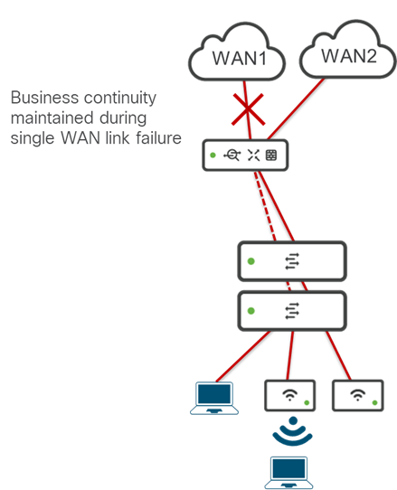
 
With the small branch design, business continuity can be preserved during an outage of the service of one of the WAN providers, or the hardware failure of a single physical interface on the Cisco secure router itself.  However, the small branch design does not provide a high-availability solution should the Cisco secure router fail.  The cost of implementing a second Cisco secure router is considered greater than the benefit of business continuity resulting from the loss of the Cisco secure router itself.  This may simply be the result of business analysis concluding that the loss of an entire Cisco secure router is a relatively rare occurrence which can be handled by adequate on-prem or nearby sparing and/or service contracts to replace the hardware as soon as possible.  Alternatively, customers may simply be directed to another nearby small branch – as in the case where the small branch is an ATM machine connected to the network of a financial services organization.

For the medium and large branch designs, the benefits of maintaining business continuity should the Cisco secure router fail are considered greater than the cost of implementing a second Cisco secure router.  

**Figure 5. Large Branch Hardware-Level Redundancy**

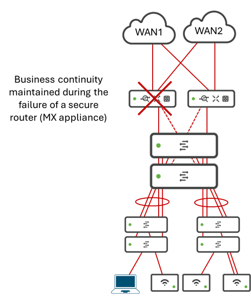

To accommodate the large branch design, a new template called *large_branch_inventory* will need to be added to [*templates-inventory.nac.yaml*](https://github.com/netascode/nac-branch/blob/main/data/templates-inventory.nac.yaml) file within the existing Cisco Unified Branch GitHub Repository.  The new template is discussed in section *3.6 Large Branch Inventory Config Template - Router, Switch, and AP Configurations* of this document.

#### 5.2.1 Warm Spare ####

Unified Branch Phase 2 will only support active/standby pairs of Cisco secure routers for the medium and large branch designs.  This is also referred to as implmenting a warm spare.

The [*meraki_appliance_warm_spare resource*](https://registry.terraform.io/providers/CiscoDevNet/meraki/latest/docs/resources/appliance_warm_spare) within the CiscoDevNet Meraki Terraform Provider will be leveraged to provide a high-availability design for the medium and large branch designs. 

The resource has the form shown below.

        resource "meraki_appliance_warm_spare" "example" {
          network_id   = "L_123456"
          enabled      = true
          spare_serial = "Q234-ABCD-5678"
          uplink_mode  = "virtual"
          virtual_ip1  = "1.2.3.4"
          virtual_ip2  = "2.3.4.5"
        }

For the large branch design the following are the configuration for the parameters:

- *network_id* - String (required) which is the network to which the warm spare feature will be enabled.

- *enabled* - Boolean (required) which should be hardcoded to true.  For the medium branch design a warm spare Cisco secure router is mandatory.  Otherwise, the design would be the same as the Unified Branch small branch design. 

- *spare_serial* - String (optional) which is the serial number of the Cisco secure router which serves as the secondary within the network.  This should be specified as a variable.

- *uplink_mode* - String (optional) can be set to 'public' or 'virtual'.  For Phase 2 of Unified Branch, uplink_mode should be hardcoded to 'virtual' since that is the method we are choosing to support for Phase 2 of Unified Branch. This method requires a separate virtual IP address that is shared between the active and standby Cisco secure routers for each WAN interface.

- *virtual_1* and *virtual_2* - Strings (optional) which represent the virtual IP addresses of the two WAN interfaces when uplink_mode is set to 'virtual'. These two parameters should be specified as variables.

The following is an example of the YAML configuration which provides the high-availability design for the medium and large branch designs for Phase 2 of Unified Branch.

        meraki:
          template:
            networks:
              #
              # The below code does the following:
              #
              # Configures the second Cisco secure router as a warm
              # spare within the network. Only virtual uplink_mode is
              # supported for Unified Branch.  This requies a virtual
              # IP address configured for each WAN interface. The
              # virtual IP address is shared between the primary
              # and secondary Cisco secure routers.
              #
              # This template is mandatory for the medium and large
              # branch designs within Unified Branch.  For the small
              # branch design, this template is not supported, since
              # adding it would result in the medium branch design. 
              #
              - name: app_warm_spare
                appliance:
                  warm_spare:
                    enabled: true
                    uplink_mode: virtual
                    virtual_ip1: ${virtual_ip1}
                    virtual_ip2: ${virtual_ip2}
                    spare_device: ${appliance_02_serial}

This will need to be added to the existing [*templates-appliance.nac.yaml*](https://github.com/netascode/nac-branch/blob/main/data/templates-inventory.nac.yaml) file within the Cisco Unified Branch GitHub Repository.

### 5.3 ZTNA / Adaptive Policy with Access Manager ###

For this document, Adaptive Policy will be used in place of ZTNA, since the specific technology used to implement ZTNA for Phase 2 of Unified Branch is Adaptive Policy.  

The use case to be developed for Adaptive Policy with Phase 2 for the large branch design is to implement inter-VLAN segmentation / access-control between VLANs 20 (Data), 20 (Voice), and 30 (IoT) via stateless ACLs implemented on the Layer 3 distribution switch stack.  This is because the SVI definitions for these VLANs resides within the Layer 3 distribution switch stack.  Traffic between these VLANs never reaches the stateful firewall within the Cisco secure router (MX appliance).  All other inter-VLAN segmentation / access-control within the large branch can still be done via the Cisco secure router firewall since the SVI definitions for VLANs 1 (default), 40 (PCI), 50 (Guest), and 999 (Infra) resides within the secure router (MX appliance).  

 The medium and large branch designs introduce micro-segmentation within VLAN 10 (Data) through the use of SGTs.  We will still want to authenticate the user/device using an external Radius server.
 
 Meraki Access Manager has been removed for Phase 2 due to APIs not being available to select Meraki Access Manager for authentication and authorization within the Switching and Wireless sections of the Meraki dashboard.  

For wireless (APs) access, the external Radius server will hand back a Group Policy name which contains the VLAN assignment and separately an SGT via Radius attribute.  For wired (switches) access Group Policy is still not supported.  The Radius server will had back the VLAN assignment and an SGT directly via Radius attributes. 

The following figure shows the use case for Adaptive Policy with Access Manager for the large branch for Phase 2 of Unified Branch.

**Figure 6. Large Branch Adaptive Policy with Access Manager Use Case**

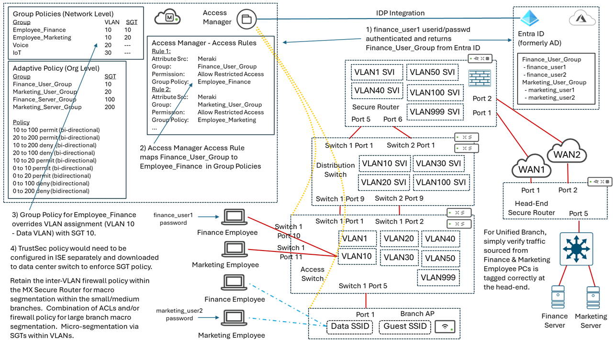

 Since the secure router does not enforce SGTs, it simply ignores them and continues to enforce the VLAN to VLAN firewall policy.  For Phase 2, we will simply verify that the SGT is passed through the AutoVPN tunnel to the head-end Cisco secure router, and is passed onto the Ethernet network at that point.  Validation testing for Phase 2 will not involve implementing TrustSec via ISE and enforcing the SGT at the data center switch.

The flow for authentication and authorization for devices is as follows:
 
 1) The userid/password from the end-user device is checked against the external Radius server.  For wireless devices the Radius server returns the Group to which the end-user is a part of.  For wired devices the Radius server returns the VLAN assignment as a Radius attribute.

 2) For wireless devices, the Group will then be used to map to a pre-configured Group Policy within the Meraki Dashboard.  Within that Group Policy, the VLAN assignment of the end-user will be hardcoded.

 3) For wired and wireless devices, the SGT will be returned separately via a Radius attribute - along with the Group Policy for wireless devices, and the VLAN assignment for wired devices.  With this design, the SGT is not defined within the Group Policy configuration for wireless devices.

 Phase 2 will not address Step 4 in the figure above - the configuration of TrustSec policy within ISE to enforce the SGT at the data center switch.

 #### 5.3.1 Adaptive Policy Group Configuration ####

The [*meraki_organization_adaptive_policy_groups*](https://registry.terraform.io/providers/CiscoDevNet/meraki/latest/docs/resources/organization_adaptive_policy_groups resource within the CiscoDevNet Meraki Terraform Provider will be leveraged to create Adaptive Policy Groups.  The resource has the form shown below.

        resource "meraki_organization_adaptive_policy_groups" "example" {
          organization_id = "123456"
          items = [{
            description = "Group of XYZ Corp Employees"
            name        = "Employee Group"
            sgt         = 1000
            policy_objects = [
              {
                id   = "2345"
                name = "Example Policy Object"
              }
            ]
          }]
        }

- *items* - Set of Attributes (required) containing the policy groups.

- *description* - String (optional) containing the name of the policy group.

- *name* - String (required) containing the name of the policy group.

- *sgt* - Integer (required) containing the SGT of the group.

- *policy_objects* - List of Attributes (optional) containing the policy objects that belong to the group. Default is an empty list [].

  - *id* - String (required) containing the ID of the policy object.

  - *name* - String (required) containing the name of the policy object.

The following table shows the parameters for the four groups which will need to be created for the Adaptive Policy example shown in Phase 2 of Unified Branch.

**Table 11. Adaptive Policy Groups**

| Name | SGT Value | Description | Policy Objects |
| -----| --------- | ----------- | -------------- |
| Finance_User_Group | 10 | Employee Finance User Group | None |
| Marketing_User_Group | 20 | Employee Marketing User Group | None |
| Finance_Server_Group | 100| Finance Server Group | None |
| Marketing_Server_Group | 200 | Marketing Server Group | None |

#### 5.3.2 Adaptive Policies Configuration ####

- This section last updated on 03/30/2026 to allow Infrastructure (SGT 2) and Unknown (SGT 0) to access Finance_Users (SGT 10), Finance_Servers (SGT 100), Marketing_Users (SGT 20), and Marketing_Servers (SGT 200). The less restrictive security stance was considered more conducive for troubleshooting (for example testing reachability between Marketing Servers and their default gateway).  Documentation to indicate the less restrictive security stance deployed within the CVD for troubleshooting purposes, and that the customer must decide where to balance the trade-off between the ability to troubleshoot and locking down access.

The [*meraki_organization_adaptive_policies*](https://registry.terraform.io/providers/CiscoDevNet/meraki/latest/docs/resources/organization_adaptive_policies) resource within the CiscoDevNet [Meraki Terraform Provider](https://registry.terraform.io/providers/CiscoDevNet/meraki/latest/docs) will be leveraged to create Adaptive Polices.  The resource has the form shown below.

        resource "meraki_organization_adaptive_policies" "example" {
          organization_id = "123456"
          items = [{
            last_entry_rule        = "allow"
            destination_group_id   = "333"
            destination_group_name = "IoT Servers"
            destination_group_sgt  = 51
            source_group_id        = "222"
            source_group_name      = "IoT Devices"
            source_group_sgt       = 50
            acls = [
              {
                id   = "444"
                name = "Block web"
              }
            ]
          }]
        }

The following table shows the parameters for the four groups which will need to be created for the Adaptive Policy example shown in Phase 2 of Unified Branch.

**Table 12. Adaptive Policies**

| Source Group | Source SGT | Destination Group | Destination SGT | Permission |
| -------------| ---------- | ----------------- | --------------- | ---------- |
| Finance_User_Group | 10 | Finance_Server_Group | 100 | Allow |
| Finance_Server_Group | 100 | Finance_User_Group | 10 | Allow |
| Marketing_User_Group | 20 | Marketing_Server_Group | 200 | Allow |
| Marketing_Server_Group | 200 | Marketing_User_Group | 20 | Allow |
| Finance_User_Group | 10 | Marketing_Server_Group | 200 | Deny |
| Marketing_Server_Group | 200 | Finance_User_Group | 10 | Deny |
| Marketing_User_Group | 20 | Finance_Server_Group | 100 | Deny |
| Finance_Server_Group | 100 | Marketing_User_Group | 20 | Deny |
| Finance_User_Group | 10 | Marketing_User_Group | 20 | Allow |
| Marketing_User_Group | 20 | Finance_User_Group | 10 | Allow |
| Finance_User_Group | 10 | Unknown | 0 | Allow |
| Unknown | 0 | Finance_User_Group | 10 | Allow |
| Marketing_User_Group | 20 | Unknown | 0 | Allow |
| Unknown | 0 | Marketing_User_Group | 20 | Allow |
| Finance_Server_Group | 100 | Unknown | 0 | Allow |
| Unknown | 0 | Finance_Server_Group | 100 | Allow |
| Marketing_Server_Group | 200 | Unknown | 0 | Allow |
| Unknown | 0 | Marketing_Server_Group | 200 | Allow |
| Finance_User_Group | 10 | Infrastructure | 2 | Allow |
| Infrastructure | 2 | Finance_User_Group | 10 | Allow |
| Marketing_User_Group | 20 | Infrastructure | 2 | Allow |
| Infrastructure | 2 | Marketing_User_Group | 20 | Allow |
| Finance_Server_Group | 100 | Infrastructure | 2 | Allow |
| Infrastructure | 2 | Finance_Server_Group | 100 | Allow |
| Marketing_Server_Group | 200 | Infrastructure | 2 | Allow |
| Infrastructure | 2 | Marketing_Server_Group | 200 | Allow |

#### 5.3.3. Adaptive Policy Settings ####

The [*meraki_organization_adaptive_policy_settings*](https://registry.terraform.io/providers/CiscoDevNet/meraki/latest/docs/resources/organization_adaptive_policy_settings) resource within the CiscoDevNet [Meraki Terraform Provider](https://registry.terraform.io/providers/CiscoDevNet/meraki/latest/docs) will be leveraged to assign the Adaptive Policy Groups and Adaptive Policies to individual small, medium, and large branch networks selected by the partner or customer deploying Unified Branch.  

The resource has the form shown below.

        resource "meraki_organization_adaptive_policy_settings" "example" {
          organization_id  = "123456"
          enabled_networks = ["L_11111111"]
        }

- *organization_id* - String (required) containing the organization ID in which Adaptive Policy is being implemented.

- *enabled_networks* - List of Strings (optional) containing the IDs of the Networks within the organization in which Adaptive Policy is enabled. 

#### 5.3.4 YAML Configuration - Adaptive Policy Groups, Policies, and Settings ####

The following is an example of the YAML configuration for creation of the Adaptive Policy Groups & Adaptive Policies, as well as the application of the Adaptive Policies to the networks (via the list of network IDs under the *settings_enabled_networks* parameter) used in the example for the medium and large branch designs for Phase 2 of Unified Branch.  

Note that the network IDs required for the *settings_enabled_networks* parameter will require us to somehow identify the network ID when creating the branch network - rather than using the name, and specify the network ID as a variable which is added to the list.

        meraki:
          domains:
            organizations:
              - name: !env org_name
                managed: false
                #
                # The below code does the following:
                #
                #  Creates four Adaptive Policy Groups and assigns
                #  SGTs for each group.  Note that Policy Objects
                #  are not included within each group and has been
                #  omitted from the YAML configuration.  Please refer 
                #  to the following for the full data model for 
                #  configuring Adaptive Policy if Policy Objects are needed.
                #
                # https://netascode.cisco.com/docs/data_models/meraki/organizations/adaptive_policy/
                #
                # Note that the Unknown (SGT 0) and Infrastructure (SGT 2) 
                # groups are automatically pre-configured within the Meraki 
                # dashboard, and are not included in the YAML below.
                #
                adaptive_policy:
                  name: Adaptive Policy
                  settings_enabled_networks:
                    - ${small_branch_01_network_id}    # YAML requires a network ID
                    - ${medium_branch_01_network_id}
                    - ${large_branch_01_network id}
                  groups:
                    - name: Finance_User_Group
                      description: Employee Finance User Group
                      sgt: 10
                    - name: Marketing_User_Group
                      description: Employee Marketing User Group
                      sgt: 20
                    - name: Finance_Server_Group
                      description: Finance Server Group
                      sgt: 100
                    - name: Marketing_Server_Group
                      description: Marketing Server Group
                      sgt: 200
                  #
                  # The below code does the following:
                  #
                  #  Creates the following bi-directional policies:
                  #  - Allows Finance Users to Finance Servers
                  #  - Allows Marketing Users to Marketing Servers
                  #  - Denies Finance Users to Marketing Servers
                  #  - Denies Marketing Users to Finance Servers
                  #  - Allows Finance Users to Marketing Users
                  #  - Allows Finance Users to Unknown
                  #  - Allows Marketing Users to Unknown
                  #  - Allows Finance Servers to Unknown
                  #  - Allows Marketing Servers to Unknown
                  #  - Allows Finance Users to Infrastructure
                  #  - Allows Marketing Users to Infrastructure
                  #  - Allows Finance Servers to Infrastructure
                  #  - Allows Marketing Servers to Infrastructure
                  #
                  # Note that the rules shown below explicitly configure
                  # what is allowed and denied for clarity, rather than
                  # relying on implicit default behavior. 
                  #
                  policies:
                    - organization_name: !env org_name
                      name: Finance Users to Finance Servers
                      source_group:
                        name: Finance_User_Group
                        sgt: 10
                      destination_group:
                        name: Finance_Server_Group
                        sgt: 100
                      last_entry_rule: allow
                    - organization_name: !env org_name
                      name: Finance Servers to Finance Users
                      source_group:
                        name: Finance_Server_Group
                        sgt: 100
                      destination_group:
                        name: Finance_Users_Group
                        sgt: 10
                      last_entry_rule: allow
                    - organization_name: !env org_name
                      name: Marketing Users to Marketing Servers
                      source_group:
                        name: Marketing_User_Group
                        sgt: 20
                      destination_group:
                        name: Marketing_Server_Group
                        sgt: 200
                      last_entry_rule: allow
                    - organization_name: !env org_name
                      name: Marketing Servers to Marketing Users
                      source_group:
                        name: Marketing_Server_Group
                        sgt: 200
                      destination_group:
                        name: Marketing_User_Group
                        sgt: 20
                      last_entry_rule: allow
                    - organization_name: !env org_name
                      name: Finance Users to Marketing Servers
                      source_group:
                        name: Finance_User_Group
                        sgt: 10
                      destination_group:
                        name: Marketing_Server_Group
                        sgt: 200
                      last_entry_rule: deny
                    - organization_name: !env org_name
                      name: Marketing Servers to Finance Users
                      source_group:
                        name: Marketing_Server_Group
                        sgt: 200
                      destination_group:
                        name: Finance_Users_Group
                        sgt: 10
                      last_entry_rule: deny
                    - organization_name: !env org_name
                      name: Marketing Users to Finance Servers
                      source_group:
                        name: Marketing_User_Group
                        sgt: 20
                      destination_group:
                        name: Finance_Server_Group
                        sgt: 100
                      last_entry_rule: deny
                    - organization_name: !env org_name
                      name: Finance Servers to Marketing Users
                      source_group:
                        name: Finance_Server_Group
                        sgt: 100
                      destination_group:
                        name: Marketing_User_Group
                        sgt: 20
                      last_entry_rule: deny
                    - organization_name: !env org_name
                      name: Finance Users to Marketing Users
                      source_group:
                        name: Finance_User_Group
                        sgt: 10
                      destination_group:
                        name: Marketing_User_Group
                        sgt: 20
                      last_entry_rule: allow
                    - organization_name: !env org_name
                      name: Marketing Users to Finance Users
                      source_group:
                        name: Marketing_User_Group
                        sgt: 20
                      destination_group:
                        name: Finance_Users_Group
                        sgt: 10
                      last_entry_rule: allow        
                    - organization_name: !env org_name
                      name: Finance Users to Unknown
                      source_group:
                        name: Finance_User_Group
                        sgt: 10
                      destination_group:
                        name: Unknown
                        sgt: 0
                      last_entry_rule: allow                
                    - organization_name: !env org_name
                      name: Unknown to Finance Users
                      source_group:
                        name: Unknown
                        sgt: 0
                      destination_group:
                        name: Finance_User_Group
                        sgt: 10
                      last_entry_rule: allow
                    - organization_name: !env org_name
                      name: Marketing Users to Unknown
                      source_group:
                        name: Marketing_User_Group
                        sgt: 20
                      destination_group:
                        name: Unknown
                        sgt: 0
                      last_entry_rule: allow                
                    - organization_name: !env org_name
                      name: Unknown to Marketing Users
                      source_group:
                        name: Unknown
                        sgt: 0
                      destination_group:
                        name: Marketing_User_Group
                        sgt: 20
                      last_entry_rule: allow 
                    - organization_name: !env org_name
                      name: Finance Servers to Unknown
                      source_group:
                        name: Finance_Server_Group
                        sgt: 100
                      destination_group:
                        name: Unknown
                        sgt: 0
                      last_entry_rule: allow                
                    - organization_name: !env org_name
                      name: Unknown to Finance Servers
                      source_group:
                        name: Unknown
                        sgt: 0
                      destination_group:
                        name: Finance_Servers_Group
                        sgt: 100
                      last_entry_rule: allow
                    - organization_name: !env org_name
                      name: Marketing Servers to Unknown
                      source_group:
                        name: Marketing_Servers_Group
                        sgt: 200
                      destination_group:
                        name: Unknown
                        sgt: 0
                      last_entry_rule: allow                
                    - organization_name: !env org_name
                      name: Unknown to Marketing Servers
                      source_group:
                        name: Unknown
                        sgt: 0
                      destination_group:
                        name: Marketing_Servers_Group
                        sgt: 200
                      last_entry_rule: allow  
                      - organization_name: !env org_name
                      name: Finance Servers to Infrastructure
                      source_group:
                        name: Finance_Server_Group
                        sgt: 100
                      destination_group:
                        name: Infrastructure
                        sgt: 2
                      last_entry_rule: allow                
                    - organization_name: !env org_name
                      name: Infrastructure to Finance Servers
                      source_group:
                        name: Infrastructure
                        sgt: 2
                      destination_group:
                        name: Finance_Servers_Group
                        sgt: 100
                      last_entry_rule: allow
                    - organization_name: !env org_name
                      name: Marketing Servers to Infrastructure
                      source_group:
                        name: Marketing_Servers_Group
                        sgt: 200
                      destination_group:
                        name: Infrastructure
                        sgt: 2
                      last_entry_rule: allow                
                    - organization_name: !env org_name
                      name: Infrastructure to Marketing Servers
                      source_group:
                        name: Infrastructure
                        sgt: 2
                      destination_group:
                        name: Marketing_Servers_Group
                        sgt: 200
                      last_entry_rule: allow 

This will need to be added to the existing *templates-appliance.nac.yaml* file within the [Cisco Unified Branch GitHub Repository](https://github.com/netascode/nac-branch).

#### 5.3.5 Modifications to Switch Ports from Phase 1 to Pass SGT Tags and Switch Port Assignment Changes  ####

This section was added on 01/13/2026.

During dashboard configuration of Adaptive Policy it has been noted that in order to pass SGT tags to upstream devices, Meraki switches must explicitly be configured to pass SGT tags.  This must be configured on all trunk ports after Adaptive Policy support for the network in which the switch resides has been enabled.  

From a dashboard perspective, configuring ports to pass SGT tags is done through clicking *details -> configuration* next to individual switch ports from the *switching -> monitor -> switchports page.  A pop-up window appears as follows:

**Figure 7. Configuring switch ports to pass SGT tags**

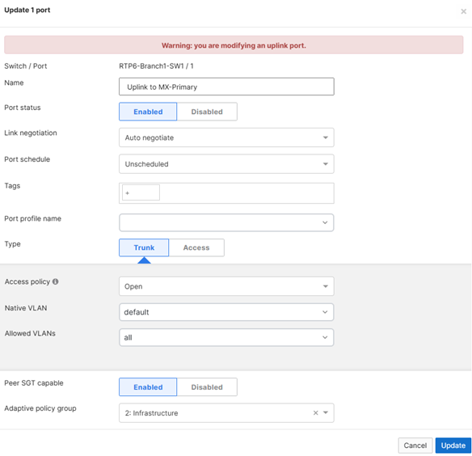

The configuration for passing SGT tags will only appear on trunk ports, and only when the devices are licensed for support of Adaptive Policy and after Adaptive Policy has been enabled for the network in which the devices reside.  

##### 5.3.5.1 Terraform Provider #####

This section was updated on 01/16/2025

The [*meraki_switch_port*](https://registry.terraform.io/providers/CiscoDevNet/meraki/latest/docs/resources/switch_port) and [*meraki_switch_ports*](https://registry.terraform.io/providers/CiscoDevNet/meraki/latest/docs/resources/switch_ports) resources within the CiscoDevnet Meraki Terraform Provider support the *peer_sgt_capable* and *adaptive_policy_group_id* parameters as of version 1.9.0 to enable switch trunk ports to pass SGT tags.  The resource has the form shown below.

        resource "meraki_switch_port" "example" {
          serial                      = "1234-ABCD-1234"
          port_id                     = "1"
          access_policy_type          = "Sticky MAC allow list"
          adaptive_policy_group_id    = "pre-defined group id"
          allowed_vlans               = "1,3,5-10"
          dai_trusted                 = false
          enabled                     = true
          isolation_enabled           = false
          link_negotiation            = "Auto negotiate"
          name                        = "My switch port"
          peer_sgt_capable            = true
          poe_enabled                 = true
          rstp_enabled                = true
          sticky_mac_allow_list_limit = 5
          stp_guard                   = "disabled"
          type                        = "access"
          udld                        = "Alert only"
          vlan                        = 10
          voice_vlan                  = 20
          profile_enabled             = false
          sticky_mac_allow_list       = ["34:56:fe:ce:8e:b0"]
          tags                        = ["tag1"]
        }

  - *peer_sgt_capable* - Boolean (optional) indicating whether the upstream device connected to the switch trunk port supports the passing of SGT tags.  This should be configured as a variable, so that when the customer / partner is deploying a branch which supports Adaptive Policy, the *peer_sgt_capable* paramater can be set to true. Otherwise, it should be set to false.

  - *adaptive_policy_group_id* - String (optional) containing the ID of an existing Adaptive Policy Group pre-confgured for the network.  Based on discussions within the technical meetings, the decision is to set this value to Group 2 - Infrastructure on secure router and switch trunk ports. 

The *peer_sgt_capable* and potentially *adaptive_policy_group_id* configuration needs to be done on all trunk switch ports to accommodate both APs connected to switch trunk ports, and the MX secure routers which connect to switch trunk ports.

##### 5.3.5.2 YAML Configuration #####

The necessary YAML configurations for *peer_sgt_capable* and *adaptive_policy_group_id* have been noted in the section titled *Router and Switch Port Changes to Medium Branch Design*.  These parameters will need to be supported by the netascode Meraki data model before Adaptive Policy can be supported for Unified Branch Phase 2.

#### 5.3.6 Modifications to Appliance LAN Ports from Phase 1 to Pass SGT Tags  ####

This section was updated on 01/13/2026.

During dashboard configuration of Adaptive Policy it has also been noted that in order to pass SGT tags to upstream devices, Cisco secure routers must explicitly be configured to pass SGT tags.  This must be configured on all LAN-side trunk ports after Adaptive Policy support for the network in which the secure router resides has been enabled.

From a dashboard perspective, configuring secure router LAN ports to pass SGT tags is done by selecting the LAN port and clicking the *edit* button  in the *Per-port VLAN Settings* section of the *Security & SD-WAN -> Addressing & VLANs* page.  A pop-up window appears as follows:

**Figure 8. Configuring MX Appliance LAN ports to pass SGT tags**

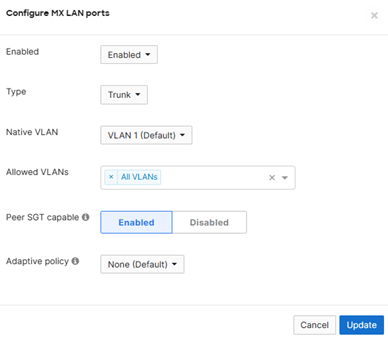

The configuration for passing SGT tags   will only appear on LAN trunk ports, and only when the devices are licensed for support of Adaptive Policy and after Adaptive Policy has been enabled for the network in which the devices reside.

##### 5.3.6.1 Terraform Provider #####

The [*meraki_appliance_port*](https://registry.terraform.io/providers/CiscoDevNet/meraki/latest/docs/resources/appliance_port) resource within the CiscoDevnet Meraki Terraform Provider does not support the *peer_sgt_capable* and *adaptive_policy_group_id* parameters as of version 1.9.0 to enable secure router (MX appliance) trunk ports to pass SGT tags.

Support for *peer_sgt_capable* and *adaptive_policy_group_id* parameters will need to be added to the Terraform Provider in order to support Adaptive Policy for Phase 2 of Unified Branch.

##### 5.3.6.2 Meraki API #####

Support for configuring *peer_sgt_capable* and *adaptive_policy_group_id* parameters is only available in Early Access APIs within the Meraki dashboard, as shown in the following figure.

**Figure 9. APIs for MX Appliance LAN ports to pass SGT tags**

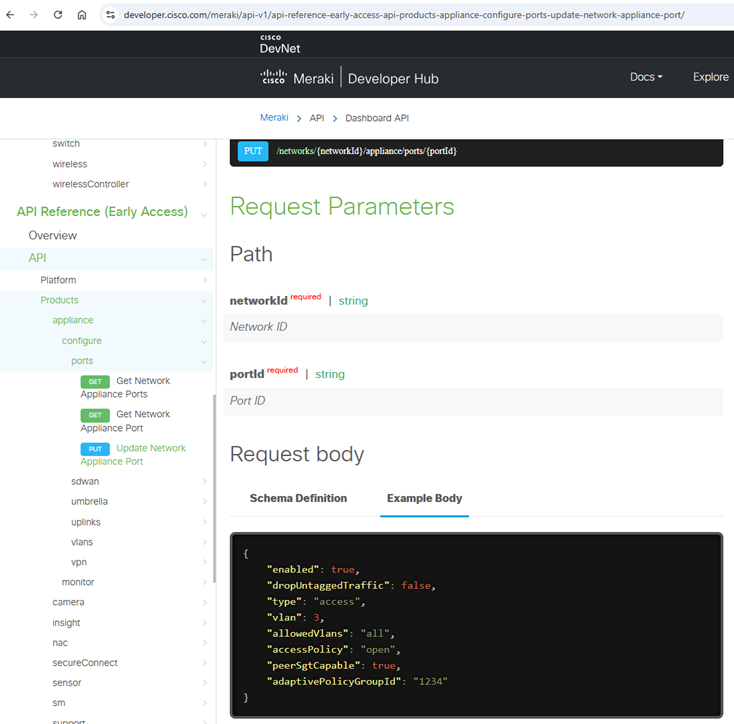

The specific API which would be leveraged is the PUT action of the */networks/{networkId}/appliance/ports/{portId}* API endpoint.

Support for *peer_sgt_capable* and *adaptive_policy_group_id* parameters will need to be moved from Early Access to General Availability for the API endpoint in order to support the ability of the Terraform provider to be updated to support Adaptive Policy for Phase 2 of Unified Branch.

#### 5.3.7 Modifications to Appliance AutoVPN Configuration from Phase 1 to Pass SGT Tags  ####

This section updated on 01/16/2026

During dashboard configuration of Adaptive Policy it has also been noted that in order to pass SGT tags to upstream devices, Cisco secure routers must explicitly be configured to pass SGT tags.  This must be explicitly configured across the AutoVPN tunnels as well.

From a dashboard perspective, configuring secure routers (MX appliances) to pass SGT tags across the AutoVPN tunnels is done by selecting *Enable* next to the *Peer SGT capable* setting in the *VPN Settings* section of the *Security & SD-WAN -> Site-to-site VPN* page.  A pop-up window appears as follows:

**Figure 10. Configuring MX Appliance AutoVPN to pass SGT tags**

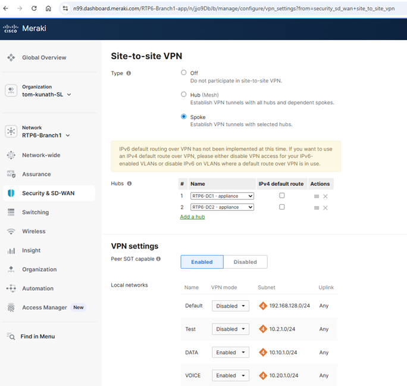

The configuration for passing SGT tags will only appear on the MX appliance, when the devices are licensed for support of Adaptive Policy and after Adaptive Policy has been enabled for the network in which the devices reside.

##### 5.3.7.1 Terraform Provider #####

The [*meraki_appliance_site_to_site_vpn*](https://registry.terraform.io/providers/CiscoDevNet/meraki/latest/docs/resources/appliance_site_to_site_vpn) resource within the CiscoDevnet Meraki Terraform Provider does not support the *peer_sgt_capable* parameter as of version 1.9.0 to enable secure router (MX appliance) AutoVPN tunnels to pass SGT tags.

Support for the *peer_sgt_capable* and parameter will need to be added to the Terraform Provider in order to support Adaptive Policy for Phase 2 of Unified Branch.

##### 5.3.7.2 Meraki API #####

This section updated on 01/16/2026

Support for configuring *peer_sgt_capable* parameters appears to be available in the */networks/{networkId}/appliance/vpn/siteToSiteVpn* API endpoint within the Meraki dashboard.  However, it does not appear to be documented within the API documentation for the GET or PUT actions within https://developer.cisco.com/meraki/api-v1/update-network-appliance-vpn-site-to-site-vpn/.  Likewise, it does not appear in the spec2.json or spe3.json files within the GitHub repository https://github.com/meraki/openapi/tree/master/openapi.

The specific API which needs to be leveraged is the PUT action of the */networks/{networkId}/appliance/vpn/siteToSiteVpn* API endpoint.

Support for the *peer_sgt_capable* parameters will need to documented within the API endpoint in order for the Terraform provider to be updated to support Adaptive Policy for Phase 2 of Unified Branch.

##### 5.3.7.3 YAML Configuration #####

This section updated on 01/16/2026.

The *app_spoke* template within the [*templates-appliance.nac.yaml file*](https://github.com/netascode/nac-branch/blob/main/data/templates-appliance.nac.yaml) within the existing Github repository will need to be updated (once the Terraform Provider and netascode Meraki data model are updated) to support the ability to enable passing SGT tags across the AutoVPN tunnels. 

An example of the configuration is as follows:

        meraki
          template
            networks
              #
              # The below code does the following:
              #
              # Security appliance AutoVPN configuration template
              # for branch networks.
              #
              # Configures the branch network to which the template
              # is applied as a spoke with dual hub routers.  The name 
              # of the hubs, which are specified as variables, is also
              # the default route for all spoke networks.
              #
              # Advertises the VLAN 10 (Data), VLAN 20 (Voice), VLAN 30
              # (IoT), VLAN 40 (PCI) which has been added for Unified 
              # Branch Phase 2, and VLAN 999 (infra) subnets across the
              # VPN to the cloud. VLAN 50 (Guest) is not advertised across 
              # the VPN.  The default VLAN (VLAN 1) is automatically
              # configured by the secure router and does not appear 
              # within the YAML.
              # 
              # IP address and subnets for VLANs are specified as variables
              # which are defined in the pods_variables.nac.yaml file.
              #
              # The peer_sgt_capable parameter, which has been added for
              # Unified Branch Phase 2, allows SGT tags to be passed through
              # AutoVPN tunnels.  This is specified as a variable which can
              # be enabled for branches that support Adaptive Policy.  Note
              # that Adaptive Policy must be enabled at the network level 
              # for the branch in order for the peer_sgt_capable parameter
              # to be valid within the app_spoke template.
              #
              # For Unified Branch Phase 2, the use_default_route paramater
              # for the hub has been changed from true to a variable called
              # hub_default_route.  This is to accomodate SSE / Cisco Secure 
              # Access Cloud integration at the branch.  When SSE / Cisco
              # Secure Access Cloud integration is enabled, the default route 
              # for all Internet bound traffic that does not have a specific
              # exclusion will be sent to the Cisco Secure Access Cloud 
              # data centers.  Therefore, the use_default_route parameter
              # should be set to false when enabling SSE / Cisco Secure Access 
              # Cloud integration. Otherwise, the use_default_route parameter
              # should be set to true as was done for the app_spoke template
              # for Unified Branch Phase 1.
              #
              - name: app_spoke
                appliance:
                        vpn_site_to_site_vpn:
                          mode: spoke
                          hubs:
                            - hub_network_name: ${hub_01_network_name}
                              use_default_route: ${hub_01_default_route}
                            - hub_network_name: ${hub_02_network_name}
                              use_default_route: ${hub_02_default_route}
                          subnets:
                            - local_subnet: ${vlan10_subnet}
                              use_vpn: true
                            - local_subnet: ${vlan20_subnet}
                              use_vpn: true
                            - local_subnet: ${vlan30_subnet}
                              use_vpn: true
                            # VLAN 40 (PCI) added for Unified Branch Phase 2
                            - local_subnet: ${vlan40_subnet}
                              use_vpn: true
                            - local_subnet: ${vlan50_subnet}
                              use_vpn: false
                            - local_subnet: ${vlan999_subnet}
                              use_vpn: true
                          # Added for Unified Branch Phase 2 for Adaptive Policy
                          peer_sgt_capable: ${peer_sgt_capable}   # Currently not in data model.

The *peer_sgt_capable* parameter (currently not in the Meraki Netascode data model) will need to be configured as a variable, so that the customer / partner has the choice of enabling / disabling it per branch.

In addition, it has been noted in the YAML configuration that VLAN 40 (PCI) has been added for Unified Branch Phase 2.  This is primarily to highlight how a VLAN can be extended to the Cisco secure router in the large branch design for stateful firewalling.  However, the VLAN has been included in the medium and small branch designs for Phase 2 for consistency.

Finally, it has been noted in the YAML configuration that the *use_default_route* parameter has been changed from being hardcoded to a value of true in Unified Branch Phase 1, to being a variable *$(hub_default_route) in Phase 2.  This is to accomodate SSE / Cisco Secure Access Integration in Phase 2. As noted in the comments within the YAML configuration above, When SSE / Cisco Secure Access Cloud integration is enabled, the default route for all Internet bound traffic that does not have a specific exclusion will be sent to the Cisco Secure Access data centers.  Therefore, the use_default_route parameter should be set to false when enabling SSE / Cisco Secure Access Cloud integration.  Otherwise, the use_default_route parameter should be set to true as was done for the app_spoke template for Unified Branch Phase 1.

### 5.4 SSE / Cisco Secure Access Cloud Integration ##

- This section last updated 04/06/2026.  The current API around third party VPN connections only supports two actions, GET (read) and PUT (update).   The API does not support the POST (create) or DELETE (delete) actions.  Hence, in order to create new third party VPN tunnels through the Terraform Provider resource, the provider must first read (GET action) in the current list of third party VPN tunnels, then append (PUT action) the new SSE tunnels to that list.  However, a further complication has been discovered during testing.  The API currently does not recognize the preset "umbrella" configuration for third party VPN tunnels.  So, although a GET action can read the configuration that includes the preset "umbrella" configuration, a subsequent PUT action fails to update the list of third party VPN tunnels.  Hence for Unified Branch Phase 2, the only alternative is to assume a greenfield deployment in which the customer has no other third party VPN connections within the entire organization. When the API has been updated and the Terraform Provider resource tested to function correctly (and/or updated if necessary), this constraint can be removed.

For Unified Branch Phase 2, the use case for SSE / Cisco Secure Access Cloud integration will be to tunnel Internet-bound traffic through an IPsec VPN tunnel (non-AutoVPN) to the Cisco Secure Access Cloud.  The following figure shows the use case.

**Figure 11. SSE / Cisco Secure Access Integration Use Case**

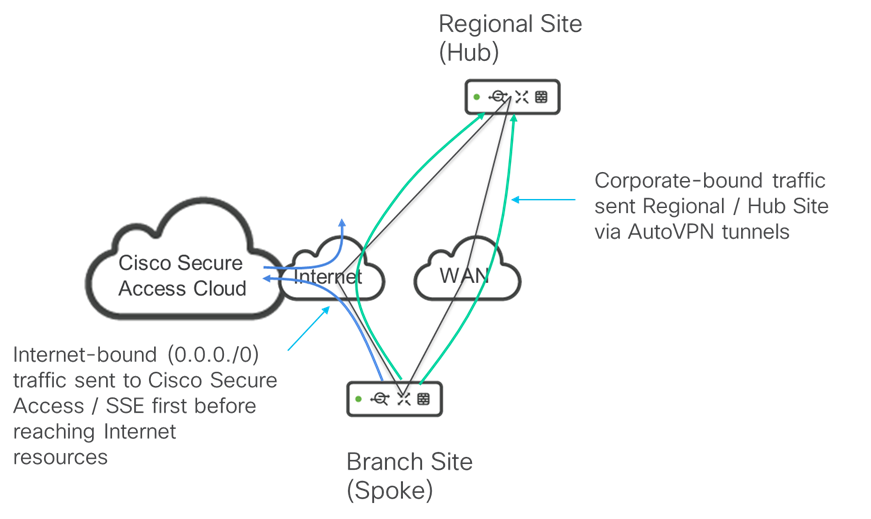

The following use cases will not be covered in Phase 2:

- Access to data center resources located in a private VPC or vNet within IaaS public cloud providers such as AWS or Azure

- Site-to-site (branch-to-branch, branch-to-hub, or hub-to-hub) traffic sent to SSE / Cisco Secure Access Cloud

- Remote access (RA) VPN traffic terminating within the SSE / Cisco Secure Access Cloud and backhauled into corporate (branch or hub) sites

Future Unified Branch phases may address these use cases.

#### 5.4.1 Terraform Provider ####

- This section updated on 03/15/2026 to indicate that the preset policy of "umbrella" within the Terraform Provider cannot be used for Unified Branch Phase 2.  Instead a custom policy will need to be defined. 

From a Branch as Code automation perspective, the [*meraki_appliance_third_party_vpn_peers*](https://registry.terraform.io/providers/CiscoDevNet/meraki/latest/docs/resources/appliance_third_party_vpn_peers) resource within the CiscoDevNet Meraki Terraform Provider can be used to configure VPN peering between the Cisco secure routers within the branches and the Cisco Secure Access Cloud.

The resource has the form shown below:

        resource "meraki_appliance_third_party_vpn_peers" "example" {
          organization_id = "123456"
          peers = [
            {
              ike_version                             = "2"
              is_route_based                          = false
              local_id                                = "myMXId@meraki.com"
              name                                    = "Peer Name"
              priority_in_group                       = 1
              public_ip                               = "123.123.123.1"
              remote_id                               = "miles@meraki.com"
              secret                                  = "Sample Password"
              group_active_active_tunnel              = false
              group_number                            = 1
              group_failover_direct_to_internet       = false
              ipsec_policies_child_lifetime           = 28800
              ipsec_policies_ike_lifetime             = 28800
              ipsec_policies_child_auth_algo          = ["sha1"]
              ipsec_policies_child_cipher_algo        = ["aes128"]
              ipsec_policies_child_pfs_group          = ["disabled"]
              ipsec_policies_ike_auth_algo            = ["sha1"]
              ipsec_policies_ike_cipher_algo          = ["tripledes"]
              ipsec_policies_ike_diffie_hellman_group = ["group2"]
              ipsec_policies_ike_prf_algo             = ["prfsha1"]
              network_tags                            = ["none"]
              private_subnets                         = ["192.168.1.0/24"]
            }
          ]
        }

- *organization_id* - String (required) containing the organization to which the peer connections will be added. Third party VPN peer configurations are defined at an organization level.  The *organization_id* should be specified as a variable for all organization-level configuration orchestrated by Branch as Code.

- *peers* - List of orbjects (required) containing the configuration of all third party VPN peers configured for the organization.  For Cisco Secure Access, there needs to be a primary and secondary peer configured, since there is no parameter for adding the second peer automatically, as is done within the Meraki dashboard.

Note that the [Meraki API endpoint](https://developer.cisco.com/meraki/api-v1/get-organization-appliance-vpn-third-party-vpn-peers/) for third party VPN peers only includes read (GET) and update (PUT) actions. There are no create (POST) or delete (DELETE) actions.  This implies that in order to delete a third party VPN peer, it must be removed from the list; and when updating a peer the entire list must be sent.  This should not be an issue for the Terraform provider, as Terraform will maintain the state of all the third party VPN peers once provisioned.  However, when configuring Branch as Code in an existing organization, there could be issues with regard to existing third party VPN connections already configured manually within the organization.

- *ike_version* - String (optional) specifying  the version of Internet Key Exchange (IKE) protocol.  Choices are '1' or '2' with the default being '1'.  This should be hardcoded to use IKEv2 for Cisco Secure Access integration.

- *is_route_based* - Boolean (optional) specifying whether a routing protocol (eBGP) is used across the tunnel.  The default is false.  For the secure Internet access use case supported in Cisco Unified Branch Phase 2, the third party VPN tunnel will be configured for NAT / Outbound only.  Hence, this should be hardcoded to false.

When *is_route_based* is set to false, the *ebgpNeighbor* parameter is ignored.  The following are the configurations under *ebgpNeighbor* which will also be ignored.

  - *ebgp_neighbor_ebgp_hold_timer* - Integer containing the eBGP hold timer in seconds for each neighbor. The eBGP hold timer must be an integer between 12 and 240. 
  
  - *ebgp_neighbor_ebgp_multihop* - Integer (optional) configured only this if the neighbor is not adjacent. The eBGP multi-hop must be an integer between 1 and 255.
  
  - *ebgp_neighbor_ip_version* - Integer containing the IP version of the neighbor.  Choices are '4' or '6'.

  - *ebgp_neighbor_multi_exit_discriminator* - Integer that configures the local metric associated with routes received from the remote peer. Routes from peers with lower metrics are will be preferred. Must be an integer between 0 and 4294967295. MED is 6th in the decision tree when identical routes from multiple peers exist.

  - *ebgp_neighbor_neighbor_ip* - String containing the IPv4/IPv6 address of the neighbor
  
  - *ebgp_neighbor_path_prepend* - List of Integers which prepends the AS_PATH BGP Attribute associated with routes received from the remote peer. Configurable value of ASNs to prepend. Length of the array may not exceed 10, and each ASN in the array must be an integer between 1 and 4294967295. AS_PATH is 4th in the decision tree when identical routes from multiple peers exist.

  - *ebgp_neighbor_remote_as_number* - Integer containing the remote ASN of the neighbor. The remote ASN must be an integer between 1 and 4294967295
  
  - *ebgp_neighbor_source_ip* - String containing the source IP of eBGP neighbor

  - *ebgp_neighbor_weight* - Integer that configures the local metric associated with routes received from the remote peer. Routes from peers with lower metrics are will be preferred. Must be an integer between 0 and 4294967295. MED is 6th in the decision tree when identical routes from multiple peers exist.

- *local_id*  - String (optional) used to identify the MX to the remote peer.  For Cisco Secure Access integration, for the primary peer, this is set to the Primary Tunnel ID for the Network Tunnel Group.  For the secondary peer, this is set to the Secondary Tunnel ID for the Network Tunnel Group. This needs to be specified as a variable for Branch as Code.

- *name* - String (required) specifying the name of the peer.  Assuming multiple VPN peers need to be configured - a primary and a secondary peer per network - this needs to be sepcified as a variable for Branch as Code.

- *priority_in_group* - Integer (optional) representing the order of the peer inside the group.  Choices are '1' or '2'. For the primary peer this should be hardcoded to 1.  For the secondary peer, this should be hardcoded to 2.

- *public_ip* - String (optional) containing the public IP address of the peer (Cisco Secure Access cloud).  For the primary peer this should correspond to the IP address used to connect to the Secure Access Network Tunnel Group Primary Data Center. For the secondary peer this should correspond to the IP address used to connect to the Secure Access Network Tunnel Group Secondary Data Center. This needs to be specified as a variable for Branch as Code.

- *remote_id* - String (optional) containing either a valid IPv4 Address, FQDN or User FQDN that is used to identify the connecting VPN peer. This should be left blank since the *public_ip* is used to identify the remote peer.  The *remote_id* setting can be excluded from Branch as Code YAML configuration.

- *secret* - String (required) containing the shared secret / passphrase for the Cisco Secure Access Tunnel Group.  The passphrase should be the same for the primary and secondary tunnel IDs configured within Cisco Secure Access.  This should be specified as an environmental variable that is not exposed within the GIT repository.  

Note that within the GET action of the [Meraki Dashboard API](https://developer.cisco.com/meraki/api-v1/get-organization-appliance-vpn-third-party-vpn-peers/) the secret is exposed in clear text.  We should note whether the secret is stored in clear text within the Terraform state during validation testing. 

- *group_active_active_tunnel* - Boolean (optional) for determining whether tunnels from primary and secondary WAN interfaces are both active. This should be hardcoded to true.

- *group_number* - Integer (optional) representing the ordering of the primary and backup tunnel group.  This should be set as a variable which is sequential for each tunnel pair. 

- *group_failover_direct_to_internet* - Boolean (optional) determines whether traffic will be sent directly to the Internet when both the primary and secondary tunnels to Cisco Secure Access are down. This setting depends on the use case to be supported.  For the Unified Branch Phase 2 design, when the tunnels are down, the desired behavior is that traffic will be sent back to a hub location where the required security functionality can be applied before sending it to the Internet - rather than directly to the Internet.  Sending traffic directly to the Internet in a fallback scenario could represent a security vulnerability - provided the branch MX does not support all required security functionality (web firewall, AMP with SSL termination, Data Loss Prevention (DLP), etc.).

- *ipsec_policies_preset* - String (optional) containing one of the following available presets: 'default', 'aws', 'azure', 'umbrella', 'zscaler'.  The choice of 'umbrella' within the Terraform Provider results in a preset policy of "Umbrella (Deprecated)" instead of "Umbrella" within the Meraki Dashboard. For integration with Cisco Secure Access, the *ipsec_policies_preset* parameter should be hardcoded to 'umbrella_short_lived'.  Unfortunately this is currently not a choice within the Terraform Provider.  The only way around this is to set *ipsec_policies_preset* to null, indicating a 'custom' policy, and then manually configuing the individual parameters under *ipsec_policies* 

When *ipsec_policies_preset* is set to null, the *ipsecPolicies* parameter will be used.  The following are the configurations under *ipsecPolicies* which will need to be set to match the "Umbrella" policy within the Meraki Dashboard.

  - *ipsec_policies_child_lifetime* - Integer (optional) containing the lifetime of the IPsec Phase 2 SA in seconds.  This should be set to 3600, since that is the value when selecting 'umbrella' within the Meraki Dashboard.

  - *ipsec_policies_ike_lifetime* - Integer (optional) containing the lifetime of the IPsec Phase 1 SA in seconds.  This should be set to 14400, since that is the value when selecting 'umbrella' within the Meraki Dashboard.

  - *ipsec_policies_child_auth_algo* - List of Strings which contains the authentication algorithm to be used in IPsec Phase 1. The value can be an array with one of the following algorithms: 'sha256', 'sha1', 'md5'. This should be set to ["sha1"], since that is the value when selecting 'umbrella' within the Meraki Dashboard.

  - *ipsec_policies_child_cipher_algo* - List of Strings (optional) containing the cipher algorithms to be used in IPsec Phase 2. The value can be an array with one or more of the following algorithms: 'aes256', 'aes192', 'aes128', 'tripledes', 'des', 'null'.  This should be set to ["aes256"], since that is the value when selecting 'umbrella' within the Meraki Dashboard.

  - *ipsec_policies_child_pfs_group* - List of Strings (optional) containing the Diffie-Hellman group to be used for Perfect Forward Secrecy (PFS) in IPsec Phase 2. The value can be an array with one of the following values: 'disabled', 'group14', 'group5', 'group2', 'group1'.  This should be set to ["disabled'], since that is the value when selecting 'umbrella' within the Meraki Dashboard.

  - *ipsec_policies_ike_auth_algo* - List of Strings (optional) containing the authentication algorithm to be used in IPsec Phase 1. The value should be an array with one of the following algorithms: 'sha256', 'sha1', 'md5'. This should be set to ["sha1"], since that it the value when selecting 'umbrella' within the Meraki Dashboard.

  - *ipsec_policies_ike_cipher_algo* - List of Strings (optional) containing the cipher algorithms to be used in IPsec Phase 1. The value should be an array with one or more of the following algorithms: 'aes256', 'aes192', 'aes128', 'tripledes', 'des'.  This should be set to ["aes256"], since that is the value when selecting 'umbrella' within the Meraki Dashboard.

  - *ipsec_policies_ike_diffie_hellman_group* - List of Strings (optional) containing the Diffie-Hellman group to be used in IPsec Phase 1. The value should be an array with one of the following algorithms: 'group14', 'group5', 'group2', 'group1'.  This should be set to ["group14"], since that is the value when selecting 'umbrella' within the Meraki Dashboard.

  - *ipsec_policies_ike_prf_algo* - List of Strings (optional) containing the pseudo-random function to be used in IKE_SA. The value should be an array with one of the following algorithms: 'prfsha256', 'prfsha1', 'prfmd5', 'default'. The default option can be used to default to the Authentication algorithm.  This should be set to {"prfsha1"], since that is the value when selecting 'umbrella' within the Meraki Dashboard.

- *network_tags* - List of Strings (optional) containing a list of network tags that will connect with this peer. Use [all] for all networks. Use [none] for no networks. If not included, the default is [all].  If a single set of peers (primary & secondary) can be used for all networks, then network tags are not needed.  However, if different networks requires a different set of peers, then tags will need to be configured.  These will need to be specified as variables or hardcoded in the GitHub repository to a value such as "SSE".

- *private_subnets* - List of Strings (required) containing the list of the private subnets of the VPN peer.  For Unified Branch Phase 2, the use case for SSE / Cisco Secure Access integration will be to tunnel Internet-bound traffic through an IPsec VPN tunnel (non-AutoVPN) to the Cisco Secure Access cloud.  For this use case, the list of private subnets should be hardcoded to ["0.0.0.0/0"]

- *sla_policy_id* - String (optional) identifying the ID of the SLA policy applied to this peer. SLA policies are defined within the *meraki_appliance_vpn_site_to_site_ipsec_peers_slas* Terraform resource, and discussed in section *5.3.3 Third Party VPN Tunnel Health Check*.

- *public_hostname* - String (optional) The public hostname of the VPN peer.  This can be left blank as the *public_ip* will be used to identify the remote peer.

#### 5.4.2 YAML Configuration ####

The following is an example of the YAML configuration to be added to the *org_global.nac.yaml* file for adding a primary and secondary peer for Cisco Secure Access acting as the third party VPN peer.

            #
            # The below code does the following:
            # 
            # third_party_vpn_peers for integration 
            # to Cisco Secure Access.
            #
            # Defines peers for the primary and secondary
            # data centers for Cisco Secure Access.
            #
            # The peer is applies to the network based on the
            # value of the tag parameter which is set as "SSE".
            # A tag variable is configured in the nw_setup template
            # within the templates-network-related.nac.yaml file.
            # To add the VPN peers corresponding to Cisco Secure
            # access to a given network, set the tag variable to
            # "SSE" when you include the nw_setup template within 
            # the network.
            #
            # Note: If you are not implementing using Cisco Secure 
            # Access within your organization, comment out the 
            # third_party_vpn_peers section. 
            #
            # Note: The "umbrella" preset policy within the Terraform 
            # Provider corresponds to the "Umbrella (Deprecated) preset
            # policy within the Meraki Dashboard.  There is no Terraform
            # Provider preset policy that conforms to the settings within
            # the Meraki Dashboard preset policy of "Umbrella".  Therefore,
            # a custom policy is used to match the settings. Because of 
            # this, SSE integration is supported only for greenfield 
            # deployments where there are no other third party VPN tunnels
            # configured within the organization.  This is due to the APIs
            # currently only supporting GET (read) and PUT (update) actions.
            # PUT (update) actions require first reading the existing
            # list of third party VPN tunnels and then appending to or deleting 
            # from the existing list - before pushing out the updated list. 
            # Hence reading in a list that contains a preset policy such as
            # "Umbrella" and subsequently trying to update the list that 
            # contains the preset policy will fail.  Updating the list with
            # only the new SSE tunnels within the YAML could result in the loss
            # of the configuration of any existing third party VPN tunnels.  
            # Hence, this configuration should only be used in greenfield 
            # organizations without existing third party VPN tunnels. 
            #
            third_party_vpn_peers:
              - name: ${peer1_primary_name}
                public_ip: ${peer1_primary_public_ip}
                private_subnets:
                  - 0.0.0.0/0
                secret: !env peer1_secret
                ike_version: 2
                local_id: ${peer1_primary_local_id}
                ipsec_policies:
                  ike_auth_algo:
                    - sha1
                  ike_cipher_algo:
                    - aes256
                  ike_diffie_hellman_group:
                    - group14
                  ike_prf_algo:
                    - prfsha1
                  ike_lifetime: 14400
                  child_auth_algo:
                    - sha1
                  child_cipher_algo:
                    - aes256
                  child_pfs_group:
                    - disabled
                  child_lifetime: 3600
                network_tags:
                  - "SSE"
                is_route_based: false                     # Cannot find this in schema or netascode Meraki data model
                priority_in_group: 1                      # Cannot find this in schema or netascode Meraki data model
                group_active_active_tunnel: true          # Cannot find this in schema or netascode Meraki data model
                group_number: 1                           # Increments for each tunnel group.  Cannot find this in schema or netascode Meraki data model
                group_failover_direct_to_internet: false  # Cannot find this in schema or netascode Meraki data model
                sla_policy_id: ${peer1_sla_policy_id}     # Cannot find this in schema or netascode Meraki data model
              - name: ${peer1_secondary_name}
                public_ip: ${peer1_secondary_public_ip}
                private_subnets:
                  - 0.0.0.0/0
                secret: !env peer1_secret
                ike_version: 2
                local_id: ${peer1_secondary_local_id}
                ipsec_policies:
                  ike_auth_algo:
                    - sha1
                  ike_cipher_algo:
                    - aes256
                  ike_diffie_hellman_group:
                    - group14
                  ike_prf_algo:
                    - prfsha1
                  ike_lifetime: 14400
                  child_auth_algo:
                    - sha1
                  child_cipher_algo:
                    - aes256
                  child_pfs_group:
                    - disabled
                  child_lifetime: 3600
                network_tags:
                  - "SSE"
                is_route_based: false                     # Cannot find this in schema or netascode Meraki data model
                priority_in_group: 2                      # Cannot find this in schema or netascode Meraki data model
                group_active_active_tunnel: true          # Cannot find this in schema or netascode Meraki data model. Not sure this can be set on secondary tunnel.
                group_number: 1                           # Increments for each tunnel group.  Cannot find this in schema or netascode Meraki data model
                group_failover_direct_to_internet: false  # Cannot find this in schema or netascode Meraki data model
                sla_policy_id: ${peer1_sla_policy_id}     # Cannot find this in schema or netascode Meraki data model

Note that there are several parameters noted above that appear within the [*meraki_appliance_third_party_vpn_peers*](https://registry.terraform.io/providers/CiscoDevNet/meraki/latest/docs/resources/appliance_third_party_vpn_peers) resource within the CiscoDevNet Meraki Terraform Provider, but do not appear within the [Third Party VPN Peers Configuration](https://netascode.cisco.com/docs/data_models/meraki/networks_appliance/vpn_third_party_vpn/) of the Meraki data model on the [netascode](https://netascode.cisco.com/) website.  This must be resolved in order to support SSE / Cisco Secure Access Integration within Unified Branch Phase 2.

#### 5.4.3 Third Party VPN Tunnel Health Check ####

This section added 02/19/2026.

Each third party VPN peer supports the ability to configure a single health check for tunnel health, as shown in the following figure.

**Figure 12. Configuring a Health Check for a 3rd Party VPN Tunnel**

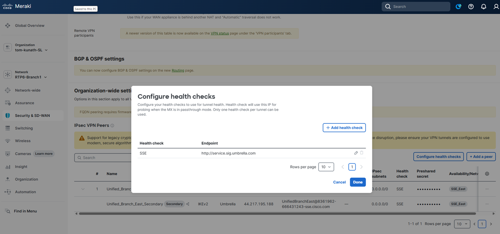

##### 5.4.3.1 Terraform Provider #####

Although this is specified as a health check in the Meraki dashboard, from an automation perpective it configured through the *sla_policy_id* parameter of the  [*meraki_appliance_third_party_vpn_peers*](https://registry.terraform.io/providers/CiscoDevNet/meraki/latest/docs/resources/appliance_third_party_vpn_peers) resource within the CiscoDevNet Meraki Terraform Provider.

The [meraki_appliance_vpn_site_to_site_ipsec_peers_slas](https://registry.terraform.io/providers/CiscoDevNet/meraki/latest/docs/resources/appliance_vpn_site_to_site_ipsec_peers_slas) resource within the CiscoDevNet Meraki Terraform Provider can be used to configure the health check / SLA itself. The resource has the following form:

resource "meraki_appliance_vpn_site_to_site_ipsec_peers_slas" "example" {
  organization_id = "123456"
  items = [
    {
      name = "sla policy"
      uri  = "http://checkthisendpoint.com"
    }
  ]
}

- *organization_id* - String (required) containing the organization to which the SLA policy will be added. SLA policy configurations are defined at an organization level.  The *organization_id* should be specified as a variable for all organization-level configuration orchestrated by Branch as Code.

- *items* - Set of Attributes (required) containing the SLA.

  - *name* - String (required) containing the name of the SLA policy.

  = *uri* - String (required) containing the URI of the health check destination.

Note that the schema for the [Update Organization Appliance Vpn Site To Site Ipsec Peers Slas](https://developer.cisco.com/meraki/api-v1/update-organization-appliance-vpn-site-to-site-ipsec-peers-slas/) API indicates that it returns an ID for each entry within *items*.  There can be multiple SLA targets defined, but only one can be chosen per third party VPN tunnel.  Hence, the item ID is necessary. However the [meraki_appliance_vpn_site_to_site_ipsec_peers_slas](https://registry.terraform.io/providers/CiscoDevNet/meraki/latest/docs/resources/appliance_vpn_site_to_site_ipsec_peers_slas) resource does not indicate an ID per item.  This must be resolved in order to support Health Checks for the SSE / Cisco Secure Access Integration within Unified Branch Phase 2.

##### 5.4.3.2 YAML Configuration #####

The [meraki_appliance_vpn_site_to_site_ipsec_peers_slas](https://registry.terraform.io/providers/CiscoDevNet/meraki/latest/docs/resources/appliance_vpn_site_to_site_ipsec_peers_slas) resource does not appeare to be currently supported within the schema and the [Meraki data model](https://netascode.cisco.com/docs/data_models/meraki/overview/) of the netascode site.

This will need to be resolved in order to support a health check for the third party IPsec VPN tunnel which is configured for SSE / Cisco Secure Access integration.

### 5.5 ThousandEyes Integration ###

For Unified Branch Phase 2, the option to enable ThousandEyes integration is desired to be supported.

Current [Meraki documentation](https://documentation.meraki.com/SASE_and_SD-WAN/MX/Integrations/MI_-_Meraki_Insight/Product_Information_and_Configuration/Meraki_MX_ThousandEyes_Configuration_Guide) indicates support for the following platforms:

- MX Models: MX67, MX67W, MX67C, MX68, MX68W, MX68CW, MX75, MX85, MX95, MX105, MX250, MX450

Support for Cisco C8121-MX and C8455-MX will need to be verified.  

Documentation also indicates that MX secure routers configured in an HA pair is supported. However, the TE agent only runs on the primary router of the HA pair.  This should be verified and noted in the CVD that ThousandEyes monitoring and tests are not available during failovers to the secondary router. 

From a dashboard perspective, integration of ThousandEyes is done through clicking *Insight -> Active Application Monitoring*. Once on the *Active Application Monitoring page*, clicking *Log in* results in a re-direction into the ThousandEyes website in order to login or create a new account.  Either a new account is created on the ThousandEyes website, or credentials are entered and authentication is done, again on the ThousandEyes website.  Because this occurs as a re-direct to the ThousandEyes website, there is no Meraki DevNet Terraform provider resource or Meraki API for this functionality.  At this point there does not appear to be a clear way to automate the initial integration of the Meraki organization with a ThousandEyes account. 

#### 5.5.1 Terraform Provider ####

From a Branch as Code automation perspective, the only functionality which is available is that the *meraki_organization_extensions_thousand_eyes_network* resource within the [CiscoDevNet Meraki Terraform Provider](https://registry.terraform.io/providers/CiscoDevNet/meraki/latest/docs/resources/organization_extensions_thousand_eyes_network) appears to be available to be used to enable the ThousandEyes agent on the MX secure router within the network.

The resource has the form shown below:

        resource "meraki_organization_extensions_thousand_eyes_network" "example" {
          organization_id = "123456"
          enabled         = true
          network_id      = "N_123456"
          tests = [
            {
              network_id                  = "N_123456"
              template_id                 = "123abc"
              template_user_inputs_tenant = "cisco"
            }
          ]
        }

- *organization_id* - String (required) containing the organization to which the peer connections will be added.

- *network_id* - String (required) containing the network where the ThousandEyes agent will be installed on the MX secure routers (primary router in an HA pair).

- *enabled* - Boolean (required) indicating whether the ThousandEyes agent is enabled for the network. This should be specified as a variable to allow the partner / customer to choose whether to enable or not for the given branch network.

- *tests* - List of Attributes (optional) containing an array of tests to be created.  The Terraform provider indicates this can only be configured during resource creation and cannot be changed afterwards.

  - *network_id* - String containing the network specific to the test.

  - *template_id* - String containing the ID of the template.

  - *template_user_inputs_temant* - String containing the tenante value. 

*Template_id* seems to refer to a set of test templates corresponding to sample applications that a customer may choose to monitor, as shown in the figure below, taken from the following [Meraki documentation](https://www.thousandeyes.com/integrations/meraki-mx).

**Figure 13. ThousandEyes Integration - Application Monitor Templates**

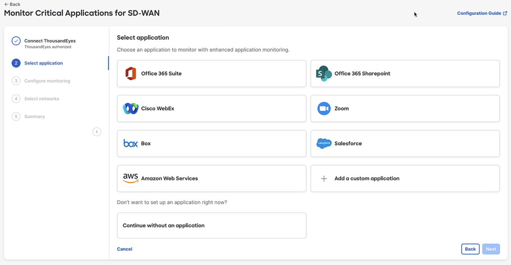

There does not appear to be a way of determining the ID of these pre-configured templates or any custom templates created.  There appear to be no APIs which return this information either.  Hence, it is unknown whether the *tests* list of attributes can even be automated.

*Template_user_inputs_tenant* seems to refer to a sub-domain or tenant for the application indicated by the *tenant_id* parameter, as shown in the figure below. 

**Figure 14. ThousandEyes Integration - Tenant Configuration**

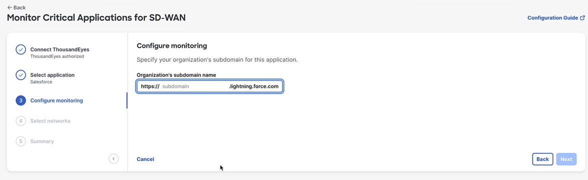

There appears to be no documentation listing valid string choices for tenants for any particular application.  Hence, it is again unknown whether the *tests* list of attribtutes can even be automated.  If the list of valid string choices can be obtained, these could be added to the netascode website to document the choice of tests a customer has when enabling ThousandEyes within a network using Branch as Code automation.

#### 5.5.2 YAML Configuration ####

The [Meraki data model](https://netascode.cisco.com/docs/data_models/meraki/overview/) within the netascode website does not appear to support ThousandEyes integration currently.  This must be added to the data model if it is to be supported in Unified Branch Phase 2.  

Based on the unknowns around configuring *tests* it is also recommended for Unified Branch Phase 2, that the *tests* parameter be omitted from the YAML configuration.  In other words, the Branch as Code automation will only enable / disable the TE agent for the branch.  The customer / partner can modify the YAML file directly to add a list of *test* attributes by consulting the [Meraki data model]() within the netascode website.

At this point it does not appear to be possible to integrate ThousandEyes with the Meraki dashboard via automation for Unified Branch Phase 2.

### 5.6 XDR Integration ###

For Unified Branch Phase 2, the option to enable XDR integration is targeted to be supported.

Current [Meraki documentation](https://documentation.meraki.com/SASE_and_SD-WAN/MX/Integrations/XDR/XDR_FAQ) indicates as of April 2025 the following models (all variations) are supported with minimum MX firmware release of 19.1.4.

- Z4
- MX: 67, 68, 75, 85, 95, 105, 250, 450
- vMX: S, M, L (Note: XL support is pending)

Support for Cisco C8121-MX and C8455-MX will need to be verified.  

XDR integration can be enabled via the Meraki dashboard as discussed in the Meraki [XDR User Guide](https://documentation.meraki.com/SASE_and_SD-WAN/MX/Integrations/XDR/XDR_User_Guide).  

Also, there does appear to be API support for enabling & disabling (POST actions) XDR integration in the [Meraki version 1.65.0 API Reference](https://developer.cisco.com/meraki/api-v1/enable-organization-integrations-xdr-networks/) as well as returning (GET action) information regarding which networks within an organization have XDR integration enabled. 

#### 5.6.1 Terraform Provider ####

From a Branch as Code automation perspective, there does not appear to be a resource within the [Meraki version 1.9.0 Terraform Provider](https://registry.terraform.io/providers/CiscoDevNet/meraki/latest/docs/resources/organization) supporting the enabling / disabling XDR integration for networks within the organization.  This will need to be developed if XDR is to be supported in Branch as Code for Unified Branch Phase 2.

#### 5.6.2 YAML Configuration ####

The [Meraki data model](https://netascode.cisco.com/docs/data_models/meraki/overview/) within the netascode website does not appear to support XDR integration currently.  This must be added to the data model if it is to be supported in Unified Branch Phase 2.

###  5.7 Modifications from Unified Branch Phase 1 ###

This section discusses changes to the Unified Branch design from Phase 1.

#### 5.7.1 802.1x Switch Access Policy ###

- This section last updated 03/10/2026.

This section documents the changes to the switch configuration for Unified Branch Phase 2 for alignment with the CVD.

##### 5.7.1.1 802.1x Switch Access Policy #####

Meraki switch access ports can be configured in one of the following ways:

- Single-Host
- Multi-Domain
- Multi-Auth
- Multi-Host

For Phase 1 of Unified Branch, the CVD shows a configuration using Single-Host, while the Branch as Code repository shows a configuration using Multi-Auth.  For Phase 2, there is a desire to converge on a single example configuration for both the CVD and the Branch as Code repository.

The following is an brief explanation of each choice.

1) Single-Host. As noted in the [MS Switch Access Policies document](https://documentation.meraki.com/Switching/MS_-_Switches/Design_and_Configure/Configuration_Guides/Access_Control/MS_Switch_Access_Policies_(802.1X)),  single-host mode isn't the right choice for the use case of an IP Phone with a PC chained off the back - which is a use case for Unified Branch.

2) Multi-Domain. This seems to be the configuration for the use-case of an IP phone with a PC chained off the back. Access Manager can be configured to send Cisco-AVPair: device-traffic-class=voice when configured. So this is a possiblity for Unified Branch.

3) Multi-Auth. This seems to allow multiple devices on the same port, as long as they are on the same VLAN. There are some exceptions for the MS390 and C9300-M noted in the document. It also seems to work with the use case of IP phones. However, multiple clients are connecting off the same port could point to some unmanaged hub allowing multiple devices connecting to the same physical switch port, which would not be a favorable configuraiton.  

4) Multi-host. This seems to indicate that the first successful authentication puts the port into forwarding state. Other devices then do not need to authenticate. Again, for a wired port (not connected to an AP) this brings up the question of how multiple clients are connecting off the same physical switch port. Again. since unmanaged hubs are generally frowned upon by IT, and also the security folks may consider this insecure, this may not be an optimal configuration.

Based upon team members experience deploying ISE, some customers do prefer the multi domain approach but only if they can guarantee quite a rigid and predictable environment, with a single PC, connected and single phone per port.  However, this does not work well in many real-world deployments involving devices which have hub-like behaviors, devices with docking stations, thin clients, virtual devices, etc.; which could have multiple mac addresses of credential requirements. Hence, a more conservative approach for enterprise customers would be to start with Multi-Auth. Then, once the customer has stabilised their implementation and has a clear understanding of assets and the credential requirements, they can optionally move to Multi-Domain as it is marginally more secure.

Hence, for Phase 2, we should converge on Multi-Auth configuration for access switch ports (change the CVD to match the configuration in the Branch as Code repository).  The discussion of why Multi-Auth is shown should be included within the CVD.  For those customers who are able to implement tighter security environments where they can guarantee one phone and one device / mac address, then they can choose to modify the YAML to use Multi-Domain if needed.

The *radius_group_attribute* parameter is currently set to "11" indicating the use of the "Filter-ID" attribute for returning a Group Policy name.  However, as indicated in the [Creating and Applying Group Policies](https://documentation.meraki.com/Platform_Management/Dashboard_Administration/Operate_and_Maintain/How-Tos/Creating_and_Applying_Group_Policies) document, for MS Switches the Group Policy can only be used to apply L3 ACLs on the MS switch.  Hence, the Filter-ID attribute cannot be used to set the VLAN number via Group Policy for MS switches.  This will need to be set by having the Radius server directly send back the VLAN number to the switch after authentication of the wired client.  In addition, the Radius server will also need to directly send back the SGT number to the switch after authentication of the wired client when Adaptive Policy is implemented.  The *radius_group_attribute* parameter should be set to "" indicating None for Unified Branch Phase 2.

##### 5.7.1.2 STP Priority Switch Setting #####

The [Configuring Spanning Tree on Meraki Switches document](https://documentation.meraki.com/Switching/MS_-_Switches/Design_and_Configure/Configuration_Guides/Port_and_VLAN_Configuration/Configuring_Spanning_Tree_on_Meraki_Switches_(MS)) seems to indicate that Meraki does support Rapid-PVSTP+ on some switches. However, it may be switch dependent. There is no need or reason for STP to be defined on a per-VLAN level for either the medium or small branch designs. So, RSTP will be used for Unified Branch designs. 

The doc does mention a few recommendations as follows:

  The default priority for all Meraki switches is 32768. It is recommended that you set the priority of your desired root bridge to 4096 to ensure its election. The root bridge should be a switch in the center of the network, near high traffic sources (such as servers), to optimize traffic flow across the network. Using priority 0 is also acceptable for the root, but leaves no room for modification when replacing a core switch in production or modifying behavior temporarily.

  It is best practices to set a layered approach to the STP priorities in a network. For instance, if there is a clear Core <> Distribution <> Access Layer, priorities should be Core (4096), Distribution (16384), and Access (61440). At no point in a production network should you leave the any switch at its default configurations.

In the current Branch as Code repository we are setting the root bridge priority to 8192:

        stp:
          stp_bridge_priority:
          - stp_priority: 8192
          stacks:
          - ${access_stack_01_name}
          rstp: true

In the CVD we are showing a configuration where it is set to 4096.  Whether it's 4096 or 8192 is irrelevant, however, for consistency and to be in allignment with the Meraki documentation, for Phase 2 of Unified Branch, *stp_priority* should be set to 4096.

##### 5.7.1.3 Switch Stacks Configuration #####

The GitHub repository for Unified Branch Phase 1 contained a switch stack definition for the small branch.  The intent of this configuration was that a single switch deployment would be a stack of only 1 switch.  Testing has indicated that an error will be gnereated if a switch stack contains less than two switches.  For the large branch design, the requirement will be for a distribution switch stack. However, there is no requirment for switch stacks for any of the access switches connected to the distribution switch stack. Therefore, the *stp* and *switch_stacks* sections of the *switch* template also needs to be modified.  For the large branch designs, the fastest way of mitigating this issue is to include both switch and switch stack parameters under the *stp* definition under a new *switch_large* as follows:

                  stp:
                    stp_bridge_priority:
                      - stp_priority: 4096
                        stacks:
                          - ${dist_stack_01_name}
                      - stp_priority: 8192
                        # Comment out switches or stacks if you do not have them in your deployment
                        switches:
                          - ${access_switch_03_serial_number}
                        stacks:
                          - ${access_stack_01_name}
                    rstp: true
                switch_stacks:
                  - name: ${dist_stack_01_name}
                    devices:
                      - ${dist_switch_01_serial_number}
                      - ${dist_switch_02_serial_number}
                  # Comment out section if you do not have access switch stacks in your deployment
                  - name: ${access_stack_01_name}
                    devices:
                      - ${access_switch_01_serial_number}
                      - ${access_switch_02_serial_number}

The YAML will default to a switch stack configuration for the distribution switch stack, under the *stp_priority* of 4096.  Additionally it will contain both *switches* and *stacks* definitions for the access layer switches, under the *stp_priority* of 8192.

If the customer has access switch stack configurations, then he/she will need to add the necessary switch stack names to the list under *switch_stacks*  He/she will then need to add the necessary switch names in the list under *devices* within each stack.  If the customer has individual access switches in a non-stack configuration, he/she will need to add the appropriate serial numbers of the access switches. The customer will also have to comment out the various parts of the configuration above to match their environment.  

This configuration is not ideal, but potentially a workable solution (pending testing) for Phase 2.  However, if the customer has different branches - some with switches and others with switch stacks - this will force the customer to duplicate the entire *switch_large* template.  This will result in duplication of configuration for the *access_settings*, *settings*, *mtu*, *routing_multicast*, *dscp_to_cos*, *qos_rules*, and *storm_control* sections which may be common across all branches. Hence it should be considered if the *stp* and *switch_stacks* sections should be split out into separate one or two separate templates. 

Again, the issue to be resolved is how to accomodate the customer having different branches - small, medium, and large - in which the large branches could also have different numbers of access switches and/or switch stacks.  A single *switch_large* template will not likely be flexible enough. 

##### 5.7.1.4 Storm Control Settings #####

Switch storm control settings should be consistent between the GitHub repository and the CVD.  The GitHub repository for Phase 1 set the broadcase_threshold, multicast_threshold, and unknown_unicast_thresholds all to 30%.  The CVD sets the broadcast_threshold to 20%, the multicast_threshold to 30%, and the unknown_unicast_threshold to 10%.  The updated Unified Branch Phase 2 settings should reflect the CVD.

##### 5.7.1.5 QoS Settings #####

QoS settings should be consistent between the GitHub repository and the CVD.  The GitHub repository for Phase 1 showed the mapping of DSCP to CoS (queues) in alignment with Cisco's 12-Class QoS model based on IETF RFC 4594.  Although the 12-Class QoS model covers the full range of DSCP values typically seen within customer deployment; by itself it has no meaning unless the customer has traffic which is either marked by the end device and trusted at the ingress switch port, or if an ingress classification & marking policy identifies traffic and sets the DSCP value based on policy.  Such QoS policy would typically leverage NBAR to automatically classify traffic at the application level.  Given the lack of NBAR support for ingress classification & marking currently in Meraki MS switch platforms, and the limited ability of end devices to set the DSCP value of various application traffic, the default DSCP to CoS (queue) mapping is implemented for Unified Branch Phase 2.  A simplified ingress & classification policy is implemented - where all Guest traffic (VLAN 50) is re-marked to DSCP 0 (default) and all Data (VLAN 10), Voice (VLAN 20), IoT (VLAN 30), and PCI (VLAN 40) traffic is trusted inbound on the switch ports for Unified Branch Phase 2.  Both are consistent with the Phase 2 CVD. 

##### 5.7.1.6 YAML Configuration #####

This section shows the changes to the *switch* template within the templates-switch.nac.yaml based on the sections above.  The *stp* and *switch_stacks* sections are a non-ideal workaround which will work for the small and medium branch designs for Phase 2, but will not work for the large branch design.

        # This template defines comprehensive network configuration templates for Meraki infrastructure.
        # Templates are applied at the network/site level and configure device behaviors across the deployment.
        #
        # Note: These are NetasCode templates for infrastructure-as-code, not Meraki Dashboard templates.
        # Variables use ${variable_name} syntax and sensitive data uses !env for environment variables.
        # 
        #
        meraki:
          template:
            networks:
              #
              # The below code does the following:
              # 
              # Switch configuration including switch heirachy and setup, access control, QoS
              # and network policies
              #
              # This template configures the complete switching infrastructure:
              #
              # Access Policies: - Configures a wired radius policy for authentication endpoints to the wire.
              #
              # - 802.1x hybrid authentication with RADIUS for wired network access control
              # - RADIUS accounting for audit trails and session tracking
              # - Change of Authorization (CoA) support for dynamic policy updates
              # - Multi-auth mode allowing multiple devices per port
              # - Voice VLAN domain support for IP phones
              #
              # Switch Settings:
              # - Management VLAN 999 for out-of-band management (migrates from VLAN 1 after onboarding)
              # - Uplink client sampling for traffic analytics
              # - Jumbo frame support with MTU configuration configured as a variable
              # - IGMP snooping for multicast optimization
              #
              # Quality of Service:
              # - Default switch DSCP to CoS (queue) mappings (explicitly configured)
              # - Per-VLAN QoS rules for traffic classification and marking
              #    - Guest traffic re-marked to default (DSCP 0)
              #    - Data, Voice, IoT, and PCI traffic trusted 
              #
              # Network Protection:
              # - Storm control limiting broadcast/multicast/unknown unicast traffic
              # - Rapid Spanning Tree Protocol (RSTP) with tuned priorities
              # - Switch stack configuration for redundancy
              #
              # Variables:
              # - ${radius_server1_host/port}: Primary RADIUS server details
              # - !env radius_server1_secret: RADIUS shared secret (from environment)
              # - ${radius_accounting_server1_host/port}: RADIUS accounting server
              # - ${switch_mtu_size}: Maximum transmission unit size (default 9176)
              # - ${dist_stack_01_name}: Distribution switch stack identifier
              # - ${access_stack_01_name}: Switch stack identifier
              # - ${access_switch_01_serial_number/02_serial_number}: Individual switch serial numbers
              #
              - name: switch_large                              # This is a new template for the large branch
                switch:
                  access_policies:
                    - name: "RADIUS-MAB"
                      radius_servers:
                        - host: ${radius_server1_host}
                          port: ${radius_server1_port}
                          secret: !env radius_server1_secret
                      radius_accounting_servers:
                        - host: ${radius_accounting_server1_host}
                          port: ${radius_accounting_server1_port}
                          secret: !env radius_accounting_server1_secret
                      radius_accounting: true
                      radius_coa_support: true
                      radius_testing: true
                      radius_group_attribute: ""                # Set to None (""). Policy Groups don't support VLAN assignment for switches.
                      host_mode: Multi-Auth
                      voice_vlan_clients: true
                      access_policy_type: Hybrid authentication
                      radius:
                        re_authentication_interval: null        # Terraform provider indicates this must be null for Multi-Auth.
                      dot1x_control_direction: both
                      url_redirect_walled_garden: false
                  settings:
                    vlan: 999
                    use_combined_power: false
                    uplink_client_sampling: true
                    mac_blocklist: false
                  mtu:
                    default_mtu_size: ${switch_mtu_size}
                  routing_multicast:
                    default_settings:
                      igmp_snooping: true
                      flood_unknown_multicast_traffic: false
                  dscp_to_cos_mappings:
                    - cos: 0
                      dscp: 0
                      title: default
                    - cos: 0
                      dscp: 10
                      title: AF11
                    - cos: 1
                      dscp: 18
                      title: AF21
                    - cos: 2
                      dscp: 26
                      title: AF31
                    - cos: 3
                      dscp: 34
                      title: AF41
                    - cos: 3
                      dscp: 46
                      title: EF voice
                  qos_rules:
                    - vlan: 50
                      protocol: ANY
                      dscp: 0
                      qos_rule_name: Remark_Guest_to_Default
                    - vlan: 10
                      protocol: ANY
                      dscp: -1
                      qos_rule_name: Trust_Data_VLAN
                    - vlan: 20
                      protocol: ANY
                      dscp: -1
                      qos_rule_name: Trust_Voice_VLAN
                    - vlan: 30
                      protocol: ANY
                      dscp: -1
                      qos_rule_name: Trust_IoT_VLAN
                    - vlan: 40
                      protocol: ANY
                      dscp: -1
                      qos_rule_name: Trust_PCI_VLAN
                  storm_control:
                      broadcast_threshold: 20
                      multicast_threshold: 30
                      unknown_unicast_threshold: 10
                  # Note, this section is a non-ideal workaround for the large branch design for
                  # Unified Branch Phase 2. 
                  stp:
                    stp_bridge_priority:
                      - stp_priority: 4096
                        stacks:
                          - ${dist_stack_01_name}
                      - stp_priority: 8192
                        # Add as many stacks as are needed for the large branch.  
                        # Comment out switches if you do not have them in your deployment.
                        switches:
                          - ${access_switch_03_serial_number}
                        # Add as many stacks as are needed for the large branch.  
                        # Comment out stacks if you do not have them in your deployment.
                        stacks:
                          - ${access_stack_01_name}
                    rstp: true
                switch_stacks:
                  - name: ${dist_stack_01_name}
                    devices:
                      - ${dist_switch_01_serial_number}
                      - ${dist_switch_02_serial_number}
                  # Add as many stacks as are needed for the large branch.                   
                  # Comment out section if you do not have access switch stacks in your deployment
                  - name: ${access_stack_01_name}
                    devices:
                      - ${access_switch_01_serial_number}
                      - ${access_switch_02_serial_number}

#### 5.7.3 Sync VPN Firewall Policy with CVD ####

Within the Phase 1 Unified Branch release, the example shown for policy objects, policy object groups, and the VPN firewall policy rules was not consistent with the CVD.    The reasoning behind this was that the customer would have to determine the specific VPN firewall rules specific to their deployment.  VPN firewall policy rules control what traffic is allowed outbound across the AutoVPN tunnels of the secure routers in all networks across the organization.  

However, the marketing message has been that Cisco is taking the best practices design from the CVD and encoding it in the YAML files within Branch as Code as well as within Workflows.  Hence, there is an inconsistency with the marketing message and what is being delivered within the automation.  Further, if the desire is to train an AI agent to return specific configuration, based on the Branch as Code YAML files, corresponding to the design within the CVD, then the VPN firewall policy rules within the Branch as Code YAML files should match the CVD design.  

An additional issue is that policy objects and policy object groups - as defined within the data model and schema - do not seem to support the use of arbitrary names, used to group IP addresses, CIDR ranges, etc.  In other words, the functionality of policy objects and policy groups within the data model and schema do not appera to match the functionality within the Meraki dashboard.  However, this may be rectified by not utilizing policy objects and policy object groups within the Branch as Code YAML files, until the functionality is added.  

The following changes to the [*org_global.nac.yaml*](https://github.com/netascode/nac-branch/blob/main/data/org_global.nac.yaml) file are suggested synchronize the policy objects, policy object groups, and VPN firewall policy with the CVD.

        meraki:
          domains:
            - name: !env domain
              organizations:
                - name: !env org_name
                  #
                  # The below code does the following:
                  #
                  # Creates two policy object groups:
                  #
                  # - "Branch 1 Printers" contains two 
                  #   policy objects - "Branch 1 Printer 1",
                  #   and "Branch 1 Printer 1" corresponding 
                  #   to printers with specific IP addresses 
                  #   located on the IoT VLAN of the Unified
                  #   Branch design, based on the Unified 
                  #   Branch CVD.
                  #
                  # - "Corp Shared Services" contains four
                  #   policy objects - "Corp RADIUS", 
                  #   "Corp DNS-DHCP", "Corp Mgt", and
                  #   "Corp SNMP" corresponding to IP addresses
                  #   of servers which provide their respective
                  #   functions, located within the hub location
                  #   of the Unified Branch design, based on the
                  #   Unified Branch CVD.
                  #
                  #  The policy_objects_groups section is provided
                  #  as an example of the use of policy objects 
                  #  and policy object groups within the firewall
                  #  policy of the secure router of the Unified 
                  #  Branch design, matching the configuration and
                  #  IP addressing shown within the Unified Branch
                  #  CVDs. Modify the configuration as necessary 
                  #  to meet the requirements of your deployment
                  #  before deploying. 
                  # 
                  policy_objects_groups:
                    - name: Corp Shared Services
                      category: NetworkObjectGroup
                      object_names:
                        - Corp RADIUS
                        - Corp DNS-DHCP
                        - Corp Mgt
                        - Corp SNMP
                    - name: Branch 1 Printers
                      category: NetworkObjectGroup
                      object_names:
                        - Branch 1 Printer 1
                        - Branch 1 Printer 2
                  #
                  # The below code does the following:
                  #
                  # Creates 11 policy objects:
                  #
                  # - "Data Subnet" corresponds to the IP
                  #   subnet range (10.10.0.0/16) of VLAN 10
                  #   (Data) within the Unified Branch CVD.
                  #
                  # - "Corp RADIUS" corresponds to the 
                  #   IP address of the external RADIUS server
                  #   used for authentication and authorization
                  #   within the Unified Branch CVD.
                  #
                  # - "Corp DNS-DHCP" corresponds to the 
                  #   IP address of the DNS and DHCP server
                  #   used for VLANs 10 (Data), 20 (Voice), 
                  #   30 (IoT), and 40 (PCS) within the Unified
                  #   Branch CVD.  These VLANs make use 
                  #   of centralized DHCP services via 
                  #   DHCP relay functionality configured on
                  #   the secure router.
                  #   
                  # - "Corp Mgt" corresponds to the 
                  #   IP address of a centralized management
                  #   server located within the hub sites
                  #   within the Unified Branch CVD.
                  #
                  # - "Corp SNMP" corresponds to the 
                  #   IP address of a centralized SNMP
                  #   server located within the hub sites
                  #   within the Unified Branch CVD.
                  #
                  # - "Voice Subnet" corresponds to the IP
                  #   subnet range (10.20.0.0/16) of VLAN 20
                  #   (Voice) within the Unified Branch CVD.
                  #
                  # - "INFRA Subnet" corresponds to the IP
                  #   subnet range (10.250.0.0/16) of VLAN 999
                  #   (Infra) within the Unified Branch CVD.
                  #
                  # - "IoT Subnet" corresponds to the IP
                  #   subnet range (10.30.0.0/16) of VLAN 30
                  #   (IoT) within the Unified Branch CVD.
                  #
                  # - "PCI Subnet" corresponds to the IP
                  #   subnet range (10.40.0.0/16) of VLAN 40
                  #   (PCI) within the Unified Branch CVD.
                  #
                  # - "Branch 1 Printer 1" corresponds to the IP 
                  #   address of the first printer located in the
                  #   shared services / IoT VLAN within the 
                  #   Unified Branch CVD.
                  #
                  # - "Branch 2 Printer 2" corresponds to the IP 
                  #   address of the second printer located in the
                  #   shared services / IoT VLAN within the 
                  #   Unified Branch CVD.          
                  #
                  # These policy objects and their associated policy 
                  # groups are provided as an example of the use of 
                  # policy objects and policy object groups within 
                  # the firewall policy of the secure router of the 
                  # Unified Branch design, matching the configuration
                  # and IP addressing shown within the Unified Branch
                  # CVDs. Modify the configuration as necessary to meet
                  # the requirements of your deployment before deploying.
                  #
                  policy_objects:
                    - name: "DATA Subnet"
                      category: network
                      type: cidr
                      cidr: "10.10.0.0/16"
                    - name: "Corp RADIUS"
                      category: network
                      type: cidr
                      cidr: "10.102.1.157"
                      group_names:
                        - Corp Shared Services
                    - name: "Corp DNS-DHCP"
                      category: network
                      type: cidr
                      cidr: "10.102.1.160"
                      group_names:
                        - Corp Shared Services
                    - name: "Corp Mgt"
                      category: network
                      type: cidr
                      cidr: "10.102.1.160"
                      group_names:
                        - Corp Shared Services
                    - name: "Corp SNMP"
                      category: network
                      type: cidr
                      cidr: "10.102.1.161"
                      group_names:
                        - Corp Shared Services
                    - name: "Voice Subnet"
                      category: network
                      type: cidr
                      cidr: "10.20.0.0/16"
                    - name: "INFRA Subnet"
                      category: network
                      type: cidr
                      cidr: "10.250.0.0/16"
                    - name: "IoT Subnet"
                      category: network
                      type: cidr
                      cidr: "10.30.0.0/16"
                    - name: "Branch 1 Printer 1"
                      category: network
                      type: cidr
                      cidr: "10.30.1.101"
                      group_names:
                        - Branch 1 Printers
                    - name: "Branch 1 Printer 2"
                      category: network
                      type: cidr
                      cidr: "10.30.1.102"
                      group_names:
                        - Branch 1 Printers
                    - name: "PCI Subnet"
                      category: network
                      type: cidr
                      cidr: "10.40.0.0/16"
                  appliance:
                    #
                    # The below code does the following:
                    #
                    # Configured organization-wide outbound
                    # firewall rules.  These rules apply to
                    # traffic leaving secure routers entering
                    # AutoVPN tunnels across all networks within
                    # the organization.
                    #
                    # This section references policy objects
                    # and policy groups created above.
                    #
                    vpn_firewall_rules:
                      rules:
                        - comment: "Shared Services"
                          destination_cidr: "10.102.1.157,10.102.1.160,10.102.1.161"
                          destination_port: "Any"
                          policy: allow
                          protocol: any
                          source_cidr: "10.10.0.0/16,10.30.0.0/16,10.20.0.0/16,10.250.0.0/16,10.40.0.0/16"
                          source_port: "Any"
                          syslog: false
                        - comment: "Shared Services"
                          destination_cidr: "10.10.0.0/16,10.30.0.0/16,10.20.0.0/16,10.250.0.0/16,10.40.0.0/16"
                          destination_port: "Any"
                          policy: allow
                          protocol: any
                          source_cidr: "10.102.1.157,10.102.1.160,10.102.1.161"
                          source_port: "Any"
                          syslog: false
                        - comment: "Data Access"
                          destination_cidr: "10.30.0.0/16,10.20.0.0/16,10.250.0.0/16,10.40.0.0/16"
                          destination_port: "Any"
                          policy: deny
                          protocol: any
                          source_cidr: "10.10.0.0/16"
                          source_port: "Any"
                          syslog: false
                        - comment: "IoT Access"
                          destination_cidr: "10.10.0.0/16,10.20.0.0/16,10.250.0.0/16,10.40.0.0/16"
                          destination_port: "Any"
                          policy: deny
                          protocol: any
                          source_cidr: "10.30.0.0/16"
                          source_port: "Any"
                          syslog: false
                        - comment: "Infra Access"
                          destination_cidr: "10.10.0.0/16,10.20.0.0/16,10.30.0.0/16,10.40.0.0/16"
                          destination_port: "Any"
                          policy: deny
                          protocol: any
                          source_cidr: "10.250.0.0/16"
                          source_port: "Any"
                          syslog: false
                        - comment: "Voice Access"
                          destination_cidr: "10.10.0.0/16,10.250.0.0/16,10.30.0.0/16,10.40.0.0/16"
                          destination_port: "Any"
                          policy: deny
                          protocol: any
                          source_cidr: "10.20.0.0/16"
                          source_port: "Any"
                          syslog: false
                        - comment: "PCI Access"
                          destination_cidr: "10.10.0.0/16,10.250.0.0/16,10.30.0.0/16,10.20.0.0/16"
                          destination_port: "Any"
                          policy: deny
                          protocol: any
                          source_cidr: "10.40.0.0/16"
                          source_port: "Any"
                          syslog: false
                      syslog_default_rule: false

As mentioned earlier the configuration of policy objects and policy object groups may not be necessary, due to differences in their implementation within the Meraki dashboard (use of names to aggregate IP adresses, CIDR ranges, etc.) and within the schema and data model within Branch as Code.

#### 5.7.5 Sync WAN Traffic Shaping and Uplink Selection Policy with CVD ####

This section updated 03/31/2026 to remove the VPN exclusion for ICMP for destination 8.8.8.8/32.

Within the Phase 1 Unified Branch release, the example shown within the traffic shaping template *app_ts* was not consistent with the CVD.  The reasoning behind this was that the customer would have to determine the specific uplink selection rules for traffic sent across the AutoVPN tunnels, specific to their deployment.  

However, the marketing message has been that Cisco is taking the best practices design from the CVD and encoding it in the YAML files within Branch as Code as well as within Workflows.  Hence, there is an inconsistency with the marketing message and what is being delivered within the automation.  Further, if the desire is to train an AI agent to return specific configuration, based on the Branch as Code YAML files, corresponding to the design within the CVD, then the uplink selection policy within the Branch as Code YAML files should match the CVD design.

The following changes to the *app_ts* template within the [*templates-wan-ts.nac.yaml*](https://github.com/netascode/nac-branch/blob/main/data/templates-wan-ts.nac.yaml) file are suggested synchronize the WAN uplink policy with the CVD.

        # ===============================================================
        # WAN TRAFFIC SHAPPING
        # ===============================================================
        #
        # The below code does the following:
        #
        # Secure router traffic shaping configuration template.
        #
        # This template applies to VPN (tunneled) traffic across the WAN
        # interfaces of the security appliance.  It consists of the
        # following sections:
        #
        # - global_bandwidth_limits
        # - custom_performance_classes
        # - rules
        # - uplink_bandwidth_limits
        # - uplink_selection
        #
        meraki:
          template:
            networks:
              - name: app_ts
                appliance:
                    traffic_shaping:
                      #
                      # ==============================================================
                      # VPN exclusions
                      #
                      # The VPN exclusion section excludes traffic from the 
                      # AutoVPN tunnels, allowing the traffic to reach the 
                      # Internet directly from the branch.
                      # ===============================================================
                      #
                      vpn_exclusions:
                        major_applications:
                          - meraki:vpnExclusions/application/1
                          - meraki:vpnExclusions/application/6
                        custom:
                          - protocol: udp
                            port: 'any'
                            destination: 64.62.142.12/32
                          - protocol: any
                            port: 'any'
                            destination: 158.115.128.0/19
                          - protocol: any
                            port: 'any'
                            destination: 209.206.48.0/20
                          - protocol: any
                            port: 'any'
                            destination: 216.157.128.0/20
                      #
                      #  ==============================================================
                      # Global bandwidth 
                      #
                      # The global_bandwidth_limits section configures per-client
                      # rate-limiting both upstream and downstream.
                      #
                      # For the Unified Branch CVD, these are set to unlimited. 
                      # This can be accomplished by setting ${wan_limit_up} and 
                      # ${wan_limit_down} to 0.
                      #
                      # The custom_performance_classes section defines two example custom
                      # (non-builtin) performance classes, also discussed within the 
                      # Unified Branch CVD.
                      #
                      #  - The first performance class, named "SaaS_Traffic", sets the max
                      #    latency at 150 ms, the max jitter tolerance at 50 milliseconds,
                      #    and the max loss percentage at 5% in order for traffic to be within
                      #    the SLA of the performance class.  
                      #
                      #  - The second performance class, named "Critical_Apps", sets the max
                      #    latency at 150 ms, the max jitter tolerance at 20 milliseconds,
                      #    and the max loss percentage at 2% in order for traffic to be within
                      #    the SLA of the performance class.  
                      #
                      #  - A third performance class, named "Default_SLA", is automatically
                      #    created by the Meraki dashboard, and does not appear within the 
                      #    YAML configuration below.  It sets no maximum latency, 
                      #    a max jitter tolerance of 100 milliseconds, and a max loss 
                      #    percentage of 5% in order for traffic to be within the SLA of
                      #    the performance class.
                      #
                      # Note that performance classes can apply to either VPN or 
                      # non-VPN (Internet) traffic across WAN uplinks.
                      #
                      # ==============================================================
                      #
                      global_bandwidth_limits:
                          limit_up: ${wan_limit_up}
                          limit_down: ${wan_limit_down}
                      custom_performance_classes:
                        - name: SaaS_Traffic
                          max_latency: 150
                          max_jitter: 50
                          max_loss_percentage: 5
                        - name: Critical_Apps
                          max_latency: 150
                          max_jitter: 20
                          max_loss_percentage: 2
                      #
                      # ==============================================================
                      # Traffic shaping rules
                      #
                      # Traffic shaping rules can be applied per client and per application
                      # to optimize network performance and ensure critical applications
                      # receive the necessary bandwidth.
                      #
                      # Rule actions:
                      #   Actions include setting bandwidth limits (upload/download),
                      #   prioritizing traffic (High, Normal, Low),
                      #   and applying DSCP tagging for QoS prioritization.
                      #
                      # The following are examples based on the Unified Branch 
                      # CVD, which do the following:
                      #
                      #  - Set Guest traffic (172.16.99.0/14) to DSCP value 
                      #    of default (0) and priority to low.
                      #
                      #  - Set traffic to the Critical Apps server
                      #    (10.102.1.161/32, port 443) to DSCP value of 
                            AF21 (18) and priority of high.
                      #
                      # Update the rules as needed to fit your requirements.
                      # ==============================================================
                      #
                      rules:
                          rules:
                            - name: Rule 01
                              definitions:
                                - type: "localNet"
                                  value: "172.16.99.0/24"
                              per_client_bandwidth_limits:
                                  settings: "ignore"
                              dscp_tag_value: 0
                              priority: high
                            - name: Rule 02
                              definitions:
                                - type: "ipRange"
                                  value: "10.102.1.161/32:443"
                              per_client_bandwidth_limits:
                                  settings: ignore
                              dscp_tag_value: 18
                              priority: high
                          default_rules: true
                      #
                      #  ==============================================================
                      # Uplink bandwidth limits
                      #
                      # The uplink_bandwidth_limits section sets the uplink and downlink
                      # bandwidth limits for all traffic from all clients on each WAN uplink.
                      # This is essentially equivalent to sub-line rate limiting to the
                      # speed of carrier, even though the physical connection may be 1 Gbps
                      # Ethernet.
                      #
                      # The Unified Branch CVD configuration sets the rate-limit to 
                      # 400,000 Kbps(400 Mbps) upstream and downstream for WAN 1 uplinks
                      # and # 500 Mbps for WAN 2. The limits within the YAML below are
                      # configured as variables so that they can be easily adjusted to 
                      # your deployment.
                      #
                      # ==============================================================
                      #
                      uplink_bandwidth_limits:
                          wan1:
                              limit_up: ${wan1_limit_up}
                              limit_down: ${wan1_limit_down}
                          wan2:
                              limit_up: ${wan2_limit_up}
                              limit_down: ${wan2_limit_down}
                          cellular:
                              limit_up: 0
                              limit_down: 0
                      #
                      #  ==============================================================
                      # Uplink selection
                      #
                      # Uplink selection is configured to match the Unified Branch 
                      # CVD.  AutoVPN tunnels are set to be created over both
                      # uplinks.  Fallback is set to graceful, which allows active
                      # sessions continue on the old link until they expire,
                      # instead of forcing the traffic to move immediately
                      # to the new path.  Load-balancing of Internet traffic is 
                      # disabled, with WAN1 configured as the primary uplink.
                      #
                      # ==============================================================
                      #
                      uplink_selection:
                          default_uplink: wan1
                          active_active_auto_vpn: true
                          load_balancing: false
                          failover_and_failback_immediate: false
                          #
                          # ==============================================================
                          # Non-VPN (Internet) traffic uplink preferences
                          #
                          # Use either wan_traffic_uplink_preferences within
                          # this template or sdwan_internet_policies in
                          # the internet_policies template within the 
                          # templates-internet-policies.nac.yaml file, but 
                          # not both.
                          #
                          # This section not used for the Unified Branch CVD, and is
                          # therefore commented out here.  See the configuration
                          # within the internet_policies template in the 
                          # templates_internet_policies.nac.yaml file for non-VPN
                          # (Internet) traffic uplink preferences
                          #
                          # ==============================================================
                          #
                          # wan_traffic_uplink_preferences:
                          # - name: policy 1
                          #   preferred_uplink: "wan1"
                          #   traffic_filters:
                          #     - type: custom
                          #       value:
                          #         protocol: tcp
                          #         source:
                          #             port: "1-1024"
                          #             cidr: any
                          #         destination:
                          #             cidr: any
                          #             port: any
                          # - name: policy 2
                          #   preferred_uplink: "wan1"
                          #   traffic_filters:
                          #     - type: custom
                          #       value:
                          #         protocol: tcp
                          #         source:
                          #             port: any
                          #             cidr: ${vlan10_subnet}
                          #         destination:
                          #             cidr: any
                          #             port: "443"
                          #
                          # ==============================================================
                          # VPN traffic uplink preferences
                          #
                          # This section is for VPN traffic uplink preferences on . 
                          # secure routers (appliances) the following three rules
                          # are configured in the Unified Branch CVD:
                          #
                          # - VoIP & videoconferencing traffic uses WAN2 
                          #   unless outside the SLA of the builtin VoIP
                          #   performance class.
                          #
                          # - Traffic to server 10.102.1.161 uses WAN2
                          #   unless outside the SLA of the custom
                          #   Critical_Apps performance class. Note, 
                          #   this example uses an IP address within the 
                          #   hub network, specific to the Unified Branch
                          #   CVD.  Customize as needed for your deployment.
                          #
                          # - All other traffic across the AutoVPN tunnels 
                          #   uses WAN1 unless outside the SLA of the
                          #   automatically created Default_SLA performance
                          #   class.
                          # ==============================================================
                          #
                          vpn_traffic_uplink_preferences:
                          - name: policy 1
                            preferred_uplink: wan2
                            traffic_filters:
                              - type: applicationCategory
                                value:
                                  id: meraki:layer7/category/16
                            fail_over_criterion: poorPerformance
                            performance_class:
                              type: builtin
                              builtin_performance_class_name: VoIP
                          - name: policy 2
                            preferred_uplink: wan2
                            traffic_filters:
                              - type: "custom"
                                value:
                                  protocol: tcp
                                  source:
                                      port: any
                                      cidr: any
                                  destination:
                                      port: 443
                                      cidr: "10.102.1.161/32"
                            fail_over_criterion: poorPerformance
                            performance_class:
                              type: custom
                              custom_performance_class_name: Critical_Apps
                          - name: policy 3
                            preferred_uplink: wan1
                            traffic_filters:
                              - type: "custom"
                                value:
                                  protocol: any
                                  source:
                                      port: any
                                      cidr: any
                                  destination:
                                      port: any
                                      cidr: any
                            fail_over_criterion: poorPerformance
                            performance_class:
                              type: custom
                              custom_performance_class_name: Default_SLA

The following changes to the *internet_policies* template within the [*templates-internet-policies.nac.yaml*](https://github.com/netascode/nac-branch/blob/main/data/templates-internet-policies.nac.yaml) file are suggested synchronize the WAN uplink policy with the CVD.

        # ===============================================================
        # SD-WAN INTERNET TRAFFIC POLICIES
        # ===============================================================
        #
        # The below code does the following:
        #
        # Security appliance traffic steering configuration template.
        #
        # This template provides an example of how to configure SD-WAN policies for
        # Internet traffic (SD-Internet). The SD-Internet function is to steer customer
        # traffic to SaaS or public cloud-based applications (outside of any transport
        # tunnel) over the best-performing WAN connection at the time the traffic is
        # forwarded. 
        #
        # The policies are configured as examples only, which match the policies within
        # the Unified Branch CVD. Network administrator should configure Internet 
        # traffic-steering policies based on the requirements the of their individual
        # organizations.
        #
        # !!! NOTE !!!
        #
        # Don't use wan_traffic_uplink_preferences (see templates-wan-ts.nac.yaml)
        # together with networks[].appliance.sdwan_internet_policies.
        #
        # The latter is a strictly better version of the former, though it requires
        # a license.  The 2 resources share the same set of data in the API,
        # and preferences/policies with e.g. matching source get overridden by 
        # the resource created last.  Also, deletion of any of the resources deletes
        # the data from the other as well.
        #
        # Network as Code Documentation:
        # https://netascode.cisco.com/docs/data_models/meraki/networks_appliance/sdwan_internet_policies/
        #
        meraki:
          template:
            networks:
              - name: internet_policies
                appliance:
                    sdwan_internet_policies:
                      - name: policy 1
                        traffic_filters:
                          - type: custom
                            value: 
                              protocol "any"
                              source:
                                port: any
                                cidr: "10.250.1.0/24"
                              destination:
                                port: any
                                cidr: any
                        preferred_uplink: "wan2"
                        fail_over_criterion: "uplinkDown"
                      - name: policy 2
                        traffic_filters:
                          - type: application
                            value:
                              protocol "any"
                              source:
                                port: any
                                cidr: "10.10.1.0/24"
                              destination:
                                applications:
                                  - id: "meraki:layer7/application/182"
                                    name: "Office 365"
                                    type: "nbar"
                                  - id: "meraki:layer7/application/161"
                                    name: "WebEx"
                                    type: "nbar"
                        preferred_uplink: "wan2"
                        fail_over_criterion: "poorPerformance"
                        performance_class:
                          type: custom
                          custom_performance_class_name: SaaS_Traffic

### 5.8 Splunk Integration ###

Splunk integration is technically already supported via the Syslog configuration from Unified Branch Phase 1, as discussed in this [YouTube video](https://www.youtube.com/watch?v=5jkwb2xgBQs&t=40s).  Splunk integration is also technically already supported from Unified Branch Phase 1 via API-based data collection through the [Cisco Meraki Add-on for Splunk](https://splunkbase.splunk.com/app/5580).  No additional configuration is needed on the Meraki side, since it leverages the existing Meraki REST-based APIs.  Both of these options should be mentioned within the updated CVD for Phase 2.

For Unified Branch Phase 2, the third option, Real-Time Webhooks, discussed in this [YouTube video](https://www.youtube.com/watch?v=aHrzaTOui10) and [document] (https://documentation.meraki.com/Platform_Management/Dashboard_Administration/Operate_and_Maintain/How-Tos/Cisco_Meraki_Add-on_for_Splunk) should be added as an option for the customer / partner to enable.

##### 5.8.1 Terraform Provider #####

From a Branch as Code automation perspective, the [*meraki_network_webhook_http_server*](https://registry.terraform.io/providers/CiscoDevNet/meraki/latest/docs/resources/network_webhook_http_server) and [*meraki_network_webhook_payload_template*](https://registry.terraform.io/providers/CiscoDevNet/meraki/latest/docs/resources/network_webhook_payload_template) resources within the CiscoDevNet Meraki Terraform Provider can be used to enable Splunk integration via Real-Time Webhooks within the branch network.

The *meraki_network_webhook_payload_template* resource should be created first, since it is referenced within the *meraki_network_webhook_http_server* resource.  

The *meraki_network_webhook_payload_template* resource has the form shown below:

        resource "meraki_network_webhook_payload_template" "example" {
          network_id = "L_123456"
          body       = "{\"event_type\":\"{{alertTypeId}}\",\"client_payload\":{\"text\":\"{{alertData}}\"}}"
          body_file  = "some_filename"
          name       = "Custom Template New"
          headers = [
            {
              name     = "Authorization"
              template = "Bearer {{sharedSecret}}"
            }
          ]
        }

- *network_id* - String (required) containing the network where the Splunk integration via Real-Time Webhooks will be enabled.

Either *body* or *body_file* must be specified. 

- *body* - String (optional) containing the liquid template used for the body of the webhook message.

- *body_file* - String (optional) containing file containing liquid template used for the body of the webhook message.

An example of the content of *body* should be provided as follows based on the [Cisco Meraki Add-on for Splunk ](https://documentation.meraki.com/Platform_Management/Dashboard_Administration/Operate_and_Maintain/How-Tos/Cisco_Meraki_Add-on_for_Splunk) document:

        "{
          "sourcetype": "meraki:webhook",
          "event": {
            "version": "0.1",
            "sentAt": "{{sentAt}}",
            "organizationId": "{{organizationId}}",
            "organizationName": "{{organizationName}}",
            "organizationUrl": "{{organizationUrl}}",
            "networkId": "{{networkId}}",
            "networkName": "{{networkName}}",
            "networkUrl": "{{networkUrl}}",
            "networkTags": {{ networkTags | jsonify }},
            "deviceSerial": "{{deviceSerial}}",
            "deviceMac": "{{deviceMac}}",
            "deviceName": "{{deviceName}}",
            "deviceUrl": "{{deviceUrl}}",
            "deviceTags": {{ deviceTags | jsonify }},
            "deviceModel": "{{deviceModel}}",
            "alertId": "{{alertId}}",
            "alertType": "{{alertType}}",
            "alertTypeId": "{{alertTypeId}}",
            "alertLevel": "{{alertLevel}}",
            "occurredAt": "{{occurredAt}}",
            "alertData": {{ alertData | jsonify }}
          }
        }"

- *name* - String (required) containing the name of the new liquid template. This should be set to something like 'splunk' to identify the liquid template is a custom template for sending Webhook alerts to Splunk.

- *headers* - List of attributes (optional) containing the necessary information to be placed in the HTTP header for authorization to the Webhooks HTTP server.

- *name* - String (optional) which must contain the string "Authorization".

- *template* - String (optional) which must contain the string "Bearer" along with the shared HTTP Event Collector (HEC) token from when the HTTP event collector was created within Splunk, as discussed in this [Cisco Meraki Add-on for Splunk ](https://documentation.meraki.com/Platform_Management/Dashboard_Administration/Operate_and_Maintain/How-Tos/Cisco_Meraki_Add-on_for_Splunk) document.

The *meraki_network_webhook_http_server* resource has the form shown below:

        resource "meraki_network_webhook_http_server" "example" {
          network_id                           = "L_123456"
          name                                 = "Example Webhook Server"
          shared_secret                        = "shhh"
          url                                  = "https://example.com"
          payload_template_name                = "Meraki (included)"
          payload_template_payload_template_id = "wpt_00001"
        }

- *network_id* - String (required) containing the network where the Splunk integration via Real-Time Webhooks will be enabled.

- *name* - String (required) containing a name to reference the HTTP server.  Note, this is not a FQDN.

- *url* - String (required) containing the URL of the HTTP (Splunk) server. Once set, cannot be updated.

- *shared_secret* -  String (optional) containing a shared secret that will be included in POSTs sent to the HTTP server. This secret can be used to verify that the request was sent by Meraki.  Since the HEC token was included within *headers* when the new liquid template was created, this field should not be needed and can be omitted.

- *payload_template_name* - String (optional) should be set to the name of the new liquid template created above.

- *payload_template_payload_template_id* - String (optional) containing the ID of the payload template. Defaults to wpt_00001 for the Meraki template. For Meraki-included templates: for the Webex (included) template use wpt_00002; for the Slack (included) template use wpt_00003; for the Microsoft Teams (included) template use wpt_00004; for the ServiceNow (included) template use wpt_00006.  Documentation is unclear whether either *payload_template_name* or *payload_template_payload_template_id* is needed.  If the *payload_template_payload_template_id* is needed, this will have to be obtained when Terraform creates the *meraki_network_webhook_payload_template* resource and somehow inserted here.

##### 5.8.2 YAML Configuration #####

The follow is an example of the YAML configuration for the configuration of Splunk integration via Real-Time Webhooks.

A new template called *webhooks* will need to be added to *templates-network-related.nac.yaml* file within the existing [Cisco Unified Branch GitHub Repository](https://github.com/netascode/nac-branch).  The new template will support Splunk integration via Real-Time Webhooks as follows:

        meraki:
          template:
            networks:
              # The below code does the following:
              #
              # webhooks template.
              #
              # The webhooks template contains the definition of the webhooks_payload_template
              # and webhooks_http_server for supporting Splunk integration via real-time 
              # webhooks alerts for branch networks.
              #
              # Customers / partners who wish to leverage real-time webhooks alerts within 
              # branch networks will need to edit the YAML as needed to meet their requirments
              # and include the template within the list of templates included within the given
              # branch definition within the *pods_variables.nac.yaml* file. 
              #
              # The liquid template definition included within the *body* parameter within 
              # *webhooks_payload_templates* is based on the pre-configured Meraki template 
              # included with Meraki dashboard.  This is intended as an example, which can be
              # modified by the customer to meet their business requirements. 
              #
              - name: webhooks
                webhooks_payload_templates:
                  - name: splunk_template
                    headers:
                      - name: "Authorization"
                      - template: "Bearer {{HEC token from creation of HTTP server in Splunk}}"
                    # headers_file: # Either headers or headers_file.
                    body: '{"sourcetype": "meraki:webhook", 
                            "event": {
                              "version": "0.1",
                              "sentAt": "{{sentAt}}",
                              "organizationId": "{{organizationId}}",
                              "organizationName": "{{organizationName}}",
                              "organizationUrl": "{{organizationUrl}}",
                              "networkId": "{{networkId}}",
                              "networkName": "{{networkName}}",
                              "networkUrl": "{{networkUrl}}",
                              "networkTags": {{ networkTags | jsonify }},
                              "deviceSerial": "{{deviceSerial}}",
                              "deviceMac": "{{deviceMac}}",
                              "deviceName": "{{deviceName}}",
                              "deviceUrl": "{{deviceUrl}}",
                              "deviceTags": {{ deviceTags | jsonify }},
                              "deviceModel": "{{deviceModel}}",
                              "alertId": "{{alertId}}",
                              "alertType": "{{alertType}}",
                              "alertTypeId": "{{alertTypeId}}",
                              "alertLevel": "{{alertLevel}}",
                              "occurredAt": "{{occurredAt}}",
                              "alertData": {{ alertData | jsonify }}
                            }
                          }'
                    # body_file: # Either body or body_file containing the liquid template.
                webhooks_http_servers:
                  - name: splunk_server
                    payload_template:
                      name: splunk_template
                      payload_template_id: {{splunk_template.id}} # Unclear whether name and id are needed from documentation.
                    url: ${splunk_webhooks_server_url}
                    # shared_secret: # This does not appear to be needed since the HEC is included in the authorization header.

## 6.0 Removed from Unified Branch Phase 2 ##

The following are removed from Phase 2 of Unified Branch.  They are tracked here, so that the work done in scoping the requirements can be moved to a different Phase when the functionality required to support the feature or product is available to be included within Unified Branch. 

### 6.1 Fixed Wireless Access Support ###

 Due to unavailability of an API on the Meraki Dashboard, the Cisco DevNet Meraki Terraform Provider will not be able to support enabling the 3rd WAN interface of the secure router in a MultiWAN Backup Uplink configuration.  Therefore, fixed wireless (5G) access is removed from Phase 2 of Unified Branch and will need to be added to a future release.

Fixed wireless access support refers to the use of an MG52 cloud managed 5G cellular gateway connected to an Cisco secure router configured for [MultiWAN Backup Uplink](https://documentation.meraki.com/SASE_and_SD-WAN/MX/Operate_and_Maintain/How-Tos/MultiWAN_Backup_Uplink) configuration for the medium and large branches.

#### 6.1.1 Large Branch High-Level Design with Fixed Wireless Access Support ####

The high-level layout of the large branch design with fixed wireless access support is shown below.

**Figure 15. Large Branch with Fixed Wireless Access Support - High Level Overview**

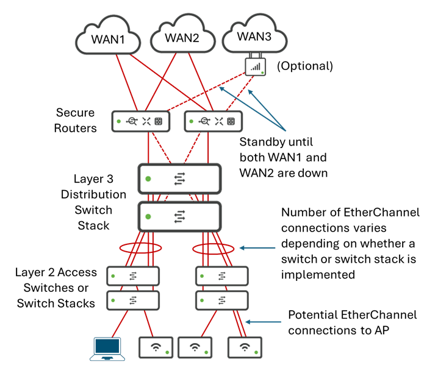

Fixed wireless access support adds the following to the medium & large branch network designs:

 - (Optional) A single MG52 Cellular Gateway configured to provide MultiWAN Backup Uplink capabilities.

#### 6.1.2 Supported Secure Router Platforms ####

MultiWAN Backup Uplink is currently supported on the MX75/85/95/105 and should be supported on the C8455-MX, although not documented.  This should be verified before release.  Support for the C8121-MX should also be available by the time of release. The MX75 has been added to the list of supported platforms for Unified Branch Phases 1 and 2.  

Note however, there appears to be no support for MultiWAN Backup Uplink for the MX67/68/250/450 platforms which are supported for Unified Branch Phases 1 and 2.  Unless a pre-deployment validation test can be added to the CI/CD pipeline, this will simply have to be noted in the documentation of the CVD, GitHub repository, and potentially Workflows, if the customer chooses a serial number of an unsupported platform in the branch and tries to enable MultiWAN Backup Uplink via automation. 

#### 6.1.3 Physical Connectivity ####

- This section was last updated on 03/11/2026 to modify the native VLAN on access switch ports connecting to APs from VLAN 1 to VLAN 999.  This is due to not having an API (and therefore no Terraform Provider resource) to change the native VLAN on APs themselves from VLAN 1 to VLAN 999. 

Fixed wireless access support adds the option for the customer/partner to choose to implement a 3rd WAN interface in a MultiWAN Backup Uplink configuration using an MG52 Cellular Gateway.  This results in the following two additional physical connectivity options for the Unified Branch large branch design.

 - Option 3:  Creating two VLANs (VLANs 901 & 902) on the L2 switch/switch stack - with MG52 Cellular Gateway.

  - Option 4:  Implementing separate non-Meraki managed switches to "split" the Ethernet handoff from each landline WAN service provider - with MG52 Cellular Gateway.

 ### 6.1.3.1 Option 3 ###

 With Option 3, VLANS 901 and 902 are again configured on the large branch L3 distribution switches simply to provide L2 passthrough connectivity from the WAN service provider physical Ethernet handoff to the Gigabit Ethernet ports (WAN1 and WAN2 respectively) of the Cisco secure routers (MX appliances). Additionally, the customer / partner has chosen to implement a 3rd WAN interface in a MultiWAN Backup Uplink configuration using an MG52 Cellular Gateway.  This is shown in the figure below.

**Figure 16. Large Branch - Physical Connectivity Option 3**

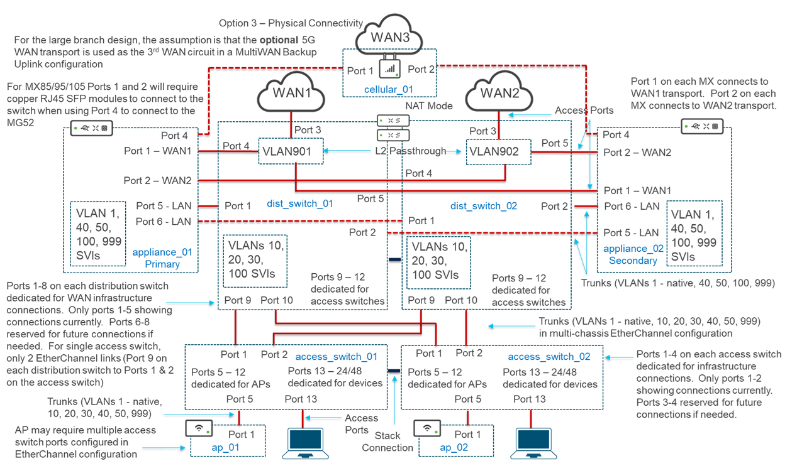

When implmenting a 3rd WAN interface on the MX85/95/105 platforms, the pairing of ports 1 & 3 and ports 2 & 4 for WAN connectivity no longer applies.  Port 4 is used for the backup uplink.  This requires WAN1 to use Port 1 and WAN2 to use Port 2 on the MX85/95/105 platforms.  Since Ports 1 & 2 are SFP ports, this will require the customer / partner to purchase copper SFP modules when connecting RJ45 Ethernet ports on the large branch L3 distribution layer switch stack, or if the large branch L3 distribution layer switch stack supports SFP ports - optionally fiber SFP modules. 

For Option 3, the following would be the port configurations based on each Layer 3 distribution switch (assuming a 2 switch distribution stack and 2 switch access stacks):

**Table 13. Option 3 Dist_Switch_01 Port Connections**

| Dist_Switch_01 | Connected To | Switch Port Configuration |
| ---------------| ------------ | ------------------------- |
| Port 1 | appliance_01, Port 5 | Trunk Port - VLANs 1, 40, 999 |
| Port 2 | appliance_02, Port 5 | Trunk Port - VLANs 1, 40, 999 |
| Port 3 | WAN1 Ethernet Handoff | Access Port - VLAN 901 | 
| Port 4 | appliance_01, Port 1 | Access Port - VLAN 901 |
| Port 5 | appliance_02, Port 1  | Access Port - VLAN 901 |
| Ports 6-8 | Infrastructure Reserved | Shutdown |
| Port 9 | access_switch_01, Port 1 | Trunk Port - VLANs 1 (native), 10, 20, 30, 40, 50, 999 |
| Port 10 | access_switch_02, Port 1 | Trunk Port - VLANs 1 (native), 10, 20, 30, 40, 50, 999 |
| Ports 11-24/48 | Reserved for Access Switch Connections | Shutdown |

**Table 14. Option 3 Dist_Switch_02 Port Connections**

| Dist_Switch_02 | Connected To | Switch Port Configuration |
| ---------------| ------------ | ------------------------- |
| Port 1 | appliance_01, Port 6 | Trunk Port - VLANs 1, 40, 999 |
| Port 2 | appliance_02, Port 6 | Trunk Port - VLANs 1, 40, 999 |
| Port 3 | WAN2 Ethernet Handoff | Access Port - VLAN 902 | 
| Port 4 | appliance_01, Port 2  | Access Port - VLAN 902 |
| Port 5 | appliance_02, Port 2  | Access Port - VLAN 902 |
| Ports 6-8 | Infrastructure Reserved | Shutdown |
| Port 9 | access_switch_01, Port 2 | Trunk Port - VLANs 1 (native), 10, 20, 30, 40, 50, 999 |
| Port 10 | access_switch_02, Port 2 | Trunk Port - VLANs 1 (native), 10, 20, 30, 40, 50, 999 |
| Ports 11-24/48 | Reserved for Access Switch Connections | Shutdown |

**Table 15. Option 3 Access_Switch_01 Port Connections**

| Access_Switch_01 | Connected To | Switch Port Configuration |
| -----------------| ------------ | ------------------------- |
| Port 1 | dist_switch_01, Port 9 | Trunk Port - VLANs 1 (native), 10, 20, 30, 40, 50, 999 |
| Port 2 | dist_switch_02, Port 9 | Trunk Port - VLANs 1 (native), 10, 20, 30, 40, 50, 999 |
| Ports 3-4 | Reserved for Distribution Switch Connections | Shutdown |
| Ports 5-12 | Dedicated for APs | Trunk Port - VLANs 1, 10, 20, 30, 40, 50, 999 (native) |
| Ports 13-24/48 | Dedicated for Devices | Access Ports |

**Table 16. Option 3 Access_Switch_02 Port Connections**

| Access_Switch_02 | Connected To | Switch Port Configuration |
| -----------------| ------------ | ------------------------- |
| Port 1 | dist_switch_01, Port 10 | Trunk Port - VLANs 1 (native), 10, 20, 30, 40, 50, 999 |
| Port 2 | dist_switch_02, Port 10 | Trunk Port - VLANs 1 (native), 10, 20, 30, 40, 50, 999 |
| Ports 3-4 | Reserved for Distribution Switch Connections | Shutdown |
| Ports 5-12 | Dedicated for APs | Trunk Port - VLANs 1, 10, 20, 30, 40, 50, 999 (native) |
| Ports 13-24/48 | Dedicated for Devices | Access Ports |

**Table 17. Option 3 MG52 Port Connections**

| MG52 Physical Port | Connected To |
| ------------------ | ------------ |
| Port 1 | appliance_01, Port 4 |
| Port 2 | appliance_02, Port 4 |

Infrastructure reserved ports and ports dedicated for APs which are unused should be shutdown. Note also, that in a MultiWAN Backup Uplink configuration, Port 3 of the MX85/95/105 is disabled and cannot be used.

 ### 6.1.3.2 Option 4 ###

 Option 4 is again for customers who are uncomfortable with using the large branch L3 distribution switches to provide both the WAN and LAN connectivity.  This is often due to potential security concerns regarding possible misconfiguration or in the event that the switch platforms are returned to a factory default configuration, or simply due to additional complexity when initially standing up the branch.  
 
 With Option 4, a pair of separate non-Meraki dashboard managed (IOS XE autonomous) switches are deployed within the large branch simply to provide L2 passthrough connectivity from the WAN service provider physical Ethernet handoff to the Gigabit Ethernet ports (WAN1 and WAN2 respectively) of the Cisco secure routers (MX appliances).  Additionally, the customer / partner has chosen to implement a 3rd WAN interface in a MultiWAN Backup Uplink configuration using an MG52 Cellular Gateway.  This is shown in the figure below.

**Figure 17. Large Branch - Physical Connectivity Option 4**

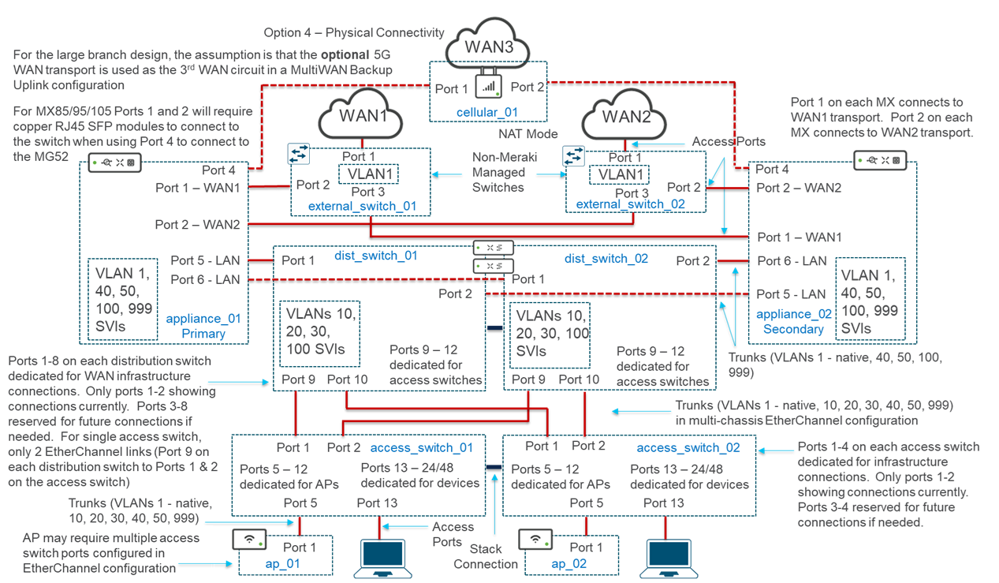

For Option 4, the following would be the port configurations based on each Layer 3 distribution switch (assuming a 2 switch distribution stack and 2 switch access stacks):

**Table 18. Option 4 Dist_Switch_01 Port Connections**

| Dist_Switch_01 | Connected To | Switch Port Configuration |
| ---------------| ------------ | ------------------------- |
| Port 1 | appliance_01, Port 5 | Trunk Port - VLANs 1, 40, 999 |
| Port 2 | appliance_02, Port 5 | Trunk Port - VLANs 1, 40, 999 |
| Ports 3-8 | Infrastructure Reserved | Shutdown |
| Port 9 | access_switch_01, Port 1 | Trunk Port - VLANs 1 (native), 10, 20, 30, 40, 50, 999 |
| Port 10 | access_switch_02, Port 1 | Trunk Port - VLANs 1 (native), 10, 20, 30, 40, 50, 999 |
| Ports 11-24/48 | Reserved for Access Switch Connections | Shutdown |

**Table 19. Option 4 Dist_Switch_02 Port Connections**

| Dist_Switch_02 | Connected To | Switch Port Configuration |
| ---------------| ------------ | ------------------------- |
| Port 1 | appliance_01, Port 6 | Trunk Port - VLANs 1, 40, 999 |
| Port 2 | appliance_02, Port 6 | Trunk Port - VLANs 1, 40, 999 |
| Ports 3-8 | Infrastructure Reserved | Shutdown |
| Port 9 | access_switch_01, Port 2 | Trunk Port - VLANs 1 (native), 10, 20, 30, 40, 50, 999 |
| Port 10 | access_switch_02, Port 2 | Trunk Port - VLANs 1 (native), 10, 20, 30, 40, 50, 999 |
| Ports 11-24/48 | Reserved for Access Switch Connections | Shutdown |

**Table 20. Option 4 Access_Switch_01 Port Connections**

| Access_Switch_01 | Connected To | Switch Port Configuration |
| -----------------| ------------ | ------------------------- |
| Port 1 | dist_switch_01, Port 9 | Trunk Port - VLANs 1 (native), 10, 20, 30, 40, 50, 999 |
| Port 2 | dist_switch_02, Port 9 | Trunk Port - VLANs 1 (native), 10, 20, 30, 40, 50, 999 |
| Ports 3-4 | Reserved for Distribution Switch Connections | Shutdown |
| Ports 5-12 | Dedicated for APs | Trunk Port - VLANs 1, 10, 20, 30, 40, 50, 999 (native) |
| Ports 13-24/48 | Dedicated for Devices | Access Ports |

**Table 21. Option 4 Access_Switch_02 Port Connections**

| Access_Switch_02 | Connected To | Switch Port Configuration |
| -----------------| ------------ | ------------------------- |
| Port 1 | dist_switch_01, Port 10 | Trunk Port - VLANs 1 (native), 10, 20, 30, 40, 50, 999 |
| Port 2 | dist_switch_02, Port 10 | Trunk Port - VLANs 1 (native), 10, 20, 30, 40, 50, 999 |
| Ports 3-4 | Reserved for Distribution Switch Connections | Shutdown |
| Ports 5-12 | Dedicated for APs | Trunk Port - VLANs 1, 10, 20, 30, 40, 50, 999 (native) |
| Ports 13-24/48 | Dedicated for Devices | Access Ports |

**Table 2. Option 4 External_switch_01 Port Connections**

| External_Switch_01 | Connected To | Configuration |
| -------------------| ------------ | ------------- |
| Port 1 | WAN1 Ethernet Handoff | Access Port | 
| Port 2 | appliance_01, Port 1 | Access Port |
| Port 3 | appliance_02, Port 1 | Access Port |

**Table 23. Option 4 External_switch_02 Port Connections**

| External_Switch_02 | Connected To | Configuration |
| -------------------| ------------ | ------------- |
| Port 1 | WAN2 Ethernet Handoff | Access Port | 
| Port 2 | appliance_02, Port 2 | Access Port |
| Port 3 | appliance_01, Port 2 | Access Port |

**Table 24. Option 4 MG52 Port Connections**
| MG52 Physical Port | Connected To |
| ------------------ | ------------ |
| Port 1 | appliance_01, Port 4 |
| Port 2 | appliance_02, Port 4 |

Infrastructure reserved ports and ports dedicated for APs which are unused should be shutdown.   Note also, that in a MultiWAN Backup Uplink configuration, Port 3 of the MX85/95/105 is disabled and cannot be used. 

#### 6.1.4 MX85/95/105 Configuration ####

Enabling the 3rd WAN interface on an MX85/95/105 appears to be done within the *Security & SD-WAN > Monitor > Appliance Status* page within the Meraki dashboard as shown in the following figure.

**Figure 18. Enabling 3rd WAN Interface on MX85/95/105 Platforms**

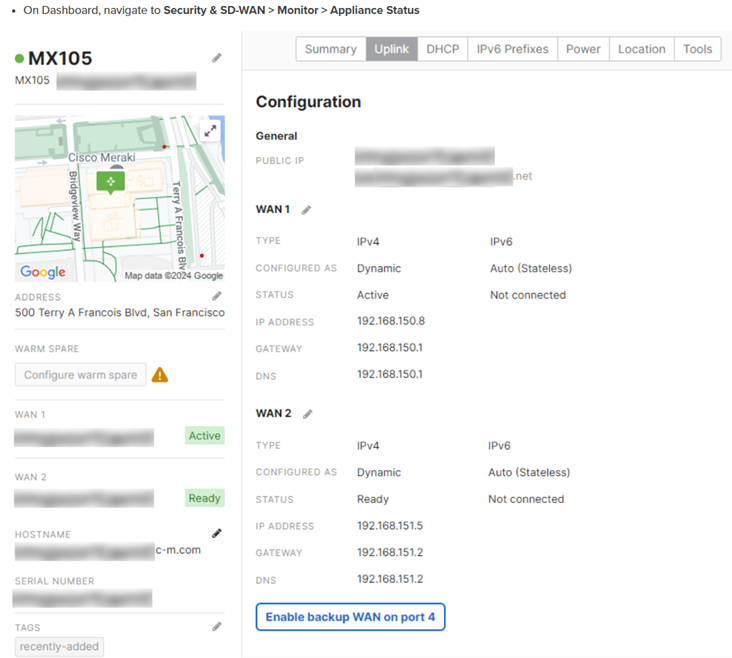

Only after the customer / partner clicks on "Enable backup WAN on Port 4" within the Meraki dashboard, does the ability to configure the IP address for the WAN3 interface appear.  

The ability to configure the IP address of the 3rd WAN interface via an API endpoint (GA or early release) is currently not available through the [Meraki API](https://developer.cisco.com/meraki/api-v1/update-device-appliance-uplinks-settings/).  Because of the lack of an API, the ability to configure the IP address for the WAN3 interface is also not available within the *meraki_appliance_uplinks_settings* resource within the [CiscoDevNet Meraki Terraform Provider](https://registry.terraform.io/providers/CiscoDevNet/meraki/latest/docs/resources/appliance_uplinks_settings).  

These issues must be resolved in order to be able to automate support for the MG52 deployed as a 5G backup 3rd WAN interface for the Cisco secure router configured in a MultiWAN Backup Uplink configuration.

The following discusses additional configuration which will need to be automated as well, in order to support the MG52 in a future release of Unified Branch.

#### 6.1.5 MG52 Configuration ####

For the medium branch & large branch designs, since there are two Cisco secure routers, the MG52 will need to be configured to operate in NAT Mode.  This is the default operating mode for the MG52.  The ability to change the operating mode of the MG52 does not seem to be available within the [CiscoDevNet Meraki Terraform Provider](https://registry.terraform.io/providers/CiscoDevNet/meraki/latest/docs) currently - although for both the medium & large branch designs, this is not needed.  For consistency of automation, we may wish to implement the MG52 in NAT mode for the small branch design as well. This will need to be addressed and resolved before supporting the MG52 for the small branch design in a future phase.

##### 6.1.5.1  Terraform Provider #####

###### 6.1.5.1.1 MG52 WAN-Side Configuration ######

Initial onboarding of the MG52 to the 5G network and Meraki dashboard will need to be done by the customer / partner by connecting a client machine directly to the LAN interface of the MG and accessing the built in web server via the client machine's browser, as discussed in the *Connecting to WAN* section of the [MG52/52E Installation Guide](https://documentation.meraki.com/SASE_and_SD-WAN/Cellular/Install_and_Get_Started/Installation_Guides/MG52%2F%2FMG52E_Installation_Guide). This will need to be documented within the CVD and potentially within the [Cisco Unified Branch GitHub Repository](https://github.com/netascode/nac-branch).

Only when the MG52 is accessible from the Meraki dashboard can automation of additional configuration or modification of the initial configuration be done. The [MG Wireless WAN Dashboard Settings](https://documentation.meraki.com/SASE_and_SD-WAN/Cellular/Design_and_Configure/Architecture_and_Best_Practices/MG_Wireless_WAN_Dashboard_Settings) document discusses the settings that can be managed from the Meraki Dashboard.

The [*meraki_device_cellular_sims*](https://registry.terraform.io/providers/CiscoDevNet/meraki/latest/docs/resources/device_cellular_sims) resource within the CiscoDevNet Meraki Terraform Provider can be used optionally to set the SIMs and APN (if needed) for the MG52 cellular gateway.

The resource has the form shown below:

        resource "meraki_device_cellular_sims" "example" {
          serial               = "1234-1234-1234"
          sim_failover_enabled = true
          sim_failover_timeout = 300
          sim_ordering         = ["sim1"]
          sims = [
            {
              is_primary = false
              sim_order  = 3
              slot       = "sim1"
              apns = [
                {
                  name                    = "internet"
                  authentication_password = "secret"
                  authentication_type     = "pap"
                  authentication_username = "milesmeraki"
                  allowed_ip_types        = ["ipv4"]
                }
              ]
            }
          ]
        }

Since initial onboarding of the MG52 to the 5G network and Meraki dashboard will need to be done by the customer / partner, and since changing the SIM or APN configuration could result in the MG52 accidently losing connectivity to the Meraki dashboard - the decision was made based on discussion from the 01/13/2026 technical meeting that the WAN side configuration of the MG52 will not be included within the YAML configuration of the GitHub repository.  There is too much risk in making a mistake which could result in the MG52 losing connectivity to the service provider and the Meraki dashboard.  Instead, it will simply be noted in the repository documentation that the customer / partner can go to the [Meraki data model](https://netascode.cisco.com/docs/data_models/meraki/devices/cellular/sims/) within the netascode website to determine the specific configuration that is needed to support configuring the WAN side of the MG52, and then add that configuration manually to their configuration.  

###### 6.1.5.1.2 MG52 LAN Side Configuration ######

The MG52 configuration will assume DHCP addressing for the secure router attached to the LAN side of the MG52 cellular gateway.

From a Branch as Code automation perspective, the [*meraki_cellular_gateway_subnet_pool*](https://registry.terraform.io/providers/CiscoDevNet/meraki/latest/docs/resources/cellular_gateway_subnet_pool) resource within the CiscoDevNet Meraki Terraform Provider can be used to set a subnet pool for the LAN side of the MG52.

The resource has the form shown below:

        resource "meraki_cellular_gateway_subnet_pool" "example" {
          network_id = "L_123456"
          cidr       = "192.168.0.0/24"
          mask       = 26
          }

- *network_id* - String (required) is the network to which the MG52 will be added.  This should be specified as a variable.

- *cidr* String (required) sets the CIDR of the pool of subnets. Based on the [MG Wireless WAN Dashboard Settings](https://documentation.meraki.com/SASE_and_SD-WAN/Cellular/Design_and_Configure/Architecture_and_Best_Practices/MG_Wireless_WAN_Dashboard_Settings) document, the CIDR range will automatically be split into 4 smaller subnets with the *mask* parameter being set appropriately. Each MG in this network will automatically pick one of these smaller subnets.  Note that there is only one MG52 per network in the Unified Branch small, medium, and large branch designs.  However, the address space will still be split into 4 smaller subnet pools.

- *mask* - String (required) sets the subnet mask for each of the 4 subnets created from the CIDR range.

Per discussion within the 12/11/2025 technical meeting, for the automation of Unified Branch, it was decided to hardcode the addressing to the following RFC 1918 address space, chosen such that it is unlikely to exist in the customer deployment today:

- cidr: 192.168.250.0/27
- mask: 29

This would result in the following four pools, each with six usable IP addresses:

- Pool1: 192.168.250.0/29 - Where the MG52 will get IP address 192.168.250.1, appliance_01 WAN3 will get IP address 192.168.250.2, and appliance_02 WAN3 will get IP address 192.168.250.3 via DHCP from this pool. The remaining 3 IP addresses (192.168.250.4 - 192.168.250.6) will remain unused.

- Pool2: 192.168.250.08/29 - This pool will be reserved for a second MG52 (currently not considered for Unified Branch).

- Pool3: 192.168.250.16/29 - This pool will be reserved for a third MG52 (currently not considered for Unified Branch).

- Pool3: 192.168.250.24/29 - This pool will be reserved for a fourth MG52 (currently not considered for Unified Branch).
 
This configuration assumes that IPv4 addressing via DHCP will be selected by the customer / parnter when configuring the IP addressing of the WAN3 interfaces on each MX secure router within the network. 

The [*meraki_cellular_gateway_lan*](https://registry.terraform.io/providers/CiscoDevNet/meraki/latest/docs/resources/cellular_gateway_lan) resource within the CiscoDevNet Meraki Terraform Provider can be used to set fixed IP assignments and reserved ranges from a subnet pool for the LAN side of the MG52.  

The resource has the form shown below:

        resource "meraki_cellular_gateway_lan" "example" {
          serial = "1234-ABCD-1234"
          fixed_ip_assignments = [
            {
              ip   = "172.31.128.10"
              mac  = "0b:00:00:00:00:ac"
              name = "server 1"
            }
         ]
          reserved_ip_ranges = [
            {
              comment = "A reserved IP range"
              end     = "172.31.128.1"
              start   = "172.31.128.0"
            }
          ]
        }

The [MG Wireless WAN Dashboard Settings](https://documentation.meraki.com/SASE_and_SD-WAN/Cellular/Design_and_Configure/Architecture_and_Best_Practices/MG_Wireless_WAN_Dashboard_Settings) document seems to imply that within each subnet pool, the first IP address is already reserved for the MG52, with the second and third IP addresses reserved for MX appliances in a high availability (warm spare) configuration.  If the second and third addresses are already reserved by the MG52 for the MX WAN3 interfaces, then the *meraki_cellular_gateway_lan* resource does not need to be included within the YAML configuration, since neither fixed_ip_assignments or additional reserved_ip_ranges will be needed.

The [*meraki_cellular_gateway_dhcp*](https://registry.terraform.io/providers/CiscoDevNet/meraki/latest/docs/resources/cellular_gateway_dhcp) resource within the CiscoDevNet Meraki Terraform Provider can be used to set the DHCP server parameters for the LAN side of the MG52.  

The resource has the form shown below:

        resource "meraki_cellular_gateway_dhcp" "example" {
          network_id             = "L_123456"
          dhcp_lease_time        = "1 hour"
          dns_nameservers        = "opendns"
          dns_custom_nameservers = []
        }

- *network_id* - String (required) is the network to which the MG52 will be added.  This should be specified as a variable.

- *dhcp_lease_time* - String (required) sets the DHCP lease time for downstream clients of the MG52.  This should be specified for the same amount of time as the lease times on the MX subnet pools, which is '1 day'. 

- *dns_name_servers* - String (required) which can be one of the following: 'upstream_dns', 'google_dns', 'opendns', 'custom'. The setting for *dns_name_servers* should match the settings for the VLAN1 subnet pool on the MX appliance, which is 'opendns'.

- *dns_custom_nameservers* - String (optional) configured only when *dns_nameservers* is specified as 'custom'.  Since *dns_name_servers* should be set for 'opendns', this parameter should be omitted.  

The [*meraki_cellular_gateway_connectivity_monitoring_destinations*](https://registry.terraform.io/providers/CiscoDevNet/meraki/latest/docs/resources/cellular_gateway_connectivity_monitoring_destinations) resource within the CiscoDevNet Meraki Terraform Provider can be used to set the destinations for monitoring the status of the cellular uplink of the MG52 gateway.

The resource has the form shown below:

        resource "meraki_cellular_gateway_connectivity_monitoring_destinations" "example" {
          network_id = "L_123456"
          destinations = [
            {
              default     = true
              description = "Google"
              ip          = "1.2.3.4"
            }
          ]
        }

- *network_id* - String (required) is the network to which the MG52 will be added.  This should be specified as a variable.

- *destinations* List of parameters (required) contains the list of IP addresses used for monitoring the status of the MG52.  Unless there is a IP address specific to the 5G cellular network which needs to be specified as an additional variable, ideally this should match the list of monitoring addresses specified for the WAN1 and WAN2 interfaces of the Cisco secure routers within the medium branch.

The [*meraki_cellular_gateway_uplink*](https://registry.terraform.io/providers/CiscoDevNet/meraki/latest/docs/resources/cellular_gateway_uplink) resource within the CiscoDevNet Meraki Terraform Provider can be used optionally to set the uplink and downlink bandwidth limits for the MG52 cellular gateway.  

The resource has the form shown below:

        resource "meraki_cellular_gateway_uplink" "example" {
          network_id                  = "L_123456"
          bandwidth_limits_limit_down = 1000000
          bandwidth_limits_limit_up   = 1000000
        }

- *network_id* - String (required) is the network to which the MG52 will be added.  This should be specified as a variable.
- *bandwidth_limits_limit_down* - Integerr (optional) sets the received bandwidth limit.  A null value indicates no limit.  This should be specified as a variable with the ability for customer to set the value to no limit.
- *bandwidth_limits_limit_up* - Integer (optional) sets the transmitted bandwidth limit.  A null value indicates no limit.  This should be specified as a variable with the ability for customer to set the value to no limit.

The [*meraki_cellular_gateway_port_forwarding_rules*](https://registry.terraform.io/providers/CiscoDevNet/meraki/latest/docs/resources/cellular_gateway_port_forwarding_rules) resource within the CiscoDevNet Meraki Terraform Provider can be used optionally to set port forwarding rules for the MG52 cellular gateway.  

The resource has the form shown below:

        resource "meraki_cellular_gateway_port_forwarding_rules" "example" {
          serial = "1234-ABCD-1234"
          rules = [
            {
              access      = "restricted"
              lan_ip      = "172.31.128.5"
              local_port  = "4"
              name        = "test"
              protocol    = "tcp"
              public_port = "11-12"
              allowed_ips = ["10.10.10.10"]
            }
          ]
        }

Given that the only use case being looked at for deployment of the MG52 for Unified Branch is where only MX secure routers are connected to the MG52, and given the MX secure router is itself a secure firewall, at this point there does not seem to be a need for port forwarding rules on the MG52.  Therefore, the YAML configuration does not have to include any Meraki cellular gateway port forwarding rule configurations.

##### 6.1.5.2 YAML Configuration ####

Based on discussion from the 01/13/2026 technical meeting, the decision was made that the WAN side configuration of the MG52 will not be included within the YAML configuration of the GitHub repository. There is too much risk in making a mistake which could result in the MG52 losing connectivity to the service provider and the Meraki dashboard.  Instead, it will simply be noted in the repository documentation that the customer / partner can go to the [Meraki data model](https://netascode.cisco.com/docs/data_models/meraki/devices/cellular/sims/) within the netascode website to determine the specific configuration that is needed to support configuring the WAN side of the MG52, and then add that configuration manually to their configuration.  

The follow is an example of the YAML configuration for the configuration of the MG52.

To accommodate the large branch design, a new template called *large_branch_inventory* will need to be added to [*templates-inventory.nac.yaml*](https://github.com/netascode/nac-branch/blob/main/data/templates-inventory.nac.yaml) file within the existing Cisco Unified Branch GitHub repository.  The new template will support an MG52 cellular gateway as follows:

       #
       # The below code does the following:
       #
       # large_branch_inventory configuration template.
       #
       # The large_branch_inventory configuration template defines
       # the devices (security appliances, switch, and access points)
       # and configures parameters specific to those devices
       # within the site/network to which the template is applied.
       #
       # Note that this repository uses the words appliance,
       # security appliance, and secure router to all refer 
       # to the MX security appliance.
       #
       - name: large_branch_inventory
         devices:
          #
          #
          ~
          # Additional configuration for the appliances, 
          # switches, and APs not shown here.
          ~
	        #
          #  The below code does the following:
          #
          #  Cellular Gateway - LAN and Port Forwarding configuration.
          #
          #  - IP addresses reserved from being handed out by the MG52
          #    internal DHCP server.
          #  - Hard-coded IP address assignments 
          #  - Port forwarding rules configured within the MG52
          #
          #  For Unified Branch Phase 2 neither fixed IP address
          #  assignments or port-forwarding rules is required.
          #  Therefore, these sections can be either  omitted or 
          #  commented out.
          #
          #  For Unified Branch Phase 2, it will be assumed the
          #  customer / partner will configure the SIMs as part 
          #  of the MG52 onboarding process, using a dedicated 
          #  device attached to the MG52.  Therefore, the SIMs 
          #  section is not included within the following YAML
          #  configuration.  For information on how to add this 
          #  to the YAML configuration please refer to the Cellular
          #  SIMS section of the Meraki data model within the
          #  netascode site:
          # 
          #  https://netascode.cisco.com/docs/data_models/meraki/devices/cellular/sims/
          # 
          #
          - name: ${cellular_01_name}
            serial: ${cellular_01_serial}
            cellular_gateway:
              name: some_name
              # lan:
              #  reserved_ip_ranges:
              #    - start: 
              #      end: 
              #      comment: 
              #  fixed_ip_assignments:
              #    - ip: 
              #      mac: 
              # port_forwarding_rules:
              #  - name
              #    lan_ip: 
              #    protocol: 
              #    access: 
              #    local_port: 
              #    public_port: 
              #
            #
            # 01/16/2026 Update:  Cellular SIMs Configuration is 
            # commented out and should be left out of the YAML  
            # configuration transferred to the production release.
            # Configuration left here for possible future addition if
            # it is found necessary by customers / partners to include.
            # 
            # cellular_sims:
              # sims:
              #  - slot: sim1
              #    is_primary: true
              #    apns:
              #      - name: apn_1
              #        allowed_ip_types: ipv4
              #        authentication:
              #          type: chap
              #          username: some_user
              #          password: some_password
              #    sim_order: 1
              # sim_failover:
              #  enabled: true
              #  timeout: 60
              # sim_ordering:
              #  - sim1
              #  - sim2
              #  - sim3

Note that the *small_branch_inventory* template will also need configuration adding an MG52.  

To accommodate the MG52 cellular gateway, a new template called *cellular_gateway* will need to be added to [*templates-network-related.nac.yaml*](https://github.com/netascode/nac-branch/blob/main/data/templates-network-related.nac.yaml) file within the existing Cisco Unified Branch GitHub repository.  The new template will support an MG52 cellular gateway as follows

        meraki:
          template:
            networks:
              #
              ~
              # Additional templates within this file not shown here.
              ~
              # 
              # The below code does the following:
              #
              # Network-level cellular_gateway template.
              #
              # Configures the following:
              # 
              # - The CIDR block used to create 4 subnet 
              #   pools of addresses handed out by each of
              #   the possible maximum of 4 MG52s which can 
              #   be supported in a network.  The configuration
              #   shown hardcodes this to 192.168.250.0/27.  The
              #   4 pools are:  192.168.250.0/29, 192.168.250.8/29,
              #   192.168.250.16/29, and 192.168.250.24/29.  Within 
              #   each pool, the first address is reserved for the
              #   MG52 LAN interface.  The next two addresses are
              #   reserved for the primary and secondary MX routers.
              #
              # - The uplink and downlink bandwidths of the 5G service.
              #   These are set to unlimited (0) in the YAML. Modify
              #   the YAML to set limits.
              #
              # - DHCP lease times and the DNS name server handed 
              #   out to the WAN3 interface of the MX routers.  This 
              #   is set the same as the WAN1 and WAN2 interfaces of 
              #   the MX routers.
              #
              # - Connectivity monitoring destinations for the MG52.  
              #   Again, this is set the same as for the WAN1 and WAN2
              #   interfaces of the MX routers in the YAML below.
              #
              - name: cellular_gateway
                cellular_gateway:
                  name: cellular_01
                  subnet_pool:
                    cidr: 192.168.250.0/27
                    mask: 29
                  uplink_bandwidth_limits:
                    limit_down: 0
                    limit_up: 0
                  dhcp:
                    dhcp_lease_time: "1 day"
                    dns_nameservers: opendns
                    # dns_custom_nameservers:
                  connectivity_monitoring_destinations:
                    - ip: 8.8.8.8
                      description: Google
                      default: true

Within the *org_global.nac.yaml* file, the following configuration can be added to support eSIMs.  Since eSIMs are only supported by a few carriers (AT&T specifically), it is uncertain whether the customer will be using eSIMs or external SIM cards.  

Based on a decision from the 01/06/26 technical meeting, eSIM support (*esims_inventory*, *esims_service_providers_accounts*, and *esims_swap*) will not be included in Unified Branch.  The use of eSIMs may be required for validation testing of MG52 functionality, hence the configuation is shown below but commented out. However the YAML configuration will NOT be included within the [*org_global.nac.yaml*](https://github.com/netascode/nac-branch/blob/main/data/org_global.nac.yaml) file of the Cisco Unified Branch GitHub repository.

        meraki:
          organizations:
            #
            ~
            # Additional organization configuration not shown here.
            ~
            #
            # The below code does the following:
            #
            #  Organization-level cellular gateway configuration.
            #
            #  - Allows configuration of information around support 
            #    for eSIMs with MG52 cellular gateways. 
            #
            cellular_gateway:
              name:
              # esims_inventory:
              #   organization_name:
              #   name:
              #   status: Active
              # esims_service_providers_accounts:
              #   account_id:
              #   api_key:
              #   title:
              #   username:
              #   service_provider_name:
              #   organization_name:
              #   account_name:
              # esims_swap:
              #   eid:
              #   target:
              #     account_id:
              #     communication_plan:
              #     rate_plan:

### 6.2 ZTNA / Adaptive Policy with Access Manager ###

Meraki Access Manager has been removed for Phase 2 due to APIs not being available to select Meraki Access Manager for authentication and authorization within the Switching and Wireless sections of the Meraki dashboard. However the use case for Adaptive Policy with external Radius server will be included in Phase 2, as discussed in Section *5.3 ZTNA / Adaptive Policy with External Radius Server* of this document. 

The following figure shows the use case for Adaptive Policy with Access Manager for Phase 2 of Unified Branch.

**Figure 19. Large Branch Adaptive Policy with Access Manager Use Case**

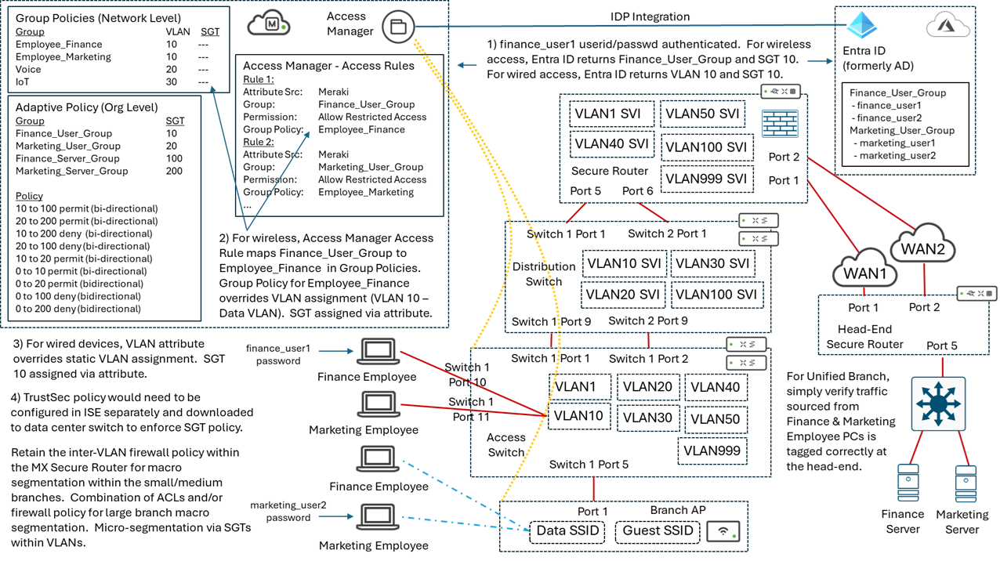

 Access Manager supports the ability to configure individual users, but not user groups.  User groups are supported via an IDP.  Currently the only supported IDP is Microsoft Entra ID (formerly known as Microsoft Active Directory).  Adding individual users to Meraki Access Manager may be sufficient for demonstrations and/or small network designs.  However, for scalable deployments, many customers already utilize an external data source such as Entra ID for creation of groups and to hold individual userids.  Hence, when Access Manager is supported in Unified Branch, it is highly desirable to intergrate Meraki Access Manager with Microsoft Entra ID.
 
 The flow for authentication and authorization for wireless devices is as follows:
 
 1) The userid/password from the end-user device is checked against the Entra ID database, returning the Group to which the end-user is a part of. 

 2) The Group will then be used to map to a pre-configured Group Policy within the Meraki Dashboard.  Within that Group Policy, the VLAN assignment of the end-user will be hardcoded.

 3) The Group Policy will include the VLAN to which the user/device is to be assigned.  The SGT can be returned separately along with the Group Policy and omitted from the Group Policy configuration.  This maitains backward compatibility with the Unified Branch Phase 1 design.

The flow for authentication and authorization for wired devices may need to be different, depending upon when Access Manager support is added to Unified Branch.  This is because Meraki dashboard switch configuration does not currently support Group Policy.  Hence, the flow for authentication and authorization for wired devices needs to be developed when the target release for Access Manager into Unified Branch is determined.

#### 6.2.1 Switch and Wireless Access Policy Modifications for Access Manager ###
 
From a switch perspective, Access Manager is configured under *Switching -> Access Policies -> Access Policy Detail*, as shown in the following figure.

**Figure 20. Switch Access Policies - Access Manager Option**

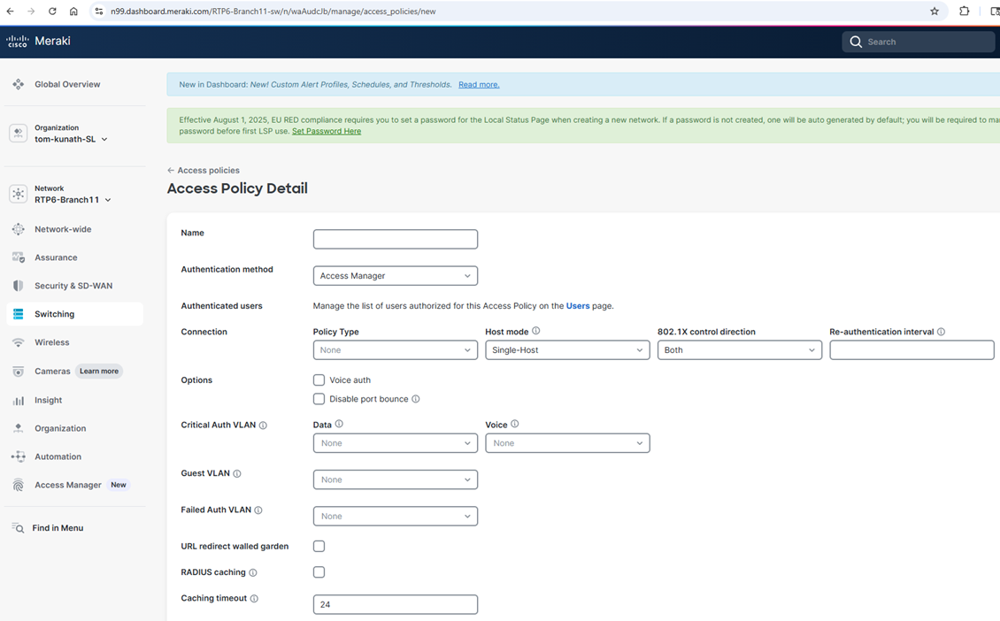

The *switch* template within the *templates-switch.nac.yaml* file will need to be modified to remove references to Radius and add configuration for Access Manager.  Currently the [*Switch Access Policies*](https://netascode.cisco.com/docs/data_models/meraki/networks_switch/access_policies/) section of the Meraki Data Model within the netascode webside does not include any references to Access Manager.

The [*meraki_switch_access_policies*](https://registry.terraform.io/providers/CiscoDevNet/meraki/latest/docs/resources/switch_access_policies) resource within the Cisco DevNet Meraki Terraform Provider also does not include any references to Access Manager. 

Finally, the [*Create Network Switch Access Policy*](https://developer.cisco.com/meraki/api-v1/create-network-switch-access-policy/) API also does not include any references to Access Manager.  No Early Access APIs have been found which reference Access Manager either. 

From an wireless (AP) perspective, Access Manager is configured under *Wireless -> Access control*, as shown in the following figure.

**Figure 21. Wireless Access Policies - Access Manager Option**

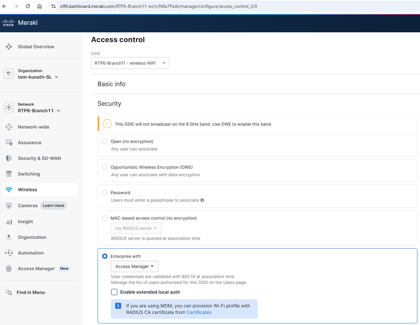

The *wireless* template within the *templates-wireless.nac.yaml* file will need to be modified to remove references to Radius and add configuration for Access Manager.  Currently the [*SSID Base Configuration*](https://netascode.cisco.com/docs/data_models/meraki/networks_wireless/ssid_settings/ssid_base/) section of the Meraki Data Model within the netascode webside does not include any references to Access Manager.

The [*meraki_wireless_ssid*](https://registry.terraform.io/providers/CiscoDevNet/meraki/latest/docs/resources/wireless_ssid) resource within the Cisco DevNet Meraki Terraform Provider also does not include any references to Access Manager. 

Finally, the [*Update Network Wireless Ssid*](https://developer.cisco.com/meraki/api-v1/update-network-wireless-ssid/) API also does not include any references to Access Manager.  No Early Access APIs have been found which reference Access Manager either. 

Because of the lack of the above APIs, Access Manager has been dropped from Unified Branch Phase 2.  Once API support is added, then the Terraform Provider an netascode Data Model can pick up the support for Access Manager.  However, in order to support ZTNA / Adaptive Policy with Access Manager for Unified Branch, this must be resolved.

### 6.3 Wireless AP Wi-Fi 7 Support ###

Wi-Fi 7 (802.11be) support was dropped in Unified Branch Phase 1, even though the APs are specifically chosen to support WiFi 7.  This was because for the AP firmware release of Phase 1, all SSIDs running on the AP needed to have 802.11w Management Frame Protection (MFP) enabled in order to enable 802.11be along with the 6 GHz radio.  The Guest SSID, being an open SSID has no MFP.

The MR 32.1.5 firmware for APs now supports *Per SSID Groups* which allow separating the Guest SSID into another SSID Group and enabling 802.11be for the SSID group containing the Data SSID as shown in the following figure:

**Figure 22. Wi-Fi 7 (802.11be) support via SSID Groups**

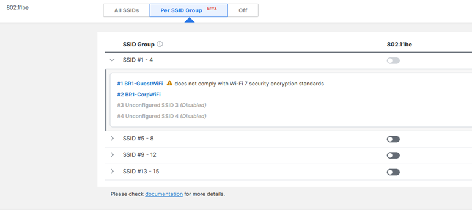

However this functionality appears to be still Beta in MR 32.1.5.  There do not appear to be any APIs (GA or Early Release) related to wireless RF profiles or wireless SSIDs that have "802.11be" or "dot11be" or anything indicating "Per SSID Group".  Without any APIs, there is nothing in the Meraki Devnet Terraform Provider indicating this new support in the *meraki_wireless_rf_profile* or *meraki_wireless_ssid resources*.

Without a way of automating this, Wi-Fi 7 support will again need to be pushed out to the next Phase of Unified Branch.